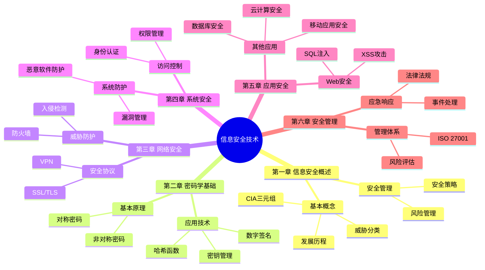

# 信息安全技术学习指南

## 📋 目录导航

### 📖 学习指南
- [📚 课程概述](#-课程概述)
- [🎯 学习目标](#-学习目标)
- [📖 主要学习内容](#-主要学习内容)
- [📝 学习方法建议](#-学习方法建议)
- [🛠️ 推荐工具和资源](#️-推荐工具和资源)
- [📅 学习计划](#-学习计划)
- [📋 作业与实验记录](#-作业与实验记录)
- [🎯 考试重点](#-考试重点)

### 📚 章节笔记
- [📁 第一章 - 信息安全概述](./第一章-信息安全概述/笔记.md)
- [📁 第二章 - 密码学基础](./第二章-密码学基础/笔记.md)
- [📁 第三章 - 网络安全](./第三章-网络安全/笔记.md)
- [📁 第四章 - 系统安全](#第四章-系统安全) *(待创建)*
- [📁 第五章 - 应用安全](#第五章-应用安全) *(待创建)*
- [📁 第六章 - 安全管理](#第六章-安全管理) *(待创建)*

### 🧪 实验与实践
- [📋 实验报告模板](./实验报告/实验模板.md)
- [🔬 实验1 - 密码算法实现](#实验1) *(待创建)*
- [🔬 实验2 - 网络安全配置](#实验2) *(待创建)*
- [🔬 实验3 - 系统安全加固](#实验3) *(待创建)*
- [🔬 实验4 - Web应用安全测试](#实验4) *(待创建)*
- [🔬 实验5 - 安全风险评估](#实验5) *(待创建)*

### 📚 学习资源
- [🔗 在线资源](#在线资源)
- [📖 推荐书籍](#推荐书籍)
- [🛠️ 学习工具](#学习工具)
- [🏆 认证考试](#认证考试)

---

## 📚 课程概述
信息安全技术是计算机科学与技术专业的重要课程，主要学习信息系统安全的基本理论、技术和方法。

## 🎯 学习目标
- 掌握信息安全的基本概念和原理
- 了解常见的安全威胁和攻击方式
- 学习密码学基础知识
- 掌握网络安全技术
- 了解系统安全和应用安全
- 学习安全管理和风险评估

## 📖 主要学习内容

### 第一章 信息安全概述
- [ ] 信息安全的基本概念
- [ ] 信息安全的重要性
- [ ] 信息安全的发展历程
- [ ] 信息安全的基本属性（机密性、完整性、可用性）

### 第二章 密码学基础
- [ ] 密码学基本概念
- [ ] 对称密码算法（DES、AES等）
- [ ] 非对称密码算法（RSA、ECC等）
- [ ] 哈希函数和数字签名
- [ ] 密钥管理

### 第三章 网络安全
- [ ] 网络安全威胁
- [ ] 防火墙技术
- [ ] 入侵检测系统（IDS）
- [ ] 虚拟专用网络（VPN）
- [ ] 网络协议安全

### 第四章 系统安全
- [ ] 操作系统安全
- [ ] 访问控制
- [ ] 身份认证
- [ ] 恶意软件防护
- [ ] 系统漏洞管理

### 第五章 应用安全
- [ ] Web应用安全
- [ ] 数据库安全
- [ ] 移动应用安全
- [ ] 云计算安全

### 第六章 安全管理
- [ ] 信息安全管理体系
- [ ] 风险评估与管理
- [ ] 安全策略制定
- [ ] 应急响应
- [ ] 法律法规

## 📝 学习方法建议

### 理论学习
1. **系统学习**：按章节顺序学习，建立完整的知识体系
2. **重点突出**：重点掌握密码学、网络安全、系统安全等核心内容
3. **案例分析**：结合实际安全事件理解理论知识

### 实践练习
1. **实验操作**：完成课程实验，动手实践安全技术
2. **工具使用**：学习使用常见的安全工具
3. **漏洞分析**：分析常见的安全漏洞和攻击方式

### 拓展学习
1. **关注热点**：关注最新的安全威胁和防护技术
2. **参与竞赛**：参加CTF等信息安全竞赛
3. **考取认证**：准备相关的安全认证考试

## 🛠️ 推荐工具和资源

### 学习工具
- **虚拟机软件**：VMware、VirtualBox
- **网络分析工具**：Wireshark
- **渗透测试工具**：Kali Linux、Metasploit
- **密码学工具**：OpenSSL、CrypTool

### 学习资源
- **教材**：《信息安全技术》、《网络安全技术与应用》
- **在线课程**：中国大学MOOC、学堂在线
- **技术网站**：FreeBuf、安全客、OWASP
- **学术期刊**：《信息安全学报》、《网络与信息安全学报》

## 📅 学习计划

```mermaid
gantt
    title 信息安全技术学习计划
    dateFormat  X
    axisFormat %s
    
    section 理论学习
    信息安全概述     :done, des1, 0, 2
    密码学基础       :active, des2, 2, 4
    网络安全         :des3, 6, 4
    系统安全         :des4, 10, 3
    应用安全         :des5, 13, 2
    安全管理         :des6, 15, 1
    
    section 实验实践
    密码算法实验     :lab1, 4, 2
    网络安全实验     :lab2, 8, 2
    系统安全实验     :lab3, 11, 2
    应用安全实验     :lab4, 13, 2
    综合实验         :lab5, 15, 1
    
    section 考试准备
    期中复习         :review1, 8, 1
    期末复习         :review2, 15, 2
```

### 第1-2周：信息安全概述
- 学习信息安全基本概念
- 了解安全威胁分类
- 完成相关练习题

### 第3-6周：密码学基础
- 学习对称和非对称密码
- 实践密码算法
- 完成密码学实验

### 第7-10周：网络安全
- 学习网络安全技术
- 配置防火墙和IDS
- 分析网络攻击案例

### 第11-14周：系统与应用安全
- 学习系统安全机制
- 分析Web应用漏洞
- 完成安全评估实验

### 第15-16周：安全管理与复习
- 学习安全管理体系
- 总结复习重点内容
- 准备期末考试

## 📋 作业与实验记录

### 实验列表
- [ ] 实验1：密码算法实现
- [ ] 实验2：网络安全配置
- [ ] 实验3：系统安全加固
- [ ] 实验4：Web应用安全测试
- [ ] 实验5：安全风险评估

### 作业记录
- [ ] 作业1：信息安全概述
- [ ] 作业2：密码学基础
- [ ] 作业3：网络安全技术
- [ ] 作业4：系统安全管理
- [ ] 作业5：综合案例分析

## 🎯 考试重点

### 理论重点
1. 信息安全基本概念和属性
2. 密码学算法原理和应用
3. 网络安全技术和协议
4. 系统安全机制
5. 安全管理体系

### 实践重点
1. 密码算法的实现和应用
2. 网络安全工具的使用
3. 系统安全配置
4. 漏洞分析和防护
5. 安全评估方法

## 📚 学习资源详细指南

### 🔗 在线资源
- **MOOC平台**
  - [中国大学MOOC - 信息安全技术](https://www.icourse163.org/)
  - [学堂在线 - 网络安全](https://www.xuetangx.com/)
  - [Coursera - Cybersecurity](https://www.coursera.org/)

- **技术社区**
  - [FreeBuf - 互联网安全新媒体平台](https://www.freebuf.com/)
  - [安全客 - 有思想的安全新媒体](https://www.anquanke.com/)
  - [OWASP - 开放式Web应用程序安全项目](https://owasp.org/)

- **官方文档**
  - [NIST网络安全框架](https://www.nist.gov/cyberframework)
  - [ISO 27001标准](https://www.iso.org/isoiec-27001-information-security.html)
  - [RFC安全协议文档](https://tools.ietf.org/rfc/)

### 📖 推荐书籍
- **基础教材**
  - 《信息安全技术》- 沈昌祥
  - 《网络安全技术与应用》- 贾春福
  - 《现代密码学》- Jonathan Katz

- **进阶读物**
  - 《应用密码学：协议、算法与C源程序》- Bruce Schneier
  - 《网络安全评估》- Chris McNab
  - 《Web应用安全权威指南》- Dafydd Stuttard

### 🛠️ 学习工具
- **虚拟化环境**
  - [VMware Workstation](https://www.vmware.com/)
  - [VirtualBox](https://www.virtualbox.org/)
  - [Docker](https://www.docker.com/)

- **安全测试工具**
  - [Kali Linux](https://www.kali.org/) - 渗透测试发行版
  - [Wireshark](https://www.wireshark.org/) - 网络协议分析器
  - [Metasploit](https://www.metasploit.com/) - 渗透测试框架
  - [Burp Suite](https://portswigger.net/burp) - Web应用安全测试

- **密码学工具**
  - [OpenSSL](https://www.openssl.org/) - 密码学库
  - [CrypTool](https://www.cryptool.org/) - 密码学教学工具
  - [Hashcat](https://hashcat.net/) - 密码破解工具

### 🏆 认证考试
- **国际认证**
  - CISSP (Certified Information Systems Security Professional)
  - CEH (Certified Ethical Hacker)
  - CISA (Certified Information Systems Auditor)
  - CISM (Certified Information Security Manager)

- **国内认证**
  - CISP (注册信息安全专业人员)
  - CISW (注册信息安全工程师)
  - 等级保护测评师

## 📚 参考资料
1. 教材：《信息安全技术》
2. 参考书：《网络安全技术与应用》
3. 标准文档：ISO 27001、GB/T 22080
4. 技术文档：RFC相关安全协议文档

## 🔄 快速导航
- [⬆️ 返回顶部](#信息安全技术学习指南)
- [📋 目录导航](#-目录导航)
- [📚 章节笔记](#-章节笔记)
- [🧪 实验与实践](#-实验与实践)

---
*最后更新时间：2025年9月*
*学习进度：持续更新中...*