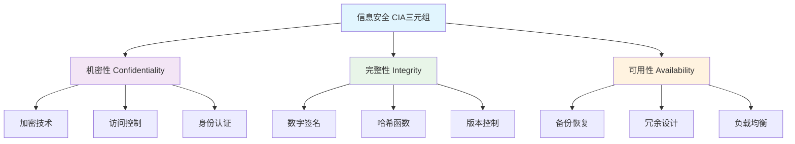
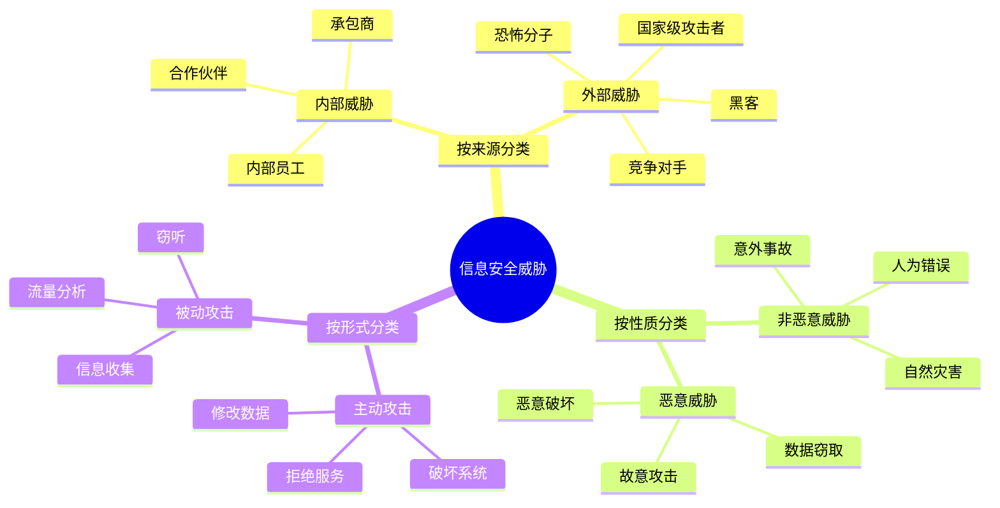
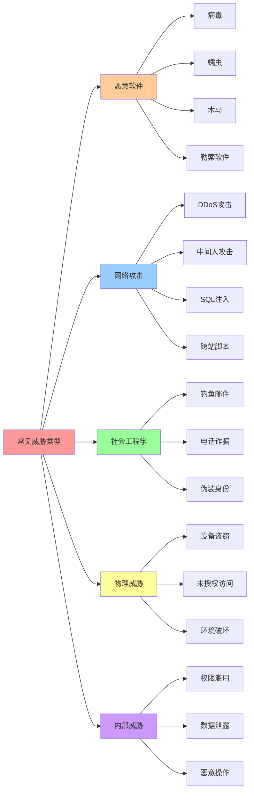
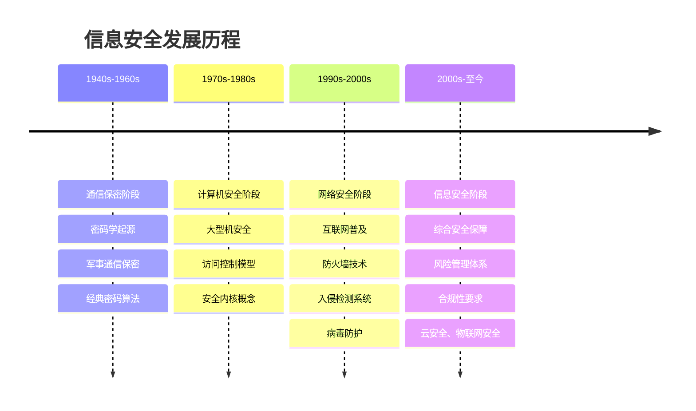
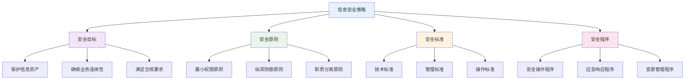
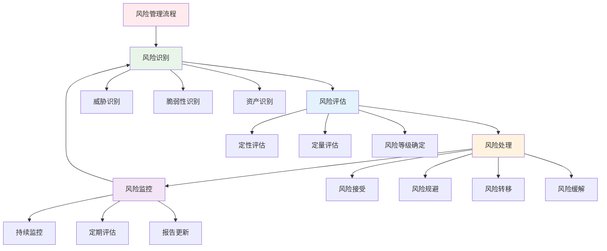

# 第一章 信息安全概述

## 📋 章节导航
- [🏠 返回主页](../README.md)
- [📖 本章内容](#本章内容)
- [📝 课堂笔记](#-课堂笔记)
- [🔍 课后思考](#-课后思考)
- [📚 扩展阅读](#-扩展阅读)
- [➡️ 下一章：密码学基础](../第二章-密码学基础/笔记.md)

## 📖 本章内容
- [1.1 信息安全的基本概念](#11-信息安全的基本概念)
- [1.2 信息安全威胁](#12-信息安全威胁)
- [1.3 信息安全发展历程](#13-信息安全发展历程)
- [1.4 信息安全管理](#14-信息安全管理)

---

## 1.1 信息安全的基本概念

### 信息安全定义
- **信息安全**：保护信息及信息系统免受未授权的访问、使用、披露、破坏、修改或销毁，以提供机密性、完整性和可用性。

### 信息安全的三要素（CIA三元组）

1. **机密性（Confidentiality）**
   - 确保信息不被未授权的个人、实体或过程获取或披露
   - 实现方法：加密、访问控制、身份认证

2. **完整性（Integrity）**
   - 确保信息和处理方法的准确性和完整性
   - 防止信息被未授权修改、删除或破坏
   - 实现方法：数字签名、哈希函数、版本控制

3. **可用性（Availability）**
   - 确保授权用户在需要时能够访问信息和相关资产
   - 实现方法：备份恢复、冗余设计、负载均衡

## 1.2 信息安全威胁

### 威胁分类

1. **按来源分类**
   - 内部威胁：内部员工、合作伙伴
   - 外部威胁：黑客、竞争对手、恐怖分子

2. **按性质分类**
   - 恶意威胁：故意的攻击行为
   - 非恶意威胁：意外事故、自然灾害

3. **按形式分类**
   - 主动攻击：修改数据、破坏系统
   - 被动攻击：窃听、流量分析

### 常见威胁类型

- [ ] 恶意软件（病毒、蠕虫、木马）
- [ ] 网络攻击（DDoS、中间人攻击）
- [ ] 社会工程学攻击
- [ ] 物理安全威胁
- [ ] 内部威胁

## 1.3 信息安全发展历程

### 发展阶段

1. **通信保密阶段**（1940s-1960s）
   - 主要关注通信安全
   - 密码学为主要手段

2. **计算机安全阶段**（1970s-1980s）
   - 计算机系统安全
   - 访问控制机制

3. **网络安全阶段**（1990s-2000s）
   - 互联网普及带来新挑战
   - 防火墙、入侵检测技术

4. **信息安全阶段**（2000s至今）
   - 综合性安全保障
   - 风险管理、合规性

## 1.4 信息安全管理

### 安全策略

- **安全策略定义**：组织为保护其信息资产而制定的规则和指导原则
- **策略要素**：
  - 安全目标
  - 安全原则
  - 安全标准
  - 安全程序

### 风险管理

1. **风险识别**：识别可能的威胁和脆弱性
2. **风险评估**：评估风险的可能性和影响
3. **风险处理**：接受、规避、转移、缓解
4. **风险监控**：持续监控和评估

## 📝 课堂笔记

### 重点内容
- [ ] CIA三元组是信息安全的核心
- [ ] 威胁和脆弱性的区别
- [ ] 风险 = 威胁 × 脆弱性 × 资产价值
- [ ] 安全是一个过程，不是产品

### 课堂讨论
- 

### 疑问点
- 

## 🔍 课后思考

1. 如何平衡安全性和可用性？
2. 组织中最大的安全威胁是什么？
3. 如何建立有效的安全文化？

## 📚 扩展阅读
- [ ] 《信息安全风险评估指南》
- [ ] ISO 27001标准文档
- [ ] NIST网络安全框架

## 🔄 快速导航
- [⬆️ 返回顶部](#第一章-信息安全概述)
- [🏠 返回主页](../README.md)
- [⬅️ 上一章：无](#)
- [➡️ 下一章：密码学基础](../第二章-密码学基础/笔记.md)

---
*笔记时间：*
*复习时间：*