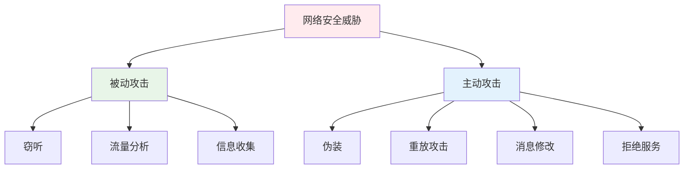
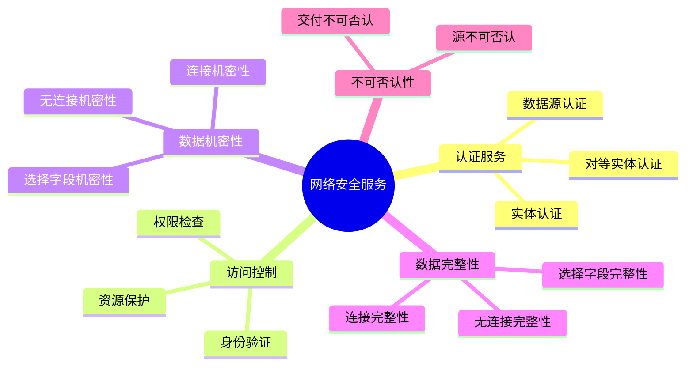
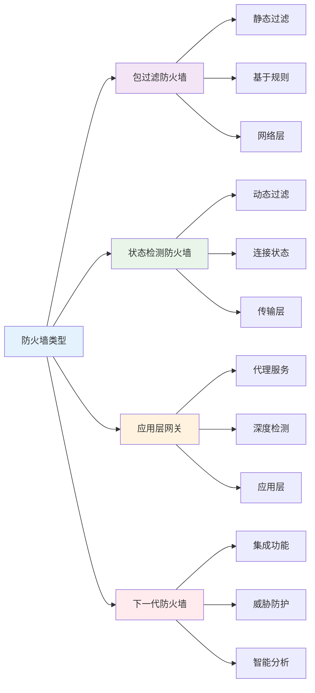
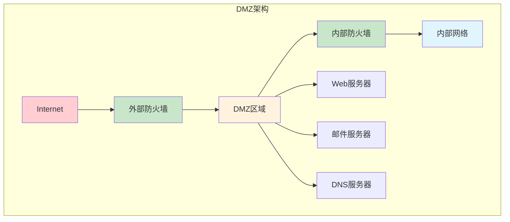
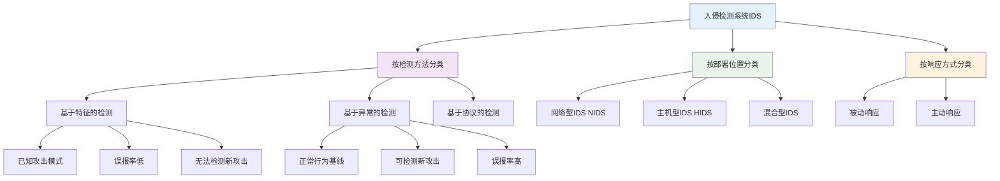
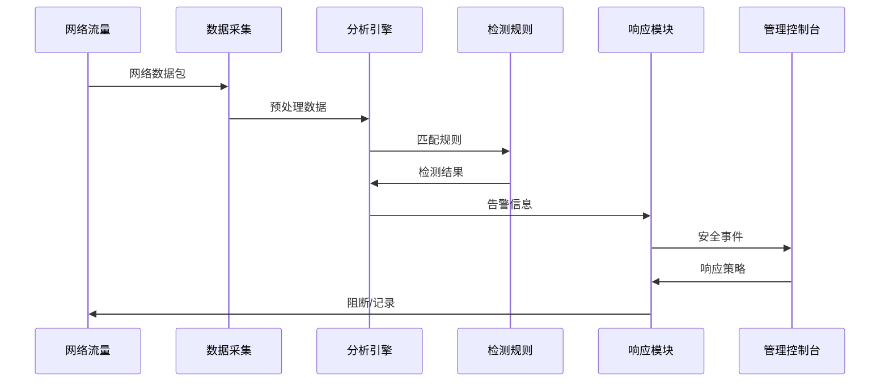
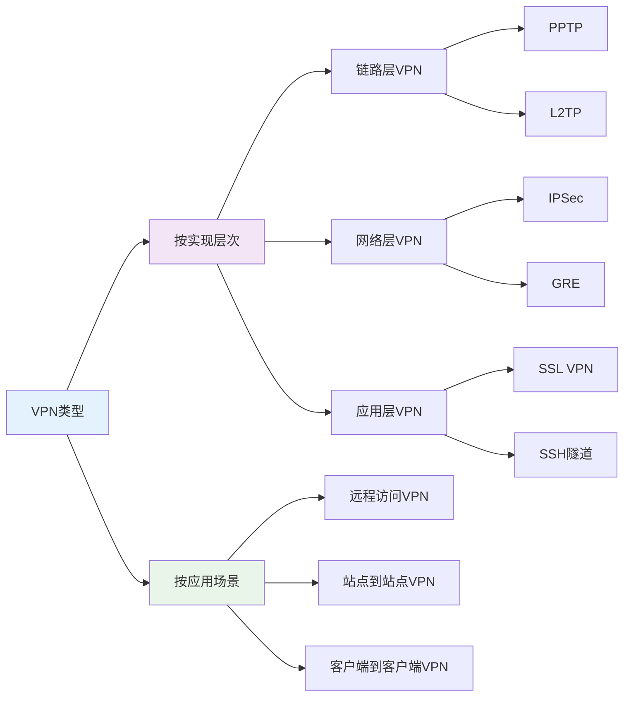
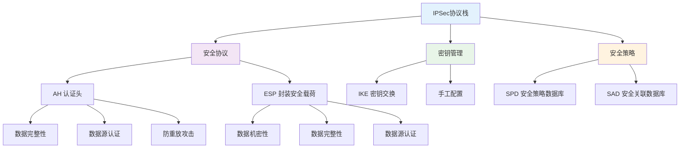
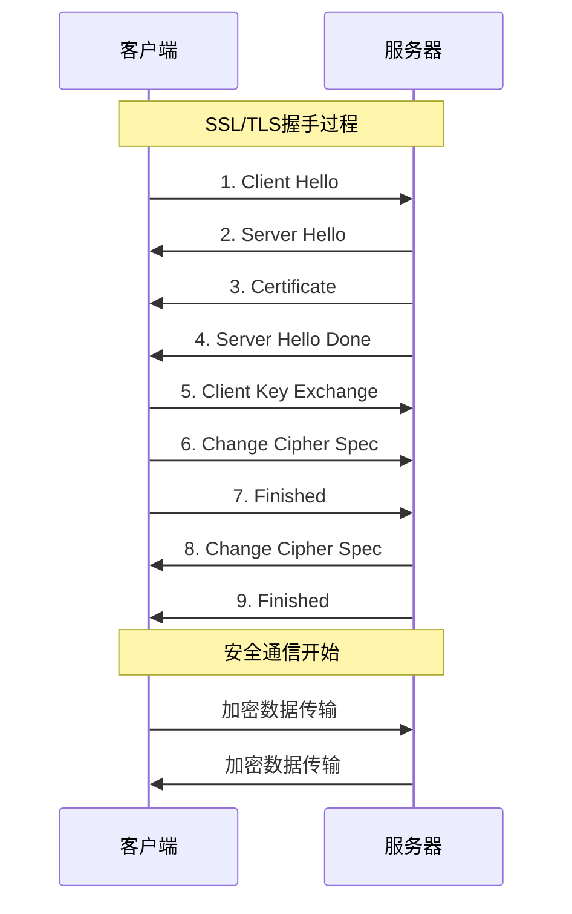
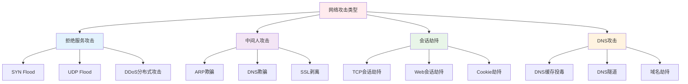

# 第三章 网络安全

## 📋 章节导航
- [🏠 返回主页](../README.md)
- [📖 本章内容](#本章内容)
- [📝 课堂笔记](#-课堂笔记)
- [🔍 课后思考](#-课后思考)
- [📚 扩展阅读](#-扩展阅读)
- [⬅️ 上一章：密码学基础](../第二章-密码学基础/笔记.md)
- [➡️ 下一章：系统安全](#下一章) *(待创建)*

## 📖 本章内容
- [3.1 网络安全概述](#31-网络安全概述)
- [3.2 防火墙技术](#32-防火墙技术)
- [3.3 入侵检测系统（IDS）](#33-入侵检测系统ids)
- [3.4 虚拟专用网络（VPN）](#34-虚拟专用网络vpn)
- [3.5 网络协议安全](#35-网络协议安全)

---

## 3.1 网络安全概述

### 网络安全威胁模型

### 网络安全服务

## 3.2 防火墙技术

### 防火墙类型

### 防火墙部署架构

## 3.3 入侵检测系统（IDS）

### IDS分类

### IDS工作流程

## 3.4 虚拟专用网络（VPN）

### VPN类型

### IPSec协议架构

## 3.5 网络协议安全

### SSL/TLS协议

### 常见网络攻击

## 📝 课堂笔记

### 重点内容
- [ ] 防火墙的工作原理和类型
- [ ] IDS和IPS的区别
- [ ] VPN的实现技术
- [ ] SSL/TLS握手过程
- [ ] 常见网络攻击及防护

### 实验记录
- [ ] 实验1：防火墙配置
- [ ] 实验2：IDS部署和配置
- [ ] 实验3：VPN搭建
- [ ] 实验4：网络攻击模拟

### 课堂讨论
- 

### 疑问点
- 

## 🔍 课后思考

1. 如何设计一个有效的网络安全架构？
2. 防火墙和IDS在网络安全中的作用有何不同？
3. VPN技术如何保证远程访问的安全性？

## 📚 扩展阅读
- [ ] 《网络安全技术与应用》
- [ ] RFC 2401 (IPSec架构)
- [ ] RFC 5246 (TLS 1.2)

## 🔄 快速导航
- [⬆️ 返回顶部](#第三章-网络安全)
- [🏠 返回主页](../README.md)
- [⬅️ 上一章：密码学基础](../第二章-密码学基础/笔记.md)
- [➡️ 下一章：系统安全](#下一章) *(待创建)*

---
*笔记时间：*
*复习时间：*