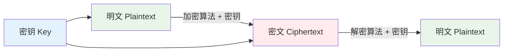
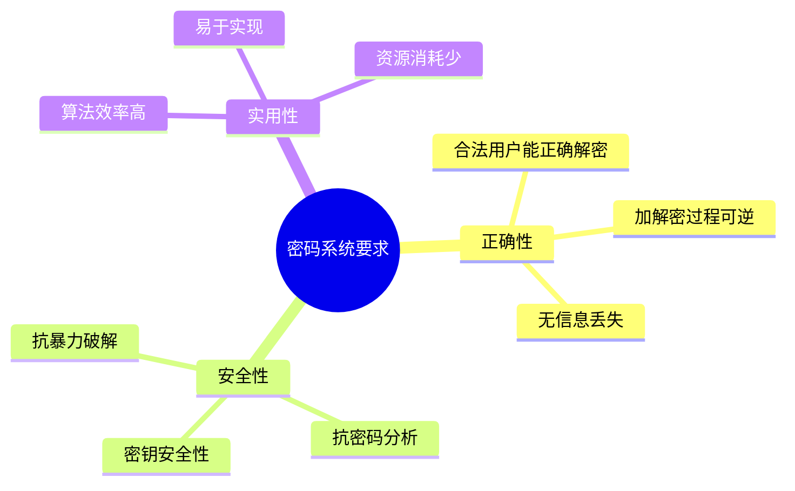
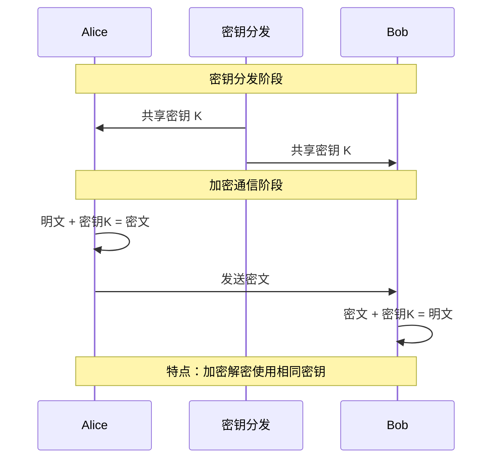
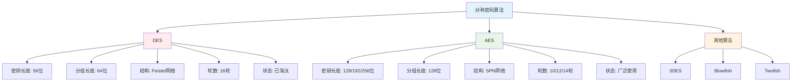
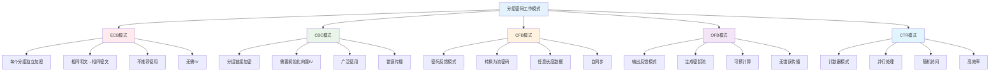

# 第二章 密码学基础

## 📋 章节导航
- [🏠 返回主页](../README.md)
- [📖 本章内容](#本章内容)
- [📝 课堂笔记](#-课堂笔记)
- [🔍 课后思考](#-课后思考)
- [📚 扩展阅读](#-扩展阅读)
- [⬅️ 上一章：信息安全概述](../第一章-信息安全概述/笔记.md)
- [➡️ 下一章：网络安全](../第三章-网络安全/笔记.md)

## 📖 本章内容
- [2.1 密码学概述](#21-密码学概述)
- [2.2 对称密码算法](#22-对称密码算法)
- [2.3 非对称密码算法](#23-非对称密码算法)
- [2.4 哈希函数](#24-哈希函数)
- [2.5 数字签名](#25-数字签名)

---

## 2.1 密码学概述

### 基本概念

- **密码学**：研究编制密码和破译密码的技术科学
- **明文（Plaintext）**：原始的、可读的信息
- **密文（Ciphertext）**：经过加密处理的信息
- **密钥（Key）**：控制加密和解密过程的参数
- **算法（Algorithm）**：加密和解密的数学函数

### 密码系统的基本要求

1. **正确性**：合法用户能够正确解密
2. **安全性**：攻击者无法破解密码
3. **实用性**：算法效率高，易于实现

## 2.2 对称密码算法

### 基本原理

- 加密和解密使用相同的密钥
- 密钥必须在通信双方之间安全共享

### 主要算法

#### DES（Data Encryption Standard）
- **密钥长度**：56位（实际64位，8位校验）
- **分组长度**：64位
- **结构**：Feistel网络，16轮
- **特点**：
  - [ ] 密钥长度较短，安全性不足
  - [ ] 已被AES替代

#### AES（Advanced Encryption Standard）
- **密钥长度**：128、192、256位
- **分组长度**：128位
- **结构**：SPN网络
- **轮数**：10/12/14轮（根据密钥长度）
- **特点**：
  - [ ] 目前最广泛使用的对称加密算法
  - [ ] 安全性高，效率好

### 工作模式

1. **ECB模式**（Electronic Codebook）
   - 每个分组独立加密
   - 相同明文产生相同密文
   - 不推荐使用

2. **CBC模式**（Cipher Block Chaining）
   - 前一个密文分组与当前明文分组异或
   - 需要初始化向量（IV）
   - 广泛使用

3. **CFB模式**（Cipher Feedback）
   - 将分组密码转换为流密码
   - 可以处理任意长度的数据

4. **OFB模式**（Output Feedback）
   - 生成密钥流进行加密
   - 预计算密钥流

## 2.3 非对称密码算法

### 基本原理
- 使用一对密钥：公钥和私钥
- 公钥公开，私钥保密
- 用公钥加密，私钥解密（或相反）

### RSA算法
#### 算法原理
1. **密钥生成**：
   - 选择两个大素数 p 和 q
   - 计算 n = p × q
   - 计算 φ(n) = (p-1)(q-1)
   - 选择公钥指数 e
   - 计算私钥指数 d

2. **加密过程**：c = m^e mod n
3. **解密过程**：m = c^d mod n

#### 安全性
- 基于大整数分解的困难性
- 密钥长度通常为1024、2048、4096位

### ECC（椭圆曲线密码）
- **优势**：相同安全级别下密钥长度更短
- **应用**：移动设备、物联网

## 2.4 哈希函数

### 基本概念
- 将任意长度的输入映射为固定长度的输出
- 单向函数，不可逆

### 安全性质
1. **单向性**：从哈希值推导原始数据困难
2. **弱抗碰撞性**：给定消息，找到具有相同哈希值的另一消息困难
3. **强抗碰撞性**：找到任意两个具有相同哈希值的消息困难

### 常用算法
- **MD5**：128位输出，已不安全
- **SHA-1**：160位输出，已不推荐
- **SHA-256**：256位输出，目前安全
- **SHA-3**：最新标准

## 2.5 数字签名

### 基本原理
- 使用私钥对消息进行签名
- 使用公钥验证签名
- 提供身份认证和不可否认性

### RSA数字签名
1. **签名**：s = H(m)^d mod n
2. **验证**：H(m) = s^e mod n

### DSA（Digital Signature Algorithm）
- 专门用于数字签名的算法
- 基于离散对数问题

## 📝 课堂笔记

### 重点公式
- RSA加密：c = m^e mod n
- RSA解密：m = c^d mod n
- 欧拉函数：φ(n) = (p-1)(q-1)

### 实验记录
- [ ] 实验1：DES算法实现
- [ ] 实验2：RSA密钥生成和加解密
- [ ] 实验3：数字签名验证

### 课堂讨论
- 

### 疑问点
- 

## 🔍 课后思考

1. 为什么需要工作模式？ECB模式有什么问题？
2. 对称密码和非对称密码的优缺点比较？
3. 如何选择合适的哈希函数？

## 📚 扩展阅读
- [ ] 《现代密码学》
- [ ] RFC 3447 (RSA标准)
- [ ] NIST SP 800-57 (密钥管理指南)

## 🔄 快速导航
- [⬆️ 返回顶部](#第二章-密码学基础)
- [🏠 返回主页](../README.md)
- [⬅️ 上一章：信息安全概述](../第一章-信息安全概述/笔记.md)
- [➡️ 下一章：网络安全](../第三章-网络安全/笔记.md)

---
*笔记时间：*
*复习时间：*