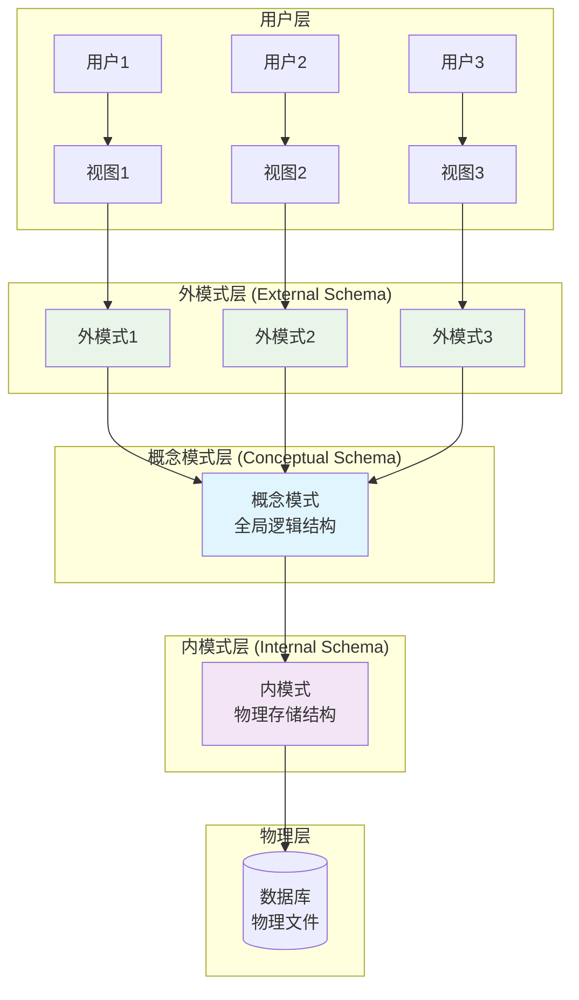
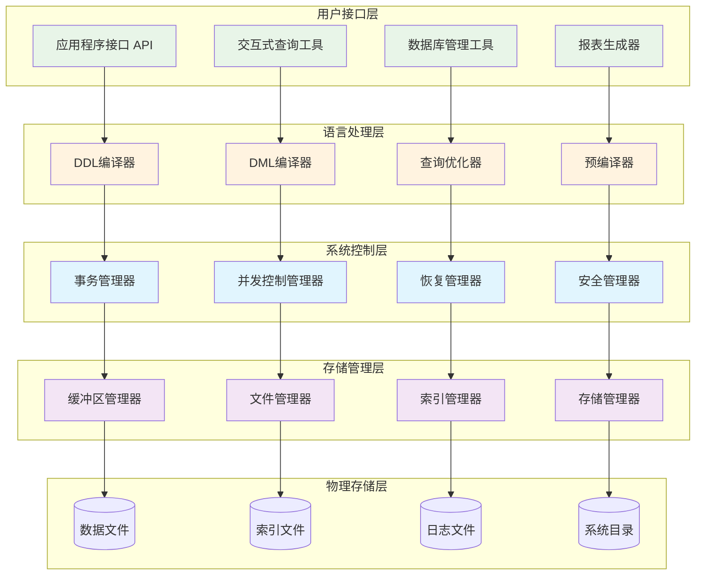
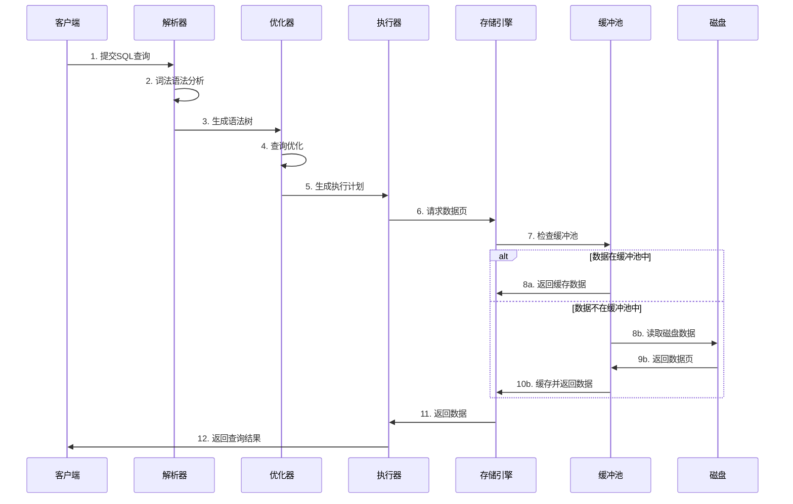
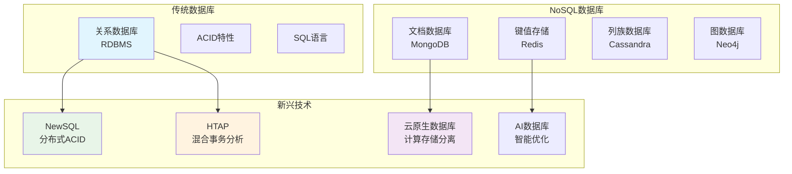

# 数据库原理学习指南

## 📚 课程概述

作为数据科学与大数据技术专业的核心课程，数据库原理是你未来从事大数据分析、数据挖掘和大数据系统开发的重要基础。本课程将帮助你掌握数据管理的核心理论和实践技能。

## 🎯 学习目标

- 掌握数据库系统的基本概念和原理
- 理解数据模型和数据库设计方法
- 熟练使用SQL进行数据操作
- 了解数据库管理系统的内部机制
- 为后续的大数据存储与管理课程打下基础

## 📖 第一章：数据库系统概述

### 1.1 数据库技术基本术语

根据你当前学习的内容，这是数据库原理的入门章节，主要包含以下核心概念：

#### 1.1.1 数据（Data）
- **定义**：描述事物的符号记录
- **特点**：
  - 可以是数字、文字、图形、图像、音频、视频等多种形式
  - 数据与其语义密不可分
  - 需要通过解释才能表达完整含义

#### 1.1.2 数据库（Database, DB）
- **定义**：长期存储在计算机内的、有组织的、可共享的数据集合
- **特点**：
  - 数据统一存储在计算机存储设备上
  - 数据按一定格式和数据模型组织
  - 具有较小的冗余度
  - 具有较高的数据独立性和易扩展性
  - 可为各种用户共享

#### 1.1.3 数据库管理系统（DBMS）
- **定义**：位于用户与操作系统之间的一层数据管理软件
- **主要功能**：
  - 数据定义功能
  - 数据组织、存储和管理
  - 数据操纵功能
  - 数据库的事务管理和运行管理
  - 数据库的建立和维护功能
  - 与其他软件系统的通信功能

#### 1.1.4 数据库系统（DBS）
- **定义**：由数据库、数据库管理系统、应用程序和数据库管理员组成的存储、管理、处理和维护数据的系统
- **组成部分**：
  - 数据库（DB）
  - 数据库管理系统（DBMS）
  - 应用开发工具
  - 应用程序
  - 数据库管理员（DBA）

## 📋 完整学习路线

### 第一阶段：基础概念（第1-2章）
- [ ] 数据库系统概述
- [ ] 关系数据库
- [ ] 关系数据库标准语言SQL

**重点掌握**：
- 四个基本概念的区别与联系
- 数据库系统的特点
- 关系模型的基本概念

### 第二阶段：设计理论（第3-4章）
- [ ] 关系数据库标准语言SQL（续）
- [ ] 数据库安全性
- [ ] 数据库完整性
- [ ] 关系数据理论

**重点掌握**：
- SQL语句的编写
- 函数依赖和范式理论
- 数据库设计方法

### 第三阶段：设计与应用（第5-6章）
- [ ] 数据库设计
- [ ] 关系查询处理和查询优化

**重点掌握**：
- E-R模型设计
- 数据库设计的六个阶段
- 查询优化策略

### 第四阶段：系统实现（第7-9章）
- [ ] 数据库恢复技术
- [ ] 并发控制
- [ ] 数据库管理系统

**重点掌握**：
- 事务处理
- 并发控制机制
- 数据库恢复方法

### 第五阶段：新技术（第10-12章）
- [ ] 数据库技术发展概述
- [ ] 分布式数据库系统
- [ ] 对象关系数据库系统

## 🛠️ 实践建议

### 1. 理论学习
- 认真理解每个概念的定义和特点
- 掌握概念之间的关系和区别
- 多做课后习题巩固理解

### 2. 实践操作
- 安装并熟悉主流数据库系统（如MySQL、PostgreSQL）
- 练习SQL语句编写
- 完成数据库设计项目

### 3. 与专业结合
作为数据科学与大数据技术专业学生，你需要特别关注：
- 大数据存储技术（NoSQL数据库）
- 分布式数据库系统
- 数据仓库与数据挖掘
- 数据库在大数据分析中的应用

## 📚 推荐学习资源

### 教材
- 《数据库系统概论》（王珊、萨师煊著）
- 《数据库系统实现》（Hector Garcia-Molina等著）

### 在线资源
- 各大数据库官方文档
- 在线SQL练习平台
- 数据库相关的开源项目

### 实践平台
- MySQL Workbench
- phpMyAdmin
- 各种在线SQL练习网站

## 🎯 学习重点提醒

1. **概念理解**：数据、数据库、DBMS、DBS四个概念是基础，必须深刻理解
2. **SQL掌握**：SQL是数据库操作的核心工具，需要大量练习
3. **设计能力**：数据库设计是实际应用的关键技能
4. **系统思维**：理解数据库作为系统的整体架构和运行机制

## 💡 学习建议

1. **循序渐进**：从基本概念开始，逐步深入
2. **理论结合实践**：每学一个概念都要动手实践
3. **多做练习**：通过大量练习巩固理论知识
4. **关注应用**：结合大数据技术的发展趋势学习

## 🔍 深度解析：附加资料

为了帮助你更深入地理解数据库原理的核心概念，我们提供了以下专题深度解析：

### 📐 内外模式联系详解

数据库三级模式结构是数据库系统的核心架构，理解内外模式之间的联系对于掌握数据库系统工作原理至关重要。

**核心要点**：
- **两级映像机制**：外/概念映像 + 概念/内映像
- **数据独立性**：逻辑独立性 + 物理独立性
- **多用户支持**：不同外模式满足不同需求
- **安全控制**：通过外模式限制数据访问

**详细内容参见**：[内外模式联系详解](附加资料/内外模式联系详解.md)

### 🏗️ DBMS系统架构与工作原理

数据库管理系统（DBMS）是管理数据库的核心软件，其架构设计直接影响系统性能和功能。

**核心组件**：
- **查询处理器**：SQL解析、优化、执行
- **存储引擎**：数据存储、索引管理、缓冲池
- **事务管理器**：ACID特性保证
- **并发控制器**：多用户并发访问控制

**工作流程**：
1. **查询解析**：词法分析 → 语法分析 → 语义分析
2. **查询优化**：基于规则优化 + 基于代价优化
3. **执行计划**：生成最优执行路径
4. **数据访问**：缓冲池管理 + 磁盘I/O优化

**详细内容参见**：[DBMS系统架构与工作原理详解](附加资料/DBMS系统架构与工作原理详解.md)

### 🔄 查询执行完整流程

### 🌐 现代数据库发展趋势

---

**祝你学习顺利！数据库原理是大数据技术的重要基石，掌握好这门课程将为你后续的专业学习奠定坚实基础。** 🚀

---

## 📚 章节导航

| 章节 | 链接 | 章节 | 链接 |
|------|------|------|------|
| 第1章 | [数据库系统概述](第1章_数据库系统概述.md) | 第8章 | [关系查询处理和查询优化](第8章_关系查询处理和查询优化.md) |
| 第2章 | [关系数据库](第2章_关系数据库.md) | 第9章 | [数据库恢复技术](第9章_数据库恢复技术.md) |
| 第3章 | [关系数据库标准语言SQL](第3章_关系数据库标准语言SQL.md) | 第10章 | [并发控制](第10章_并发控制.md) |
| 第4章 | [数据库安全性](第4章_数据库安全性.md) | 第11章 | [数据库管理系统](第11章_数据库管理系统.md) |
| 第5章 | [数据库完整性](第5章_数据库完整性.md) | 第12章 | [数据库技术发展概述](第12章_数据库技术发展概述.md) |
| 第6章 | [关系数据理论](第6章_关系数据理论.md) | 第13章 | [分布式数据库系统](第13章_分布式数据库系统.md) |
| 第7章 | [数据库设计](第7章_数据库设计.md) | 第14章 | [对象关系数据库](第14章_对象关系数据库.md) |

### 🔍 附加资料

| 专题 | 链接 | 说明 |
|------|------|------|
| 内外模式联系 | [内外模式联系详解](附加资料/内外模式联系详解.md) | 三级模式结构深度解析 |
| DBMS架构 | [DBMS系统架构与工作原理详解](附加资料/DBMS系统架构与工作原理详解.md) | 数据库管理系统内部机制 |

**返回项目首页：** [README](../README.md)