# 第10章 并发控制

## 学习目标
- 理解并发控制的基本概念和重要性
- 掌握事务调度和串行化理论
- 了解并发操作可能产生的问题
- 掌握封锁协议和两段锁协议
- 理解死锁的产生、预防和解除
- 了解时间戳排序和多版本并发控制
- 掌握隔离级别和并发控制的实现

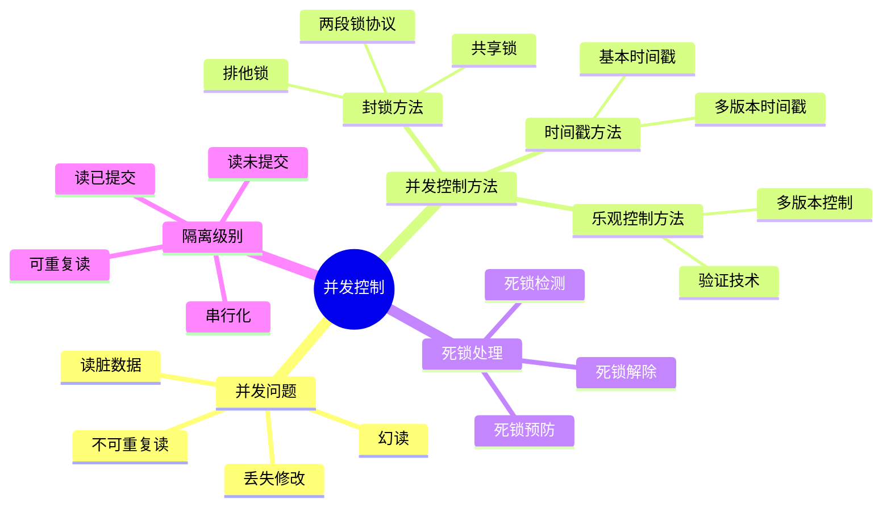

## 10.1 并发控制概述

### 10.1.1 并发操作的必要性

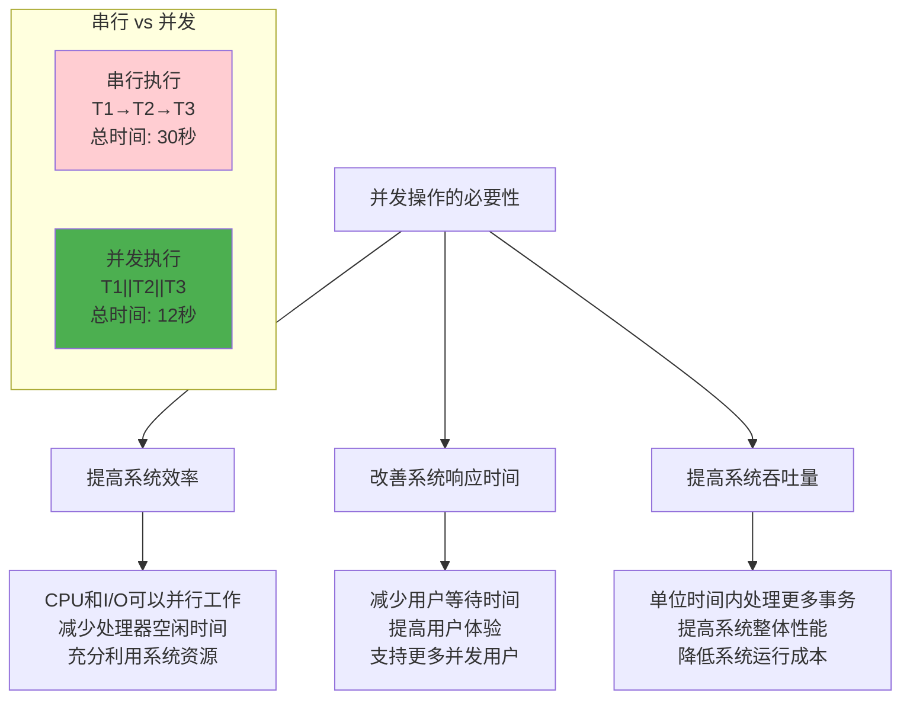

### 10.1.2 并发操作带来的问题

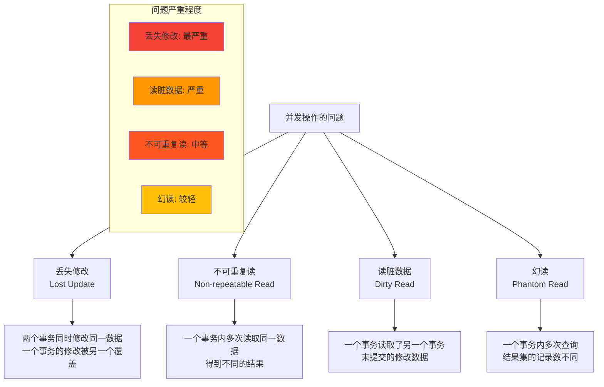

### 10.1.3 并发控制的任务

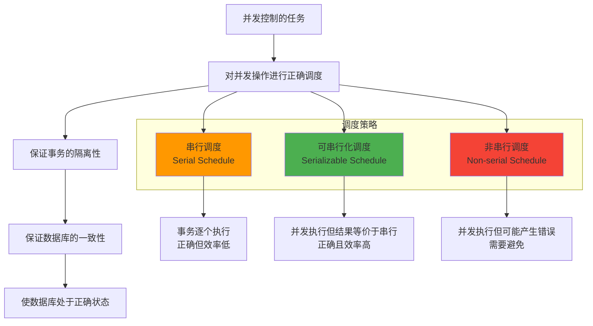

## 10.2 封锁

### 10.2.1 封锁的基本概念

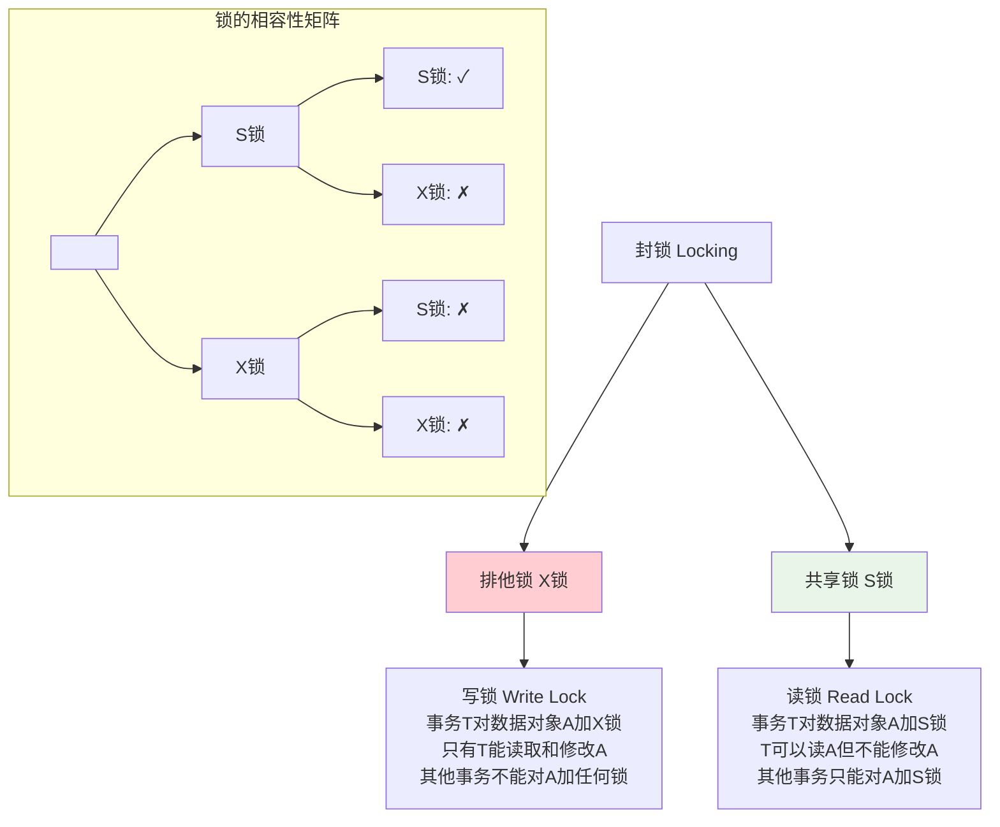

### 10.2.2 封锁协议

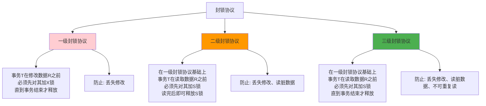

### 10.2.3 两段锁协议

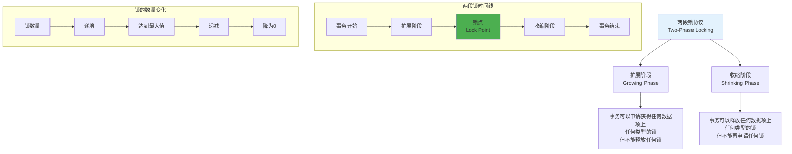

### 10.2.4 封锁的粒度

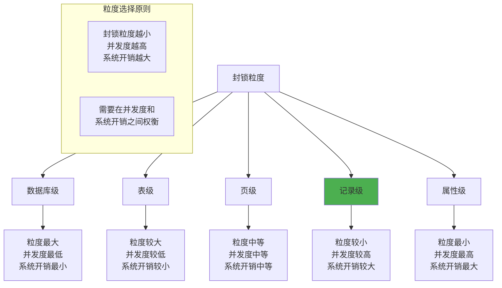

## 10.3 死锁

### 10.3.1 死锁的概念

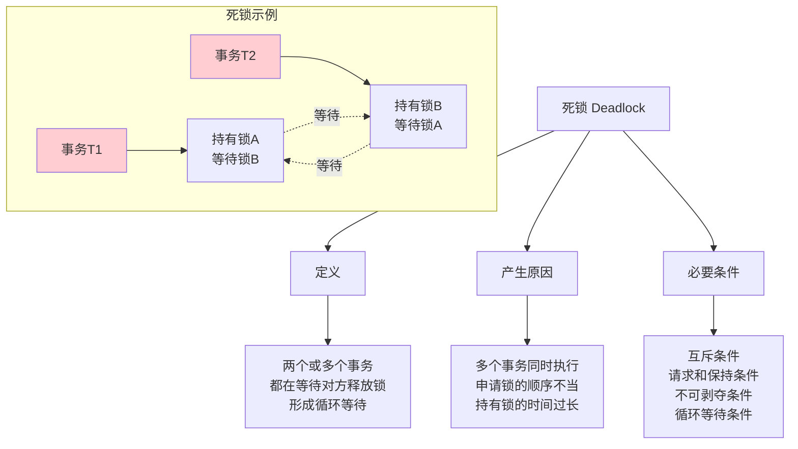

### 10.3.2 死锁的预防

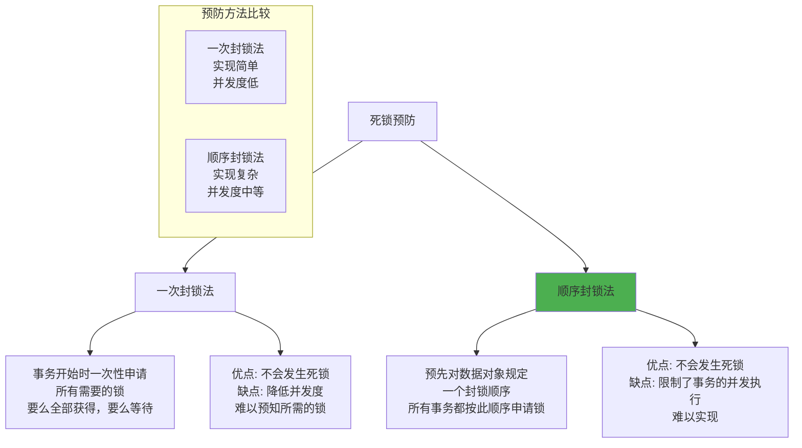

### 10.3.3 死锁的检测

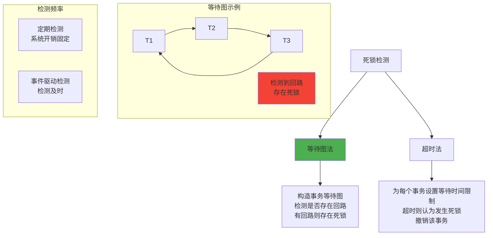

### 10.3.4 死锁的解除

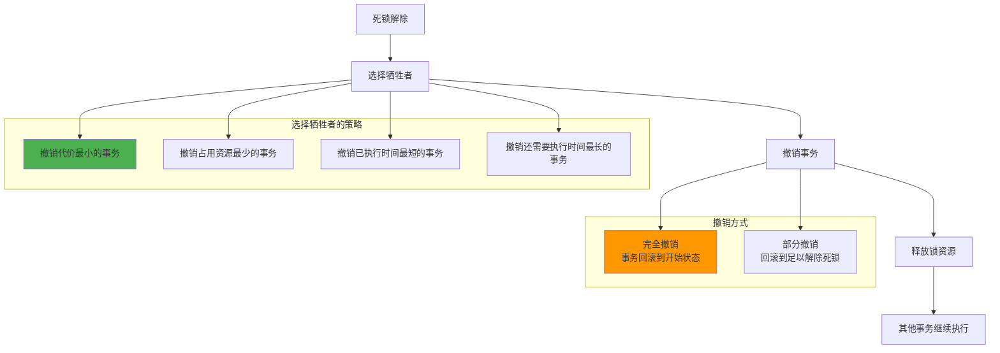

## 10.4 时间戳排序

### 10.4.1 时间戳的概念

```mermaid
graph TD
    A[时间戳排序] --> B[时间戳的分配]
    A --> C[时间戳的作用]
    A --> D[排序规则]
    
    B --> B1[系统时钟<br/>逻辑计数器<br/>事务标识符]
    
    C --> C1[确定事务的执行顺序<br/>解决读写冲突<br/>保证串行化]
    
    D --> D1[时间戳小的事务<br/>在时间戳大的事务之前执行<br/>TS(Ti) < TS(Tj) → Ti先于Tj]
    
    subgraph "时间戳示例"
        E[T1: TS=100]
        F[T2: TS=150]
        G[T3: TS=200]
        H[执行顺序: T1 → T2 → T3]
    end
    
    style D fill:#e3f2fd
```

### 10.4.2 基本时间戳排序算法

```mermaid
flowchart TD
    A[事务Ti请求读数据项X] --> B{TS(Ti) < WTS(X)?}
    B -->|是| C[拒绝读操作<br/>撤销Ti]
    B -->|否| D[允许读操作<br/>RTS(X) = max(RTS(X), TS(Ti))]
    
    E[事务Ti请求写数据项X] --> F{TS(Ti) < RTS(X)?}
    F -->|是| G[拒绝写操作<br/>撤销Ti]
    F -->|否| H{TS(Ti) < WTS(X)?}
    H -->|是| I[拒绝写操作<br/>撤销Ti]
    H -->|否| J[允许写操作<br/>WTS(X) = TS(Ti)]
    
    subgraph "时间戳标记"
        K[RTS(X): X的读时间戳<br/>最后读X的事务的时间戳]
        L[WTS(X): X的写时间戳<br/>最后写X的事务的时间戳]
    end
    
    style C fill:#f44336
    style G fill:#f44336
    style I fill:#f44336
    style D fill:#4caf50
    style J fill:#4caf50
```

### 10.4.3 多版本时间戳排序

```mermaid
graph TD
    A[多版本时间戳排序] --> B[版本管理]
    A --> C[读操作规则]
    A --> D[写操作规则]
    
    B --> B1[为每个数据项维护多个版本<br/>每个版本有读写时间戳<br/>版本按写时间戳排序]
    
    C --> C1[事务Ti读数据项X<br/>选择WTS ≤ TS(Ti)的最大版本<br/>更新该版本的RTS]
    
    D --> D1[事务Ti写数据项X<br/>检查是否有冲突<br/>创建新版本或拒绝操作]
    
    subgraph "版本示例"
        E[X的版本1: WTS=50, RTS=120]
        F[X的版本2: WTS=100, RTS=150]
        G[X的版本3: WTS=180, RTS=180]
    end
    
    style A fill:#e3f2fd
    style C1 fill:#4caf50
```

## 10.5 乐观并发控制

### 10.5.1 乐观控制的基本思想

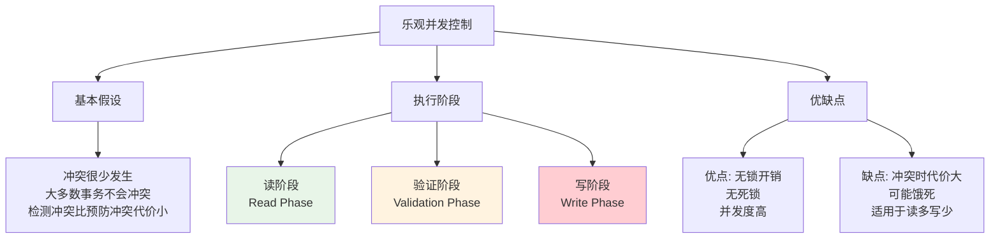

### 10.5.2 验证技术

```mermaid
flowchart TD
    A[事务Ti进入验证阶段] --> B[检查与已提交事务的冲突]
    B --> C{是否存在冲突?}
    C -->|否| D[验证通过<br/>进入写阶段]
    C -->|是| E[验证失败<br/>撤销事务]
    
    subgraph "冲突检测条件"
        F[对于任意已提交事务Tj<br/>满足以下条件之一:]
        G[1. finish(Tj) < start(Ti)]
        H[2. start(Ti) < finish(Tj) < validation(Ti)<br/>且 WS(Tj) ∩ RS(Ti) = ∅]
        I[3. start(Ti) < start(Tj) < validation(Ti)<br/>且 WS(Tj) ∩ RS(Ti) = ∅<br/>且 WS(Tj) ∩ WS(Ti) = ∅]
    end
    
    B --> F
    F --> G
    F --> H
    F --> I
    
    style D fill:#4caf50
    style E fill:#f44336
```

### 10.5.3 多版本并发控制

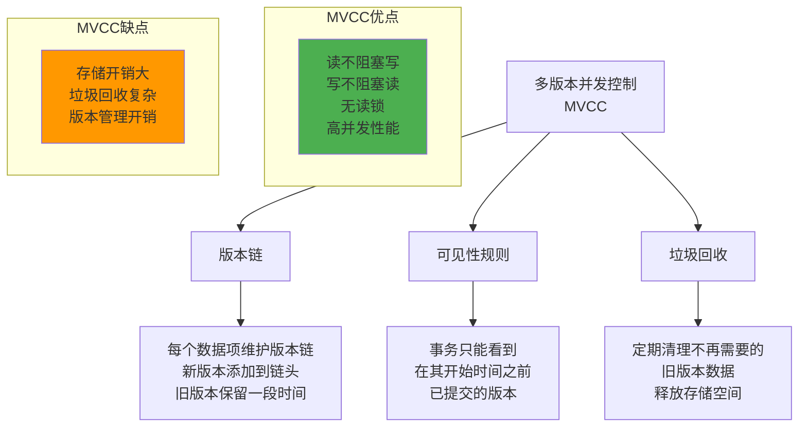

## 10.6 隔离级别

### 10.6.1 SQL标准隔离级别

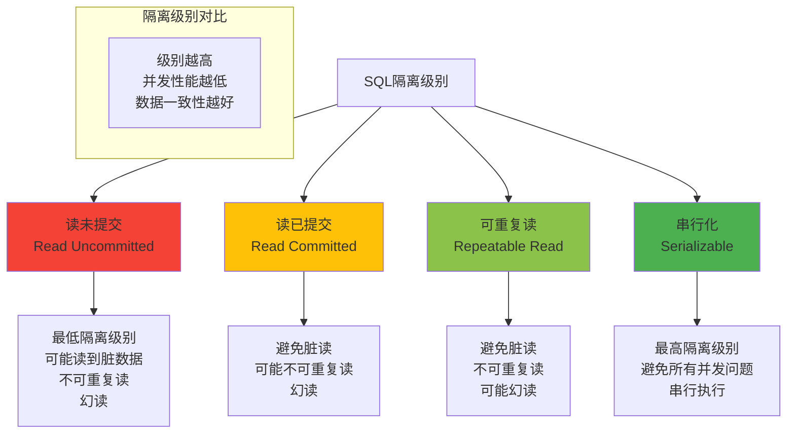

### 10.6.2 隔离级别的实现

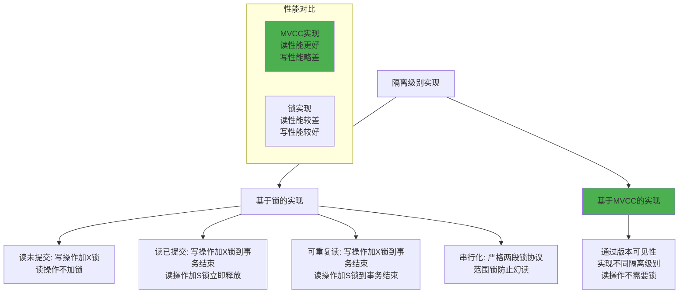

## 10.7 并发控制的实现

### 10.7.1 锁管理器

```mermaid
graph TD
    A[锁管理器] --> B[锁表]
    A --> C[等待队列]
    A --> D[死锁检测]
    
    B --> B1[记录所有锁信息<br/>数据项、锁类型、持有者<br/>哈希表实现]
    
    C --> C1[管理等待锁的事务<br/>FIFO队列<br/>优先级队列]
    
    D --> D1[定期检测死锁<br/>构造等待图<br/>选择牺牲者]
    
    subgraph "锁操作"
        E[申请锁<br/>Lock Request]
        F[释放锁<br/>Lock Release]
        G[锁升级<br/>Lock Upgrade]
        H[锁降级<br/>Lock Downgrade]
    end
    
    style A fill:#e3f2fd
```

### 10.7.2 事务调度器

```mermaid
flowchart TD
    A[事务调度器] --> B[接收事务请求]
    B --> C[分析操作类型]
    C --> D{需要加锁?}
    D -->|是| E[向锁管理器申请锁]
    D -->|否| F[直接执行操作]
    E --> G{获得锁?}
    G -->|是| F
    G -->|否| H[加入等待队列]
    F --> I[执行数据库操作]
    I --> J[操作完成]
    
    subgraph "调度策略"
        K[先来先服务<br/>FCFS]
        L[优先级调度<br/>Priority]
        M[最短作业优先<br/>SJF]
    end
    
    style F fill:#4caf50
    style H fill:#ff9800
```

## 10.8 学习检查点

### 10.8.1 重点概念总结

```mermaid
mindmap
  root((并发控制))
    并发问题
      丢失修改
      不可重复读
      读脏数据
      幻读
    封锁方法
      锁类型
        共享锁S
        排他锁X
      封锁协议
        一级封锁协议
        二级封锁协议
        三级封锁协议
      两段锁协议
        扩展阶段
        收缩阶段
    死锁处理
      死锁预防
        一次封锁法
        顺序封锁法
      死锁检测
        等待图法
        超时法
      死锁解除
        选择牺牲者
        撤销事务
    其他方法
      时间戳排序
        基本时间戳
        多版本时间戳
      乐观控制
        验证技术
        多版本控制
    隔离级别
      读未提交
      读已提交
      可重复读
      串行化
```

### 10.8.2 练习题

1. **并发控制基础**
   - 分析并发操作可能产生的问题
   - 设计封锁协议解决并发问题
   - 比较不同封锁协议的效果

2. **死锁处理**
   - 构造死锁场景并用等待图检测
   - 设计死锁预防策略
   - 分析死锁解除的代价

3. **隔离级别应用**
   - 分析不同隔离级别的适用场景
   - 设计基于锁的隔离级别实现
   - 比较MVCC和锁机制的优缺点

### 10.8.3 思考题

1. 为什么两段锁协议能保证串行化？
2. 在什么情况下应该选择乐观并发控制？
3. MVCC如何解决读写冲突问题？
4. 如何在并发性能和数据一致性之间取得平衡？

---

**本章小结**：并发控制是数据库系统的核心技术之一，它确保多个事务并发执行时数据的一致性和隔离性。通过封锁、时间戳排序、乐观控制等方法，可以有效解决并发操作带来的问题。在实际应用中，需要根据应用特点选择合适的并发控制策略和隔离级别，在并发性能和数据一致性之间找到最佳平衡点。

---
**上一章：** [第9章 数据库恢复技术](第9章_数据库恢复技术.md)  
**下一章：** [第11章 数据库管理系统](第11章_数据库管理系统.md)