# 第11章 数据库管理系统

## 学习目标
- 理解数据库管理系统的基本概念和功能
- 掌握DBMS的系统结构和组成
- 了解数据库系统的运行和管理
- 理解数据库管理员的职责和工作
- 掌握数据库系统的性能监控和调优
- 了解数据库系统的发展趋势
- 理解分布式数据库系统的基本概念

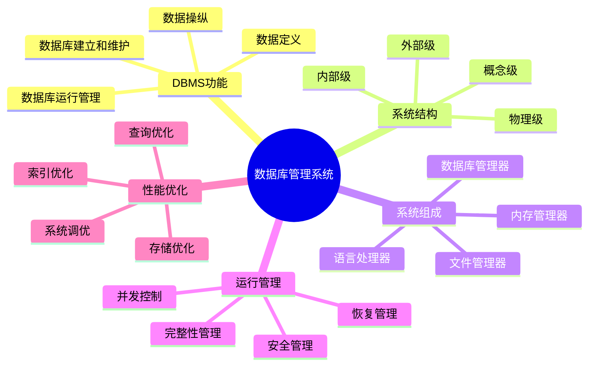

## 11.1 数据库管理系统概述

### 11.1.1 DBMS的定义和功能

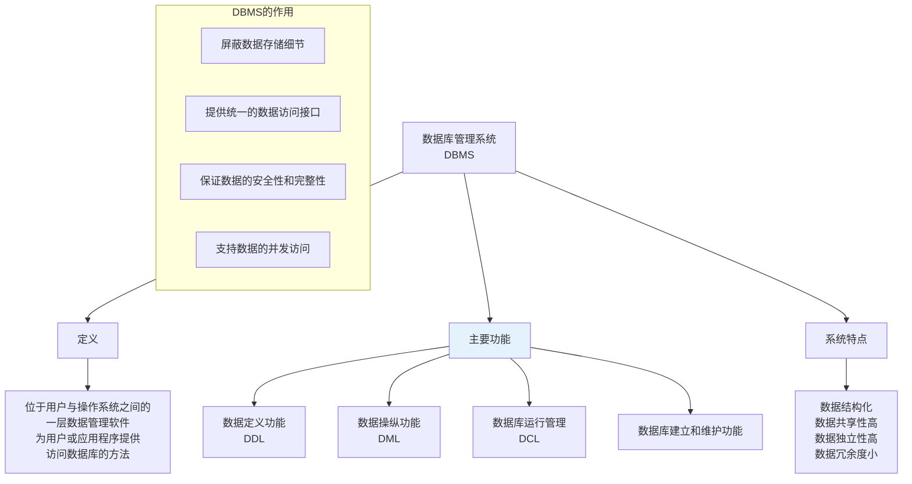

### 11.1.2 DBMS的发展历程

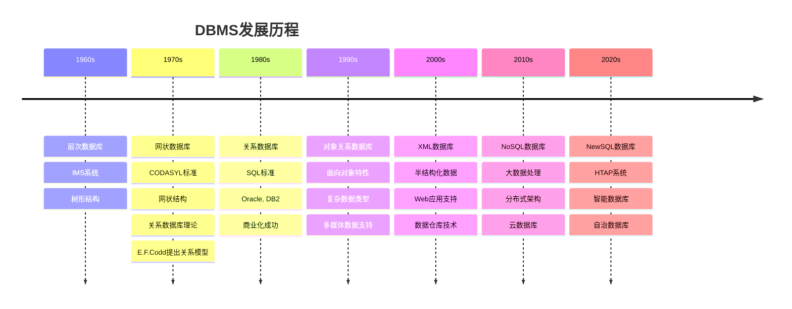

### 11.1.3 DBMS的分类

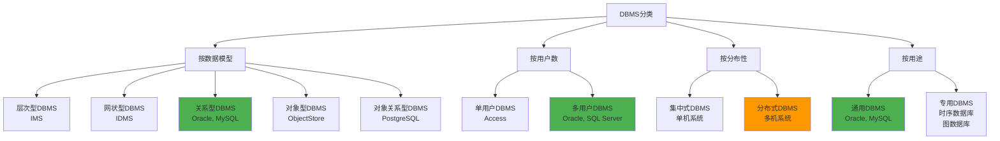

## 11.2 数据库系统结构

### 11.2.1 数据库系统三级模式结构

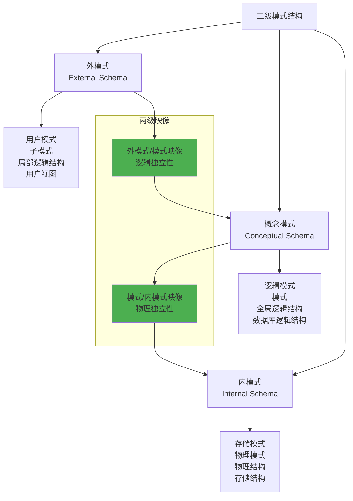

### 11.2.2 数据库系统的体系结构

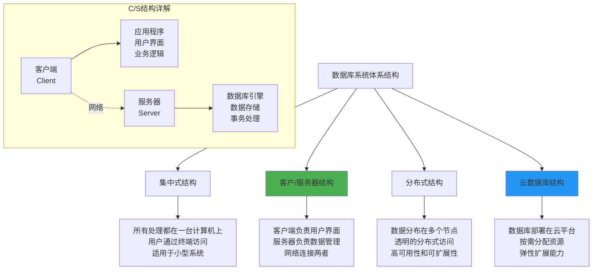

### 11.2.3 数据库管理系统的组成

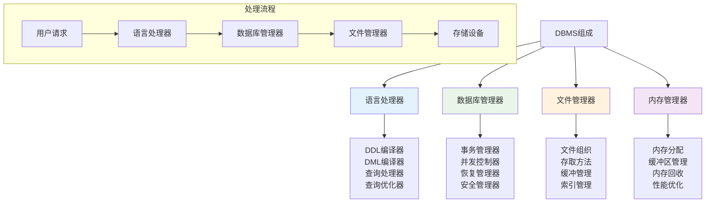

## 11.3 数据库运行和管理

### 11.3.1 数据库的运行控制

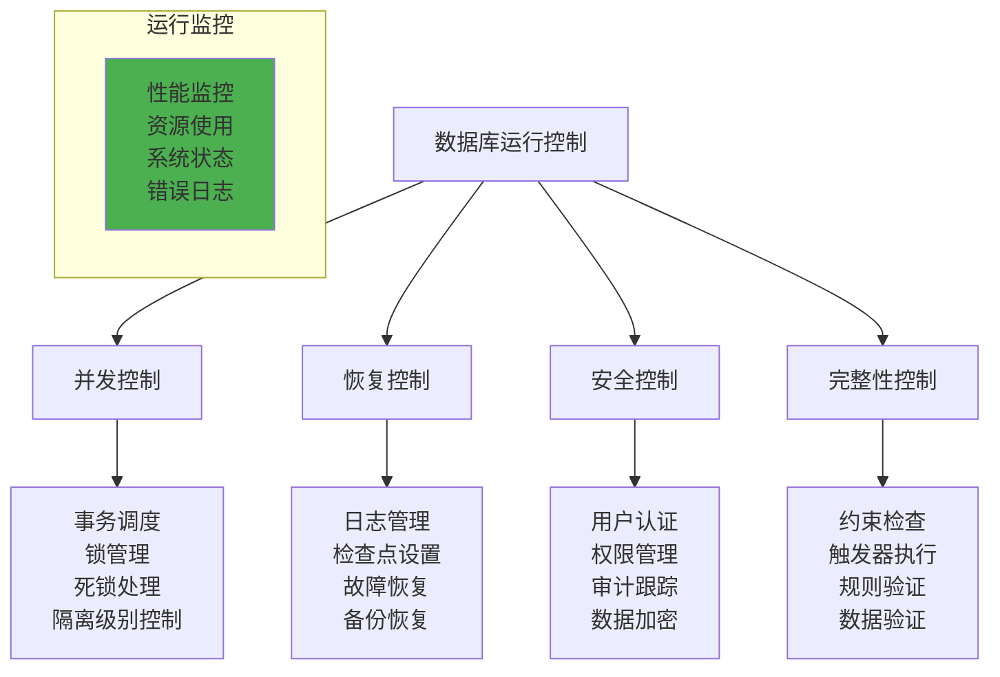

### 11.3.2 数据库的存储管理

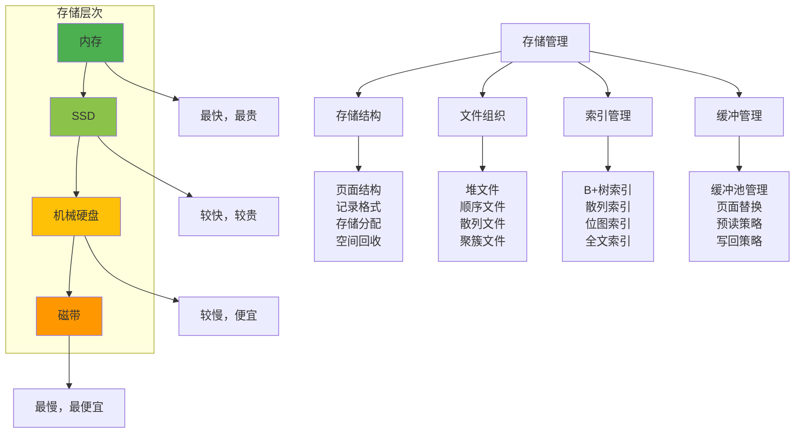

### 11.3.3 查询处理和优化

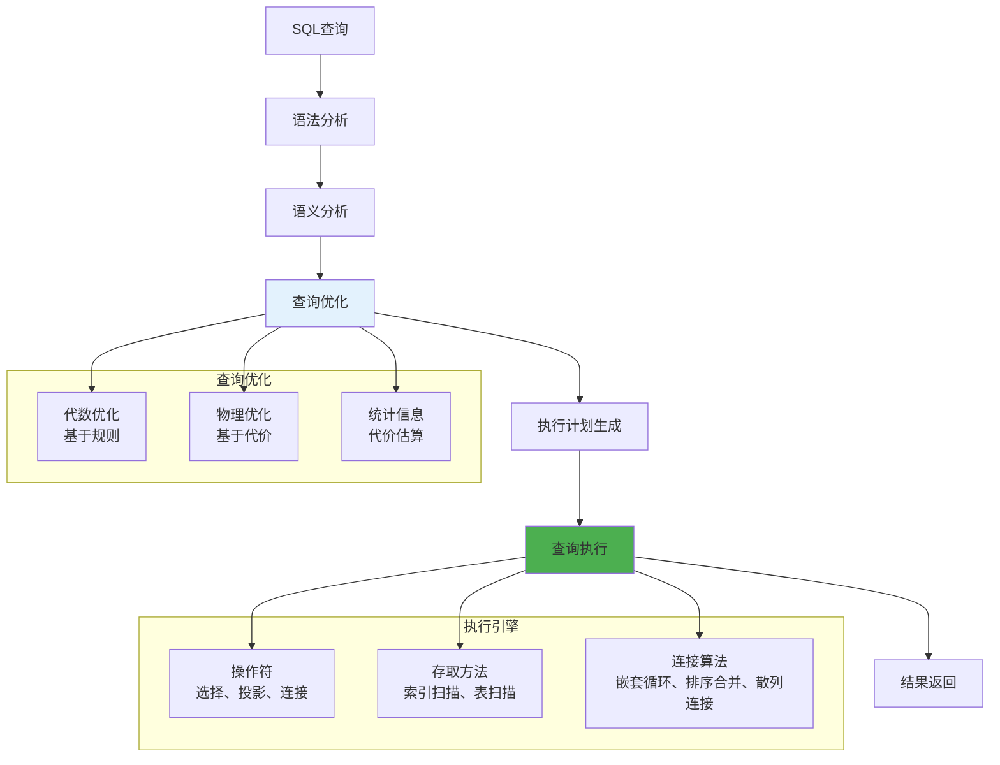

## 11.4 数据库管理员

### 11.4.1 DBA的职责

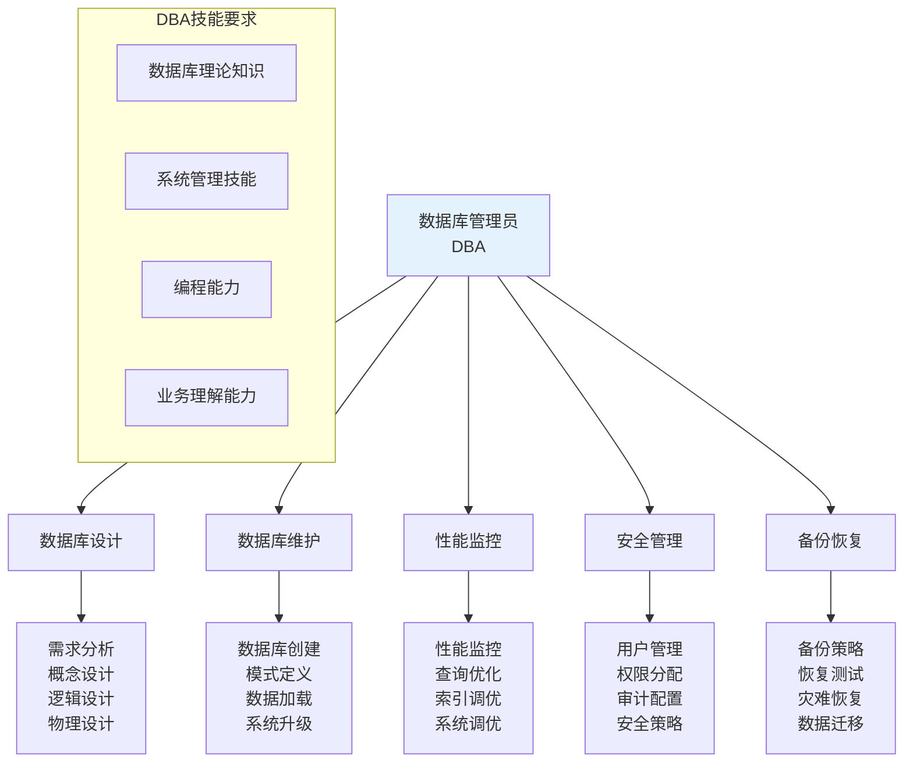

### 11.4.2 数据库管理工具

```mermaid
graph TD
    A[数据库管理工具] --> B[图形化管理工具]
    A --> C[命令行工具]
    A --> D[监控工具]
    A --> E[自动化工具]
    
    B --> B1[Oracle Enterprise Manager<br/>SQL Server Management Studio<br/>MySQL Workbench<br/>pgAdmin]
    
    C --> C1[sqlplus (Oracle)<br/>mysql (MySQL)<br/>psql (PostgreSQL)<br/>sqlcmd (SQL Server)]
    
    D --> D1[性能监控<br/>AWR报告<br/>慢查询日志<br/>系统资源监控]
    
    E --> E1[备份脚本<br/>监控脚本<br/>维护作业<br/>自动故障转移]
    
    subgraph "工具特点"
        F[图形化: 易用性好<br/>功能丰富]
        G[命令行: 效率高<br/>适合自动化]
        H[监控: 实时性好<br/>预警及时]
        I[自动化: 减少人工<br/>提高可靠性]
    end
    
    style B fill:#4caf50
    style E fill:#2196f3
```

## 11.5 数据库系统性能

### 11.5.1 性能指标

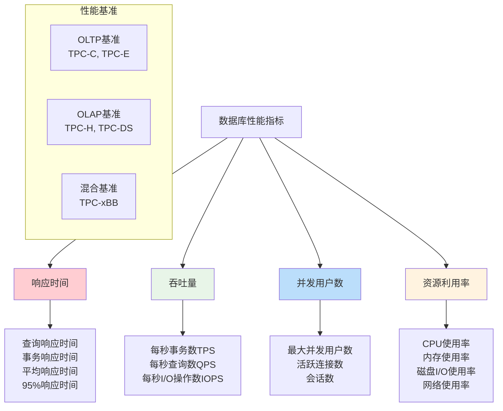

### 11.5.2 性能监控

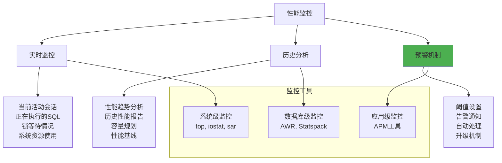

### 11.5.3 性能调优

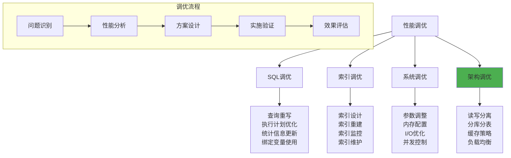

## 11.6 数据库技术发展

### 11.6.1 新兴数据库技术

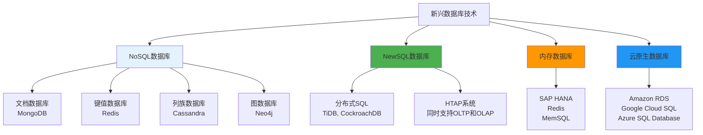

### 11.6.2 人工智能与数据库

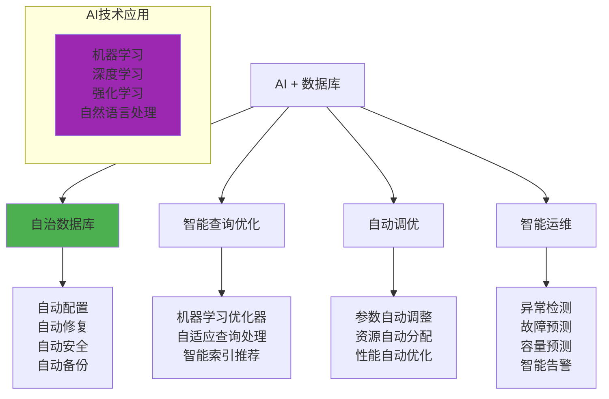

### 11.6.3 区块链与数据库

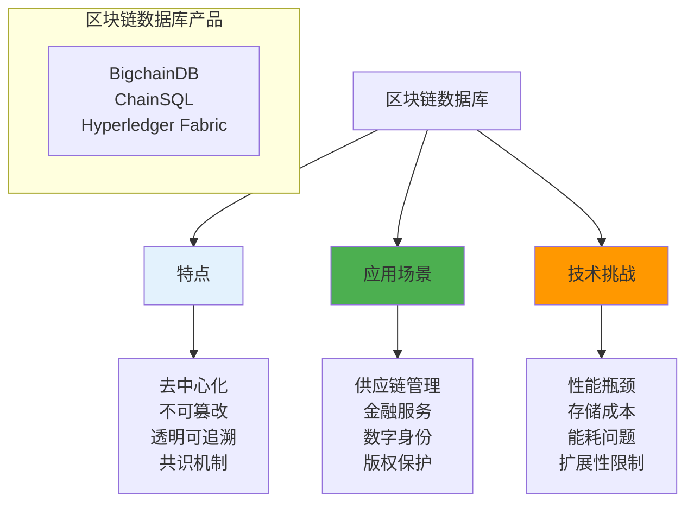

## 11.7 分布式数据库系统

### 11.7.1 分布式数据库概念

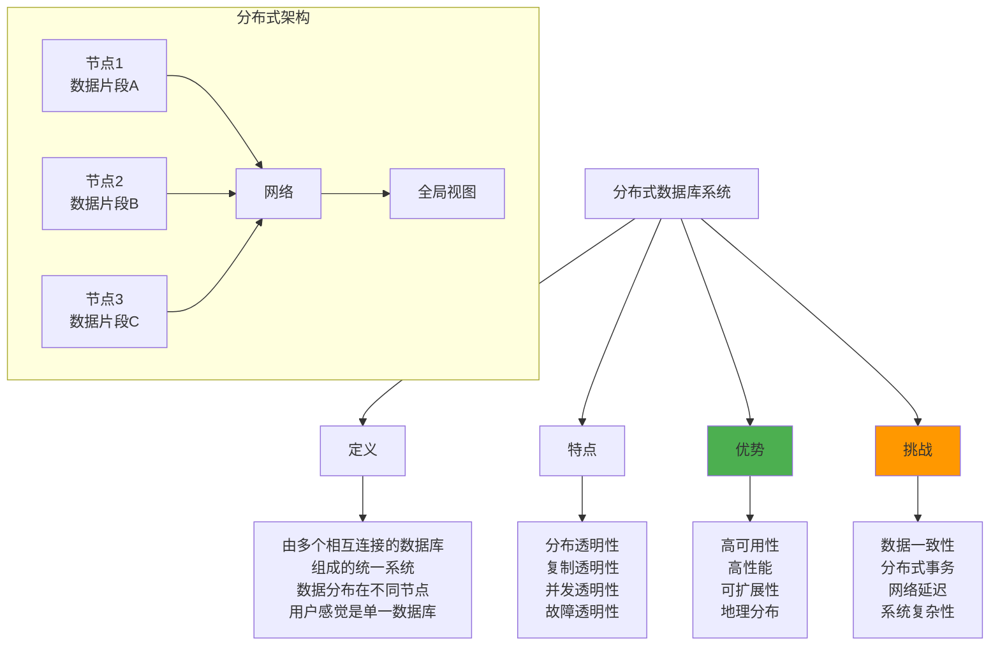

### 11.7.2 数据分布策略

```mermaid
graph TD
    A[数据分布策略] --> B[水平分片]
    A --> C[垂直分片]
    A --> D[混合分片]
    A --> E[数据复制]
    
    B --> B1[按行分割数据<br/>每个片段包含部分行<br/>相同的模式结构]
    
    C --> C1[按列分割数据<br/>每个片段包含部分列<br/>不同的模式结构]
    
    D --> D1[同时使用水平和垂直分片<br/>更复杂的分布策略]
    
    E --> E1[完全复制<br/>部分复制<br/>选择性复制]
    
    subgraph "分片示例"
        F[原表: 学生信息<br/>学号|姓名|年龄|专业]
        G[水平分片<br/>按学号范围分割]
        H[垂直分片<br/>按属性分割]
    end
    
    style B fill:#4caf50
    style C fill:#8bc34a
```

### 11.7.3 分布式事务处理

```mermaid
sequenceDiagram
    participant C as 协调者
    participant P1 as 参与者1
    participant P2 as 参与者2
    participant P3 as 参与者3
    
    Note over C,P3: 两阶段提交协议 (2PC)
    
    C->>P1: prepare
    C->>P2: prepare
    C->>P3: prepare
    
    P1->>C: yes/no
    P2->>C: yes/no
    P3->>C: yes/no
    
    Note over C: 决策阶段
    
    C->>P1: commit/abort
    C->>P2: commit/abort
    C->>P3: commit/abort
    
    P1->>C: ack
    P2->>C: ack
    P3->>C: ack
```

## 11.8 学习检查点

### 11.8.1 重点概念总结

```mermaid
mindmap
  root((数据库管理系统))
    DBMS基础
      定义和功能
        数据定义
        数据操纵
        运行管理
        建立维护
      发展历程
        层次数据库
        网状数据库
        关系数据库
        对象数据库
        NoSQL数据库
      分类方式
        按数据模型
        按用户数
        按分布性
        按用途
    系统结构
      三级模式
        外模式
        概念模式
        内模式
      体系结构
        集中式
        客户服务器
        分布式
        云数据库
      系统组成
        语言处理器
        数据库管理器
        文件管理器
        内存管理器
    运行管理
      并发控制
      恢复管理
      安全管理
      完整性管理
      性能监控
      存储管理
    DBA职责
      数据库设计
      系统维护
      性能调优
      安全管理
      备份恢复
    技术发展
      NoSQL数据库
      NewSQL数据库
      内存数据库
      云原生数据库
      AI数据库
      区块链数据库
```

### 11.8.2 练习题

1. **DBMS基础概念**
   - 比较不同类型DBMS的特点
   - 分析三级模式结构的优势
   - 设计数据库系统架构

2. **系统管理实践**
   - 制定数据库备份策略
   - 设计性能监控方案
   - 分析系统瓶颈和优化方案

3. **新技术应用**
   - 比较关系数据库和NoSQL数据库
   - 分析分布式数据库的优缺点
   - 设计云数据库迁移方案

### 11.8.3 思考题

1. 为什么需要三级模式结构？它如何实现数据独立性？
2. DBA在数据库系统中扮演什么角色？需要具备哪些技能？
3. 分布式数据库系统面临哪些技术挑战？如何解决？
4. 未来数据库技术的发展趋势是什么？

---

**本章小结**：数据库管理系统是现代信息系统的核心组件，它提供了数据存储、管理和访问的完整解决方案。随着技术的发展，DBMS正朝着更加智能化、自动化和分布式的方向发展。理解DBMS的基本原理和管理方法，对于数据库应用开发和系统管理具有重要意义。