# 第12章 数据库技术发展概述

## 学习目标
- 了解数据库技术的发展历程和趋势
- 理解新兴数据库技术的特点和应用
- 掌握大数据时代的数据管理技术
- 了解云计算对数据库技术的影响
- 理解人工智能与数据库的结合
- 掌握数据库技术的未来发展方向
- 了解数据库技术在各行业的应用

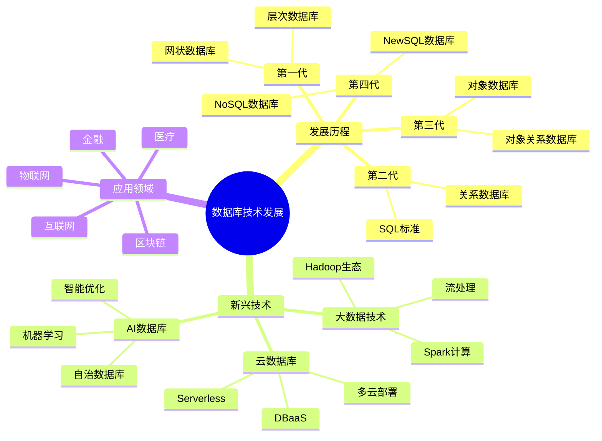
```mermaid
mindmap
  root((数据库技术发展))
    发展历程
      第一代
        层次数据库
        网状数据库
      第二代
        关系数据库
        SQL标准
      第三代
        对象数据库
        对象关系数据库
      第四代
        NoSQL数据库
        NewSQL数据库
    新兴技术
      大数据技术
        Hadoop生态
        Spark计算
        流处理
      云数据库
        DBaaS
        Serverless
        多云部署
      AI数据库
        自治数据库
        智能优化
        机器学习
    应用领域
      互联网
      金融
      医疗
      物联网
      区块链
```

## 12.1 数据库技术发展历程

### 12.1.1 数据库技术发展的四个阶段

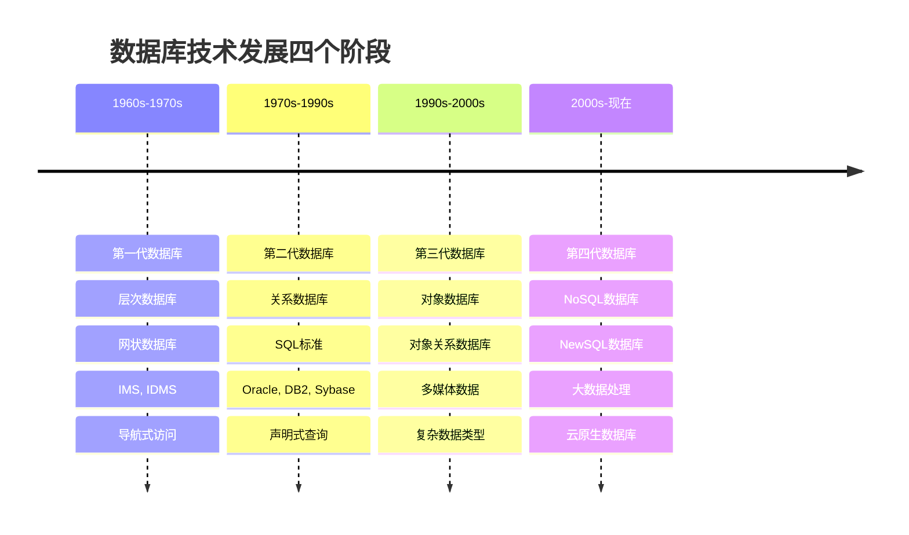
```mermaid
timeline
    title 数据库技术发展四个阶段
    
    1960s-1970s : 第一代数据库
                : 层次数据库
                : 网状数据库
                : IMS, IDMS
                : 导航式访问
    
    1970s-1990s : 第二代数据库
                : 关系数据库
                : SQL标准
                : Oracle, DB2, Sybase
                : 声明式查询
    
    1990s-2000s : 第三代数据库
                : 对象数据库
                : 对象关系数据库
                : 多媒体数据
                : 复杂数据类型
    
    2000s-现在  : 第四代数据库
                : NoSQL数据库
                : NewSQL数据库
                : 大数据处理
                : 云原生数据库
```

### 12.1.2 各代数据库技术特点对比

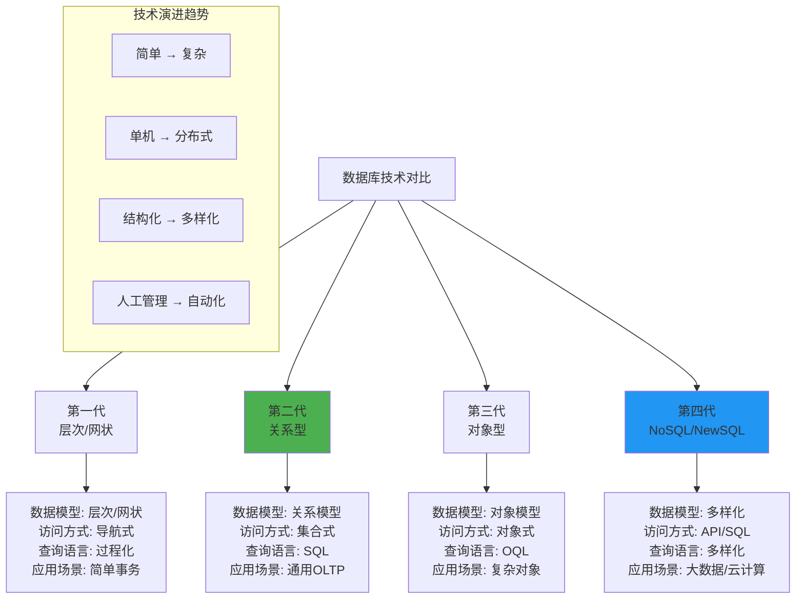
```mermaid
graph TD
    A[数据库技术对比] --> B[第一代<br/>层次/网状]
    A --> C[第二代<br/>关系型]
    A --> D[第三代<br/>对象型]
    A --> E[第四代<br/>NoSQL/NewSQL]
    
    B --> B1[数据模型: 层次/网状<br/>访问方式: 导航式<br/>查询语言: 过程化<br/>应用场景: 简单事务]
    
    C --> C1[数据模型: 关系模型<br/>访问方式: 集合式<br/>查询语言: SQL<br/>应用场景: 通用OLTP]
    
    D --> D1[数据模型: 对象模型<br/>访问方式: 对象式<br/>查询语言: OQL<br/>应用场景: 复杂对象]
    
    E --> E1[数据模型: 多样化<br/>访问方式: API/SQL<br/>查询语言: 多样化<br/>应用场景: 大数据/云计算]
    
    subgraph "技术演进趋势"
        F[简单 → 复杂]
        G[单机 → 分布式]
        H[结构化 → 多样化]
        I[人工管理 → 自动化]
    end
    
    style C fill:#4caf50
    style E fill:#2196f3
```

### 12.1.3 数据库标准化进程

```mermaid
graph TD
    A[数据库标准化] --> B[SQL标准]
    A --> C[接口标准]
    A --> D[数据交换标准]
    
    B --> B1[SQL-86 (SQL1)<br/>SQL-89 (SQL1修订版)<br/>SQL-92 (SQL2)<br/>SQL:1999 (SQL3)<br/>SQL:2003, SQL:2006<br/>SQL:2008, SQL:2011<br/>SQL:2016]
    
    C --> C1[ODBC<br/>JDBC<br/>ADO.NET<br/>OLE DB]
    
    D --> D1[XML<br/>JSON<br/>CSV<br/>Parquet]
    
    subgraph "标准化意义"
        E[提高互操作性<br/>降低学习成本<br/>促进技术发展<br/>保护用户投资]
    end
    
    style B fill:#e3f2fd
    style E fill:#4caf50
```

## 12.2 大数据时代的数据管理

### 12.2.1 大数据的特征

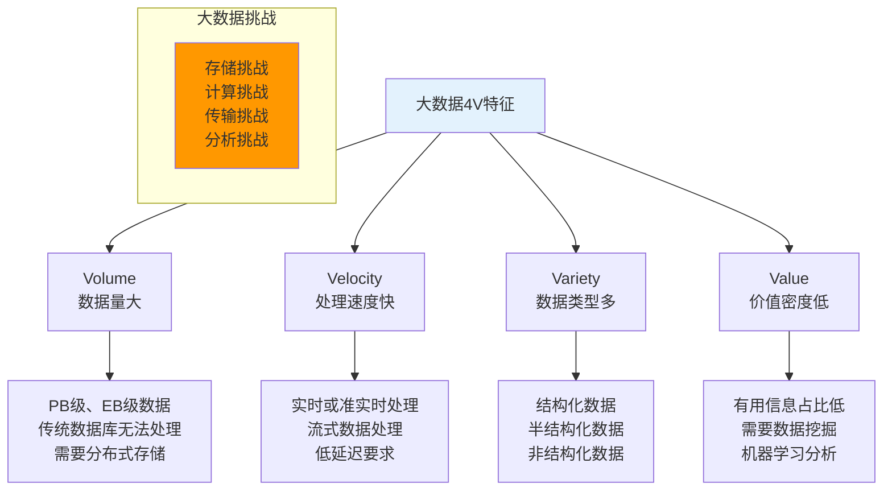
```mermaid
graph TD
    A[大数据4V特征] --> B[Volume<br/>数据量大]
    A --> C[Velocity<br/>处理速度快]
    A --> D[Variety<br/>数据类型多]
    A --> E[Value<br/>价值密度低]
    
    B --> B1[PB级、EB级数据<br/>传统数据库无法处理<br/>需要分布式存储]
    
    C --> C1[实时或准实时处理<br/>流式数据处理<br/>低延迟要求]
    
    D --> D1[结构化数据<br/>半结构化数据<br/>非结构化数据]
    
    E --> E1[有用信息占比低<br/>需要数据挖掘<br/>机器学习分析]
    
    subgraph "大数据挑战"
        F[存储挑战<br/>计算挑战<br/>传输挑战<br/>分析挑战]
    end
    
    style A fill:#e3f2fd
    style F fill:#ff9800
```

### 12.2.2 大数据技术栈

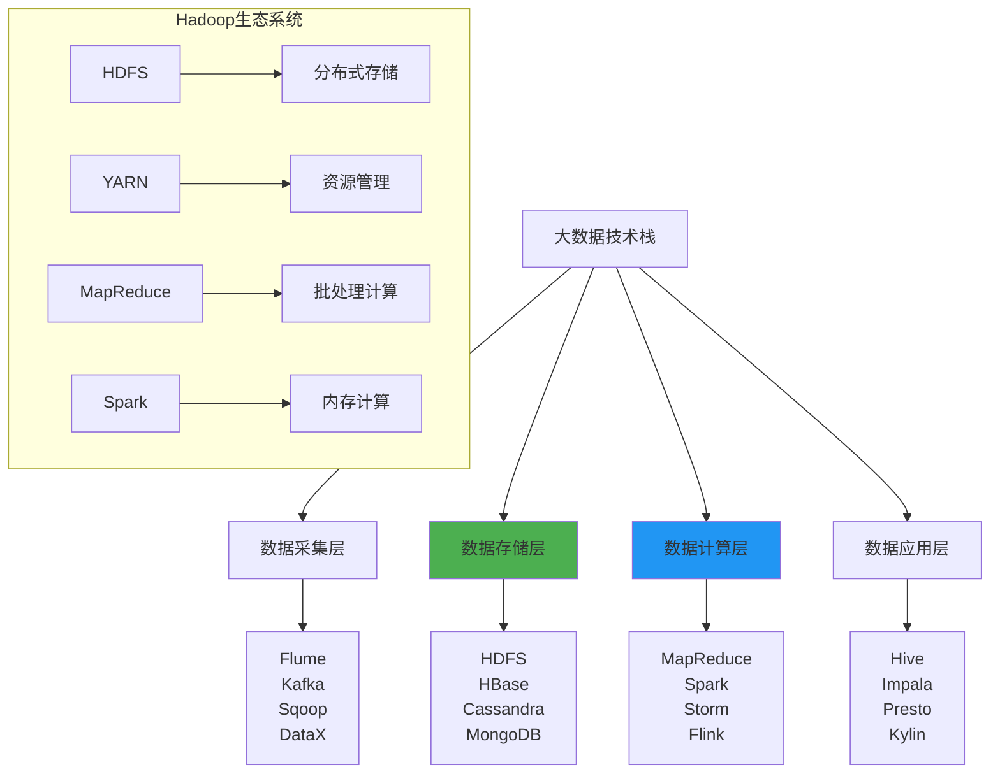
```mermaid
graph TD
    A[大数据技术栈] --> B[数据采集层]
    A --> C[数据存储层]
    A --> D[数据计算层]
    A --> E[数据应用层]
    
    B --> B1[Flume<br/>Kafka<br/>Sqoop<br/>DataX]
    
    C --> C1[HDFS<br/>HBase<br/>Cassandra<br/>MongoDB]
    
    D --> D1[MapReduce<br/>Spark<br/>Storm<br/>Flink]
    
    E --> E1[Hive<br/>Impala<br/>Presto<br/>Kylin]
    
    subgraph "Hadoop生态系统"
        F[HDFS] --> G[分布式存储]
        H[YARN] --> I[资源管理]
        J[MapReduce] --> K[批处理计算]
        L[Spark] --> M[内存计算]
    end
    
    style C fill:#4caf50
    style D fill:#2196f3
```

### 12.2.3 NoSQL数据库分类

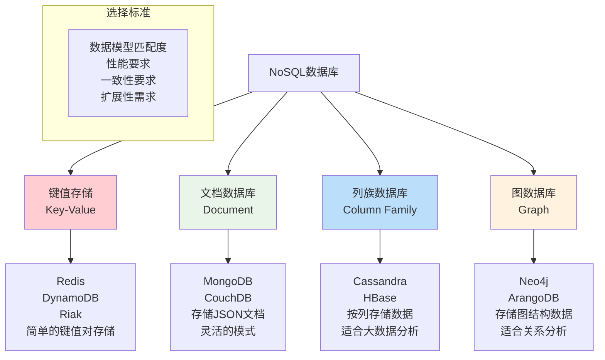
```mermaid
graph TD
    A[NoSQL数据库] --> B[键值存储<br/>Key-Value]
    A --> C[文档数据库<br/>Document]
    A --> D[列族数据库<br/>Column Family]
    A --> E[图数据库<br/>Graph]
    
    B --> B1[Redis<br/>DynamoDB<br/>Riak<br/>简单的键值对存储]
    
    C --> C1[MongoDB<br/>CouchDB<br/>存储JSON文档<br/>灵活的模式]
    
    D --> D1[Cassandra<br/>HBase<br/>按列存储数据<br/>适合大数据分析]
    
    E --> E1[Neo4j<br/>ArangoDB<br/>存储图结构数据<br/>适合关系分析]
    
    subgraph "选择标准"
        F[数据模型匹配度<br/>性能要求<br/>一致性要求<br/>扩展性需求]
    end
    
    style B fill:#ffcdd2
    style C fill:#e8f5e8
    style D fill:#bbdefb
    style E fill:#fff3e0
```

## 12.3 云计算与数据库

### 12.3.1 云数据库服务模式

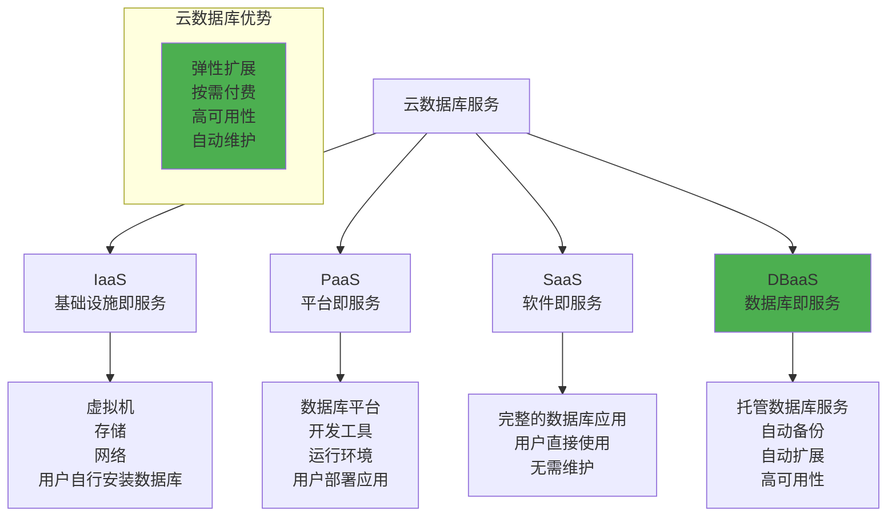
```mermaid
graph TD
    A[云数据库服务] --> B[IaaS<br/>基础设施即服务]
    A --> C[PaaS<br/>平台即服务]
    A --> D[SaaS<br/>软件即服务]
    A --> E[DBaaS<br/>数据库即服务]
    
    B --> B1[虚拟机<br/>存储<br/>网络<br/>用户自行安装数据库]
    
    C --> C1[数据库平台<br/>开发工具<br/>运行环境<br/>用户部署应用]
    
    D --> D1[完整的数据库应用<br/>用户直接使用<br/>无需维护]
    
    E --> E1[托管数据库服务<br/>自动备份<br/>自动扩展<br/>高可用性]
    
    subgraph "云数据库优势"
        F[弹性扩展<br/>按需付费<br/>高可用性<br/>自动维护]
    end
    
    style E fill:#4caf50
    style F fill:#4caf50
```

### 12.3.2 主要云数据库产品

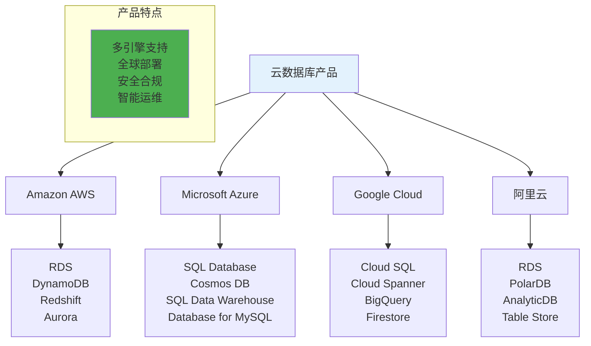
```mermaid
graph TD
    A[云数据库产品] --> B[Amazon AWS]
    A --> C[Microsoft Azure]
    A --> D[Google Cloud]
    A --> E[阿里云]
    
    B --> B1[RDS<br/>DynamoDB<br/>Redshift<br/>Aurora]
    
    C --> C1[SQL Database<br/>Cosmos DB<br/>SQL Data Warehouse<br/>Database for MySQL]
    
    D --> D1[Cloud SQL<br/>Cloud Spanner<br/>BigQuery<br/>Firestore]
    
    E --> E1[RDS<br/>PolarDB<br/>AnalyticDB<br/>Table Store]
    
    subgraph "产品特点"
        F[多引擎支持<br/>全球部署<br/>安全合规<br/>智能运维]
    end
    
    style A fill:#e3f2fd
    style F fill:#4caf50
```

### 12.3.3 Serverless数据库

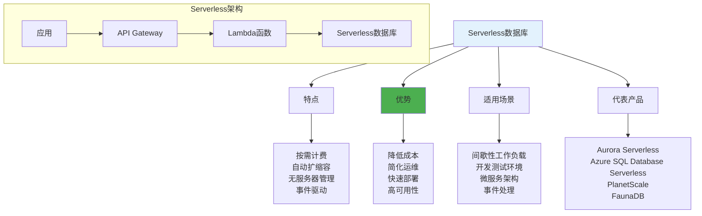
```mermaid
graph TD
    A[Serverless数据库] --> B[特点]
    A --> C[优势]
    A --> D[适用场景]
    A --> E[代表产品]
    
    B --> B1[按需计费<br/>自动扩缩容<br/>无服务器管理<br/>事件驱动]
    
    C --> C1[降低成本<br/>简化运维<br/>快速部署<br/>高可用性]
    
    D --> D1[间歇性工作负载<br/>开发测试环境<br/>微服务架构<br/>事件处理]
    
    E --> E1[Aurora Serverless<br/>Azure SQL Database Serverless<br/>PlanetScale<br/>FaunaDB]
    
    subgraph "Serverless架构"
        F[应用] --> G[API Gateway]
        G --> H[Lambda函数]
        H --> I[Serverless数据库]
    end
    
    style A fill:#e3f2fd
    style C fill:#4caf50
```

## 12.4 人工智能与数据库

### 12.4.1 AI在数据库中的应用

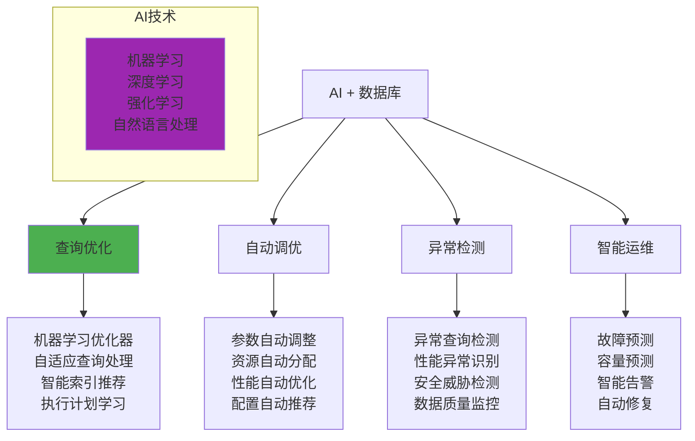
```mermaid
graph TD
    A[AI + 数据库] --> B[查询优化]
    A --> C[自动调优]
    A --> D[异常检测]
    A --> E[智能运维]
    
    B --> B1[机器学习优化器<br/>自适应查询处理<br/>智能索引推荐<br/>执行计划学习]
    
    C --> C1[参数自动调整<br/>资源自动分配<br/>性能自动优化<br/>配置自动推荐]
    
    D --> D1[异常查询检测<br/>性能异常识别<br/>安全威胁检测<br/>数据质量监控]
    
    E --> E1[故障预测<br/>容量预测<br/>智能告警<br/>自动修复]
    
    subgraph "AI技术"
        F[机器学习<br/>深度学习<br/>强化学习<br/>自然语言处理]
    end
    
    style B fill:#4caf50
    style F fill:#9c27b0
```

### 12.4.2 自治数据库

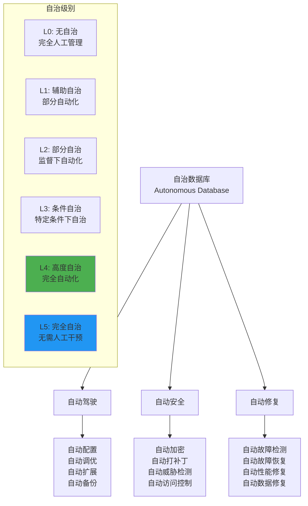
```mermaid
graph TD
    A[自治数据库<br/>Autonomous Database] --> B[自动驾驶]
    A --> C[自动安全]
    A --> D[自动修复]
    
    B --> B1[自动配置<br/>自动调优<br/>自动扩展<br/>自动备份]
    
    C --> C1[自动加密<br/>自动打补丁<br/>自动威胁检测<br/>自动访问控制]
    
    D --> D1[自动故障检测<br/>自动故障恢复<br/>自动性能修复<br/>自动数据修复]
    
    subgraph "自治级别"
        E[L0: 无自治<br/>完全人工管理]
        F[L1: 辅助自治<br/>部分自动化]
        G[L2: 部分自治<br/>监督下自动化]
        H[L3: 条件自治<br/>特定条件下自治]
        I[L4: 高度自治<br/>完全自动化]
        J[L5: 完全自治<br/>无需人工干预]
    end
    
    style I fill:#4caf50
    style J fill:#2196f3
```

### 12.4.3 数据库中的机器学习

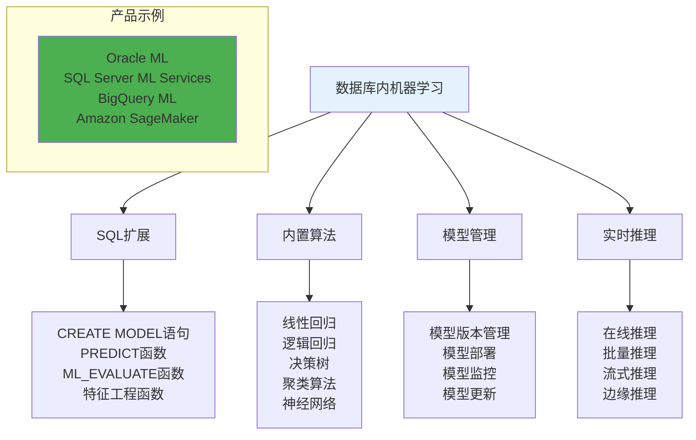
```mermaid
graph TD
    A[数据库内机器学习] --> B[SQL扩展]
    A --> C[内置算法]
    A --> D[模型管理]
    A --> E[实时推理]
    
    B --> B1[CREATE MODEL语句<br/>PREDICT函数<br/>ML_EVALUATE函数<br/>特征工程函数]
    
    C --> C1[线性回归<br/>逻辑回归<br/>决策树<br/>聚类算法<br/>神经网络]
    
    D --> D1[模型版本管理<br/>模型部署<br/>模型监控<br/>模型更新]
    
    E --> E1[在线推理<br/>批量推理<br/>流式推理<br/>边缘推理]
    
    subgraph "产品示例"
        F[Oracle ML<br/>SQL Server ML Services<br/>BigQuery ML<br/>Amazon SageMaker]
    end
    
    style A fill:#e3f2fd
    style F fill:#4caf50
```

## 12.5 新兴数据库技术

### 12.5.1 NewSQL数据库

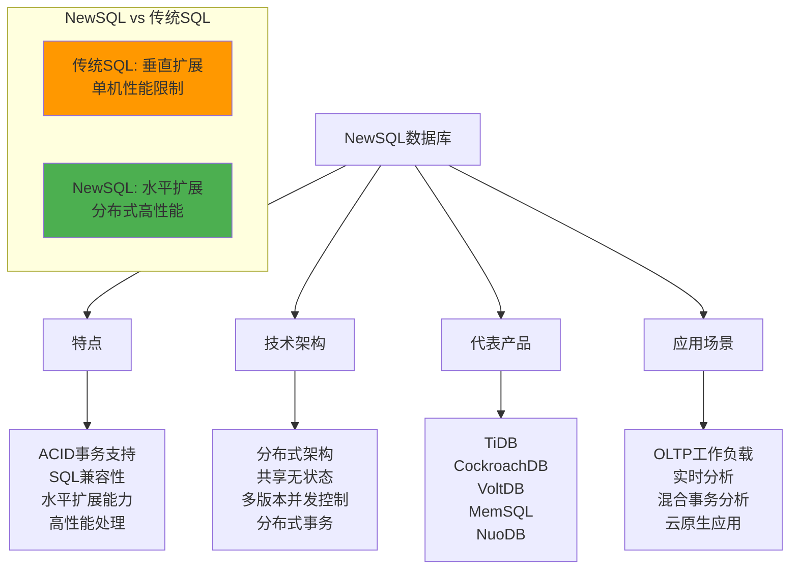
```mermaid
graph TD
    A[NewSQL数据库] --> B[特点]
    A --> C[技术架构]
    A --> D[代表产品]
    A --> E[应用场景]
    
    B --> B1[ACID事务支持<br/>SQL兼容性<br/>水平扩展能力<br/>高性能处理]
    
    C --> C1[分布式架构<br/>共享无状态<br/>多版本并发控制<br/>分布式事务]
    
    D --> D1[TiDB<br/>CockroachDB<br/>VoltDB<br/>MemSQL<br/>NuoDB]
    
    E --> E1[OLTP工作负载<br/>实时分析<br/>混合事务分析<br/>云原生应用]
    
    subgraph "NewSQL vs 传统SQL"
        F[传统SQL: 垂直扩展<br/>单机性能限制]
        G[NewSQL: 水平扩展<br/>分布式高性能]
    end
    
    style G fill:#4caf50
    style F fill:#ff9800
```

### 12.5.2 时序数据库

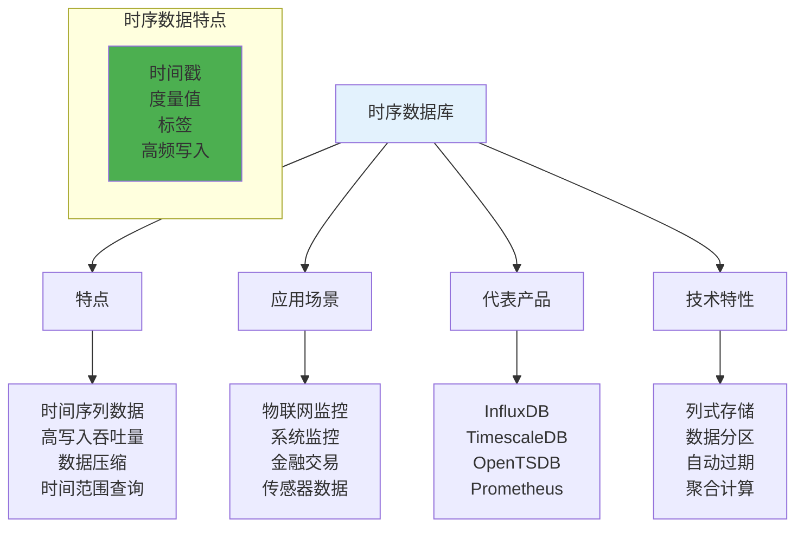
```mermaid
graph TD
    A[时序数据库] --> B[特点]
    A --> C[应用场景]
    A --> D[代表产品]
    A --> E[技术特性]
    
    B --> B1[时间序列数据<br/>高写入吞吐量<br/>数据压缩<br/>时间范围查询]
    
    C --> C1[物联网监控<br/>系统监控<br/>金融交易<br/>传感器数据]
    
    D --> D1[InfluxDB<br/>TimescaleDB<br/>OpenTSDB<br/>Prometheus]
    
    E --> E1[列式存储<br/>数据分区<br/>自动过期<br/>聚合计算]
    
    subgraph "时序数据特点"
        F[时间戳<br/>度量值<br/>标签<br/>高频写入]
    end
    
    style A fill:#e3f2fd
    style F fill:#4caf50
```

### 12.5.3 图数据库

```mermaid
graph TD
    A[图数据库] --> B[数据模型]
    A --> C[查询语言]
    A --> D[应用场景]
    A --> E[代表产品]
    
    B --> B1[节点 Nodes<br/>边 Edges<br/>属性 Properties<br/>标签 Labels]
    
    C --> C1[Cypher (Neo4j)<br/>Gremlin (Apache TinkerPop)<br/>SPARQL (RDF)<br/>GraphQL]
    
    D --> D1[社交网络分析<br/>推荐系统<br/>知识图谱<br/>欺诈检测<br/>网络安全]
    
    E --> E1[Neo4j<br/>Amazon Neptune<br/>ArangoDB<br/>JanusGraph<br/>TigerGraph]
    
    subgraph "图查询示例"
        F[查找朋友的朋友<br/>最短路径<br/>社区检测<br/>影响力分析]
    end
    
    style A fill:#e3f2fd
    style F fill:#4caf50
```

## 12.6 区块链与数据库

### 12.6.1 区块链数据库特点

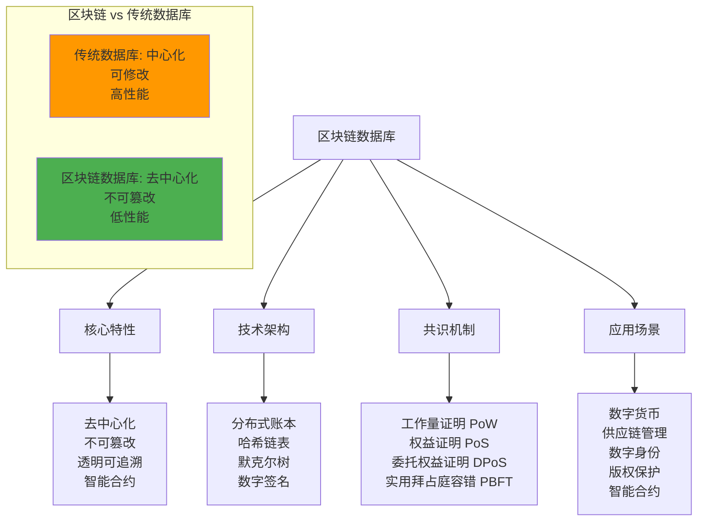
```mermaid
graph TD
    A[区块链数据库] --> B[核心特性]
    A --> C[技术架构]
    A --> D[共识机制]
    A --> E[应用场景]
    
    B --> B1[去中心化<br/>不可篡改<br/>透明可追溯<br/>智能合约]
    
    C --> C1[分布式账本<br/>哈希链表<br/>默克尔树<br/>数字签名]
    
    D --> D1[工作量证明 PoW<br/>权益证明 PoS<br/>委托权益证明 DPoS<br/>实用拜占庭容错 PBFT]
    
    E --> E1[数字货币<br/>供应链管理<br/>数字身份<br/>版权保护<br/>智能合约]
    
    subgraph "区块链 vs 传统数据库"
        F[传统数据库: 中心化<br/>可修改<br/>高性能]
        G[区块链数据库: 去中心化<br/>不可篡改<br/>低性能]
    end
    
    style G fill:#4caf50
    style F fill:#ff9800
```

### 12.6.2 区块链数据库产品

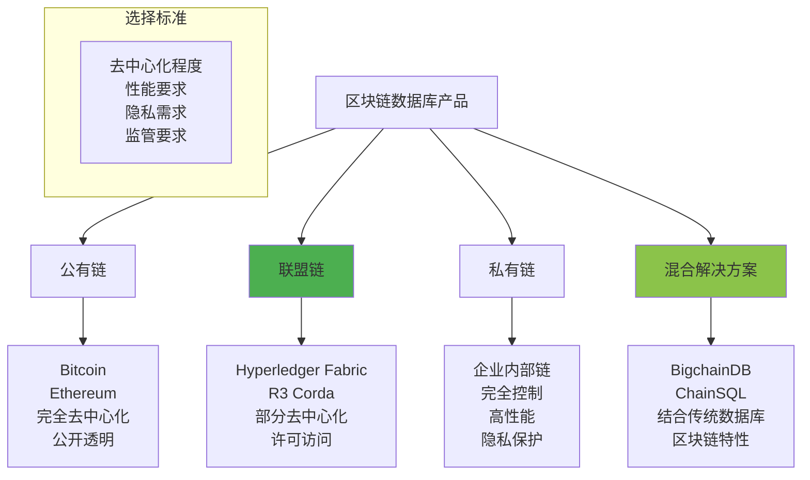
```mermaid
graph TD
    A[区块链数据库产品] --> B[公有链]
    A --> C[联盟链]
    A --> D[私有链]
    A --> E[混合解决方案]
    
    B --> B1[Bitcoin<br/>Ethereum<br/>完全去中心化<br/>公开透明]
    
    C --> C1[Hyperledger Fabric<br/>R3 Corda<br/>部分去中心化<br/>许可访问]
    
    D --> D1[企业内部链<br/>完全控制<br/>高性能<br/>隐私保护]
    
    E --> E1[BigchainDB<br/>ChainSQL<br/>结合传统数据库<br/>区块链特性]
    
    subgraph "选择标准"
        F[去中心化程度<br/>性能要求<br/>隐私需求<br/>监管要求]
    end
    
    style C fill:#4caf50
    style E fill:#8bc34a
```

## 12.7 数据库技术应用领域

### 12.7.1 互联网行业应用

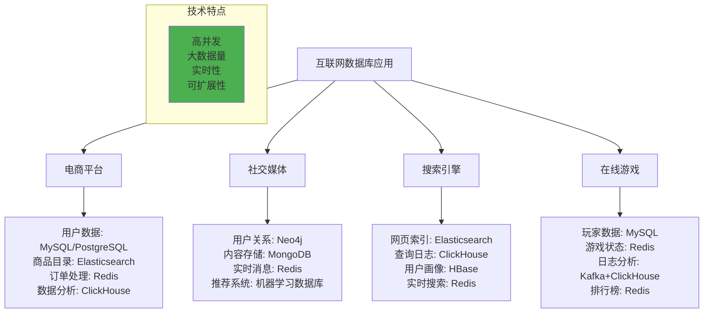
```mermaid
graph TD
    A[互联网数据库应用] --> B[电商平台]
    A --> C[社交媒体]
    A --> D[搜索引擎]
    A --> E[在线游戏]
    
    B --> B1[用户数据: MySQL/PostgreSQL<br/>商品目录: Elasticsearch<br/>订单处理: Redis<br/>数据分析: ClickHouse]
    
    C --> C1[用户关系: Neo4j<br/>内容存储: MongoDB<br/>实时消息: Redis<br/>推荐系统: 机器学习数据库]
    
    D --> D1[网页索引: Elasticsearch<br/>查询日志: ClickHouse<br/>用户画像: HBase<br/>实时搜索: Redis]
    
    E --> E1[玩家数据: MySQL<br/>游戏状态: Redis<br/>日志分析: Kafka+ClickHouse<br/>排行榜: Redis]
    
    subgraph "技术特点"
        F[高并发<br/>大数据量<br/>实时性<br/>可扩展性]
    end
    
    style F fill:#4caf50
```

### 12.7.2 金融行业应用

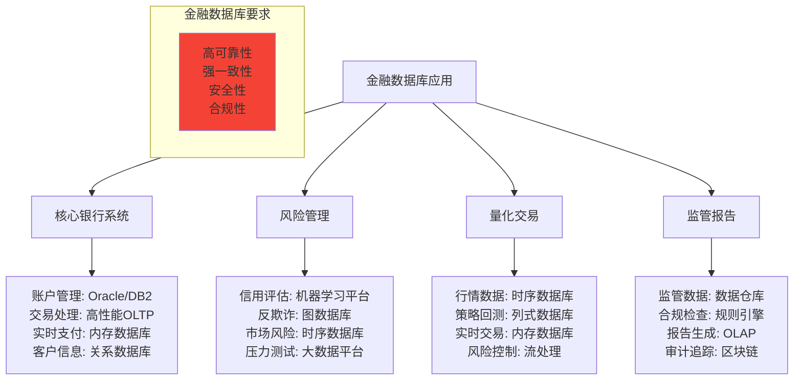
```mermaid
graph TD
    A[金融数据库应用] --> B[核心银行系统]
    A --> C[风险管理]
    A --> D[量化交易]
    A --> E[监管报告]
    
    B --> B1[账户管理: Oracle/DB2<br/>交易处理: 高性能OLTP<br/>实时支付: 内存数据库<br/>客户信息: 关系数据库]
    
    C --> C1[信用评估: 机器学习平台<br/>反欺诈: 图数据库<br/>市场风险: 时序数据库<br/>压力测试: 大数据平台]
    
    D --> D1[行情数据: 时序数据库<br/>策略回测: 列式数据库<br/>实时交易: 内存数据库<br/>风险控制: 流处理]
    
    E --> E1[监管数据: 数据仓库<br/>合规检查: 规则引擎<br/>报告生成: OLAP<br/>审计追踪: 区块链]
    
    subgraph "金融数据库要求"
        F[高可靠性<br/>强一致性<br/>安全性<br/>合规性]
    end
    
    style F fill:#f44336
```

### 12.7.3 物联网应用

```mermaid
graph TD
    A[物联网数据库应用] --> B[设备管理]
    A --> C[数据采集]
    A --> D[实时分析]
    A --> E[预测维护]
    
    B --> B1[设备注册: 关系数据库<br/>设备状态: 键值存储<br/>设备配置: 文档数据库<br/>设备关系: 图数据库]
    
    C --> C1[传感器数据: 时序数据库<br/>数据缓存: Redis<br/>数据流: Kafka<br/>数据湖: HDFS]
    
    D --> D1[流处理: Flink/Storm<br/>实时告警: 内存数据库<br/>仪表板: OLAP<br/>边缘计算: 轻量级数据库]
    
    E --> E1[历史数据: 数据仓库<br/>机器学习: ML平台<br/>模型部署: 边缘数据库<br/>维护计划: 关系数据库]
    
    subgraph "IoT数据特点"
        F[海量数据<br/>实时性<br/>多样性<br/>地理分布]
    end
    
    style F fill:#2196f3
```

## 12.8 数据库技术发展趋势

### 12.8.1 技术发展趋势

```mermaid
graph TD
    A[数据库技术趋势] --> B[智能化]
    A --> C[云原生]
    A --> D[多模型]
    A --> E[边缘计算]
    
    B --> B1[自治数据库<br/>AI驱动优化<br/>智能运维<br/>自动调优]
    
    C --> C1[容器化部署<br/>微服务架构<br/>Serverless<br/>多云支持]
    
    D --> D1[统一平台<br/>多种数据模型<br/>混合工作负载<br/>HTAP系统]
    
    E --> E1[边缘数据库<br/>本地处理<br/>低延迟<br/>离线能力]
    
    subgraph "未来特征"
        F[更智能<br/>更简单<br/>更快速<br/>更安全]
    end
    
    style B fill:#4caf50
    style F fill:#4caf50
```

### 12.8.2 新兴计算模式

```mermaid
graph TD
    A[新兴计算模式] --> B[量子计算]
    A --> C[边缘计算]
    A --> D[雾计算]
    A --> E[神经形态计算]
    
    B --> B1[量子数据库<br/>量子查询<br/>量子加密<br/>指数级加速]
    
    C --> C1[边缘数据库<br/>本地处理<br/>实时响应<br/>带宽节省]
    
    D --> D1[分层计算<br/>就近处理<br/>智能路由<br/>负载均衡]
    
    E --> E1[类脑计算<br/>神经网络数据库<br/>自适应学习<br/>低功耗]
    
    subgraph "技术挑战"
        F[技术成熟度<br/>标准化<br/>成本控制<br/>人才培养]
    end
    
    style B fill:#9c27b0
    style F fill:#ff9800
```

### 12.8.3 数据库即服务发展

```mermaid
graph TD
    A[DBaaS发展趋势] --> B[多云策略]
    A --> C[Serverless化]
    A --> D[AI集成]
    A --> E[边缘扩展]
    
    B --> B1[避免厂商锁定<br/>跨云数据同步<br/>混合云部署<br/>云间迁移]
    
    C --> C1[按需计费<br/>自动扩缩容<br/>零运维<br/>事件驱动]
    
    D --> D1[智能优化<br/>自动调优<br/>异常检测<br/>预测分析]
    
    E --> E1[边缘节点<br/>就近服务<br/>低延迟<br/>离线能力]
    
    subgraph "服务演进"
        F[IaaS → PaaS → SaaS → FaaS]
    end
    
    style C fill:#4caf50
    style F fill:#2196f3
```

## 12.9 学习检查点

### 12.9.1 重点概念总结

```mermaid
mindmap
  root((数据库技术发展))
    发展历程
      第一代
        层次数据库
        网状数据库
      第二代
        关系数据库
        SQL标准
      第三代
        对象数据库
        对象关系数据库
      第四代
        NoSQL数据库
        NewSQL数据库
    大数据技术
      特征
        Volume
        Velocity
        Variety
        Value
      技术栈
        Hadoop生态
        Spark计算
        流处理
      NoSQL分类
        键值存储
        文档数据库
        列族数据库
        图数据库
    云计算影响
      服务模式
        IaaS
        PaaS
        SaaS
        DBaaS
      云数据库
        弹性扩展
        按需付费
        自动维护
      Serverless
        无服务器
        事件驱动
        按需计费
    AI与数据库
      应用领域
        查询优化
        自动调优
        异常检测
        智能运维
      自治数据库
        自动驾驶
        自动安全
        自动修复
      机器学习
        SQL扩展
        内置算法
        模型管理
    新兴技术
      NewSQL
        ACID事务
        水平扩展
        SQL兼容
      时序数据库
        时间序列
        高写入
        数据压缩
      图数据库
        图模型
        关系分析
        复杂查询
      区块链
        去中心化
        不可篡改
        智能合约
    发展趋势
      智能化
        自治数据库
        AI优化
      云原生
        容器化
        微服务
      多模型
        统一平台
        HTAP
      边缘计算
        本地处理
        低延迟
```

### 12.9.2 练习题

1. **技术发展分析**
   - 比较四代数据库技术的特点
   - 分析NoSQL数据库的适用场景
   - 评估NewSQL数据库的优势

2. **新技术应用**
   - 设计大数据处理架构
   - 选择合适的云数据库服务
   - 分析AI在数据库中的应用

3. **趋势预测**
   - 预测数据库技术发展方向
   - 分析新兴技术的影响
   - 设计未来数据库架构

### 12.9.3 思考题

1. 为什么会出现NoSQL数据库？它解决了什么问题？
2. 云计算如何改变了数据库的使用方式？
3. AI技术将如何影响数据库的未来发展？
4. 在选择数据库技术时应该考虑哪些因素？

---

**本章小结**：数据库技术经历了从简单到复杂、从单机到分布式、从结构化到多样化的发展历程。大数据、云计算、人工智能等新兴技术正在深刻改变数据库的设计理念和应用模式。未来的数据库将更加智能化、自动化，能够适应各种复杂的应用场景和计算环境。理解这些发展趋势对于选择合适的数据库技术和制定技术发展策略具有重要意义。