# 第13章 分布式数据库系统

## 学习目标
- 理解分布式数据库系统的基本概念和特点
- 掌握分布式数据库的体系结构
- 了解数据分布策略和分片技术
- 理解分布式事务处理机制
- 掌握分布式查询处理和优化
- 了解分布式数据库的一致性问题
- 理解CAP定理和BASE理论
- 掌握分布式数据库的设计和实现

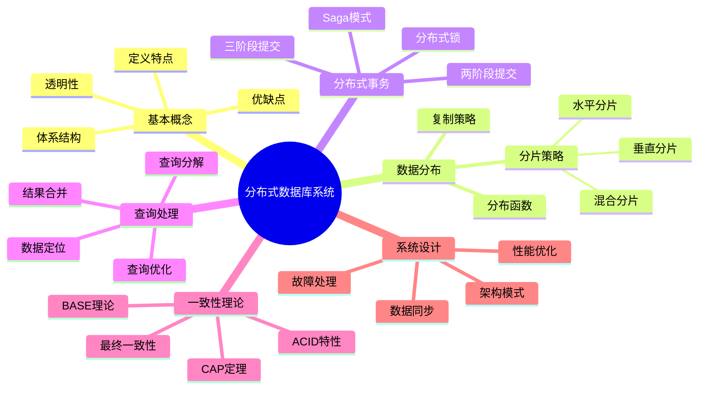

## 13.1 分布式数据库系统概述

### 13.1.1 分布式数据库的定义

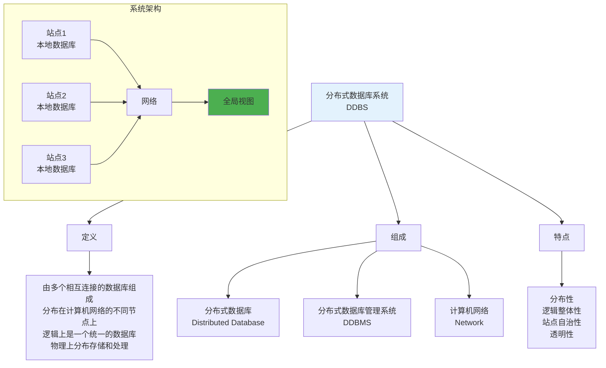

### 13.1.2 分布式数据库的优缺点

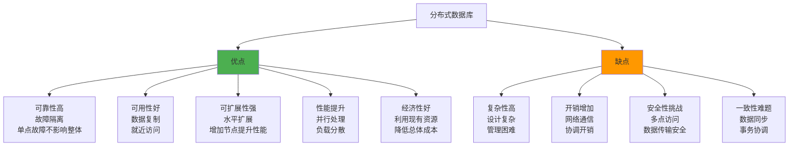

### 13.1.3 分布式数据库的透明性

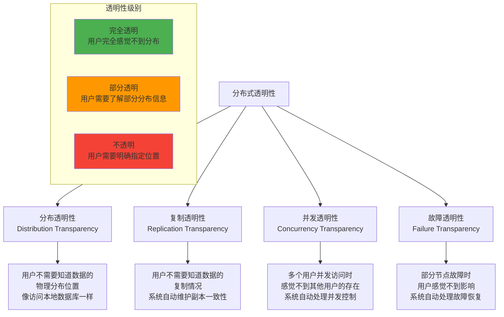

## 13.2 分布式数据库体系结构

### 13.2.1 体系结构模型

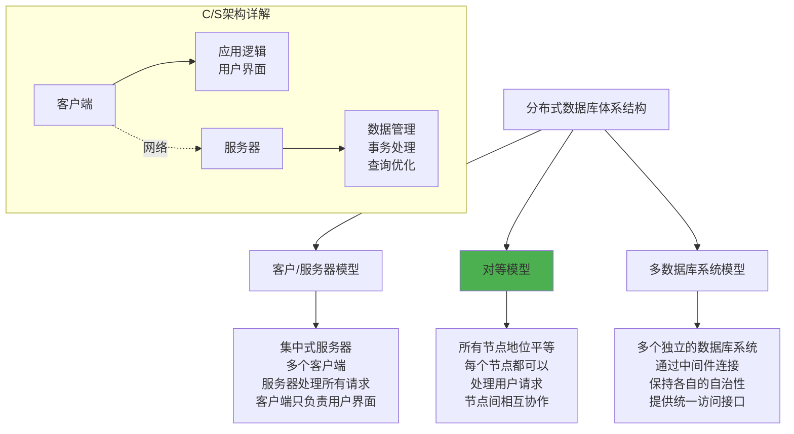

### 13.2.2 分布式数据库管理系统结构

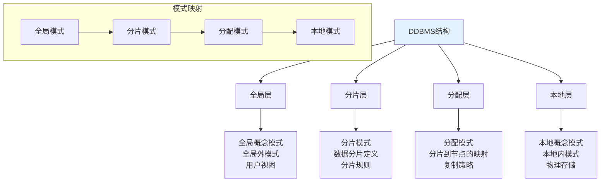

### 13.2.3 分布式数据库的组件

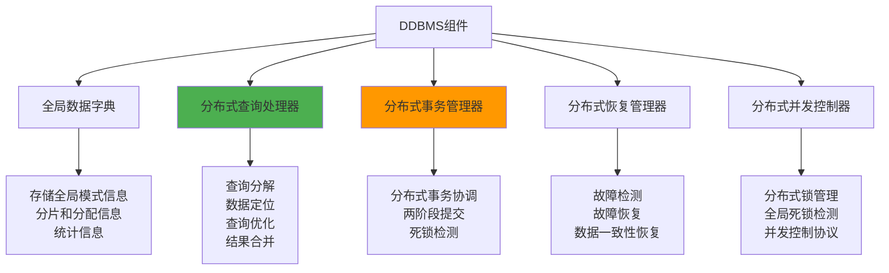

## 13.3 数据分布设计

### 13.3.1 数据分片

```mermaid
graph TD
    A[数据分片策略] --> B[水平分片<br/>Horizontal Fragmentation]
    A --> C[垂直分片<br/>Vertical Fragmentation]
    A --> D[混合分片<br/>Hybrid Fragmentation]
    
    B --> B1[按行分割<br/>每个分片包含部分行<br/>相同的模式结构<br/>基于选择条件]
    
    C --> C1[按列分割<br/>每个分片包含部分列<br/>不同的模式结构<br/>基于投影操作]
    
    D --> D1[同时使用水平和垂直分片<br/>先水平后垂直<br/>或先垂直后水平]
    
    subgraph "分片示例"
        E[学生表<br/>学号|姓名|年龄|专业|成绩]
        F[水平分片<br/>按年龄分割]
        G[垂直分片<br/>按属性分割]
        H[混合分片<br/>组合分割]
    end
    
    E --> F
    E --> G
    E --> H
    
    style B fill:#4caf50
    style C fill:#8bc34a
    style D fill:#2196f3
```

### 13.3.2 分片算法

#### 水平分片算法

```mermaid
flowchart TD
    A[水平分片算法] --> B[基于谓词的分片]
    A --> C[基于轮询的分片]
    A --> D[基于散列的分片]
    A --> E[基于范围的分片]
    
    B --> B1[根据选择条件分片<br/>age < 25: 分片1<br/>age >= 25: 分片2]
    
    C --> C1[轮流分配记录<br/>记录1 → 分片1<br/>记录2 → 分片2<br/>记录3 → 分片1]
    
    D --> D1[使用散列函数<br/>hash(key) mod n<br/>确定分片位置]
    
    E --> E1[按值范围分片<br/>1-1000: 分片1<br/>1001-2000: 分片2]
    
    subgraph "分片选择标准"
        F[数据访问模式<br/>查询频率<br/>数据增长<br/>负载均衡]
    end
    
    style D fill:#4caf50
    style E fill:#8bc34a
```

#### 垂直分片算法

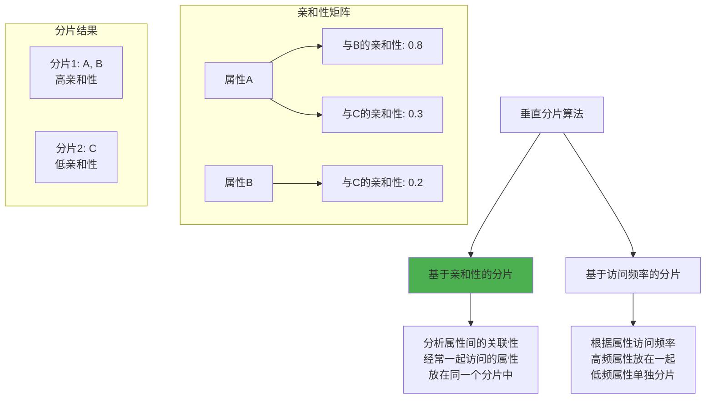

### 13.3.3 数据分配和复制

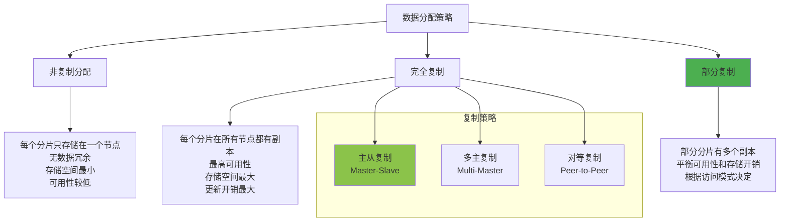

## 13.4 分布式查询处理

### 13.4.1 查询处理步骤

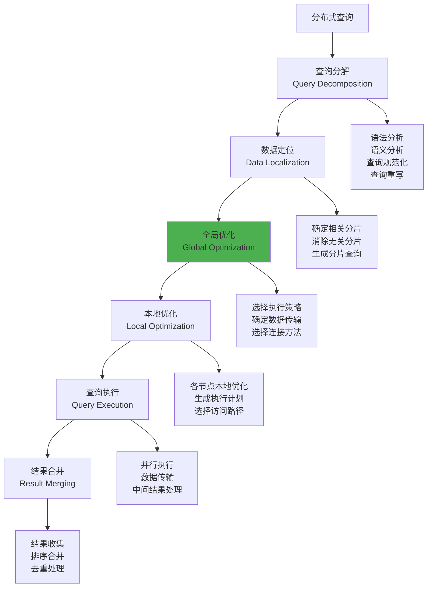

### 13.4.2 查询分解

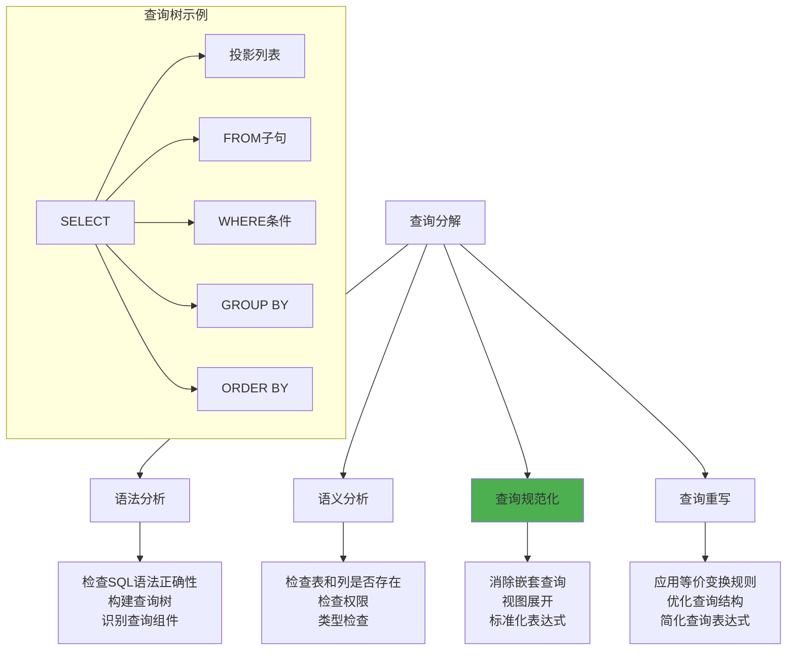

### 13.4.3 数据定位

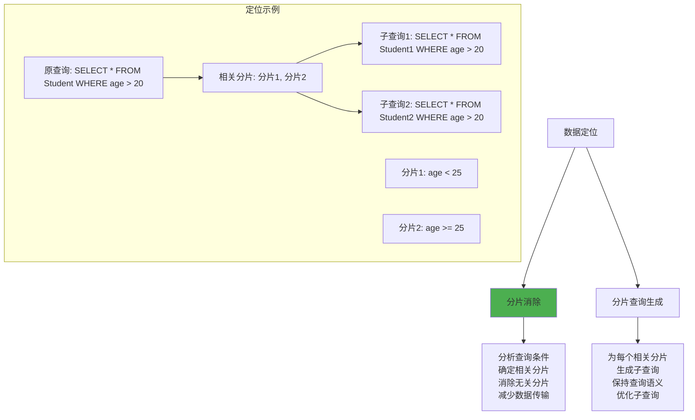

### 13.4.4 分布式连接处理

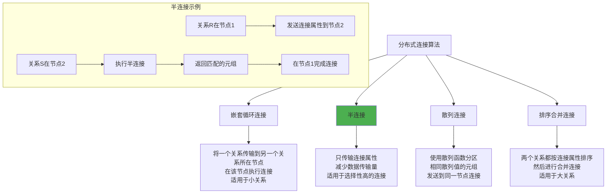

## 13.5 分布式事务管理

### 13.5.1 分布式事务的特点

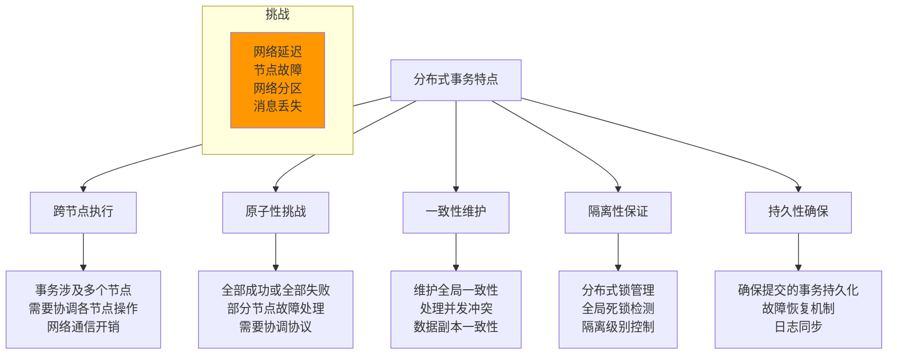

### 13.5.2 两阶段提交协议

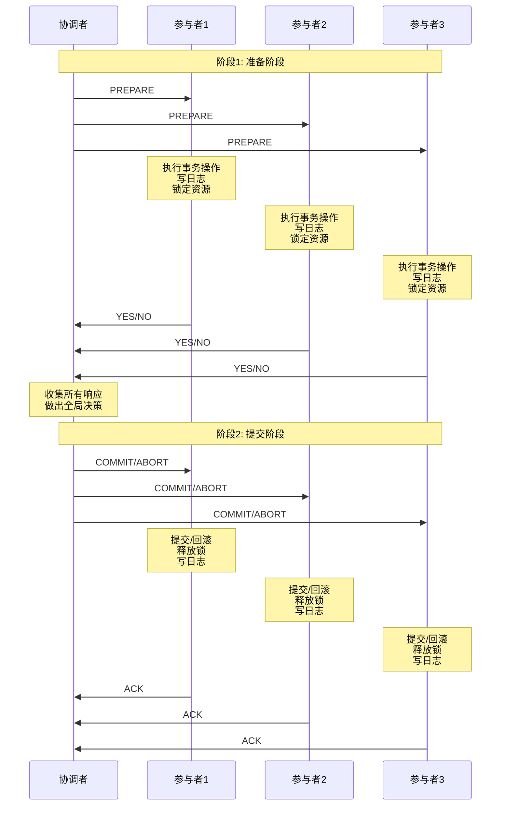

### 13.5.3 三阶段提交协议

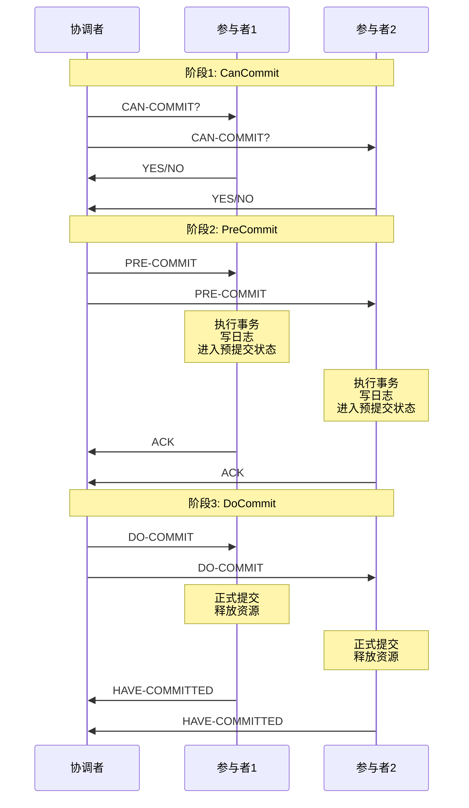

### 13.5.4 Saga事务模式

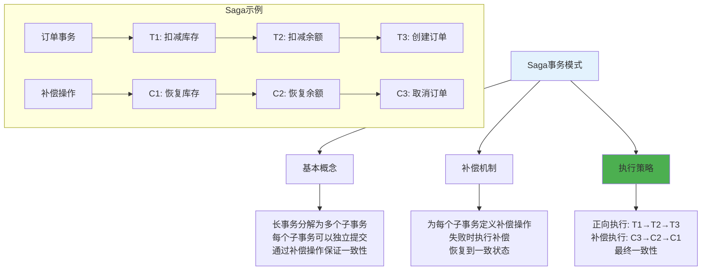

## 13.6 分布式并发控制

### 13.6.1 分布式锁管理

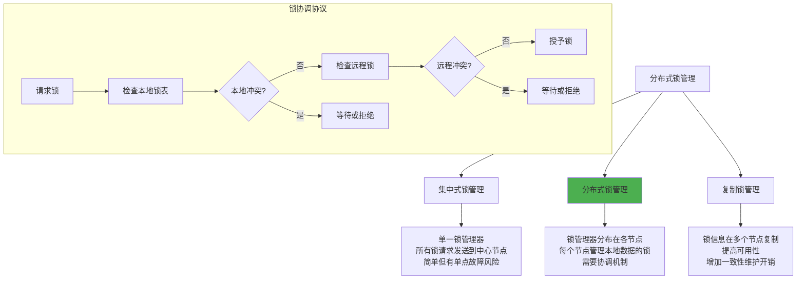

### 13.6.2 全局死锁检测

```mermaid
graph TD
    A[全局死锁检测] --> B[集中式检测]
    A --> C[分布式检测]
    A --> D[层次式检测]
    
    B --> B1[中央死锁检测器<br/>收集所有等待图信息<br/>检测全局死锁]
    
    C --> C1[各节点协作检测<br/>交换等待图信息<br/>分布式算法]
    
    D --> D1[分层检测结构<br/>本地检测 + 全局检测<br/>减少通信开销]
    
    subgraph "死锁检测算法"
        E[等待图构造] --> F[环路检测]
        F --> G[死锁确认]
        G --> H[选择牺牲者]
        H --> I[事务回滚]
    end
    
    subgraph "全局等待图"
        J[节点1: T1→T2] --> K[节点2: T2→T3]
        K --> L[节点3: T3→T1]
        L --> M[检测到环路<br/>存在死锁]
    end
    
    style C fill:#4caf50
    style M fill:#f44336
```

### 13.6.3 时间戳排序

```mermaid
graph TD
    A[分布式时间戳排序] --> B[时间戳生成]
    A --> C[全局排序]
    A --> D[冲突处理]
    
    B --> B1[逻辑时钟<br/>物理时钟<br/>混合时钟<br/>确保全局唯一性]
    
    C --> C1[Lamport时间戳<br/>Vector时钟<br/>确定事件顺序]
    
    D --> D1[读写冲突检测<br/>事务回滚<br/>重新执行]
    
    subgraph "Lamport时间戳"
        E[事件发生: LC = LC + 1]
        F[发送消息: 附带时间戳]
        G[接收消息: LC = max(LC, 消息时间戳) + 1]
    end
    
    subgraph "Vector时钟"
        H[节点i: VC[i] = VC[i] + 1]
        I[发送消息: 附带整个向量]
        J[接收消息: VC[j] = max(VC[j], 消息VC[j])]
    end
    
    style C fill:#4caf50
```

## 13.7 分布式数据库的一致性

### 13.7.1 CAP定理

```mermaid
graph TD
    A[CAP定理] --> B[一致性<br/>Consistency]
    A --> C[可用性<br/>Availability]
    A --> D[分区容错性<br/>Partition Tolerance]
    
    B --> B1[所有节点在同一时间<br/>看到相同的数据<br/>强一致性要求]
    
    C --> C1[系统在有限时间内<br/>返回合理的响应<br/>不是错误或超时]
    
    D --> D1[系统在网络分区时<br/>仍能继续运行<br/>容忍网络故障]
    
    subgraph "CAP权衡"
        E[CA系统<br/>传统关系数据库<br/>单点故障风险]
        F[CP系统<br/>分布式数据库<br/>可能不可用]
        G[AP系统<br/>NoSQL数据库<br/>最终一致性]
    end
    
    subgraph "定理核心"
        H[分布式系统最多只能<br/>同时保证CAP中的两个特性<br/>必须在三者间权衡]
    end
    
    style H fill:#f44336
    style G fill:#4caf50
```

### 13.7.2 BASE理论

```mermaid
graph TD
    A[BASE理论] --> B[基本可用<br/>Basically Available]
    A --> C[软状态<br/>Soft State]
    A --> D[最终一致性<br/>Eventually Consistent]
    
    B --> B1[系统在出现故障时<br/>允许损失部分可用性<br/>保证核心功能可用]
    
    C --> C1[系统状态可以有一定时间<br/>的不一致<br/>不要求实时一致性]
    
    D --> D1[系统在一定时间后<br/>会达到一致状态<br/>不保证强一致性]
    
    subgraph "BASE vs ACID"
        E[ACID: 强一致性<br/>立即一致<br/>严格事务]
        F[BASE: 弱一致性<br/>最终一致<br/>灵活事务]
    end
    
    subgraph "应用场景"
        G[大规模分布式系统<br/>高可用性要求<br/>可以容忍短期不一致]
    end
    
    style F fill:#4caf50
    style G fill:#4caf50
```

### 13.7.3 一致性模型

```mermaid
graph TD
    A[一致性模型] --> B[强一致性]
    A --> C[弱一致性]
    A --> D[最终一致性]
    
    B --> B1[线性一致性<br/>顺序一致性<br/>因果一致性]
    
    C --> C1[客户端一致性<br/>会话一致性<br/>单调读一致性]
    
    D --> D1[收敛一致性<br/>读己之写一致性<br/>单调写一致性]
    
    subgraph "一致性强度"
        E[强一致性] --> F[因果一致性]
        F --> G[会话一致性]
        G --> H[最终一致性]
        H --> I[弱一致性]
    end
    
    subgraph "实现机制"
        J[同步复制<br/>分布式锁<br/>共识算法]
        K[异步复制<br/>版本向量<br/>冲突解决]
    end
    
    B --> J
    D --> K
    
    style B fill:#f44336
    style D fill:#4caf50
```

## 13.8 分布式数据库设计

### 13.8.1 设计步骤

```mermaid
flowchart TD
    A[分布式数据库设计] --> B[需求分析]
    B --> C[概念设计]
    C --> D[分布设计]
    D --> E[物理设计]
    E --> F[实现和测试]
    
    B --> B1[分析应用需求<br/>确定性能要求<br/>评估分布环境]
    
    C --> C1[设计全局概念模式<br/>确定实体关系<br/>定义完整性约束]
    
    D --> D1[数据分片设计<br/>分配策略设计<br/>复制策略设计]
    
    E --> E1[选择存储结构<br/>设计索引策略<br/>优化访问路径]
    
    F --> F1[系统实现<br/>性能测试<br/>调优优化]
    
    subgraph "设计原则"
        G[透明性<br/>可靠性<br/>可扩展性<br/>性能优化]
    end
    
    style D fill:#4caf50
```

### 13.8.2 分片设计策略

```mermaid
graph TD
    A[分片设计策略] --> B[应用驱动分片]
    A --> C[数据驱动分片]
    A --> D[混合分片策略]
    
    B --> B1[根据应用访问模式<br/>将相关数据放在一起<br/>减少跨节点访问]
    
    C --> C1[根据数据特征分片<br/>均匀分布数据<br/>平衡存储负载]
    
    D --> D1[结合应用和数据特征<br/>综合考虑多个因素<br/>优化整体性能]
    
    subgraph "分片评估指标"
        E[数据分布均匀性<br/>查询本地化程度<br/>负载均衡程度<br/>扩展性]
    end
    
    subgraph "分片工具"
        F[分片分析器<br/>负载监控器<br/>性能分析器<br/>重分片工具]
    end
    
    style D fill:#4caf50
```

### 13.8.3 复制策略设计

```mermaid
graph TD
    A[复制策略设计] --> B[复制程度]
    A --> C[复制位置]
    A --> D[一致性维护]
    
    B --> B1[完全复制<br/>部分复制<br/>选择性复制<br/>动态复制]
    
    C --> C1[就近复制<br/>负载均衡<br/>故障容错<br/>网络优化]
    
    D --> D1[同步复制<br/>异步复制<br/>半同步复制<br/>最终一致性]
    
    subgraph "复制决策因素"
        E[数据访问频率<br/>数据更新频率<br/>网络带宽<br/>存储成本<br/>一致性要求]
    end
    
    subgraph "复制算法"
        F[主从复制<br/>多主复制<br/>无主复制<br/>链式复制]
    end
    
    style C fill:#4caf50
    style F fill:#8bc34a
```

## 13.9 学习检查点

### 13.9.1 重点概念总结

```mermaid
mindmap
  root((分布式数据库系统))
    基本概念
      定义特点
        分布性
        逻辑整体性
        站点自治性
        透明性
      优缺点
        优点
          可靠性高
          可用性好
          可扩展性强
          性能提升
        缺点
          复杂性高
          开销增加
          安全挑战
          一致性难题
      透明性
        分布透明性
        复制透明性
        并发透明性
        故障透明性
    体系结构
      架构模型
        客户服务器
        对等模型
        多数据库系统
      DDBMS结构
        全局层
        分片层
        分配层
        本地层
      系统组件
        全局数据字典
        查询处理器
        事务管理器
        恢复管理器
        并发控制器
    数据分布
      分片策略
        水平分片
        垂直分片
        混合分片
      分片算法
        基于谓词
        基于散列
        基于范围
        基于轮询
      分配复制
        非复制分配
        完全复制
        部分复制
        复制策略
    查询处理
      处理步骤
        查询分解
        数据定位
        全局优化
        本地优化
        查询执行
        结果合并
      连接算法
        嵌套循环
        半连接
        散列连接
        排序合并
    事务管理
      分布式事务
        跨节点执行
        原子性挑战
        一致性维护
      提交协议
        两阶段提交
        三阶段提交
        Saga模式
      并发控制
        分布式锁
        死锁检测
        时间戳排序
    一致性理论
      CAP定理
        一致性
        可用性
        分区容错性
      BASE理论
        基本可用
        软状态
        最终一致性
      一致性模型
        强一致性
        弱一致性
        最终一致性
```

### 13.9.2 练习题

1. **分布式数据库基础**
   - 比较集中式和分布式数据库的优缺点
   - 分析分布式数据库的透明性要求
   - 设计分布式数据库体系结构

2. **数据分布设计**
   - 设计水平分片和垂直分片策略
   - 分析不同复制策略的适用场景
   - 优化数据分布以提高查询性能

3. **分布式事务处理**
   - 分析两阶段提交协议的优缺点
   - 设计分布式死锁检测算法
   - 比较不同一致性模型的特点

### 13.9.3 思考题

1. 为什么分布式数据库需要透明性？如何实现？
2. CAP定理对分布式数据库设计有什么指导意义？
3. 在什么情况下应该选择最终一致性而不是强一致性？
4. 如何在分布式环境中保证事务的ACID特性？

---

**本章小结**：分布式数据库系统是现代大规模应用的重要基础设施。它通过数据分布、复制和分布式事务处理技术，提供了高可用性、高性能和可扩展性。然而，分布式环境也带来了一致性、并发控制和故障处理等挑战。理解CAP定理和BASE理论，掌握分布式数据库的设计原理和实现技术，对于构建可靠的分布式系统具有重要意义。

---
**上一章：** [第12章 数据库技术发展概述](第12章_数据库技术发展概述.md)  
**下一章：** [第14章 对象关系数据库](第14章_对象关系数据库.md)