# 第14章 对象关系数据库

## 学习目标
- 理解对象关系数据库的基本概念和特点
- 掌握对象关系数据模型的组成要素
- 了解SQL:1999和SQL:2003标准的对象特性
- 理解用户定义类型(UDT)和类型构造器
- 掌握对象关系数据库的查询语言
- 了解对象关系映射(ORM)技术
- 理解对象关系数据库的应用场景
- 掌握对象关系数据库的设计方法

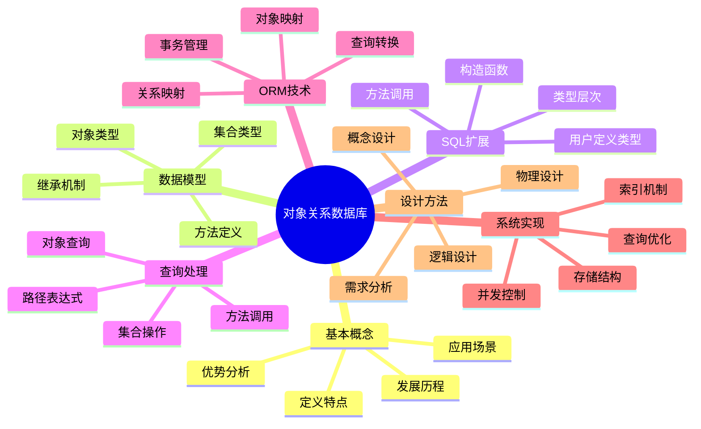

## 14.1 对象关系数据库概述

### 14.1.1 对象关系数据库的定义

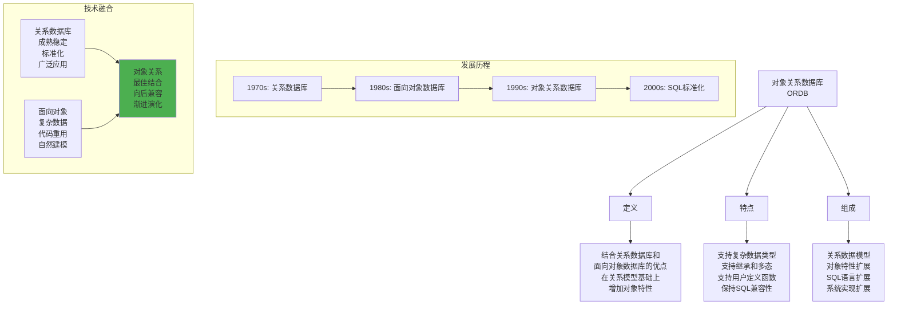

### 14.1.2 对象关系数据库的优势

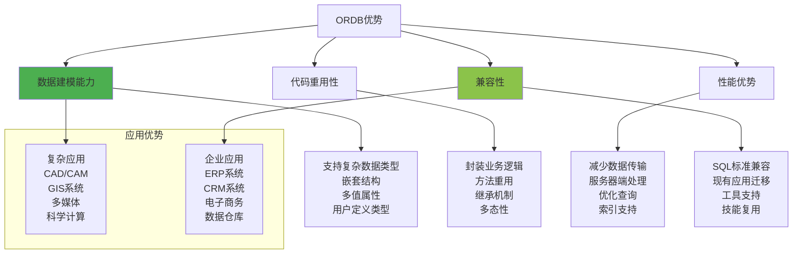

### 14.1.3 对象关系数据库与其他数据库的比较

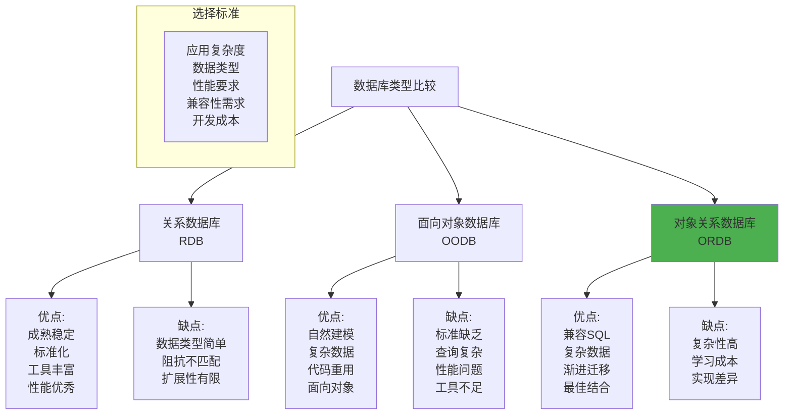

## 14.2 对象关系数据模型

### 14.2.1 用户定义类型(UDT)

```mermaid
graph TD
    A[用户定义类型<br/>UDT] --> B[结构化类型]
    A --> C[不同类型]
    A --> D[集合类型]
    
    B --> B1[CREATE TYPE语句<br/>属性定义<br/>方法定义<br/>构造函数]
    
    C --> C1[DISTINCT类型<br/>基于现有类型<br/>强类型检查<br/>类型安全]
    
    D --> D1[ARRAY类型<br/>MULTISET类型<br/>嵌套表<br/>变长数组]
    
    subgraph "UDT示例"
        E[CREATE TYPE Address AS (<br/>  street VARCHAR(50),<br/>  city VARCHAR(30),<br/>  zipcode CHAR(10)<br/>)]
        
        F[CREATE TYPE Person AS (<br/>  name VARCHAR(50),<br/>  age INTEGER,<br/>  address Address<br/>)]
    end
    
    subgraph "方法定义"
        G[CREATE TYPE Rectangle AS (<br/>  length REAL,<br/>  width REAL<br/>) NOT FINAL<br/>METHOD area() RETURNS REAL]
    end
    
    style B fill:#4caf50
```

### 14.2.2 类型继承

```mermaid
graph TD
    A[类型继承] --> B[继承语法]
    A --> C[方法继承]
    A --> D[多态性]
    
    B --> B1[UNDER子句<br/>父类型指定<br/>属性继承<br/>方法继承]
    
    C --> C1[方法重写<br/>OVERRIDING关键字<br/>方法重载<br/>动态绑定]
    
    D --> D1[类型替换<br/>动态类型<br/>运行时绑定<br/>虚方法调用]
    
    subgraph "继承示例"
        E[CREATE TYPE Person AS (<br/>  name VARCHAR(50),<br/>  age INTEGER<br/>) NOT FINAL]
        
        F[CREATE TYPE Student UNDER Person AS (<br/>  student_id CHAR(10),<br/>  major VARCHAR(30)<br/>) NOT FINAL]
        
        G[CREATE TYPE Employee UNDER Person AS (<br/>  employee_id CHAR(10),<br/>  salary DECIMAL(10,2)<br/>) NOT FINAL]
    end
    
    subgraph "继承层次"
        H[Person] --> I[Student]
        H --> J[Employee]
        I --> K[GraduateStudent]
        J --> L[Manager]
    end
    
    style B fill:#4caf50
```

### 14.2.3 方法定义和调用

```mermaid
graph TD
    A[方法定义] --> B[实例方法]
    A --> C[静态方法]
    A --> D[构造方法]
    
    B --> B1[INSTANCE METHOD<br/>访问实例属性<br/>修改对象状态<br/>返回计算结果]
    
    C --> C1[STATIC METHOD<br/>类级别方法<br/>不访问实例<br/>工具方法]
    
    D --> D1[CONSTRUCTOR<br/>对象创建<br/>属性初始化<br/>默认构造器]
    
    subgraph "方法实现"
        E[CREATE METHOD area()<br/>FOR Rectangle<br/>RETURNS REAL<br/>LANGUAGE SQL<br/>RETURN SELF.length * SELF.width]
    end
    
    subgraph "方法调用"
        F[SELECT r.area()<br/>FROM rectangles r<br/>WHERE r.length > 10]
        
        G[UPDATE rectangles<br/>SET length = length * 2<br/>WHERE area() < 100]
    end
    
    subgraph "方法类型"
        H[观察方法<br/>Observer<br/>只读访问]
        I[变更方法<br/>Mutator<br/>修改状态]
        J[构造方法<br/>Constructor<br/>创建对象]
    end
    
    style B fill:#4caf50
```

### 14.2.4 集合类型

```mermaid
graph TD
    A[集合类型] --> B[ARRAY类型]
    A --> C[MULTISET类型]
    A --> D[嵌套表]
    
    B --> B1[固定大小数组<br/>元素类型相同<br/>索引访问<br/>有序集合]
    
    C --> C1[可变大小集合<br/>允许重复元素<br/>无序集合<br/>动态增长]
    
    D --> D1[表类型<br/>行的集合<br/>支持查询<br/>嵌套结构]
    
    subgraph "ARRAY示例"
        E[CREATE TYPE PhoneArray AS<br/>ARRAY[5] OF VARCHAR(15)]
        
        F[CREATE TABLE Person (<br/>  name VARCHAR(50),<br/>  phones PhoneArray<br/>)]
    end
    
    subgraph "MULTISET示例"
        G[CREATE TYPE SkillSet AS<br/>MULTISET(VARCHAR(30))]
        
        H[CREATE TABLE Employee (<br/>  name VARCHAR(50),<br/>  skills SkillSet<br/>)]
    end
    
    subgraph "集合操作"
        I[CARDINALITY(collection)<br/>ELEMENT(collection)<br/>collection[index]<br/>UNNEST(collection)]
    end
    
    style C fill:#4caf50
```

## 14.3 SQL对象扩展

### 14.3.1 SQL:1999对象特性

```mermaid
graph TD
    A[SQL:1999对象特性] --> B[结构化类型]
    A --> C[类型化表]
    A --> D[引用类型]
    A --> E[数组类型]
    
    B --> B1[用户定义类型<br/>属性和方法<br/>继承机制<br/>构造函数]
    
    C --> C1[基于UDT的表<br/>对象标识符<br/>类型化行<br/>方法调用]
    
    D --> D1[REF类型<br/>对象引用<br/>外键关系<br/>解引用操作]
    
    E --> E1[一维数组<br/>元素访问<br/>数组操作<br/>UNNEST操作]
    
    subgraph "类型化表示例"
        F[CREATE TABLE PersonTable OF Person (<br/>  REF IS person_id SYSTEM GENERATED,<br/>  name WITH OPTIONS NOT NULL<br/>)]
    end
    
    subgraph "引用类型示例"
        G[CREATE TABLE Department (<br/>  dept_name VARCHAR(30),<br/>  manager REF(Person) SCOPE PersonTable<br/>)]
    end
    
    style B fill:#4caf50
```

### 14.3.2 SQL:2003增强特性

```mermaid
graph TD
    A[SQL:2003增强] --> B[XML数据类型]
    A --> C[窗口函数]
    A --> D[标准化特性]
    
    B --> B1[XML列类型<br/>XML查询<br/>XPath支持<br/>XML索引]
    
    C --> C1[OVER子句<br/>分区函数<br/>排序函数<br/>聚合函数]
    
    D --> D1[MERGE语句<br/>OLAP操作<br/>公共表表达式<br/>递归查询]
    
    subgraph "XML示例"
        E[CREATE TABLE Documents (<br/>  id INTEGER,<br/>  content XML<br/>)]
        
        F[SELECT content.query('<br/>  //book[@price < 50]<br/>') FROM Documents]
    end
    
    subgraph "窗口函数示例"
        G[SELECT name, salary,<br/>  RANK() OVER (<br/>    PARTITION BY dept<br/>    ORDER BY salary DESC<br/>  ) as rank<br/>FROM Employee]
    end
    
    style B fill:#4caf50
```

### 14.3.3 对象查询语言

```mermaid
graph TD
    A[对象查询语言] --> B[路径表达式]
    A --> C[方法调用]
    A --> D[集合查询]
    
    B --> B1[点号操作符<br/>属性访问<br/>嵌套访问<br/>引用解析]
    
    C --> C1[实例方法调用<br/>静态方法调用<br/>链式调用<br/>参数传递]
    
    D --> D1[UNNEST操作<br/>集合连接<br/>集合函数<br/>子查询]
    
    subgraph "路径表达式示例"
        E[SELECT p.name, p.address.city<br/>FROM PersonTable p<br/>WHERE p.address.zipcode = '12345']
    end
    
    subgraph "方法调用示例"
        F[SELECT r.area(), r.perimeter()<br/>FROM RectangleTable r<br/>WHERE r.area() > 100]
    end
    
    subgraph "集合查询示例"
        G[SELECT e.name<br/>FROM EmployeeTable e,<br/>     UNNEST(e.skills) AS s(skill)<br/>WHERE s.skill = 'Java']
    end
    
    style B fill:#4caf50
```

## 14.4 对象关系映射(ORM)

### 14.4.1 ORM基本概念

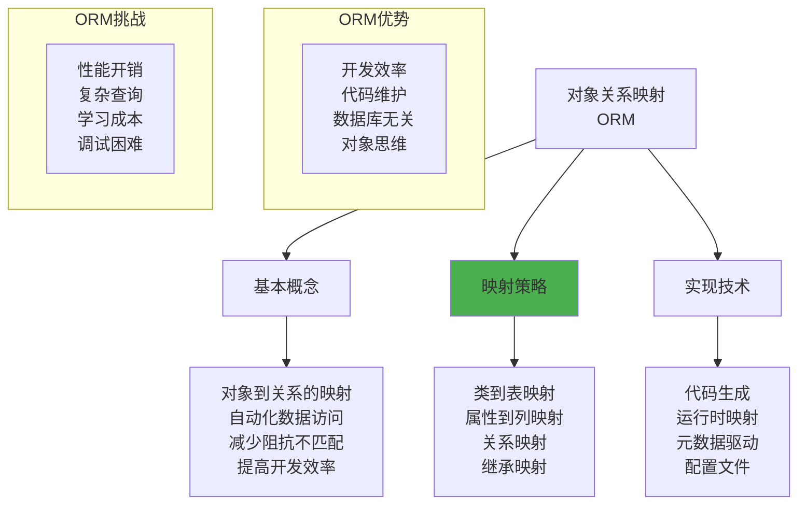

### 14.4.2 映射策略

```mermaid
graph TD
    A[映射策略] --> B[继承映射]
    A --> C[关联映射]
    A --> D[集合映射]
    
    B --> B1[单表继承<br/>Table per Class<br/>Table per Subclass<br/>混合策略]
    
    C --> C1[一对一映射<br/>一对多映射<br/>多对多映射<br/>外键关系]
    
    D --> D1[List映射<br/>Set映射<br/>Map映射<br/>嵌套集合]
    
    subgraph "单表继承"
        E[Person表<br/>id | type | name | age | student_id | salary<br/>包含所有子类属性<br/>使用type字段区分]
    end
    
    subgraph "Table per Class"
        F[Person表: id, name, age<br/>Student表: id, student_id<br/>Employee表: id, salary<br/>每个类一个表]
    end
    
    subgraph "Table per Subclass"
        G[Person表: id, name, age<br/>Student表: person_id, student_id<br/>Employee表: person_id, salary<br/>继承关系通过外键]
    end
    
    style B fill:#4caf50
```

### 14.4.3 ORM框架

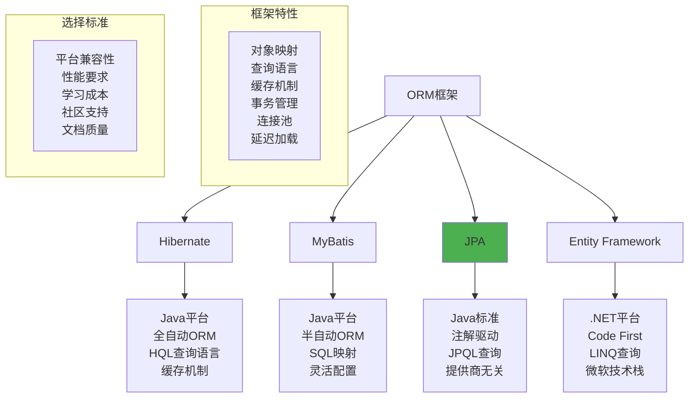

### 14.4.4 查询优化

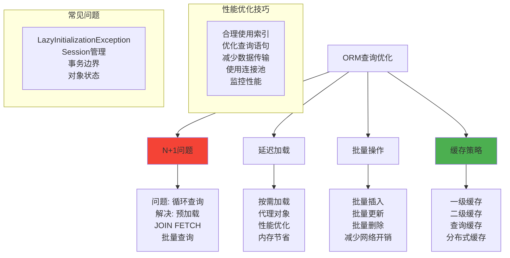

## 14.5 对象关系数据库实现

### 14.5.1 存储结构

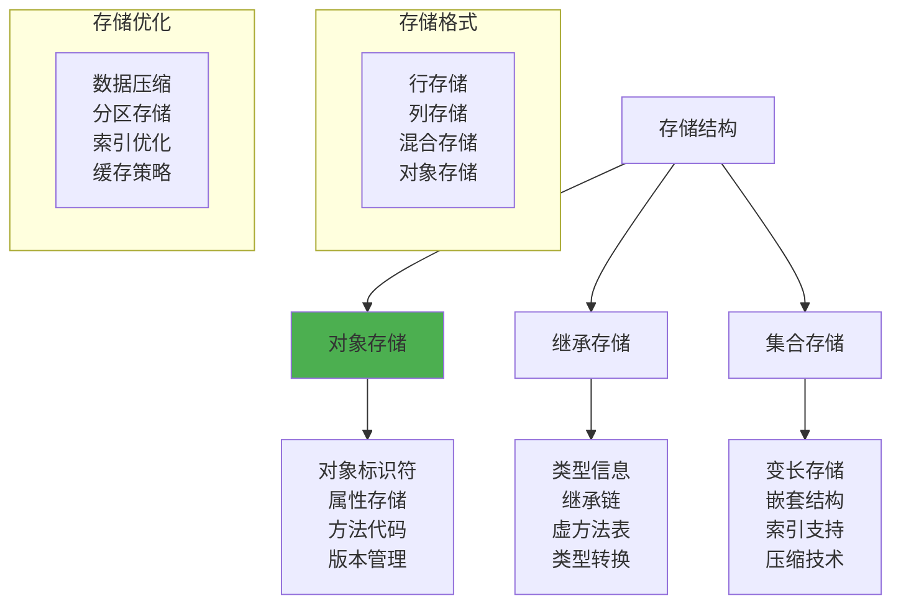

### 14.5.2 索引机制

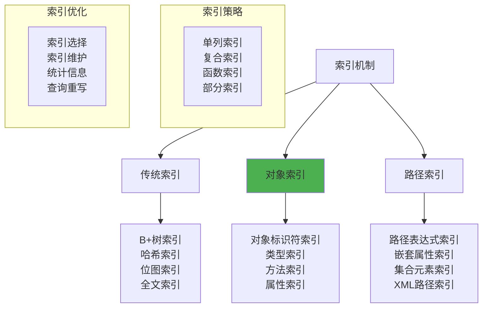

### 14.5.3 查询处理

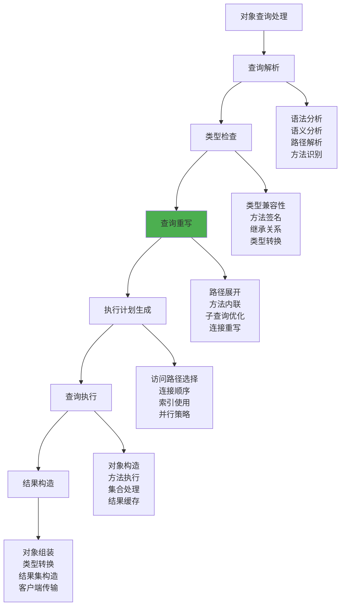

### 14.5.4 并发控制

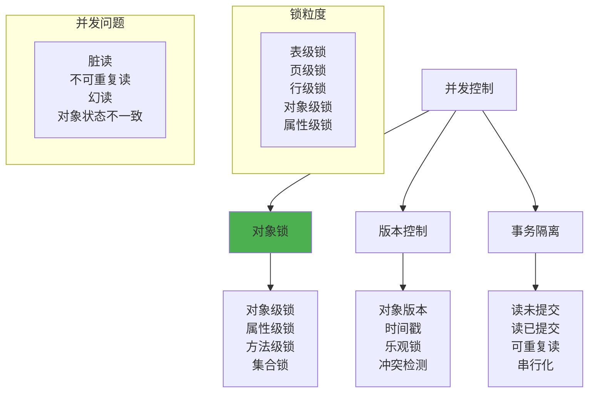

## 14.6 对象关系数据库设计

### 14.6.1 设计方法论

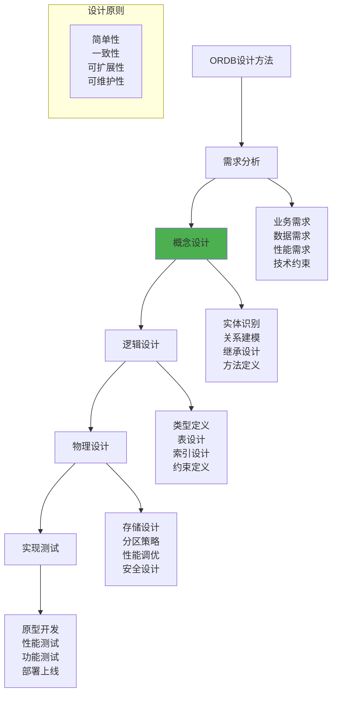

### 14.6.2 类型设计

```mermaid
graph TD
    A[类型设计] --> B[类型层次]
    A --> C[属性设计]
    A --> D[方法设计]
    
    B --> B1[继承关系<br/>抽象类型<br/>接口定义<br/>多态支持]
    
    C --> C1[基本属性<br/>复杂属性<br/>集合属性<br/>引用属性]
    
    D --> D1[构造方法<br/>访问方法<br/>业务方法<br/>工具方法]
    
    subgraph "设计模式"
        E[工厂模式<br/>建造者模式<br/>策略模式<br/>观察者模式]
    end
    
    subgraph "设计考虑"
        F[性能影响<br/>存储开销<br/>查询复杂度<br/>维护成本]
    end
    
    style B fill:#4caf50
```

### 14.6.3 性能设计

```mermaid
graph TD
    A[性能设计] --> B[存储优化]
    A --> C[查询优化]
    A --> D[索引优化]
    
    B --> B1[数据分区<br/>压缩存储<br/>缓存策略<br/>内存管理]
    
    C --> C1[查询重写<br/>执行计划<br/>并行处理<br/>结果缓存]
    
    D --> D1[索引选择<br/>复合索引<br/>函数索引<br/>维护策略]
    
    subgraph "性能监控"
        E[响应时间<br/>吞吐量<br/>资源使用<br/>并发性能]
    end
    
    subgraph "优化技术"
        F[预编译<br/>连接池<br/>批量操作<br/>异步处理]
    end
    
    style C fill:#4caf50
```

## 14.7 应用案例

### 14.7.1 GIS系统

```mermaid
graph TD
    A[GIS系统应用] --> B[空间数据类型]
    A --> C[空间操作]
    A --> D[空间索引]
    
    B --> B1[Point类型<br/>Line类型<br/>Polygon类型<br/>Geometry类型]
    
    C --> C1[距离计算<br/>相交判断<br/>包含关系<br/>缓冲区分析]
    
    D --> D1[R-tree索引<br/>Quad-tree索引<br/>Grid索引<br/>空间聚簇]
    
    subgraph "空间类型定义"
        E[CREATE TYPE Point AS (<br/>  x DOUBLE,<br/>  y DOUBLE<br/>) INSTANTIABLE<br/>METHOD distance(Point) RETURNS DOUBLE]
    end
    
    subgraph "空间查询"
        F[SELECT p.name<br/>FROM Places p<br/>WHERE p.location.distance(<br/>  Point(120.0, 30.0)<br/>) < 1000]
    end
    
    style B fill:#4caf50
```

### 14.7.2 多媒体数据库

```mermaid
graph TD
    A[多媒体数据库] --> B[媒体类型]
    A --> C[内容分析]
    A --> D[检索方法]
    
    B --> B1[Image类型<br/>Video类型<br/>Audio类型<br/>Document类型]
    
    C --> C1[特征提取<br/>内容索引<br/>相似度计算<br/>语义分析]
    
    D --> D1[基于内容检索<br/>相似性查询<br/>模糊匹配<br/>多模态检索]
    
    subgraph "媒体类型定义"
        E[CREATE TYPE Image AS (<br/>  data BLOB,<br/>  width INTEGER,<br/>  height INTEGER,<br/>  format VARCHAR(10)<br/>) INSTANTIABLE<br/>METHOD similarity(Image) RETURNS DOUBLE]
    end
    
    subgraph "内容检索"
        F[SELECT i.title<br/>FROM Images i<br/>WHERE i.content.similarity(<br/>  :queryImage<br/>) > 0.8]
    end
    
    style B fill:#4caf50
```

### 14.7.3 科学计算

```mermaid
graph TD
    A[科学计算应用] --> B[复杂数据结构]
    A --> C[数值计算]
    A --> D[数据分析]
    
    B --> B1[Matrix类型<br/>Vector类型<br/>Complex类型<br/>TimeSeries类型]
    
    C --> C1[矩阵运算<br/>统计函数<br/>数值分析<br/>优化算法]
    
    D --> D1[数据挖掘<br/>模式识别<br/>机器学习<br/>可视化]
    
    subgraph "科学类型"
        E[CREATE TYPE Matrix AS (<br/>  rows INTEGER,<br/>  cols INTEGER,<br/>  data ARRAY[1000] OF DOUBLE<br/>) INSTANTIABLE<br/>METHOD multiply(Matrix) RETURNS Matrix]
    end
    
    subgraph "科学计算"
        F[SELECT m1.multiply(m2)<br/>FROM Matrices m1, Matrices m2<br/>WHERE m1.experiment_id = m2.experiment_id]
    end
    
    style B fill:#4caf50
```

## 14.8 学习检查点

### 14.8.1 重点概念总结

```mermaid
mindmap
  root((对象关系数据库))
    基本概念
      定义特点
        关系+对象
        SQL兼容
        复杂数据
        方法封装
      优势分析
        建模能力强
        代码重用
        性能优势
        兼容性好
      发展历程
        关系数据库
        面向对象数据库
        对象关系融合
        标准化发展
    数据模型
      用户定义类型
        结构化类型
        不同类型
        集合类型
        类型安全
      继承机制
        类型继承
        方法继承
        多态性
        动态绑定
      方法定义
        实例方法
        静态方法
        构造方法
        方法重写
    SQL扩展
      SQL1999
        结构化类型
        类型化表
        引用类型
        数组类型
      SQL2003
        XML类型
        窗口函数
        MERGE语句
        递归查询
      查询语言
        路径表达式
        方法调用
        集合查询
        类型转换
    ORM技术
      基本概念
        对象映射
        自动化访问
        阻抗匹配
        开发效率
      映射策略
        继承映射
        关联映射
        集合映射
        配置驱动
      框架实现
        Hibernate
        MyBatis
        JPA
        Entity Framework
    系统实现
      存储结构
        对象存储
        继承存储
        集合存储
        版本管理
      索引机制
        传统索引
        对象索引
        路径索引
        性能优化
      查询处理
        查询解析
        类型检查
        查询重写
        执行优化
    应用场景
      GIS系统
        空间数据
        空间操作
        空间索引
        地理分析
      多媒体
        媒体类型
        内容分析
        相似检索
        特征提取
      科学计算
        复杂结构
        数值计算
        数据分析
        算法实现
```

### 14.8.2 练习题

1. **对象关系数据模型**
   - 设计一个图书管理系统的对象关系模型
   - 定义Book、Author、Publisher等类型
   - 实现继承关系和方法定义

2. **SQL对象扩展**
   - 使用SQL:1999语法创建类型化表
   - 实现复杂查询包含路径表达式和方法调用
   - 设计集合类型的存储和查询

3. **ORM应用**
   - 比较不同ORM框架的特点
   - 设计映射策略解决继承问题
   - 优化ORM查询性能

### 14.8.3 思考题

1. 对象关系数据库相比纯关系数据库有哪些优势和劣势？
2. 如何在对象关系数据库中有效处理复杂的继承层次？
3. ORM技术如何解决对象和关系之间的阻抗不匹配问题？
4. 在什么情况下应该选择对象关系数据库而不是NoSQL数据库？

---

**本章小结**：对象关系数据库成功地结合了关系数据库的成熟稳定和面向对象技术的建模能力。通过用户定义类型、继承机制、方法定义等特性，ORDB能够更自然地表示复杂的现实世界实体。SQL标准的对象扩展为开发者提供了强大的数据建模和查询能力。ORM技术进一步简化了应用开发，减少了对象和关系之间的阻抗不匹配。在GIS、多媒体、科学计算等领域，对象关系数据库展现出了独特的优势。

---
**上一章：** [第13章 分布式数据库系统](第13章_分布式数据库系统.md)  
**返回目录：** [数据库原理学习指南](数据库原理学习指南.md)