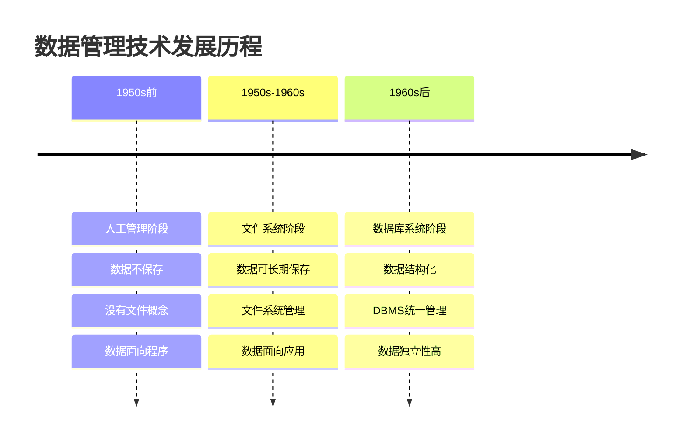
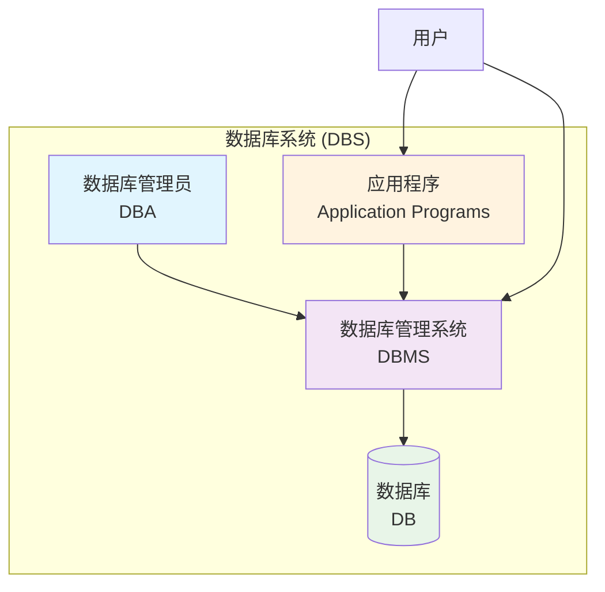
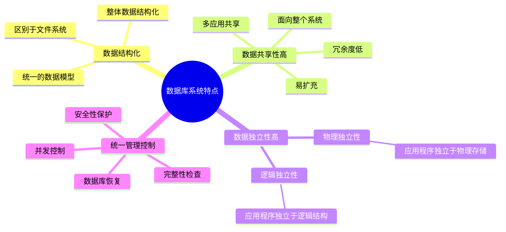
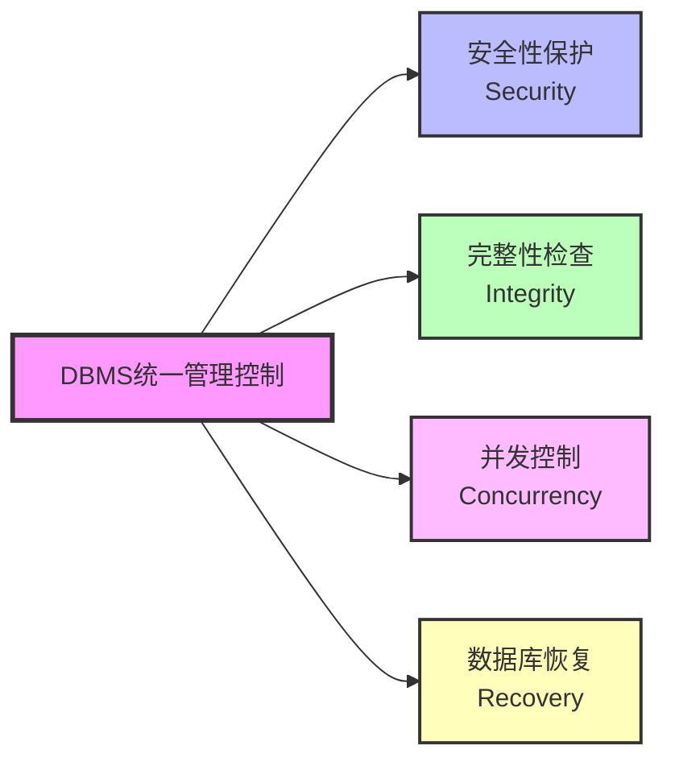

# 第1章 数据库系统概述

## 📚 本章学习目标
- 理解数据管理技术的发展历程
- 掌握数据库系统的基本概念
- 了解数据库系统的特点和优势
- 理解数据库系统的组成和结构

## 1.1 数据管理技术的发展

### 1.1.1 人工管理阶段（20世纪50年代中期以前）
**特点：**
- 数据不保存在计算机内
- 没有专门的软件对数据进行管理
- 只有程序，没有文件的概念
- 数据面向程序

**缺点：**
- 数据不能长期保存
- 没有对数据进行管理的软件
- 数据不能共享
- 数据不具有独立性

### 1.1.2 文件系统阶段（20世纪50年代后期-60年代中期）
**特点：**
- 数据可以长期保存在外存上
- 由文件系统管理数据
- 数据可以重复使用
- 数据面向应用

**缺点：**
- 数据冗余度大，浪费存储空间
- 数据不一致性
- 数据联系弱
- 数据不独立，修改数据的逻辑结构对应用程序影响很大
- 并发访问异常，多用户环境下会产生数据不一致性
- 数据安全性差

### 1.1.3 数据库系统阶段（20世纪60年代后期以来）
**特点：**
- 数据结构化
- 数据的共享性高，冗余度低，易扩充
- 数据独立性高
- 数据由DBMS统一管理和控制

## 1.2 数据库系统基本概念

### 1.2.1 数据（Data）
**定义：** 描述事物的符号记录称为数据

**特点：**
- 数据是数据库中存储的基本对象
- 数据的含义称为数据的语义
- 数据与其语义是不可分的
- 数据可以是数字、文字、图形、图像、音频、视频等

**举例：**
- 学生记录：(张三, 男, 20, 计算机科学与技术)
- 其中"张三"是姓名，"男"是性别，"20"是年龄

### 1.2.2 数据库（Database, DB）
**定义：** 数据库是长期储存在计算机内、有组织的、可共享的大量数据的集合

**特点：**
- 数据按一定的数据模型组织、描述和储存
- 具有较小的冗余度
- 具有较高的数据独立性和易扩展性
- 可为各种用户共享

**基本特征：**
- 永久存储
- 有组织
- 可共享

### 1.2.3 数据库管理系统（DBMS）
**定义：** 数据库管理系统是位于用户与操作系统之间的一层数据管理软件

**主要功能：**
1. **数据定义功能**
   - 提供数据定义语言（DDL）
   - 定义数据库中的数据对象

2. **数据组织、存储和管理**
   - 分类组织、存储和管理各种数据
   - 确定组织数据的文件结构和存取方式

3. **数据操纵功能**
   - 提供数据操纵语言（DML）
   - 实现对数据库的基本操作（查询、插入、删除和修改）

4. **数据库的事务管理和运行管理**
   - 数据库在建立、运行和维护时由DBMS统一管理和控制
   - 保证数据的安全性、完整性、多用户对数据的并发使用
   - 发生故障后的系统恢复

5. **数据库的建立和维护功能**
   - 数据库初始数据装载转换
   - 数据库转储
   - 介质故障恢复
   - 数据库的重组织
   - 性能监视分析等

6. **其他功能**
   - 通信功能
   - 数据转换功能
   - 互访和互操作功能

### 1.2.4 数据库系统（DBS）
**定义：** 数据库系统是由数据库、数据库管理系统（及其应用开发工具）、应用程序和数据库管理员组成的存储、管理、处理和维护数据的系统

**组成：**
- 数据库（DB）
- 数据库管理系统（DBMS）
- 应用程序（AP）
- 数据库管理员（DBA）

## 1.3 数据库系统的特点

### 1.3.1 数据结构化
- 数据库系统实现整体数据的结构化
- 这是数据库的主要特征之一，也是数据库系统与文件系统的本质区别

### 1.3.2 数据的共享性高，冗余度低且易扩充
- 数据库的数据不再面向某个应用而是面向整个系统
- 多个应用可以同时使用数据库中的数据
- 新的应用可以从数据库中获得所需的数据

### 1.3.3 数据独立性高
**物理独立性：** 用户的应用程序与数据库中数据的物理存储是相互独立的
**逻辑独立性：** 用户的应用程序与数据库的逻辑结构是相互独立的

### 1.3.4 数据由DBMS统一管理和控制

DBMS提供的数据控制功能：
- **数据的安全性（Security）保护**
- **数据的完整性（Integrity）检查**
- **并发（Concurrency）控制**
- **数据库恢复（Recovery）**

## 📝 本章重点概念总结

| 概念 | 定义 | 关键特点 |
|------|------|----------|
| 数据 | 描述事物的符号记录 | 与语义不可分 |
| 数据库 | 有组织的数据集合 | 结构化、共享、持久存储 |
| DBMS | 数据管理软件 | 提供定义、操纵、控制功能 |
| DBS | 完整的数据库系统 | 包含DB、DBMS、应用程序、DBA |

## 🎯 学习检查点

- [ ] 能够区分数据管理技术的三个发展阶段
- [ ] 理解四个基本概念的定义和区别
- [ ] 掌握数据库系统的主要特点
- [ ] 了解DBMS的主要功能

## 💡 思考题

1. 试述文件系统与数据库系统的区别和联系
2. 数据库系统的主要特点是什么？这些特点带来什么好处？
3. 试述数据、数据库、数据库系统、数据库管理系统的概念与联系
4. 什么是数据的物理独立性和逻辑独立性？各有什么意义？

---
**下一章：** [第2章 关系数据库](第2章_关系数据库.md)