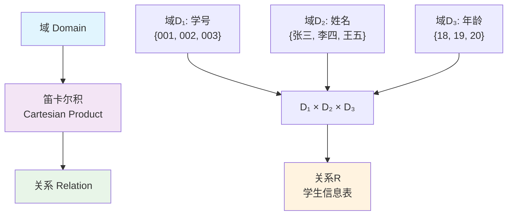
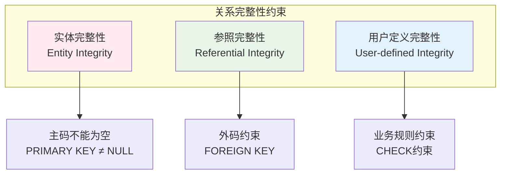
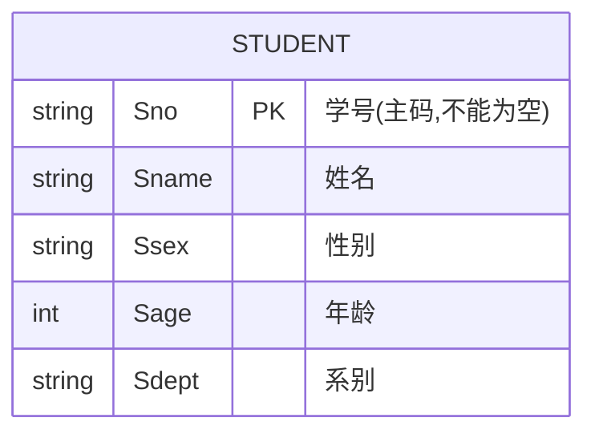
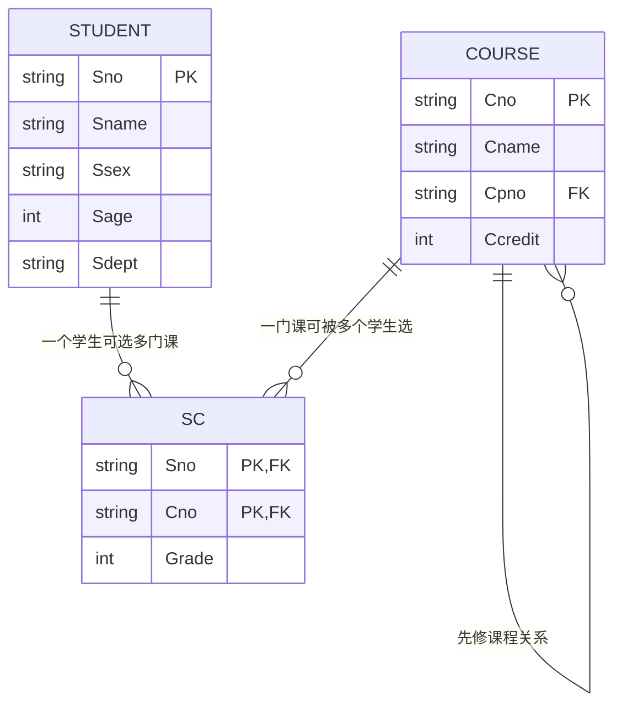
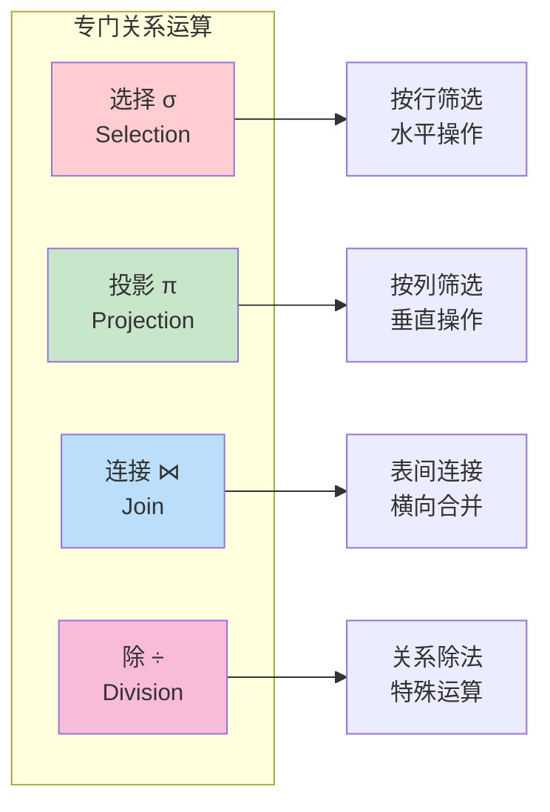
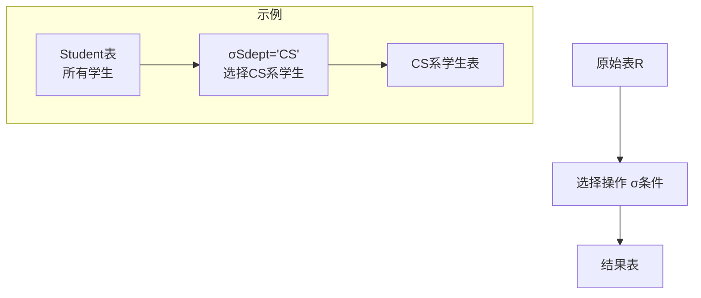
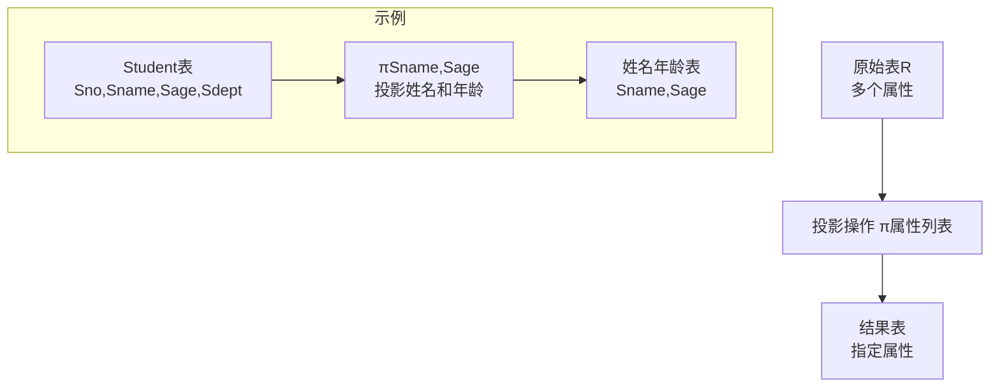
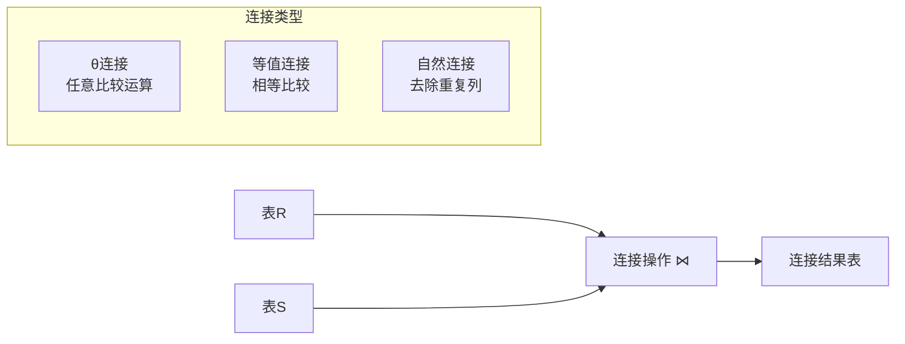

# 第2章 关系数据库

## 📚 本章学习目标
- 理解关系数据结构及形式化定义
- 掌握关系操作集合
- 理解关系的完整性
- 掌握关系代数的基本操作

## 2.1 关系数据结构及形式化定义

### 2.1.1 关系



**域（Domain）**
- 域是一组具有相同数据类型的值的集合
- 例如：整数、实数、字符串、日期等

**笛卡尔积（Cartesian Product）**
- 给定一组域D₁, D₂, ..., Dₙ，这些域的笛卡尔积为：
  D₁ × D₂ × ... × Dₙ = {(d₁, d₂, ..., dₙ) | dᵢ ∈ Dᵢ, i = 1, 2, ..., n}

**关系（Relation）**
- D₁ × D₂ × ... × Dₙ的子集叫做在域D₁, D₂, ..., Dₙ上的关系
- 表示为R(D₁, D₂, ..., Dₙ)
- 关系中的每个元素(d₁, d₂, ..., dₙ)叫做一个n元组（n-tuple）

### 2.1.2 关系模式
**关系模式（Relation Schema）**
- 关系模式是对关系的描述
- 一般表示为：R(U, D, DOM, F)
  - R：关系名
  - U：组成该关系的属性名集合
  - D：属性组U中属性所来自的域
  - DOM：属性向域的映象集合
  - F：属性间数据的依赖关系集合

**简化表示：** R(A₁, A₂, ..., Aₙ)

### 2.1.3 关系数据库
**关系数据库**
- 在一个给定的应用领域中，所有关系的集合构成一个关系数据库

**关系数据库模式**
- 对关系数据库的描述
- 是若干个关系模式的集合

## 2.2 关系操作

### 2.2.1 基本关系操作
**查询操作：**
- 选择（Selection）
- 投影（Projection）
- 连接（Join）
- 除（Division）
- 并（Union）
- 差（Difference）
- 交（Intersection）
- 笛卡尔积（Cartesian Product）

**数据更新操作：**
- 插入（Insert）
- 删除（Delete）
- 修改（Update）

### 2.2.2 关系操作的特点
- **集合操作方式**：操作的对象和结果都是集合
- **一次一集合的方式**：一次操作多个元组

## 2.3 关系的完整性



### 2.3.1 实体完整性（Entity Integrity）
**规则：** 若属性A是基本关系R的主属性，则属性A不能取空值



**说明：**
- 主属性：包含在任何一个候选码中的属性
- 主码的属性不能为空值（NULL）
- 这是最基本的完整性约束

### 2.3.2 参照完整性（Referential Integrity）
**外码（Foreign Key）**
- 设F是基本关系R的一个或一组属性，但不是关系R的码
- 如果F与基本关系S的主码Ks相对应，则称F是基本关系R的外码



**参照完整性规则：**
若属性（或属性组）F是基本关系R的外码，它与基本关系S的主码Ks相对应，则对于R中每个元组在F上的值必须为：
- 或者取空值（F的每个属性值均为空值）
- 或者等于S中某个元组的主码值

### 2.3.3 用户定义的完整性（User-defined Integrity）
- 针对某一具体关系数据库的约束条件
- 反映某一具体应用所涉及的数据必须满足的语义要求

## 2.4 关系代数

### 2.4.1 传统的集合运算

#### 并（Union）∪
**定义：** R ∪ S = {t | t ∈ R ∨ t ∈ S}
**条件：** R和S必须是相容的（属性数目相同，对应属性的域相同）

#### 差（Difference）-
**定义：** R - S = {t | t ∈ R ∧ t ∉ S}
**条件：** R和S必须是相容的

#### 交（Intersection）∩
**定义：** R ∩ S = {t | t ∈ R ∧ t ∈ S}
**条件：** R和S必须是相容的

#### 笛卡尔积（Cartesian Product）×
**定义：** R × S = {tr ts | tr ∈ R ∧ ts ∈ S}

### 2.4.2 专门的关系运算



#### 选择（Selection）σ
**定义：** σF(R) = {t | t ∈ R ∧ F(t) = '真'}
**作用：** 从关系R中选择满足给定条件的诸元组



#### 投影（Projection）π
**定义：** πA(R) = {t[A] | t ∈ R}
**作用：** 从R中选择出若干属性列组成新的关系



#### 连接（Join）⋈
**θ连接：** R ⋈A θ B S = {tr ts | tr ∈ R ∧ ts ∈ S ∧ tr[A] θ ts[B]}

**等值连接：** 当θ为"="时的连接运算

**自然连接：** 在等值连接中把目标列表中重复的属性列去掉



#### 除（Division）÷
**定义：** 设关系R除以关系S的结果为关系T，则T包含所有在R但不在S中的属性及其值，且T的元组与S的元组的所有组合都在R中

## 📊 关系代数运算示例

### 示例数据
**学生关系 Student(Sno, Sname, Ssex, Sage, Sdept)**
| Sno | Sname | Ssex | Sage | Sdept |
|-----|-------|------|------|-------|
| 001 | 李勇  | 男   | 20   | CS    |
| 002 | 刘晨  | 女   | 19   | CS    |
| 003 | 王敏  | 女   | 18   | MA    |

**课程关系 Course(Cno, Cname, Cpno, Ccredit)**
| Cno | Cname    | Cpno | Ccredit |
|-----|----------|------|---------|
| 1   | 数据库   | 5    | 4       |
| 2   | 数学     |      | 2       |
| 3   | 信息系统 | 1    | 4       |

### 运算示例
1. **选择操作：** 查询计算机科学系的学生
   σSdept='CS'(Student)

2. **投影操作：** 查询学生的姓名和年龄
   πSname,Sage(Student)

3. **连接操作：** 查询每个学生的选课情况
   Student ⋈ SC ⋈ Course

## 🎯 学习检查点

- [ ] 理解域、关系、关系模式的概念
- [ ] 掌握关系的三类完整性约束
- [ ] 熟练使用关系代数的基本运算
- [ ] 能够用关系代数表达式解决实际问题

## 💡 练习题

1. 设有关系R(A,B,C)和S(B,C,D)，计算R∪S、R∩S、R-S
2. 用关系代数表达式表示下列查询：
   - 查询年龄大于19岁的学生姓名
   - 查询选修了课程号为"1"的课程的学生学号
   - 查询计算机科学系学生选修的课程号

## 🔗 相关概念图

```
关系数据库
├── 关系数据结构
│   ├── 域
│   ├── 关系
│   └── 关系模式
├── 关系操作
│   ├── 查询操作
│   └── 更新操作
├── 关系完整性
│   ├── 实体完整性
│   ├── 参照完整性
│   └── 用户定义完整性
└── 关系代数
    ├── 传统集合运算
    └── 专门关系运算
```

---
**上一章：** [第1章 数据库系统概述](第1章_数据库系统概述.md)  
**下一章：** [第3章 关系数据库标准语言SQL](第3章_关系数据库标准语言SQL.md)