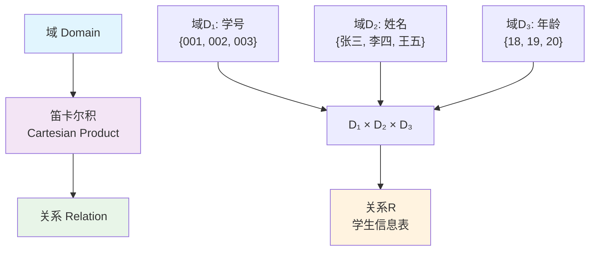
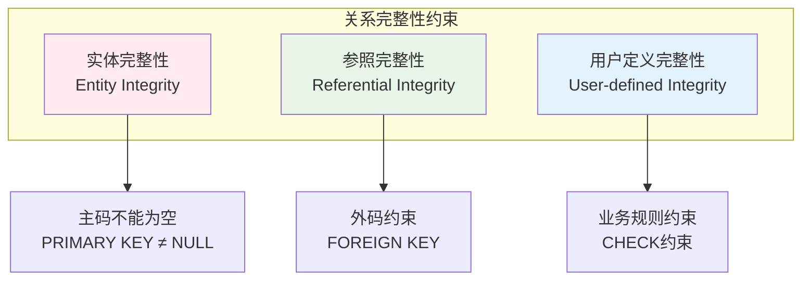
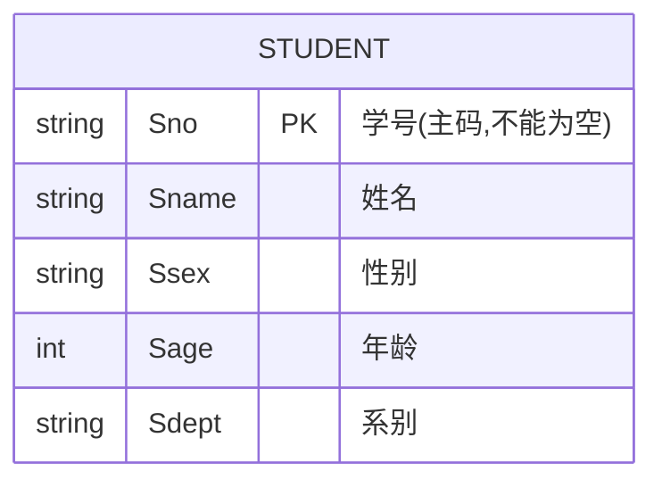
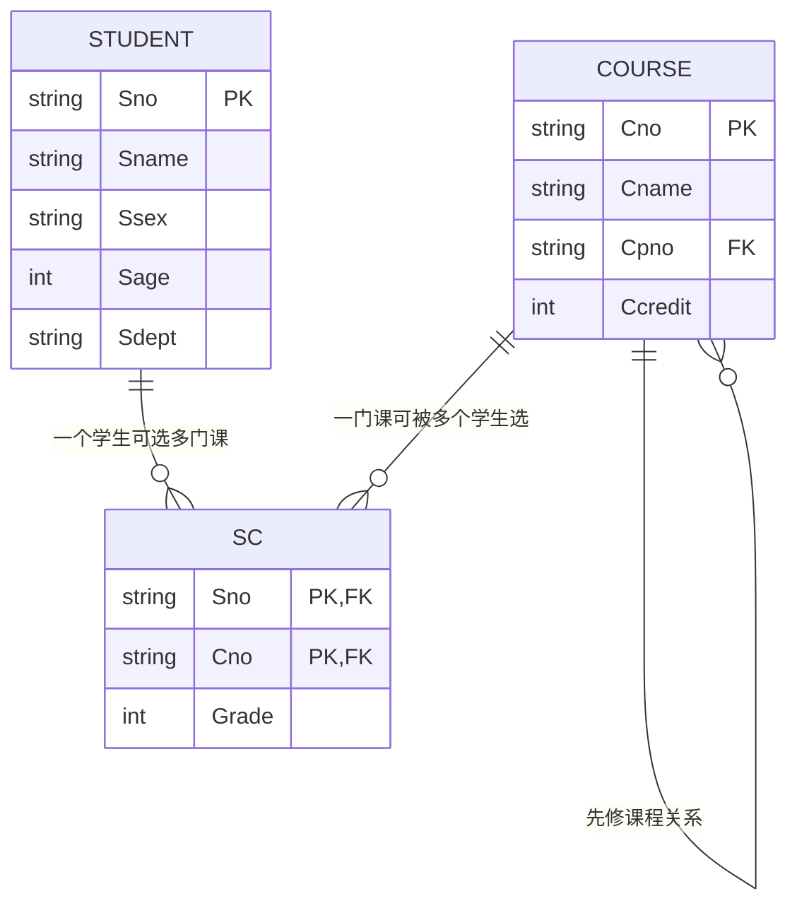
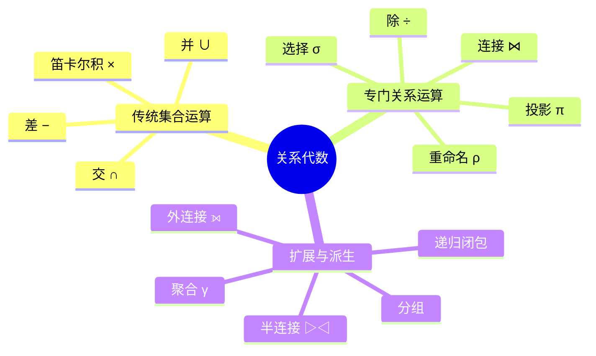
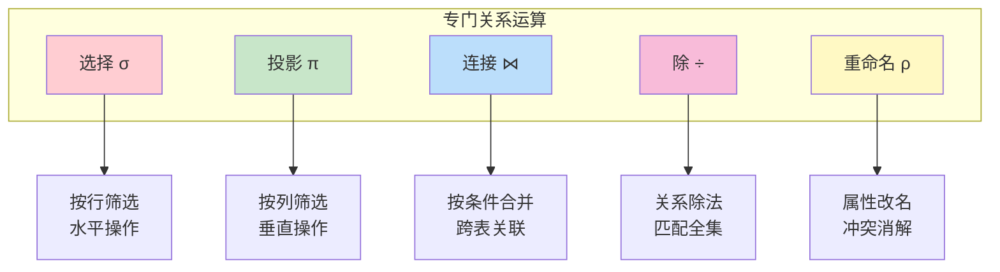
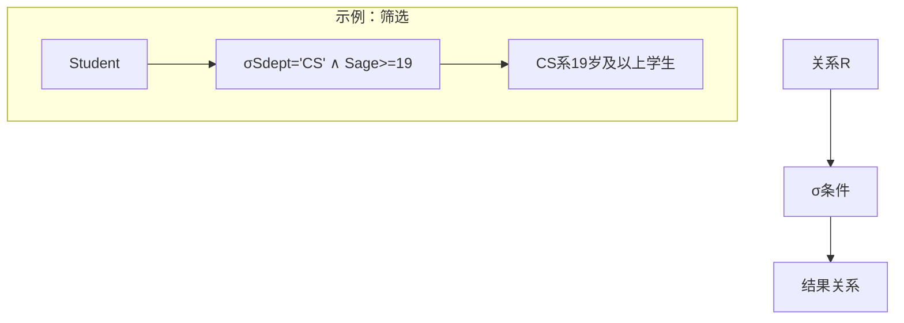
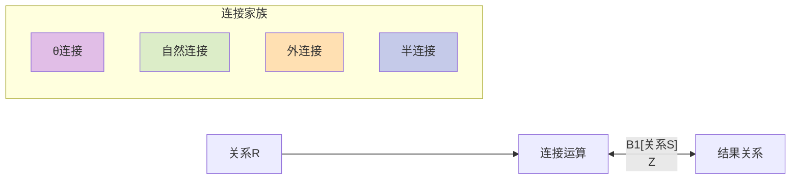
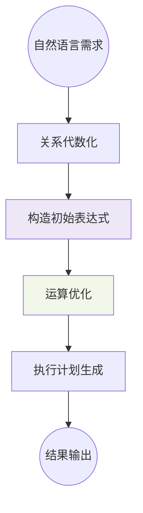
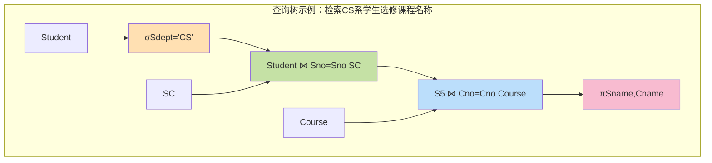

# 第2章 关系数据库

## 📚 本章学习目标
- 理解关系数据结构及形式化定义
- 掌握关系操作集合
- 理解关系的完整性
- 掌握关系代数的基本操作

## 2.1 关系数据结构及形式化定义

### 2.1.1 关系



**域（Domain）**
- 域是一组具有相同数据类型的值的集合
- 例如：整数、实数、字符串、日期等

**笛卡尔积（Cartesian Product）**
- 给定一组域D₁, D₂, ..., Dₙ，这些域的笛卡尔积为：
  D₁ × D₂ × ... × Dₙ = {(d₁, d₂, ..., dₙ) | dᵢ ∈ Dᵢ, i = 1, 2, ..., n}

**关系（Relation）**
- D₁ × D₂ × ... × Dₙ的子集叫做在域D₁, D₂, ..., Dₙ上的关系
- 表示为R(D₁, D₂, ..., Dₙ)
- 关系中的每个元素(d₁, d₂, ..., dₙ)叫做一个n元组（n-tuple）

### 2.1.2 关系模式
**关系模式（Relation Schema）**
- 关系模式是对关系的描述
- 一般表示为：R(U, D, DOM, F)
  - R：关系名
  - U：组成该关系的属性名集合
  - D：属性组U中属性所来自的域
  - DOM：属性向域的映象集合
  - F：属性间数据的依赖关系集合

**简化表示：** R(A₁, A₂, ..., Aₙ)

### 2.1.3 关系数据库
**关系数据库**
- 在一个给定的应用领域中，所有关系的集合构成一个关系数据库

**关系数据库模式**
- 对关系数据库的描述
- 是若干个关系模式的集合

## 2.2 关系操作

### 2.2.1 基本关系操作
**查询操作：**
- 选择（Selection）
- 投影（Projection）
- 连接（Join）
- 除（Division）
- 并（Union）
- 差（Difference）
- 交（Intersection）
- 笛卡尔积（Cartesian Product）

**数据更新操作：**
- 插入（Insert）
- 删除（Delete）
- 修改（Update）

### 2.2.2 关系操作的特点
- **集合操作方式**：操作的对象和结果都是集合
- **一次一集合的方式**：一次操作多个元组

## 2.3 关系的完整性



### 2.3.1 实体完整性（Entity Integrity）
**规则：** 若属性A是基本关系R的主属性，则属性A不能取空值



**说明：**
- 主属性：包含在任何一个候选码中的属性
- 主码的属性不能为空值（NULL）
- 这是最基本的完整性约束

### 2.3.2 参照完整性（Referential Integrity）
**外码（Foreign Key）**
- 设F是基本关系R的一个或一组属性，但不是关系R的码
- 如果F与基本关系S的主码Ks相对应，则称F是基本关系R的外码



**参照完整性规则：**
若属性（或属性组）F是基本关系R的外码，它与基本关系S的主码Ks相对应，则对于R中每个元组在F上的值必须为：
- 或者取空值（F的每个属性值均为空值）
- 或者等于S中某个元组的主码值

### 2.3.3 用户定义的完整性（User-defined Integrity）
- 针对某一具体关系数据库的约束条件
- 反映某一具体应用所涉及的数据必须满足的语义要求

## 2.4 关系代数



### 2.4.1 传统的集合运算

#### 并（Union）∪
**定义：** R ∪ S = {t | t ∈ R ∨ t ∈ S}

**适用条件：** R和S必须是**相容关系**（属性个数相同，且对应属性来自同一域）。

**性质：** 交换律、结合律、幂等律都成立。

#### 差（Difference）−
**定义：** R − S = {t | t ∈ R ∧ t ∉ S}

**适用条件：** R和S必须相容；该操作不具交换性。

#### 交（Intersection）∩
**定义：** R ∩ S = {t | t ∈ R ∧ t ∈ S}

**推导：** R ∩ S 可以由差运算推导得到：R ∩ S = R − (R − S)。

#### 笛卡尔积（Cartesian Product）×
**定义：** R × S = {tr ts | tr ∈ R ∧ ts ∈ S}

**意义：** 为连接运算奠定基础；结果关系包含来自两个关系的所有属性，元组数为 |R| × |S|。

### 2.4.2 专门的关系运算



#### 选择（Selection）σ
**定义：** σF(R) = {t | t ∈ R ∧ F(t) = 真}

**典型谓词：** 比较运算（=, ≠, >, <, ≥, ≤）、逻辑联结（∧, ∨, ¬）、集合测试（IN, BETWEEN）。



**性质：** 可分解（σF1∧F2(R) = σF2(σF1(R)))；交换律在相同关系上成立。

#### 投影（Projection）π
**定义：** πA(R) = {t[A] | t ∈ R}

**作用：** 从关系R中选出若干属性列，并自动去除重复元组。

```mermaid
graph TD
    S[关系R] --> T[π属性集]
    T --> U[仅保留指定列]

    subgraph "示例：取列"
        V[Student(Sno,Sname,Sage,Sdept)]
        V --> W[πSname,Sdept]
        W --> X[Sname,Sdept去重]
    end
```

**注意：** 投影不会保留属性的原顺序要求；必要时通过重命名保持语义。

#### 连接（Join）⋈
**θ连接：** R ⋈A θ B S = {tr ts | tr ∈ R ∧ ts ∈ S ∧ tr[A] θ ts[B]}。

**等值连接：** θ 为 "=" 的特殊情况。

**自然连接：** 在等值连接基础上自动去除重复的同名属性列，可表示为 R ⋈ S。

**外连接：** 为保留未匹配元组引入空值，可分为左外连接（⟕）、右外连接（⟖）、全外连接（⟗）。



#### 除（Division）÷
**定义：** 设关系R(X, Y) 除以关系S(Y) 的结果为 T(X)，其中 X 为 R 中除 Y 外的属性集合，则：

T = {t[X] | t ∈ R 且 ∀s ∈ S, (t[X], s) ∈ R}。

**用途：** 表达“至少包含 S 的全部元素”的查询，如“选修了所有必修课的学生”。

#### 重命名（Rename）ρ
**记号示例：** ρSno→StudentID(Student) 或 ρX(A,B←C,D)(R)。

**作用：** 解决属性重名冲突、辅助复杂表达式的书写，也是递归定义查询表达式的基础。

### 2.4.3 关系代数表达式的构造

关系代数表达式是由基本运算符组合而成的有向无环图（DAG）。构造时通常遵循“先代数化、后优化、再求值”的流程。



- **联合表达式：** 可用括号显式指定执行顺序，默认为左结合。
- **赋值/命名：** 可记作 Temp ← Student ⋈ SC，用来拆分复杂查询。
- **表达式图：** 常以查询树或查询图形式展示，便于优化器分析。

### 2.4.4 查询树与执行思路



- 查询树自下而上表示运算顺序；叶节点为基本关系，内节点为运算符。
- 优化时优先“下推选择、合并同类项、减少中间结果”。
- 逻辑执行顺序：σ → ⋈ → π，以缩减数据量并提升效率。

### 2.4.5 常用代数恒等式

| 序号 | 恒等式 | 含义 |
|------|--------|------|
| 1 | σF1∧F2(R) = σF1(σF2(R)) | 选择分解 |
| 2 | πX(πY(R)) = πX(R) (X ⊆ Y) | 投影冗余 |
| 3 | σF(R ⋈ S) = σF(R) ⋈ S （F 仅涉及 R） | 选择下推 |
| 4 | R ⋈ S = S ⋈ R | 连接交换 |
| 5 | (R ⋈ S) ⋈ T = R ⋈ (S ⋈ T) | 连接结合 |
| 6 | R ∩ S = R − (R − S) | 交的推导 |
| 7 | R ∪ (S ∩ T) = (R ∪ S) ∩ (R ∪ T) | 分配律 |

**应用：** 借助等价变换降低中间结果体积、简化表达式、指导索引选择。

### 2.4.6 扩展与派生运算

- **半连接（▷◁）：** 仅返回参与匹配的左（或右）侧元组，用于减少传输成本。
- **反连接：** 类似集合差，返回未匹配元组。
- **外连接（⟕, ⟖, ⟗）：** 保留未匹配元组并用 NULL 填补缺失属性。
- **聚合与分组（γ）：** γSdept;AVG(Sage)→AvgAge(Student) 表示按系分组求平均年龄。
- **递归闭包：** 在路径查询、层次结构遍历中使用，以求某关系的传递闭包（如祖先/后代查询）。

```mermaid
flowchart LR
    H1[基本关系] --> H2[γ 聚合]
    H1 --> H3[▷◁ 半连接]
    H1 --> H4[⟕ 外连接]
    H1 --> H5[TC(R) 递归闭包]

    H2 --> H6[汇总统计]
    H3 --> H7[过滤冗余]
    H4 --> H8[补全缺失]
    H5 --> H9[路径分析]

    style H2 fill:#dcedc8
    style H3 fill:#ffe0b2
    style H4 fill:#f8bbd0
    style H5 fill:#c5cae9
```

### 2.4.7 综合案例：多运算组合

需求：“查询选修了所有编号为 {1,3} 课程且平均成绩不低于 85 分的学生姓名与平均分。”

解析步骤：
1. **获取目标课程集：** 定义集合 C = {1, 3}，视作关系 Required(Cno)。
2. **找出满足全集条件的学生：** Temp ← πSno(σCno∈C(SC)) ÷ Required。
3. **计算平均成绩：** Score ← γSno;AVG(Grade)→AvgGrade(SC)。
4. **筛选成绩：** HighScore ← σAvgGrade≥85(Score)。
5. **合并学生信息：** Result ← πSname,AvgGrade((Temp ⋈ Sno Sno= Sno HighScore) ⋈ Sno Sno= Sno Student)。

```mermaid
graph TD
    R1[SC] --> R2[σCno∈{1,3}]
    R2 --> R3[πSno,Cno]
    R3 --> R4[÷ Required]
    R1 --> R5[γSno;AVG(Grade)→AvgGrade]
    R5 --> R6[σAvgGrade≥85]
    R4 --> R7[⋈ Sno]
    R6 --> R7
    R7 --> R8[⋈ Student]
    R8 --> R9[πSname,AvgGrade]

    style R2 fill:#ffe0b2
    style R4 fill:#f3e5f5
    style R5 fill:#dcedc8
    style R6 fill:#f8bbd0
    style R7 fill:#bbdefb
    style R9 fill:#fff9c4
```

**结果解释：** 通过除运算保证“全集匹配”，再与聚合结果交集，最终返回符合业务规则的学生名单及平均成绩。

## 📊 关系代数运算示例

### 示例数据
**学生关系 Student(Sno, Sname, Ssex, Sage, Sdept)**
| Sno | Sname | Ssex | Sage | Sdept |
|-----|-------|------|------|-------|
| 001 | 李勇  | 男   | 20   | CS    |
| 002 | 刘晨  | 女   | 19   | CS    |
| 003 | 王敏  | 女   | 18   | MA    |

**课程关系 Course(Cno, Cname, Cpno, Ccredit)**
| Cno | Cname    | Cpno | Ccredit |
|-----|----------|------|---------|
| 1   | 数据库   | 5    | 4       |
| 2   | 数学     |      | 2       |
| 3   | 信息系统 | 1    | 4       |

### 运算示例
1. **选择操作：** 查询计算机科学系的学生
   σSdept='CS'(Student)

2. **投影操作：** 查询学生的姓名和年龄
   πSname,Sage(Student)

3. **连接操作：** 查询每个学生的选课情况
   Student ⋈ SC ⋈ Course

## 🎯 学习检查点

- [ ] 理解域、关系、关系模式的概念
- [ ] 掌握关系的三类完整性约束
- [ ] 熟练使用关系代数的基本运算
- [ ] 能够用关系代数表达式解决实际问题

## 💡 练习题

1. 设有关系R(A,B,C)和S(B,C,D)，计算R∪S、R∩S、R-S
2. 用关系代数表达式表示下列查询：
   - 查询年龄大于19岁的学生姓名
   - 查询选修了课程号为"1"的课程的学生学号
   - 查询计算机科学系学生选修的课程号

## 🔗 相关概念图

```
关系数据库
├── 关系数据结构
│   ├── 域
│   ├── 关系
│   └── 关系模式
├── 关系操作
│   ├── 查询操作
│   └── 更新操作
├── 关系完整性
│   ├── 实体完整性
│   ├── 参照完整性
│   └── 用户定义完整性
└── 关系代数
    ├── 传统集合运算
    └── 专门关系运算
```

---
**上一章：** [第1章 数据库系统概述](第1章_数据库系统概述.md)  
**下一章：** [第3章 关系数据库标准语言SQL](第3章_关系数据库标准语言SQL.md)