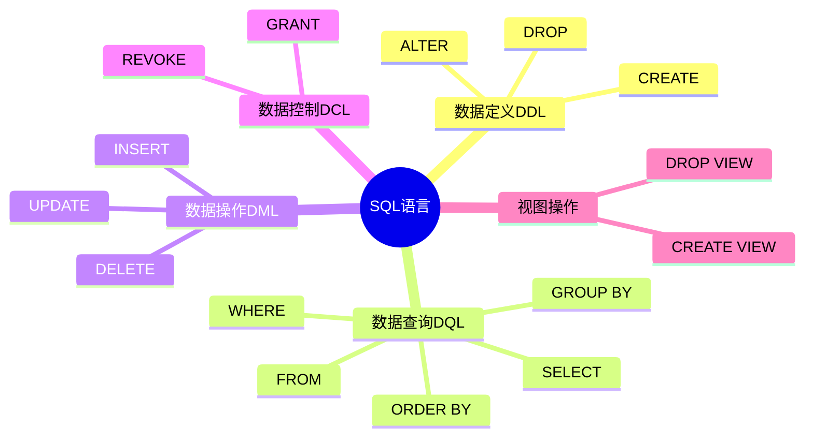
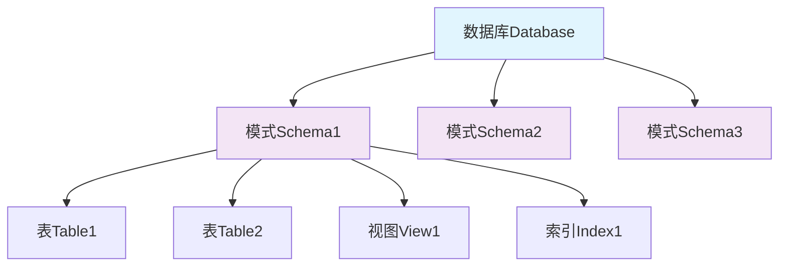
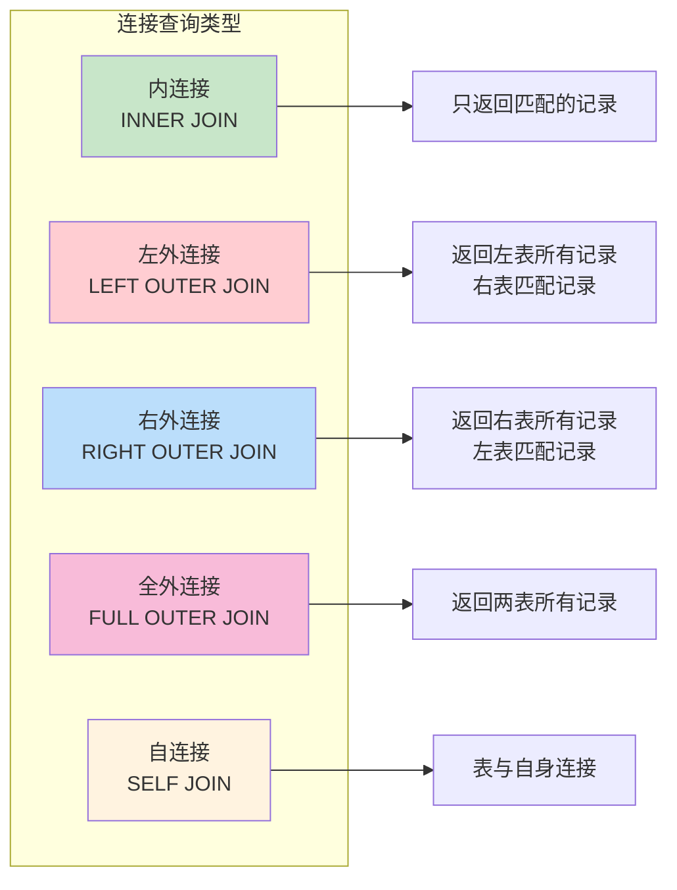
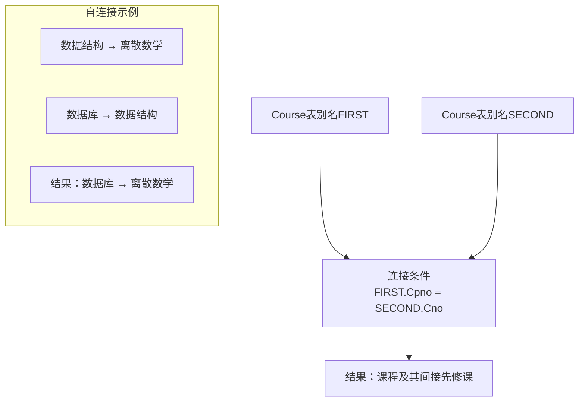
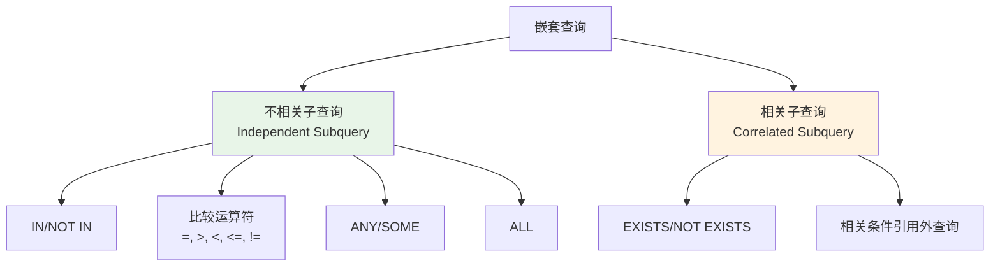
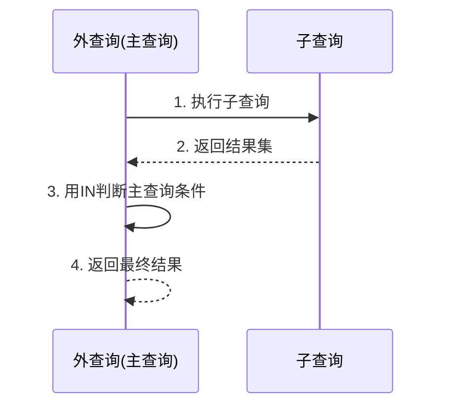

# 第3章 关系数据库标准语言SQL

## 学习目标
- 掌握SQL语言的基本概念和特点
- 熟练掌握SQL的数据定义功能
- 熟练掌握SQL的数据查询功能
- 掌握SQL的数据更新功能
- 了解视图的概念和使用方法
- 能够编写复杂的SQL查询语句



## 3.1 SQL概述

### 3.1.1 SQL的产生与发展
- **1974年**：IBM开始System R项目，开发了SEQUEL语言
- **1982年**：IBM发布SQL/DS
- **1986年**：SQL成为ANSI标准（SQL-86）
- **1989年**：SQL-89（SQL1）
- **1992年**：SQL-92（SQL2）
- **1999年**：SQL:1999（SQL3）
- **2003年**：SQL:2003
- **2006年**：SQL:2006

### 3.1.2 SQL的特点
1. **综合统一**
   - 集数据定义语言（DDL）、数据操纵语言（DML）、数据控制语言（DCL）功能于一体

2. **高度非过程化**
   - 只需提出"做什么"，无须指明"怎么做"

3. **面向集合的操作方式**
   - 操作对象是集合，结果也是集合

4. **以同一种语法结构提供多种使用方式**
   - 可以独立使用
   - 可以嵌入到高级语言中使用

5. **语言简洁，易学易用**

### 3.1.3 SQL的基本概念
| SQL术语 | 关系数据库术语 |
|---------|----------------|
| 表（Table） | 关系（Relation） |
| 行（Row） | 元组（Tuple） |
| 列（Column） | 属性（Attribute） |

## 3.2 数据定义

### 3.2.1 模式的定义与删除



#### 定义模式
```sql
CREATE SCHEMA <模式名> AUTHORIZATION <用户名>;
```

**示例：**
```sql
CREATE SCHEMA "S-T" AUTHORIZATION WANG;
```

#### 删除模式
```sql
DROP SCHEMA <模式名> <CASCADE|RESTRICT>;
```
- CASCADE（级联）：删除模式的同时把该模式中所有的数据库对象全部删除
- RESTRICT（限制）：如果该模式中定义了下属的数据库对象，则拒绝该删除语句的执行

### 3.2.2 基本表的定义、删除与修改

#### 定义基本表
```sql
CREATE TABLE <表名>
(
    <列名> <数据类型> [列级完整性约束条件],
    <列名> <数据类型> [列级完整性约束条件],
    ...
    [表级完整性约束条件]
);
```

**常用数据类型：**
- CHAR(n)：长度为n的定长字符串
- VARCHAR(n)：最大长度为n的变长字符串
- CLOB：字符串大对象
- BLOB：二进制大对象
- INT：长整数（4字节）
- SMALLINT：短整数（2字节）
- BIGINT：大整数（8字节）
- NUMERIC(p,d)：定点数，p位数字，d位小数
- DECIMAL(p,d)：同NUMERIC
- REAL：取决于机器精度的单精度浮点数
- DOUBLE PRECISION：取决于机器精度的双精度浮点数
- FLOAT(n)：可选精度的浮点数，精度至少为n位数字
- BOOLEAN：逻辑布尔量
- DATE：日期，包含年、月、日
- TIME：时间，包含时、分、秒
- TIMESTAMP：时间戳类型
- INTERVAL：时间间隔类型

**示例：**
```sql
CREATE TABLE Student
(
    Sno    CHAR(9) PRIMARY KEY,
    Sname  CHAR(20) UNIQUE,
    Ssex   CHAR(2),
    Sage   SMALLINT,
    Sdept  CHAR(20)
);

CREATE TABLE Course
(
    Cno      CHAR(4) PRIMARY KEY,
    Cname    CHAR(40) NOT NULL,
    Cpno     CHAR(4),
    Ccredit  SMALLINT,
    FOREIGN KEY (Cpno) REFERENCES Course(Cno)
);

CREATE TABLE SC
(
    Sno    CHAR(9),
    Cno    CHAR(4),
    Grade  SMALLINT,
    PRIMARY KEY (Sno, Cno),
    FOREIGN KEY (Sno) REFERENCES Student(Sno),
    FOREIGN KEY (Cno) REFERENCES Course(Cno)
);
```

#### 修改基本表
```sql
ALTER TABLE <表名>
[ADD [COLUMN] <新列名> <数据类型> [完整性约束]]
[ADD <表级完整性约束>]
[DROP [COLUMN] <列名> [CASCADE|RESTRICT]]
[DROP CONSTRAINT <完整性约束名> [RESTRICT|CASCADE]]
[ALTER COLUMN <列名> <数据类型>];
```

**示例：**
```sql
-- 向Student表增加"入学时间"列
ALTER TABLE Student ADD S_entrance DATE;

-- 将年龄的数据类型改为INT
ALTER TABLE Student ALTER COLUMN Sage INT;

-- 增加课程名称必须取唯一值的约束条件
ALTER TABLE Course ADD UNIQUE(Cname);
```

#### 删除基本表
```sql
DROP TABLE <表名> [RESTRICT|CASCADE];
```

### 3.2.3 索引的建立与删除

#### 建立索引
```sql
CREATE [UNIQUE] [CLUSTER] INDEX <索引名>
ON <表名>(<列名>[<次序>][,<列名>[<次序>]]...);
```

**示例：**
```sql
-- 为学生-课程表SC按学号升序建唯一索引
CREATE UNIQUE INDEX SCno ON SC(Sno ASC);

-- 为学生表Student按姓名建唯一索引
CREATE UNIQUE INDEX Stusname ON Student(Sname);

-- 为课程表Course按课程号建唯一索引
CREATE UNIQUE INDEX Coucno ON Course(Cno);

-- 为学生-课程表SC按学号升序和课程号降序建唯一索引
CREATE UNIQUE INDEX SCno ON SC(Sno ASC, Cno DESC);
```

#### 修改索引
```sql
ALTER INDEX <旧索引名> RENAME TO <新索引名>;
```

#### 删除索引
```sql
DROP INDEX <索引名>;
```

## 3.3 数据查询

### 3.3.1 单表查询

#### 基本查询结构
```sql
SELECT [ALL|DISTINCT] <目标列表达式>[,<目标列表达式>]...
FROM <表名或视图名>[,<表名或视图名>]...
[WHERE <条件表达式>]
[GROUP BY <列名1>[HAVING <条件表达式>]]
[ORDER BY <列名2>[ASC|DESC]];
```

#### 选择表中的若干列

**查询指定列：**
```sql
-- 查询全体学生的学号与姓名
SELECT Sno, Sname FROM Student;
```

**查询全部列：**
```sql
-- 查询全体学生的详细记录
SELECT * FROM Student;
-- 等价于
SELECT Sno, Sname, Ssex, Sage, Sdept FROM Student;
```

**查询经过计算的值：**
```sql
-- 查询全体学生的姓名及其出生年份
SELECT Sname, 2023-Sage FROM Student;

-- 查询全体学生的姓名、出生年份和所在的院系，要求用小写字母表示系名
SELECT Sname, 'Year of Birth:', 2023-Sage, LOWER(Sdept)
FROM Student;
```

#### 选择表中的若干元组

**消除取值重复的行：**
```sql
-- 查询选修了课程的学生学号
SELECT DISTINCT Sno FROM SC;
```

**查询满足条件的元组：**

**比较大小：**
```sql
-- 查询计算机科学系全体学生的名单
SELECT Sname FROM Student WHERE Sdept='CS';

-- 查询所有年龄在20岁以下的学生姓名及其年龄
SELECT Sname, Sage FROM Student WHERE Sage < 20;

-- 查询考试成绩有不及格的学生的学号
SELECT DISTINCT Sno FROM SC WHERE Grade < 60;
```

**确定范围：**
```sql
-- 查询年龄在20~23岁（包括20岁和23岁）之间的学生的姓名、系别和年龄
SELECT Sname, Sdept, Sage
FROM Student
WHERE Sage BETWEEN 20 AND 23;

-- 查询年龄不在20~23岁之间的学生姓名、系别和年龄
SELECT Sname, Sdept, Sage
FROM Student
WHERE Sage NOT BETWEEN 20 AND 23;
```

**确定集合：**
```sql
-- 查询计算机科学系（CS）、数学系（MA）和信息系（IS）学生的姓名和性别
SELECT Sname, Ssex
FROM Student
WHERE Sdept IN ('CS', 'MA', 'IS');

-- 查询既不是计算机科学系、也不是数学系、也不是信息系的学生的姓名和性别
SELECT Sname, Ssex
FROM Student
WHERE Sdept NOT IN ('CS', 'MA', 'IS');
```

**字符匹配：**
```sql
-- 查询学号为201215121的学生的详细情况
SELECT * FROM Student WHERE Sno LIKE '201215121';

-- 查询所有姓刘学生的姓名、学号和性别
SELECT Sname, Sno, Ssex FROM Student WHERE Sname LIKE '刘%';

-- 查询姓"欧阳"且全名为三个汉字的学生的姓名
SELECT Sname FROM Student WHERE Sname LIKE '欧阳_';

-- 查询名字中第2个字为"阳"字的学生的姓名和学号
SELECT Sname, Sno FROM Student WHERE Sname LIKE '_阳%';

-- 查询所有不姓刘的学生姓名、学号和性别
SELECT Sname, Sno, Ssex FROM Student WHERE Sname NOT LIKE '刘%';
```

**涉及空值的查询：**
```sql
-- 查询缺少成绩的学生的学号和相应的课程号
SELECT Sno, Cno FROM SC WHERE Grade IS NULL;

-- 查询所有有成绩的学生学号和课程号
SELECT Sno, Cno FROM SC WHERE Grade IS NOT NULL;
```

**多重条件查询：**
```sql
-- 查询计算机科学系年龄在20岁以下的学生姓名
SELECT Sname
FROM Student
WHERE Sdept='CS' AND Sage<20;

-- 查询选修了3号课程的学生的学号及其成绩，查询结果按分数降序排列
SELECT Sno, Grade
FROM SC
WHERE Cno='3'
ORDER BY Grade DESC;
```

#### ORDER BY子句
```sql
-- 查询选修了3号课程的学生的学号及其成绩，查询结果按分数降序排列
SELECT Sno, Grade
FROM SC
WHERE Cno='3'
ORDER BY Grade DESC;

-- 查询全体学生情况，查询结果按所在系的系号升序排列，同一系中的学生按年龄降序排列
SELECT *
FROM Student
ORDER BY Sdept, Sage DESC;
```

### 3.3.2 聚集函数

**常用聚集函数：**
- COUNT(*)：统计元组个数
- COUNT([DISTINCT|ALL] <列名>)：统计一列中值的个数
- SUM([DISTINCT|ALL] <列名>)：计算一列值的总和（数值型）
- AVG([DISTINCT|ALL] <列名>)：计算一列值的平均值（数值型）
- MAX([DISTINCT|ALL] <列名>)：求一列值中的最大值
- MIN([DISTINCT|ALL] <列名>)：求一列值中的最小值

**示例：**
```sql
-- 查询学生总人数
SELECT COUNT(*) FROM Student;

-- 查询选修了课程的学生人数
SELECT COUNT(DISTINCT Sno) FROM SC;

-- 计算1号课程的学生平均成绩
SELECT AVG(Grade) FROM SC WHERE Cno='1';

-- 查询选修1号课程的学生最高分数
SELECT MAX(Grade) FROM SC WHERE Cno='1';

-- 查询学生201215012选修课程的总学分数
SELECT SUM(Ccredit)
FROM SC, Course
WHERE Sno='201215012' AND SC.Cno=Course.Cno;
```

### 3.3.3 GROUP BY子句

```sql
-- 求各个课程号及相应的选课人数
SELECT Cno, COUNT(Sno)
FROM SC
GROUP BY Cno;

-- 查询选修了3门以上课程的学生学号
SELECT Sno
FROM SC
GROUP BY Sno
HAVING COUNT(*) > 3;

-- 查询平均成绩大于等于90分的学生学号和平均成绩
SELECT Sno, AVG(Grade)
FROM SC
GROUP BY Sno
HAVING AVG(Grade) >= 90;
```

### 3.3.4 连接查询



#### 等值与非等值连接查询
```sql
-- 查询每个学生及其选修课程的情况
SELECT Student.*, SC.*
FROM Student, SC
WHERE Student.Sno = SC.Sno;

-- 查询选修2号课程且成绩在90分以上的所有学生的学号和姓名
SELECT Student.Sno, Sname
FROM Student, SC
WHERE Student.Sno = SC.Sno AND SC.Cno='2' AND SC.Grade > 90;
```

#### 自身连接
```sql
-- 查询每一门课的间接先修课（即先修课的先修课）
SELECT FIRST.Cno, SECOND.Cpno
FROM Course FIRST, Course SECOND
WHERE FIRST.Cpno = SECOND.Cno;
```



#### 外连接
```sql
-- 查询每个学生及其选修课程的情况（包括没有选修任何课程的学生）
SELECT Student.Sno, Sname, Ssex, Sage, Sdept, Cno, Grade
FROM Student LEFT OUTER JOIN SC ON (Student.Sno=SC.Sno);
```

#### 多表连接
```sql
-- 查询每个学生的学号、姓名、选修的课程名及成绩
SELECT Student.Sno, Sname, Cname, Grade
FROM Student, SC, Course
WHERE Student.Sno = SC.Sno AND SC.Cno = Course.Cno;
```

### 3.3.5 嵌套查询



#### 带有IN谓词的子查询
```sql
-- 查询与"刘晨"在同一个系学习的学生
SELECT Sno, Sname, Sdept
FROM Student
WHERE Sdept IN
    (SELECT Sdept
     FROM Student
     WHERE Sname='刘晨');
```



#### 带有比较运算符的子查询
```sql
-- 找出每个学生超过他选修课程平均成绩的课程号
SELECT Sno, Cno
FROM SC x
WHERE Grade >= (SELECT AVG(Grade)
                FROM SC y
                WHERE y.Sno = x.Sno);
```

#### 带有ANY（SOME）或ALL谓词的子查询
```sql
-- 查询非计算机科学系中比计算机科学系任意一个学生年龄小的学生姓名和年龄
SELECT Sname, Sage
FROM Student
WHERE Sage < ANY (SELECT Sage
                  FROM Student
                  WHERE Sdept='CS')
AND Sdept <> 'CS';

-- 查询非计算机科学系中比计算机科学系所有学生年龄都小的学生姓名及年龄
SELECT Sname, Sage
FROM Student
WHERE Sage < ALL (SELECT Sage
                  FROM Student
                  WHERE Sdept='CS')
AND Sdept <> 'CS';
```

```mermaid
graph LR
    A[ANY/SOME] --> A1[与子查询结果中<br/>任意一个值比较为真]
    B[ALL] --> B1[与子查询结果中<br/>所有值比较都为真]
    
    subgraph "示例"
        C[< ANY (20,25,30)] --> C1[< 30 为真]
        D[< ALL (20,25,30)] --> D1[< 20 为真]
    end
```

#### 带有EXISTS谓词的子查询
```sql
-- 查询所有选修了1号课程的学生姓名
SELECT Sname
FROM Student
WHERE EXISTS
    (SELECT *
     FROM SC
     WHERE Sno=Student.Sno AND Cno='1');

-- 查询没有选修1号课程的学生姓名
SELECT Sname
FROM Student
WHERE NOT EXISTS
    (SELECT *
     FROM SC
     WHERE Sno=Student.Sno AND Cno='1');
```

## 3.4 数据更新

### 3.4.1 插入数据

#### 插入元组
```sql
INSERT INTO <表名> [(<属性列1>[,<属性列2>]...)]
VALUES (<常量1>[,<常量2>]...);
```

**示例：**
```sql
-- 将一个新学生元组（学号：201215128；姓名：陈冬；性别：男；所在系：IS；年龄：18岁）插入到Student表中
INSERT INTO Student (Sno, Sname, Ssex, Sdept, Sage)
VALUES ('201215128', '陈冬', '男', 'IS', 18);

-- 将学生201215126选修1号课程的成绩80分插入到SC表中
INSERT INTO SC (Sno, Cno, Grade)
VALUES ('201215126', '1', 80);
```

#### 插入子查询结果
```sql
-- 对每一个系，求学生的平均年龄，并把结果存入数据库
CREATE TABLE Dept_age
(
    Sdept CHAR(15),
    Avg_age SMALLINT
);

INSERT INTO Dept_age(Sdept, Avg_age)
SELECT Sdept, AVG(Sage)
FROM Student
GROUP BY Sdept;
```

### 3.4.2 修改数据
```sql
UPDATE <表名>
SET <列名>=<表达式>[,<列名>=<表达式>]...
[WHERE <条件>];
```

**示例：**
```sql
-- 将学生201215121的年龄改为22岁
UPDATE Student
SET Sage=22
WHERE Sno='201215121';

-- 将所有学生的年龄增加1岁
UPDATE Student
SET Sage=Sage+1;

-- 将计算机科学系全体学生的成绩置零
UPDATE SC
SET Grade=0
WHERE Sno IN
    (SELECT Sno
     FROM Student
     WHERE Sdept='CS');
```

### 3.4.3 删除数据
```sql
DELETE FROM <表名>
[WHERE <条件>];
```

**示例：**
```sql
-- 删除学号为201215128的学生记录
DELETE FROM Student
WHERE Sno='201215128';

-- 删除所有的学生选课记录
DELETE FROM SC;

-- 删除计算机科学系所有学生的选课记录
DELETE FROM SC
WHERE Sno IN
    (SELECT Sno
     FROM Student
     WHERE Sdept='CS');
```

## 3.5 视图

### 3.5.1 定义视图
```sql
CREATE VIEW <视图名> [(<列名>[,<列名>]...)]
AS <子查询>
[WITH CHECK OPTION];
```

**示例：**
```sql
-- 建立信息系学生的视图
CREATE VIEW IS_Student
AS
SELECT Sno, Sname, Sage
FROM Student
WHERE Sdept='IS';

-- 建立信息系选修了1号课程的学生的视图
CREATE VIEW IS_S1(Sno, Sname, Grade)
AS
SELECT Student.Sno, Sname, Grade
FROM Student, SC
WHERE Sdept='IS' AND Student.Sno=SC.Sno AND SC.Cno='1';

-- 建立信息系选修了1号课程且成绩在90分以上的学生的视图
CREATE VIEW IS_S2
AS
SELECT Sno, Sname, Grade
FROM IS_S1
WHERE Grade >= 90;

-- 定义一个反映学生出生年份的视图
CREATE VIEW BT_S(Sno, Sname, Sbirth)
AS
SELECT Sno, Sname, 2023-Sage
FROM Student;

-- 将学生的学号及平均成绩定义为一个视图
CREATE VIEW S_G(Sno, Gavg)
AS
SELECT Sno, AVG(Grade)
FROM SC
GROUP BY Sno;
```

### 3.5.2 删除视图
```sql
DROP VIEW <视图名> [CASCADE];
```

**示例：**
```sql
-- 删除视图BT_S和IS_S1
DROP VIEW BT_S;
DROP VIEW IS_S1 CASCADE;
```

### 3.5.3 查询视图
```sql
-- 在信息系学生的视图中找出年龄小于20岁的学生
SELECT Sno, Sage
FROM IS_Student
WHERE Sage < 20;

-- 查询选修了1号课程的信息系学生
SELECT IS_Student.Sno, Sname
FROM IS_Student, SC
WHERE IS_Student.Sno = SC.Sno AND SC.Cno='1';
```

### 3.5.4 更新视图
```sql
-- 将信息系学生视图IS_Student中学号为201215122的学生姓名改为"刘辰"
UPDATE IS_Student
SET Sname='刘辰'
WHERE Sno='201215122';

-- 向信息系学生视图IS_Student中插入一个新的学生记录
INSERT INTO IS_Student
VALUES('201215129', '赵新', 20);

-- 删除信息系学生视图IS_Student中学号为201215129的记录
DELETE FROM IS_Student
WHERE Sno='201215129';
```

## 🎯 学习检查点

- [ ] 掌握SQL的基本语法结构
- [ ] 熟练使用DDL语句创建和修改表结构
- [ ] 掌握各种查询语句的使用
- [ ] 能够使用聚集函数和分组查询
- [ ] 理解连接查询和嵌套查询
- [ ] 掌握数据更新操作
- [ ] 了解视图的概念和使用

## 💡 综合练习

基于以下表结构完成练习：
- Student(Sno, Sname, Ssex, Sage, Sdept)
- Course(Cno, Cname, Cpno, Ccredit)
- SC(Sno, Cno, Grade)

**练习题：**
1. 查询选修了全部课程的学生姓名
2. 查询至少选修了学生201215122选修的全部课程的学生号码
3. 查询计算机科学系的学生及年龄不大于19岁的学生
4. 查询选修课程数目超过3门的学生学号

---
**上一章：** [第2章 关系数据库](第2章_关系数据库.md)  
**下一章：** [第4章 数据库安全性](第4章_数据库安全性.md)