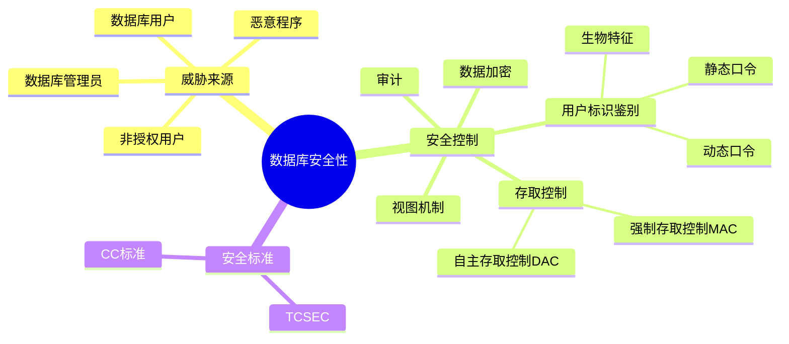
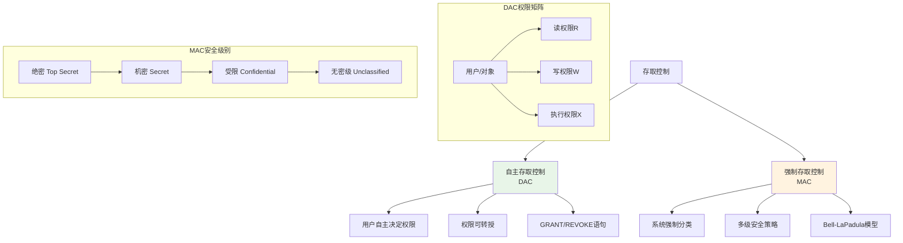
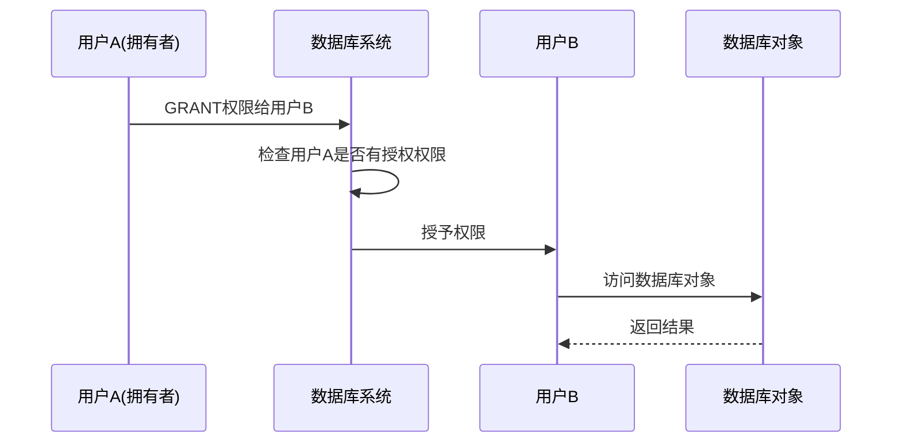

# 第4章 数据库安全性

## 学习目标
- 了解数据库安全性的基本概念
- 掌握数据库安全性控制的主要方法
- 理解用户标识与鉴别的重要性
- 掌握存取控制的基本原理和方法
- 了解视图机制在安全性控制中的作用
- 理解审计、数据加密等安全技术



## 4.1 数据库安全性概述

### 4.1.1 数据库的不安全因素
1. **非授权用户对数据库的恶意存取和破坏**
   - 一些黑客和犯罪分子在用户存取数据库时猎取用户名和用户口令
   - 非法登录数据库系统

2. **数据库中重要或敏感的数据被泄露**
   - 数据在传输过程中被截获
   - 通过多次合法查询数据库从中推导出一些保密数据

3. **安全环境的脆弱性**
   - 数据库的管理系统的漏洞被利用
   - 管理员安全配置不当

### 4.1.2 安全标准简介
**TCSEC/TDI标准**
- D级：最小保护级
- C级：自主保护级
  - C1：自主安全保护
  - C2：受控的存取保护
- B级：强制保护级
  - B1：标记的安全保护
  - B2：结构化保护
  - B3：安全域
- A级：验证保护级
  - A1：验证设计

**CC标准**
- 功能类（Functional Class）
- 保证类（Assurance Class）

## 4.2 数据库安全性控制

### 4.2.1 用户身份鉴别
**身份鉴别方法：**
1. **静态口令鉴别**
   - 用户名/口令方式
   - 口令需要定期更换

2. **动态口令鉴别**
   - 一次性口令
   - 短信密码

3. **生物特征鉴别**
   - 指纹识别
   - 虹膜识别
   - 声纹识别

4. **智能卡鉴别**
   - IC卡
   - USB Key

### 4.2.2 存取控制



**存取控制机制组成：**
- 定义用户权限，并将用户权限登记到数据字典中
- 合法权限检查

**存取控制方法：**
1. **自主存取控制（DAC）**
   - 用户对于不同的数据库对象有不同的存取权限
   - 不同的用户对同一对象也有不同的权限
   - 用户还可将其拥有的存取权限转授给其他用户



2. **强制存取控制（MAC）**
   - 每一个数据库对象被标以一定的密级
   - 每一个用户也被授予某一个级别的许可证
   - 对于任意一个对象，只有具有合法许可证的用户才可以存取

### 4.2.3 自主存取控制方法

#### 授权：授予与收回
**GRANT语句的一般格式：**
```sql
GRANT <权限>[,<权限>]...
ON <对象类型> <对象名>[,<对象类型> <对象名>]...
TO <用户>[,<用户>]...
[WITH GRANT OPTION];
```

**权限类型：**
- SELECT：查询数据
- INSERT：插入数据
- UPDATE：修改数据
- DELETE：删除数据
- ALL PRIVILEGES：所有权限

**示例：**
```sql
-- 把查询Student表权限授给用户U1
GRANT SELECT
ON TABLE Student
TO U1;

-- 把对Student表和Course表的全部权限授予用户U2和U3
GRANT ALL PRIVILEGES
ON TABLE Student, Course
TO U2, U3;

-- 把对表SC的查询权限授予所有用户
GRANT SELECT
ON TABLE SC
TO PUBLIC;

-- 把查询Student表和修改学生学号的权限授给用户U4
GRANT SELECT, UPDATE(Sno)
ON TABLE Student
TO U4;

-- 把对表SC的INSERT权限授予U5用户，并允许他再将此权限授予其他用户
GRANT INSERT
ON TABLE SC
TO U5
WITH GRANT OPTION;
```

**REVOKE语句的一般格式：**
```sql
REVOKE <权限>[,<权限>]...
ON <对象类型> <对象名>[,<对象类型> <对象名>]...
FROM <用户>[,<用户>]...
[CASCADE|RESTRICT];
```

**示例：**
```sql
-- 把用户U4修改学生学号的权限收回
REVOKE UPDATE(Sno)
ON TABLE Student
FROM U4;

-- 收回所有用户对表SC的查询权限
REVOKE SELECT
ON TABLE SC
FROM PUBLIC;

-- 把用户U5对SC表的INSERT权限收回
REVOKE INSERT
ON TABLE SC
FROM U5 CASCADE;
```

#### 创建数据库模式的权限
```sql
-- 创建用户WANG，并为其分配创建模式的权限
CREATE USER WANG
[WITH] [DBA|RESOURCE|CONNECT];
```

**用户权限：**
- DBA：数据库管理员
- RESOURCE：创建基本表和视图，成为所创建对象的属主
- CONNECT：登录数据库

#### 数据库角色
**创建角色：**
```sql
CREATE ROLE <角色名>;
```

**给角色授权：**
```sql
GRANT <权限>[,<权限>]...
ON <对象类型><对象名>
TO <角色>[,<角色>]...;
```

**将一个角色授予其他的角色或用户：**
```sql
GRANT <角色1>[,<角色2>]...
TO <角色3>[,<用户1>]...
[WITH ADMIN OPTION];
```

**收回角色：**
```sql
REVOKE <角色>[,<角色>]...
FROM <角色>[,<用户>]...;
```

**示例：**
```sql
-- 通过角色来实现将一组权限授予一个用户
-- 首先创建一个角色R1
CREATE ROLE R1;

-- 然后使用GRANT语句，使角色R1拥有Student表的SELECT、UPDATE、INSERT权限
GRANT SELECT, UPDATE, INSERT
ON TABLE Student
TO R1;

-- 将这个角色授予王平，张明，赵玲。使他们具有角色R1所包含的全部权限
GRANT R1
TO 王平, 张明, 赵玲;

-- 可以一次性通过R1来回收王平的这3个权限
REVOKE R1
FROM 王平;
```

### 4.2.4 强制存取控制方法

**敏感度标记：**
- 绝密（Top Secret，TS）
- 机密（Secret，S）
- 可信（Confidential，C）
- 无分类（Unclassified，U）

**强制存取控制规则：**
1. 仅当主体的许可证级别大于或等于客体的密级时，该主体才能读相应的客体
2. 仅当主体的许可证级别小于或等于客体的密级时，该主体才能写相应的客体

## 4.3 视图机制

### 4.3.1 为不同的用户定义不同的视图
```sql
-- 建立计算机系学生的视图
CREATE VIEW CS_Student
AS
SELECT *
FROM Student
WHERE Sdept='CS';

-- 建立计算机系选修了1号课程的学生的视图
CREATE VIEW CS_S1
AS
SELECT Sno, Sname, Grade
FROM Student, SC
WHERE Sdept='CS' AND Student.Sno=SC.Sno AND SC.Cno='1';
```

### 4.3.2 在视图上进一步定义存取权限
```sql
-- 在视图CS_Student上进一步定义存取权限
GRANT SELECT
ON CS_Student
TO 王平;

GRANT ALL
ON CS_Student
TO 张明;
```

## 4.4 审计

### 4.4.1 审计的基本概念
**审计（Auditing）**：启用一个专用的审计日志（Audit Log），将用户对数据库的所有操作记录在上面

**审计的用途：**
- 重现导致数据库现有状况的一系列事件
- 找出非法存取数据的人、时间和内容等
- 为维护数据库安全提供依据

### 4.4.2 AUDIT语句和NOAUDIT语句
**AUDIT语句：**
```sql
AUDIT ALTER, UPDATE
ON SC;
```

**NOAUDIT语句：**
```sql
NOAUDIT ALTER, UPDATE
ON SC;
```

## 4.5 数据加密

### 4.5.1 数据加密概述
**数据加密的基本思想：**
根据一定的算法将原始数据——"明文"变换为不可直接识别的格式——"密文"，从而使得不知道解密算法的人无法获知数据的内容

### 4.5.2 加密技术分类

#### 对称加密
**特点：**
- 加密密钥和解密密钥相同
- 加密解密速度快
- 密钥分发困难

**常用算法：**
- DES（Data Encryption Standard）
- AES（Advanced Encryption Standard）

#### 非对称加密
**特点：**
- 使用公钥和私钥
- 加密解密速度慢
- 密钥分发容易

**常用算法：**
- RSA
- ECC（Elliptic Curve Cryptography）

### 4.5.3 在数据库中的应用
```sql
-- 创建加密表
CREATE TABLE Customer
(
    CustomerID INT,
    CustomerName VARCHAR(50),
    CreditCard VARBINARY(256)  -- 加密存储信用卡号
);

-- 插入加密数据
INSERT INTO Customer VALUES
(1, 'John Doe', EncryptByKey(Key_GUID('CustomerKey'), '1234-5678-9012-3456'));

-- 查询解密数据
SELECT CustomerID, CustomerName,
       CONVERT(VARCHAR, DecryptByKey(CreditCard)) AS CreditCard
FROM Customer;
```

## 4.6 其他安全性保护

### 4.6.1 推理控制
**推理**：用户利用能够访问的数据，推导出不能直接访问的数据

**推理控制方法：**
- 对敏感数据进行分级
- 多实例对象
- 查询限制
- 加噪声
- 数据交换

### 4.6.2 隐蔽信道
**隐蔽信道**：允许进程以违反系统安全策略的方式传输信息的通信信道

**防范方法：**
- 通过形式化的方法证明系统中不存在隐蔽信道
- 通过噪声使隐蔽信道的信道容量降到很低的水平
- 检测隐蔽信道的存在

### 4.6.3 数据隐私保护
**k-匿名**：发布的数据中任意一条记录都不能被区别于不少于k-1条其他记录

**l-多样性**：每个等价类中敏感属性至少有l个不同的值

**t-接近性**：每个等价类中敏感属性的分布与整个数据集中该属性的分布差异不超过阈值t

## 📊 数据库安全性体系结构

```
数据库安全性
├── 用户身份鉴别
│   ├── 静态口令
│   ├── 动态口令
│   ├── 生物特征
│   └── 智能卡
├── 存取控制
│   ├── 自主存取控制(DAC)
│   └── 强制存取控制(MAC)
├── 视图机制
├── 审计
├── 数据加密
│   ├── 对称加密
│   └── 非对称加密
└── 其他保护
    ├── 推理控制
    ├── 隐蔽信道
    └── 隐私保护
```

## 🎯 学习检查点

- [ ] 理解数据库安全性的重要性和威胁
- [ ] 掌握用户身份鉴别的各种方法
- [ ] 熟练使用GRANT和REVOKE语句
- [ ] 理解自主存取控制和强制存取控制的区别
- [ ] 了解数据库角色的概念和使用
- [ ] 掌握视图在安全性控制中的作用
- [ ] 了解审计和数据加密技术

## 💡 实践练习

1. **权限管理练习：**
   - 创建不同的用户和角色
   - 为用户分配不同的权限
   - 练习权限的授予和收回

2. **视图安全练习：**
   - 创建不同的视图限制用户访问
   - 在视图上设置权限

3. **审计练习：**
   - 启用数据库审计功能
   - 分析审计日志

## 🔒 安全最佳实践

1. **最小权限原则**：用户只应该拥有完成其工作所必需的最小权限
2. **定期审查权限**：定期检查和更新用户权限
3. **强密码策略**：实施强密码策略和定期更换
4. **数据分类**：对敏感数据进行分类和标记
5. **监控和审计**：实施全面的监控和审计机制
6. **加密保护**：对敏感数据进行加密存储和传输
7. **备份安全**：确保备份数据的安全性

---
**上一章：** [第3章 关系数据库标准语言SQL](第3章_关系数据库标准语言SQL.md)  
**下一章：** [第5章 数据库完整性](第5章_数据库完整性.md)