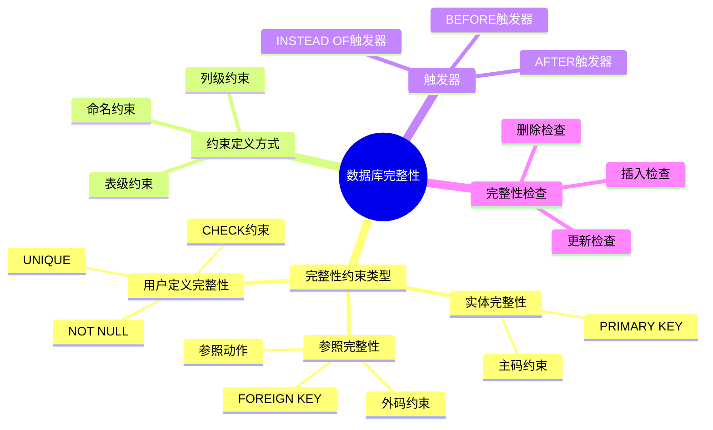
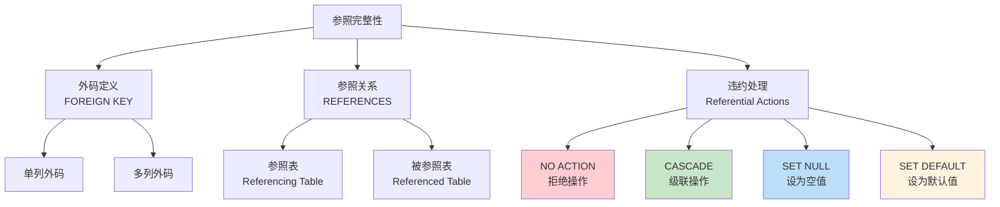
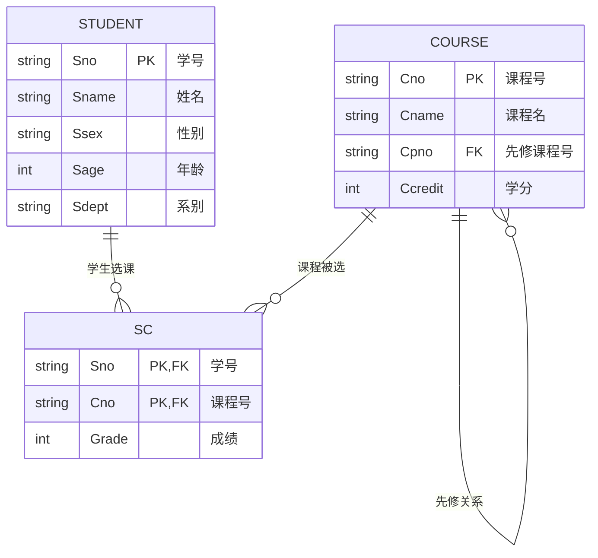
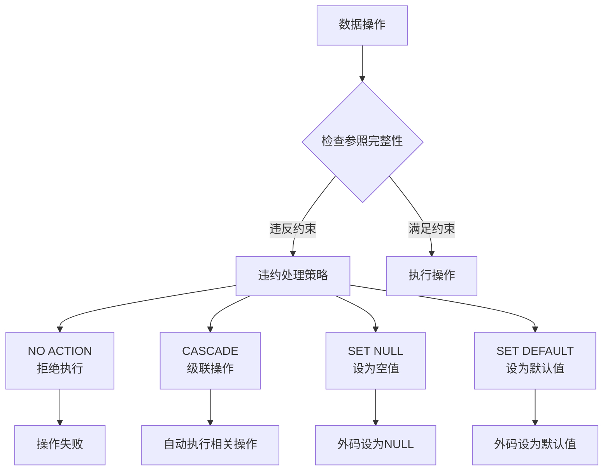
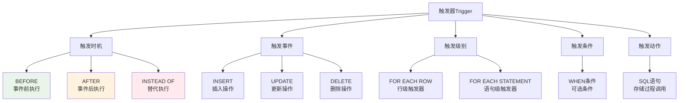
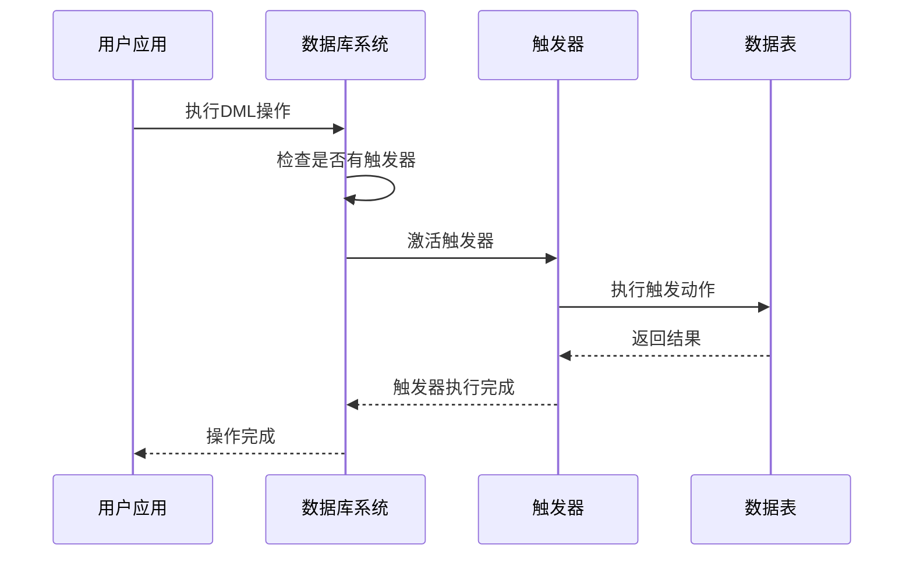

# 第5章 数据库完整性

## 📚 本章学习目标
- 理解数据库完整性的概念和意义
- 掌握实体完整性的定义和维护
- 掌握参照完整性的定义和维护
- 学会定义和使用用户定义的完整性
- 了解完整性约束命名子句
- 掌握域中完整性限制的定义
- 了解触发器的概念和使用



## 5.1 完整性约束条件

### 5.1.1 数据库完整性概述
**数据库的完整性（Integrity）**：数据库中数据的正确性和相容性

**数据的正确性**：数据是符合现实世界语义、反映当前实际状况的

**数据的相容性**：数据库同一对象在不同关系表中的数据是符合逻辑的

**完整性约束条件的作用对象：**
- 列级约束条件：对某个特定属性的约束
- 元组约束条件：对元组的约束
- 关系约束条件：对关系的约束

### 5.1.2 完整性约束条件的分类
1. **静态约束条件**
   - 列约束
   - 表约束

2. **动态约束条件**
   - 触发器

## 5.2 实体完整性

### 5.2.1 实体完整性定义
**实体完整性规则**：若属性A是基本关系R的主属性，则属性A不能取空值

### 5.2.2 实体完整性的SQL实现

#### 主码约束
**列级约束条件：**
```sql
CREATE TABLE Student
(
    Sno CHAR(9) PRIMARY KEY,  -- 列级完整性约束条件，Sno是主码
    Sname CHAR(20) NOT NULL,  -- Sname属性不能取空值
    Ssex CHAR(2),
    Sage SMALLINT,
    Sdept CHAR(20)
);
```

**表级约束条件：**
```sql
CREATE TABLE Student
(
    Sno CHAR(9),
    Sname CHAR(20) NOT NULL,
    Ssex CHAR(2),
    Sage SMALLINT,
    Sdept CHAR(20),
    PRIMARY KEY (Sno)  -- 表级完整性约束条件，Sno是主码
);
```

**复合主码：**
```sql
CREATE TABLE SC
(
    Sno CHAR(9) NOT NULL,
    Cno CHAR(4) NOT NULL,
    Grade SMALLINT,
    PRIMARY KEY (Sno, Cno)  -- 表级完整性约束条件，(Sno, Cno)是主码
);
```

### 5.2.3 实体完整性检查和违约处理
**检查时机：**
- INSERT语句
- UPDATE语句

**违约处理：**
- 拒绝（NO ACTION）执行该操作

## 5.3 参照完整性



### 5.3.1 参照完整性定义
**参照完整性规则**：若属性（或属性组）F是基本关系R的外码，它与基本关系S的主码Ks相对应，则对于R中每个元组在F上的值必须为：
- 或者取空值（F的每个属性值均为空值）
- 或者等于S中某个元组的主码值

### 5.3.2 参照完整性的SQL实现

#### 外码约束
```sql
CREATE TABLE SC
(
    Sno CHAR(9) NOT NULL,
    Cno CHAR(4) NOT NULL,
    Grade SMALLINT,
    PRIMARY KEY (Sno, Cno),
    FOREIGN KEY (Sno) REFERENCES Student(Sno),  -- 表级完整性约束条件，Sno是外码，被参照表是Student
    FOREIGN KEY (Cno) REFERENCES Course(Cno)   -- 表级完整性约束条件，Cno是外码，被参照表是Course
);
```



**在列级定义外码：**
```sql
CREATE TABLE SC
(
    Sno CHAR(9) NOT NULL REFERENCES Student(Sno),
    Cno CHAR(4) NOT NULL REFERENCES Course(Cno),
    Grade SMALLINT,
    PRIMARY KEY (Sno, Cno)
);
```

### 5.3.3 参照完整性检查和违约处理

#### 可能破坏参照完整性的情况
1. **在参照表中插入元组**
2. **修改参照表中外码值**
3. **删除被参照表中的元组**
4. **修改被参照表中主码值**



#### 违约处理策略
**拒绝（NO ACTION）策略：**
```sql
CREATE TABLE SC
(
    Sno CHAR(9) NOT NULL,
    Cno CHAR(4) NOT NULL,
    Grade SMALLINT,
    PRIMARY KEY (Sno, Cno),
    FOREIGN KEY (Sno) REFERENCES Student(Sno) ON DELETE NO ACTION ON UPDATE NO ACTION,
    FOREIGN KEY (Cno) REFERENCES Course(Cno) ON DELETE NO ACTION ON UPDATE NO ACTION
);
```

**级联（CASCADE）策略：**
```sql
CREATE TABLE SC
(
    Sno CHAR(9) NOT NULL,
    Cno CHAR(4) NOT NULL,
    Grade SMALLINT,
    PRIMARY KEY (Sno, Cno),
    FOREIGN KEY (Sno) REFERENCES Student(Sno) ON DELETE CASCADE ON UPDATE CASCADE,
    FOREIGN KEY (Cno) REFERENCES Course(Cno) ON DELETE CASCADE ON UPDATE CASCADE
);
```

**设置为空值（SET NULL）策略：**
```sql
CREATE TABLE SC
(
    Sno CHAR(9),
    Cno CHAR(4),
    Grade SMALLINT,
    PRIMARY KEY (Sno, Cno),
    FOREIGN KEY (Sno) REFERENCES Student(Sno) ON DELETE SET NULL,
    FOREIGN KEY (Cno) REFERENCES Course(Cno) ON DELETE SET NULL
);
```

## 5.4 用户定义的完整性

### 5.4.1 属性上的约束条件

#### NOT NULL约束
```sql
CREATE TABLE Student
(
    Sno CHAR(9) PRIMARY KEY,
    Sname CHAR(8) NOT NULL,  -- Sname属性不能取空值
    Ssex CHAR(2),
    Sage SMALLINT,
    Sdept CHAR(20)
);
```

#### UNIQUE约束
```sql
CREATE TABLE Dept
(
    Deptno NUMERIC(2),
    Dname CHAR(9) UNIQUE NOT NULL,  -- Dname属性不能取空值，并且取唯一值
    Location CHAR(10),
    PRIMARY KEY (Deptno)
);
```

#### CHECK约束
```sql
CREATE TABLE Student
(
    Sno CHAR(9) PRIMARY KEY,
    Sname CHAR(8) NOT NULL,
    Ssex CHAR(2) CHECK (Ssex IN ('男', '女')),  -- 性别属性Ssex只能是'男'或'女'
    Sage SMALLINT CHECK (Sage >= 0 AND Sage <= 150),  -- 年龄属性Sage的取值范围是0到150
    Sdept CHAR(20)
);
```

### 5.4.2 元组上的约束条件
```sql
CREATE TABLE Student
(
    Sno CHAR(9),
    Sname CHAR(8) NOT NULL,
    Ssex CHAR(2),
    Sage SMALLINT,
    Sdept CHAR(20),
    PRIMARY KEY (Sno),
    CHECK (Ssex='女' OR Sname NOT LIKE 'Ms.%')  -- 定义了元组中Sname和Ssex两个属性值之间的约束条件
);
```

### 5.4.3 用户定义完整性的检查和违约处理
**检查时机：**
- INSERT语句
- UPDATE语句

**违约处理：**
- 拒绝执行该操作

## 5.5 完整性约束命名子句

### 5.5.1 完整性约束命名
```sql
CREATE TABLE Student
(
    Sno NUMERIC(6)
        CONSTRAINT C1 CHECK (Sno BETWEEN 90000 AND 99999),
    Sname CHAR(20)
        CONSTRAINT C2 NOT NULL,
    Sage NUMERIC(3)
        CONSTRAINT C3 CHECK (Sage < 30),
    Ssex CHAR(2)
        CONSTRAINT C4 CHECK (Ssex IN ('男', '女')),
    CONSTRAINT StudentKey PRIMARY KEY(Sno)
);
```

### 5.5.2 修改表中的完整性限制
**使用ALTER TABLE语句修改表中的完整性限制：**

**增加完整性约束条件：**
```sql
ALTER TABLE Student
ADD CONSTRAINT C1 CHECK (Sno BETWEEN 90000 AND 99999);
```

**删除完整性约束条件：**
```sql
ALTER TABLE Student
DROP CONSTRAINT C1;
```

## 5.6 域中的完整性限制

### 5.6.1 域的定义
```sql
CREATE DOMAIN GenderDomain CHAR(2)
CHECK (VALUE IN ('男', '女'));
```

### 5.6.2 域的使用
```sql
CREATE TABLE Student
(
    Sno CHAR(9) PRIMARY KEY,
    Sname CHAR(20),
    Ssex GenderDomain,  -- 使用域GenderDomain
    Sage SMALLINT,
    Sdept CHAR(20)
);
```

### 5.6.3 域的删除
```sql
DROP DOMAIN GenderDomain [RESTRICT|CASCADE];
```

## 5.7 触发器



### 5.7.1 触发器概述
**触发器（Trigger）**：是用户定义在关系表上的一类由事件驱动的特殊过程



**触发器的特点：**
- 由事件驱动
- 自动执行
- 不能直接调用

### 5.7.2 定义触发器
```sql
CREATE TRIGGER <触发器名>
{BEFORE | AFTER} <触发事件> ON <表名>
REFERENCING NEW|OLD ROW AS <变量>
FOR EACH {ROW | STATEMENT}
[WHEN <触发条件>]
<触发动作体>
```

**触发事件：**
- INSERT
- DELETE
- UPDATE [OF <列名列表>]

**示例：**
```sql
-- 当对表SC的Grade属性进行修改时，若分数增加了10%则记录到另一个表中
CREATE TRIGGER SC_T
AFTER UPDATE OF Grade ON SC
REFERENCING
    OLD ROW AS OldTuple,
    NEW ROW AS NewTuple
FOR EACH ROW
WHEN (NewTuple.Grade >= 1.1 * OldTuple.Grade)
    INSERT INTO SC_U(Sno, Cno, OldGrade, NewGrade)
    VALUES(OldTuple.Sno, OldTuple.Cno, OldTuple.Grade, NewTuple.Grade);
```

```sql
-- 将每次对表Student的插入操作所增加的学生个数记录到表StudentInsertLog中
CREATE TRIGGER Student_Count
AFTER INSERT ON Student
REFERENCING NEW TABLE AS DELTA
FOR EACH STATEMENT
    INSERT INTO StudentInsertLog (Numbers)
    SELECT COUNT(*) FROM DELTA;
```

```sql
-- 定义一个BEFORE行级触发器，为教师表Teacher定义完整性规则"教授的工资不得低于4000元，如果低于4000元，自动改为4000元"
CREATE TRIGGER Insert_Or_Update_Sal
BEFORE INSERT OR UPDATE ON Teacher
REFERENCING NEW ROW AS NewTuple
FOR EACH ROW
BEGIN
    IF (NewTuple.Job='教授') AND (NewTuple.Sal < 4000)
    THEN NewTuple.Sal := 4000;
    END IF;
END;
```

### 5.7.3 激活触发器
触发器的执行是由触发事件激活的，是自动的

### 5.7.4 删除触发器
```sql
DROP TRIGGER <触发器名> ON <表名>;
```

**示例：**
```sql
DROP TRIGGER SC_T ON SC;
```

## 📊 完整性约束体系结构

```
数据库完整性
├── 实体完整性
│   ├── 主码约束
│   └── 候选码约束
├── 参照完整性
│   ├── 外码约束
│   └── 违约处理策略
│       ├── NO ACTION
│       ├── CASCADE
│       └── SET NULL
├── 用户定义完整性
│   ├── 列级约束
│   │   ├── NOT NULL
│   │   ├── UNIQUE
│   │   └── CHECK
│   └── 元组约束
└── 触发器
    ├── BEFORE触发器
    └── AFTER触发器
```

## 🎯 学习检查点

- [ ] 理解数据库完整性的概念和重要性
- [ ] 掌握实体完整性的定义和实现
- [ ] 掌握参照完整性的定义和违约处理策略
- [ ] 熟练使用各种用户定义的完整性约束
- [ ] 了解完整性约束的命名和修改
- [ ] 掌握域的定义和使用
- [ ] 理解触发器的概念和基本使用

## 💡 实践练习

### 练习1：完整性约束定义
基于学生选课数据库，定义以下完整性约束：

```sql
-- 1. 学生表的完整性约束
CREATE TABLE Student
(
    Sno CHAR(9) PRIMARY KEY,
    Sname CHAR(20) NOT NULL UNIQUE,
    Ssex CHAR(2) CHECK (Ssex IN ('男', '女')),
    Sage SMALLINT CHECK (Sage >= 15 AND Sage <= 45),
    Sdept CHAR(20)
);

-- 2. 课程表的完整性约束
CREATE TABLE Course
(
    Cno CHAR(4) PRIMARY KEY,
    Cname CHAR(40) NOT NULL UNIQUE,
    Cpno CHAR(4),
    Ccredit SMALLINT CHECK (Ccredit > 0),
    FOREIGN KEY (Cpno) REFERENCES Course(Cno)
);

-- 3. 选课表的完整性约束
CREATE TABLE SC
(
    Sno CHAR(9),
    Cno CHAR(4),
    Grade SMALLINT CHECK (Grade >= 0 AND Grade <= 100),
    PRIMARY KEY (Sno, Cno),
    FOREIGN KEY (Sno) REFERENCES Student(Sno) ON DELETE CASCADE,
    FOREIGN KEY (Cno) REFERENCES Course(Cno) ON DELETE CASCADE
);
```

### 练习2：触发器应用
```sql
-- 创建一个触发器，当学生成绩被修改时，记录修改日志
CREATE TABLE GradeLog
(
    LogID INT IDENTITY(1,1) PRIMARY KEY,
    Sno CHAR(9),
    Cno CHAR(4),
    OldGrade SMALLINT,
    NewGrade SMALLINT,
    ModifyTime DATETIME DEFAULT GETDATE()
);

CREATE TRIGGER Grade_Update_Log
AFTER UPDATE OF Grade ON SC
REFERENCING
    OLD ROW AS OldTuple,
    NEW ROW AS NewTuple
FOR EACH ROW
    INSERT INTO GradeLog(Sno, Cno, OldGrade, NewGrade)
    VALUES(OldTuple.Sno, OldTuple.Cno, OldTuple.Grade, NewTuple.Grade);
```

## 🔍 常见问题和解决方案

### 问题1：外码约束冲突
**问题**：插入数据时违反外码约束
**解决**：确保外码值在被参照表中存在，或者允许外码为空

### 问题2：CHECK约束过于严格
**问题**：CHECK约束条件过于严格，导致合法数据无法插入
**解决**：重新设计约束条件，使其更加合理

### 问题3：触发器递归调用
**问题**：触发器可能导致递归调用
**解决**：仔细设计触发器逻辑，避免无限递归

## 📝 总结

数据库完整性是保证数据质量的重要机制，包括：
1. **实体完整性**：保证主码的唯一性和非空性
2. **参照完整性**：保证外码与主码的一致性
3. **用户定义完整性**：根据应用需求定义的约束
4. **触发器**：复杂完整性约束的实现机制

正确使用这些完整性约束机制，可以有效保证数据库中数据的正确性和一致性。

---
**上一章：** [第4章 数据库安全性](第4章_数据库安全性.md)  
**下一章：** [第6章 关系数据理论](第6章_关系数据理论.md)