# 第6章 关系数据理论

## 学习目标
- 理解函数依赖的概念和性质
- 掌握码的概念和求解方法
- 理解范式的概念和作用
- 掌握1NF、2NF、3NF、BCNF的定义和判断
- 学会数据库模式的规范化设计
- 了解多值依赖和4NF的概念

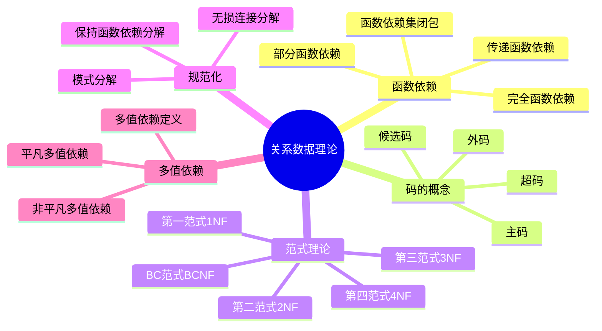

## 6.1 问题的提出

### 6.1.1 关系模式中可能存在的问题

考虑学生选课关系：
```
Student(Sno, Sname, Sdept, Mname, Cno, Grade)
```

**存在的问题：**

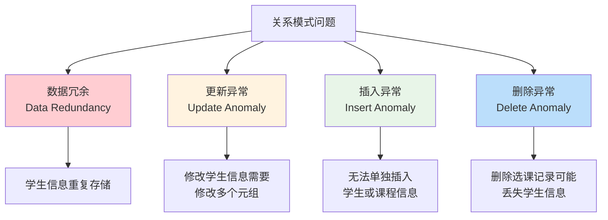

1. **数据冗余**：学生姓名、系别、系主任在多个元组中重复出现
2. **更新异常**：修改学生系别时，需要修改多个元组
3. **插入异常**：无法插入尚未选课的学生信息
4. **删除异常**：删除学生的最后一门选课记录时，学生信息也被删除

## 6.2 规范化

### 6.2.1 函数依赖

#### 函数依赖的定义
设R(U)是一个关系模式，X和Y是U的子集。如果对于R(U)的任意一个可能的关系r，r中不可能存在两个元组在X上的属性值相等，而在Y上的属性值不等，则称"X函数确定Y"或"Y函数依赖于X"，记作X→Y。

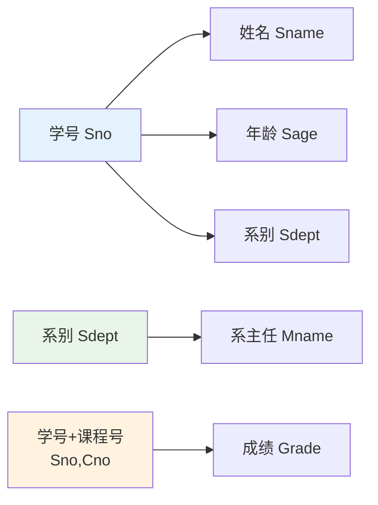

#### 函数依赖的类型

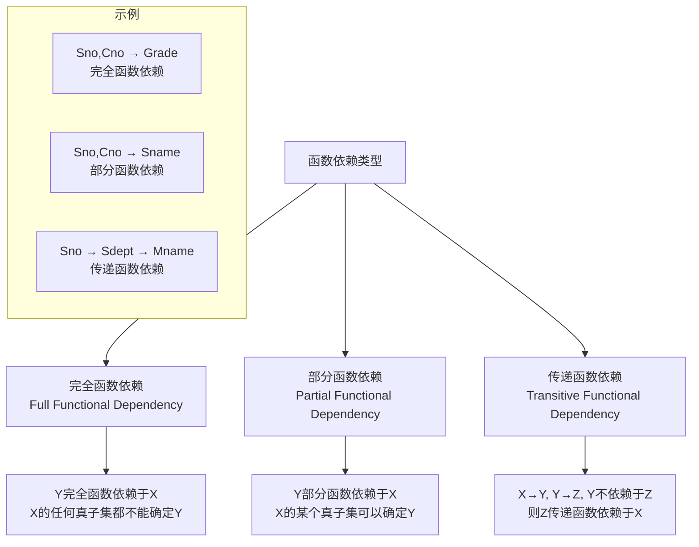

### 6.2.2 码

#### 码的定义
设K为R<U,F>中的属性或属性组合。若K→U，则K称为R的一个**超码**。
若K是超码，且K的任何真子集都不是超码，则K称为R的**候选码**。

```mermaid
graph TD
    A[码的层次结构] --> B[超码 Super Key]
    B --> C[候选码 Candidate Key]
    C --> D[主码 Primary Key]
    
    B --> B1[能唯一标识元组的<br/>属性或属性组]
    C --> C1[最小的超码<br/>去掉任何属性都不是超码]
    D --> D1[从候选码中选择的<br/>一个作为主码]
    
    subgraph "示例：学生选课关系"
        E[超码: {Sno,Cno,Sname}]
        F[候选码: {Sno,Cno}]
        G[主码: {Sno,Cno}]
        H[主属性: Sno, Cno]
        I[非主属性: Sname, Grade]
    end
    
    style D fill:#ffcdd2
    style H fill:#e8f5e8
    style I fill:#bbdefb
```

### 6.2.3 范式

#### 第一范式（1NF）
如果一个关系模式R的所有属性都是不可分的基本数据项，则R∈1NF。

```mermaid
graph LR
    subgraph "不满足1NF"
        A[学生表<br/>学号|姓名|联系方式]
        B[001|张三|电话:123 邮箱:abc@qq.com]
    end
    
    subgraph "满足1NF"
        C[学生表<br/>学号|姓名|电话|邮箱]
        D[001|张三|123|abc@qq.com]
    end
    
    A --> C
    style A fill:#ffcdd2
    style C fill:#e8f5e8
```

#### 第二范式（2NF）
若R∈1NF，且每一个非主属性完全函数依赖于任何一个候选码，则R∈2NF。

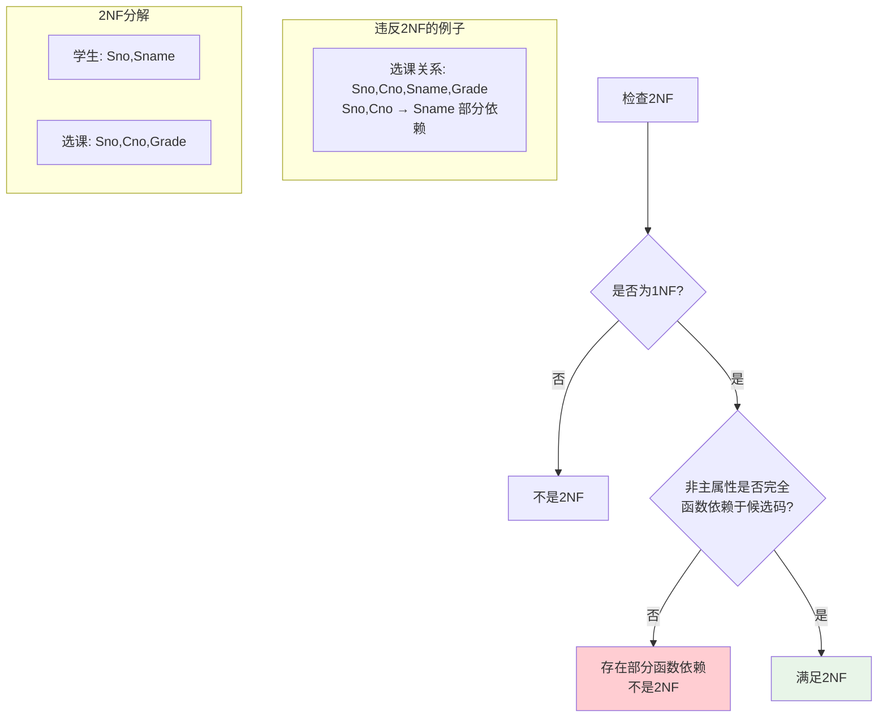

#### 第三范式（3NF）
设关系模式R<U,F>∈1NF，若R中不存在这样的码X、属性组Y及非主属性Z（Z⊄Y），使得X→Y，Y→Z，则称R<U,F>∈3NF。

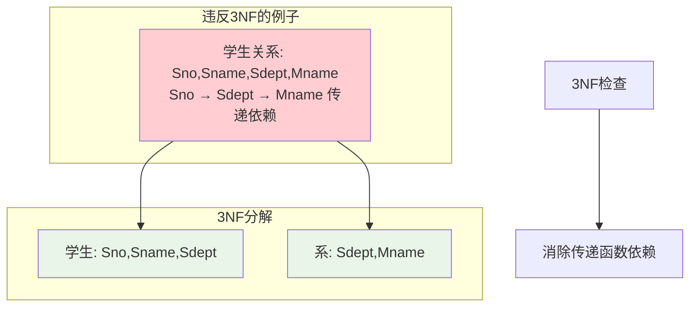

#### BC范式（BCNF）
设关系模式R<U,F>∈1NF，若X→Y且Y⊄X时X必含有码，则R<U,F>∈BCNF。

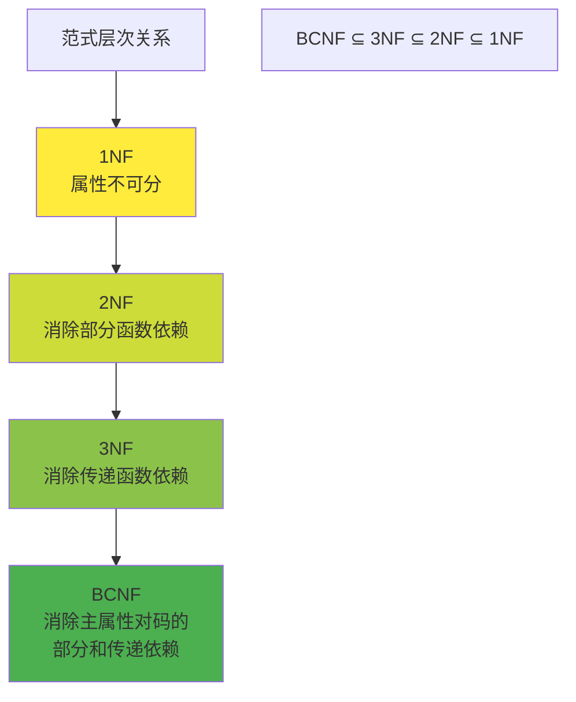

## 6.3 数据依赖的公理系统

### 6.3.1 Armstrong公理系统

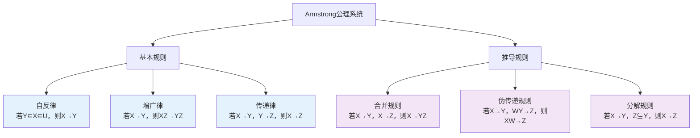

### 6.3.2 函数依赖集的闭包

**算法：求属性集X关于函数依赖集F的闭包X+**

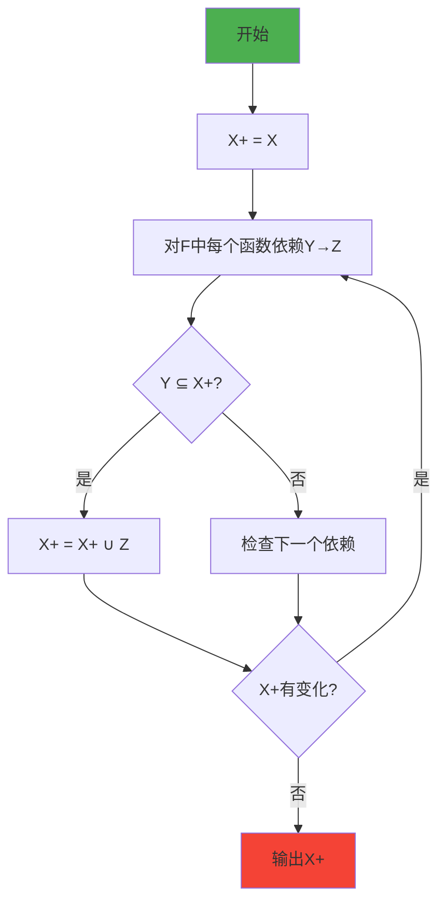

## 6.4 模式的分解

### 6.4.1 模式分解的标准

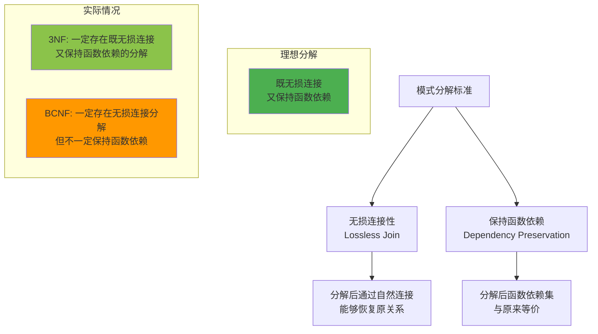

### 6.4.2 3NF的分解算法

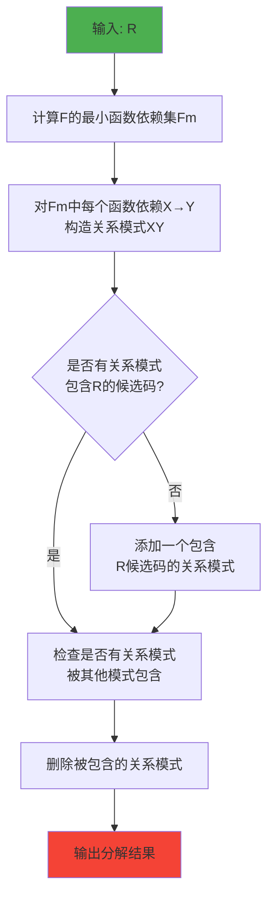

## 6.5 多值依赖

### 6.5.1 多值依赖的定义

设R(U)是一个关系模式，X、Y、Z是U的子集，且Z=U-X-Y。多值依赖X→→Y成立，当且仅当对R的任一关系r，给定的一对(x,z)值，有一组Y的值，这组值仅仅决定于x值而与z值无关。

```mermaid
graph TD
    A[多值依赖示例] --> B[课程-教师-参考书关系]
    
    subgraph "关系实例"
        C[数据库|张三|数据库系统概论]
        D[数据库|张三|数据库原理]
        E[数据库|李四|数据库系统概论]
        F[数据库|李四|数据库原理]
    end
    
    B --> G[课程 →→ 教师<br/>课程 →→ 参考书]
    
    subgraph "4NF分解"
        H[课程-教师: 课程,教师]
        I[课程-参考书: 课程,参考书]
    end
    
    style G fill:#fff3e0
    style H fill:#e8f5e8
    style I fill:#e8f5e8
```

### 6.5.2 第四范式（4NF）

关系模式R<U,F>∈1NF，如果对于R的每个非平凡多值依赖X→→Y（Y⊄X），X都含有码，则R<U,F>∈4NF。

## 6.6 学习检查点

### 6.6.1 重点概念总结

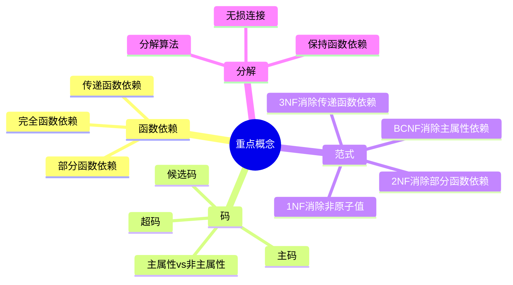

### 6.6.2 练习题

1. **函数依赖判断题**
   - 给定关系模式和函数依赖集，判断各种函数依赖关系
   - 求属性集的闭包
   - 求候选码

2. **范式判断题**
   - 判断关系模式属于哪个范式
   - 找出违反范式的函数依赖
   - 进行模式分解

3. **综合应用题**
   - 设计满足特定范式的关系模式
   - 分析实际问题中的数据依赖关系

### 6.6.3 思考题

1. 为什么需要数据库规范化？规范化的优缺点是什么？
2. 3NF和BCNF的区别是什么？什么情况下需要使用BCNF？
3. 如何在保证数据一致性和查询效率之间找到平衡？
4. 多值依赖与函数依赖有什么区别和联系？

## 6.7 实践应用

### 6.7.1 规范化设计步骤

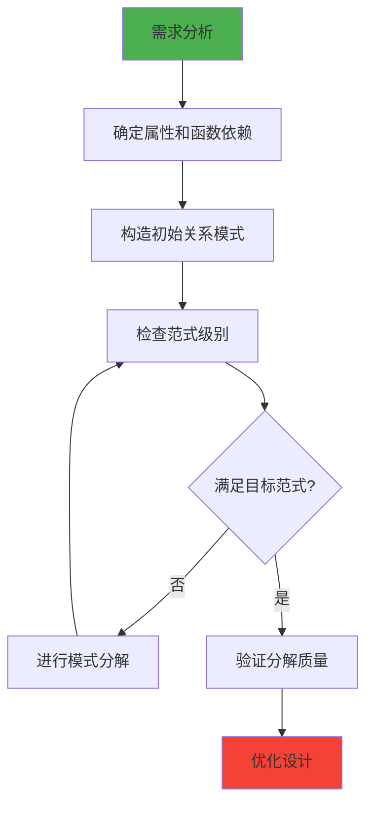

### 6.7.2 常见设计模式

1. **一对一关系**：可以合并为一个关系
2. **一对多关系**：在"多"的一方添加外码
3. **多对多关系**：需要建立中间关系表

---

**本章小结**：关系数据理论为数据库设计提供了理论基础，通过函数依赖分析和范式理论，可以设计出结构良好、避免异常的关系模式。掌握这些理论对于数据库设计和优化具有重要意义。