# 第7章 数据库设计

## 学习目标
- 理解数据库设计的基本概念和重要性
- 掌握数据库设计的六个阶段
- 熟练使用E-R模型进行概念结构设计
- 掌握E-R图向关系模型的转换方法
- 了解物理设计的基本原理
- 掌握数据库设计的实施和维护方法

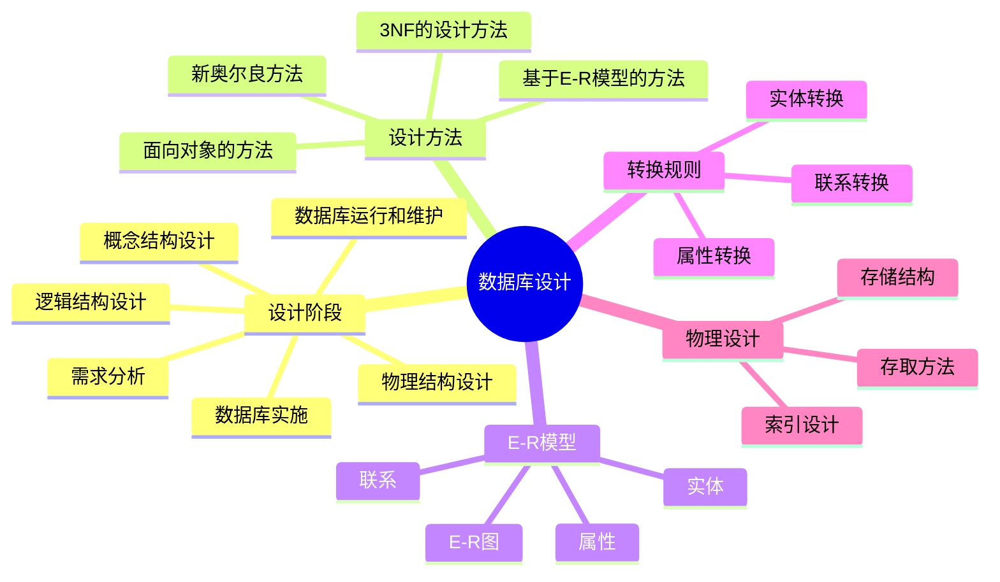

## 7.1 数据库设计概述

### 7.1.1 数据库设计的特点

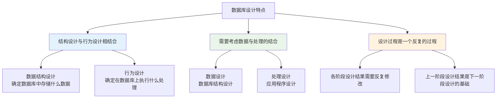

### 7.1.2 数据库设计方法

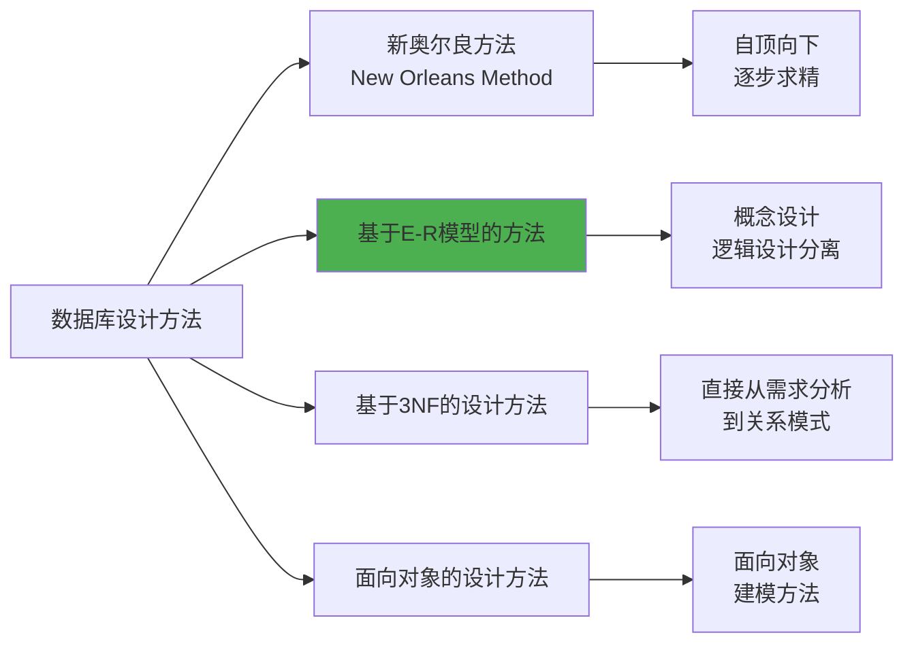

## 7.2 数据库设计过程

### 7.2.1 数据库设计的六个阶段

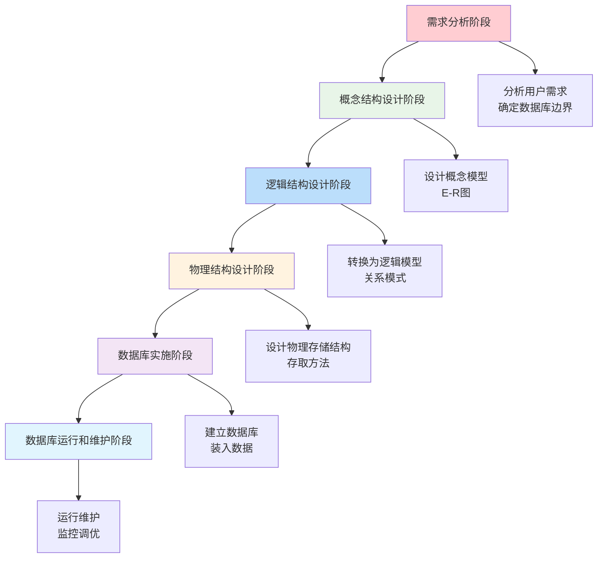

### 7.2.2 各阶段的设计描述

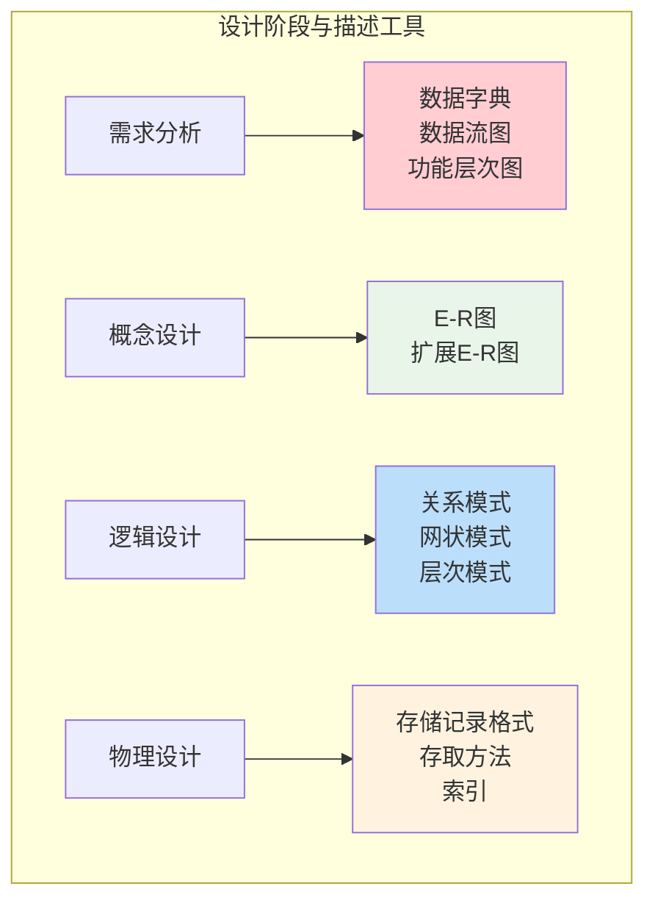

## 7.3 需求分析

### 7.3.1 需求分析的任务

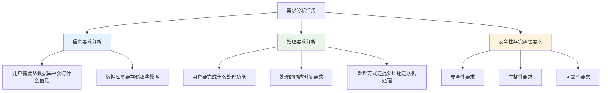

### 7.3.2 需求分析的方法

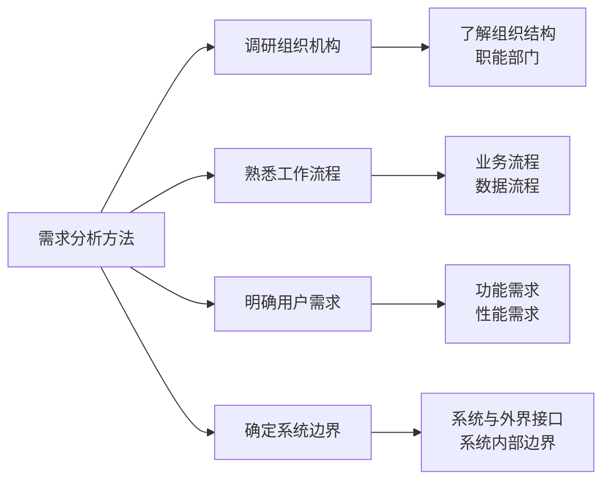

### 7.3.3 数据字典

数据字典是关于数据库中数据的描述，即元数据，而不是数据本身。

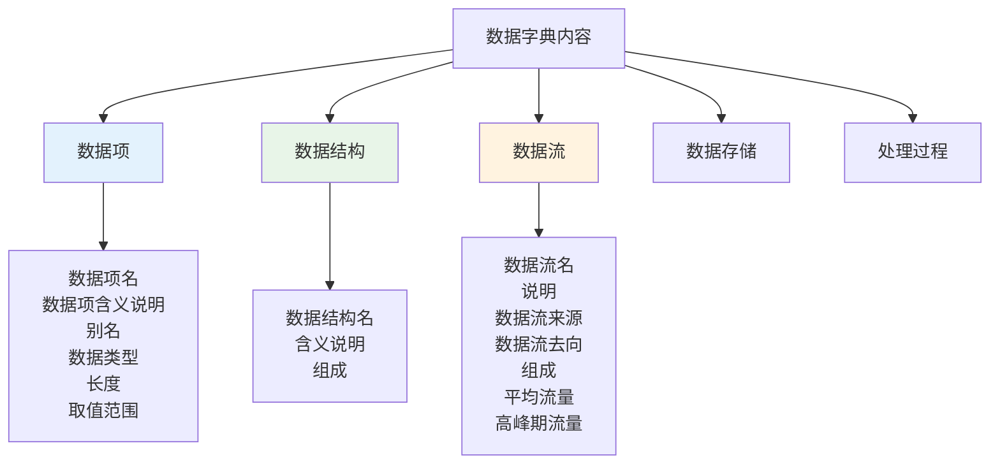

## 7.4 概念结构设计

### 7.4.1 概念结构设计的特点和策略

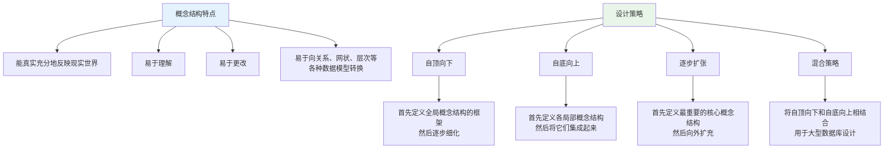

### 7.4.2 E-R模型

#### 实体-联系方法

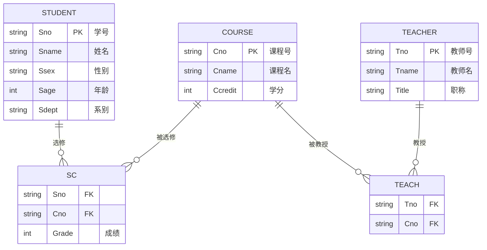

#### E-R图的基本元素

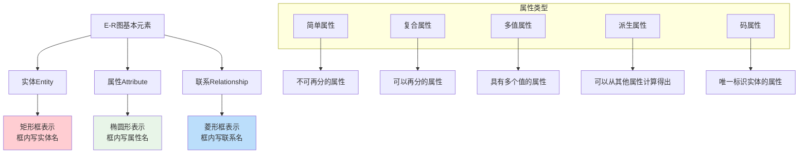

#### 联系的类型

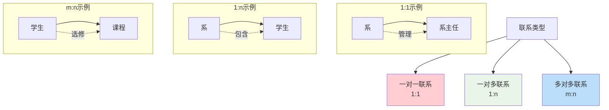

### 7.4.3 E-R图的集成

当采用自底向上的设计策略时，各分E-R图之间可能存在冲突，需要消除。

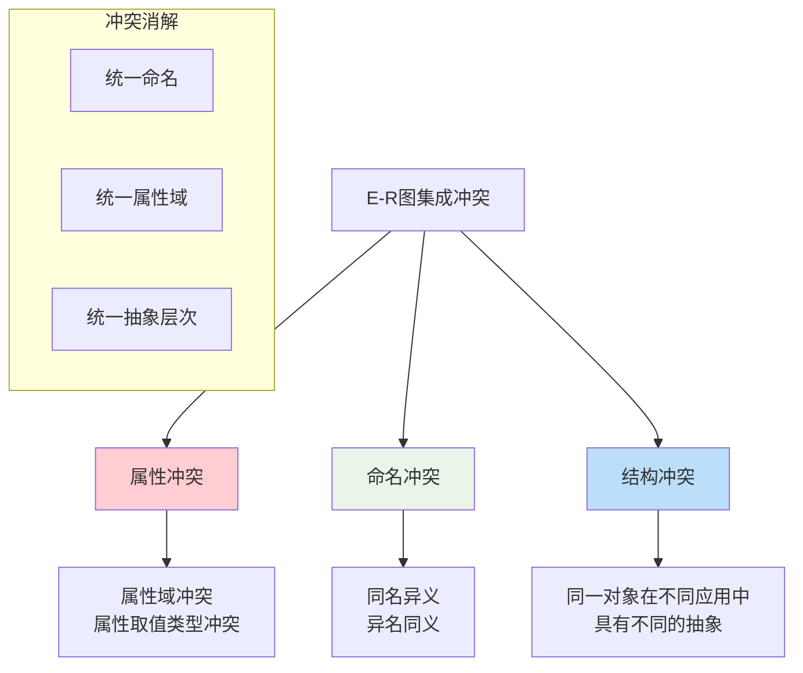

## 7.5 逻辑结构设计

### 7.5.1 E-R图向关系模型的转换

#### 转换规则

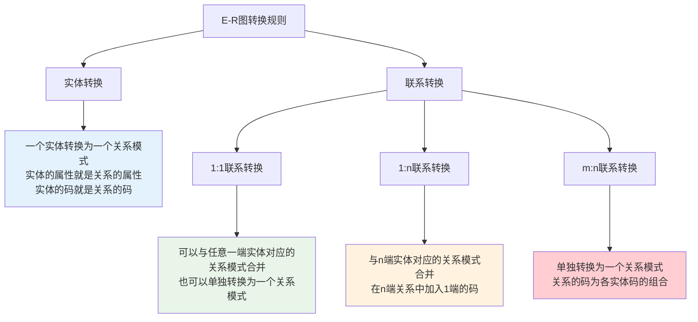

#### 转换示例

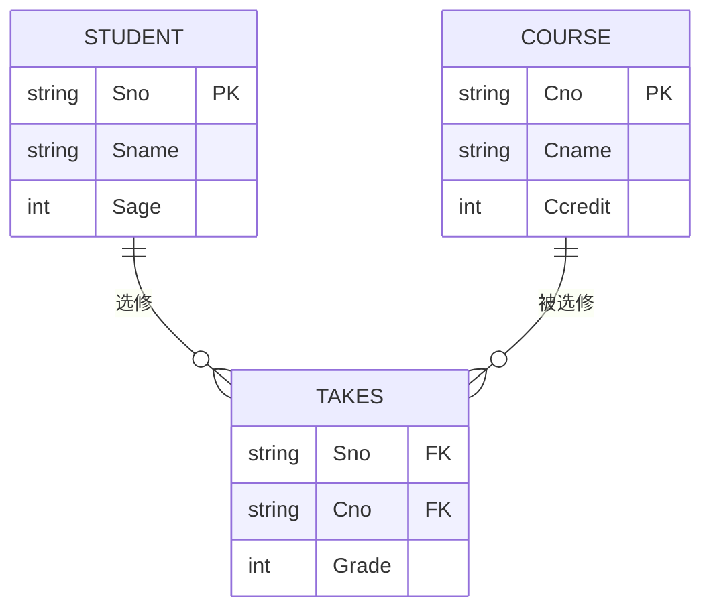

**转换结果：**
```sql
Student(Sno, Sname, Sage)
Course(Cno, Cname, Ccredit)
SC(Sno, Cno, Grade)
```

### 7.5.2 数据模型的优化

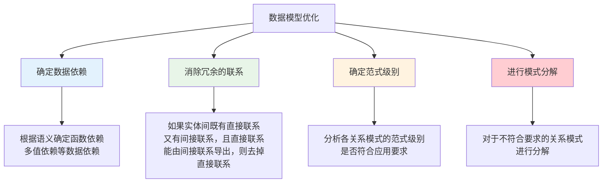

### 7.5.3 设计用户子模式

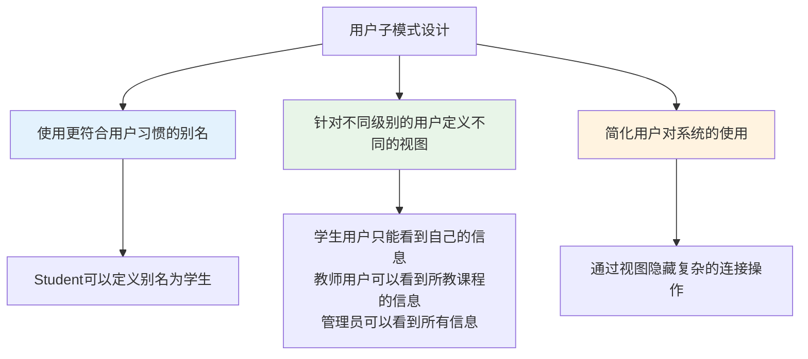

## 7.6 物理结构设计

### 7.6.1 物理设计的内容

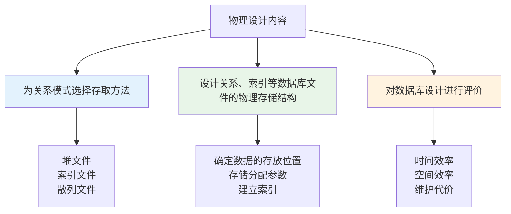

### 7.6.2 关系模式存取方法选择

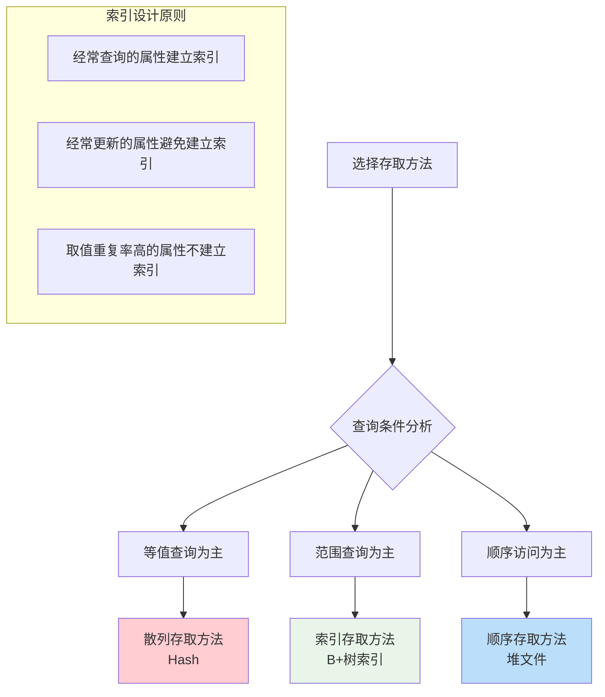

### 7.6.3 数据库物理设计的评价

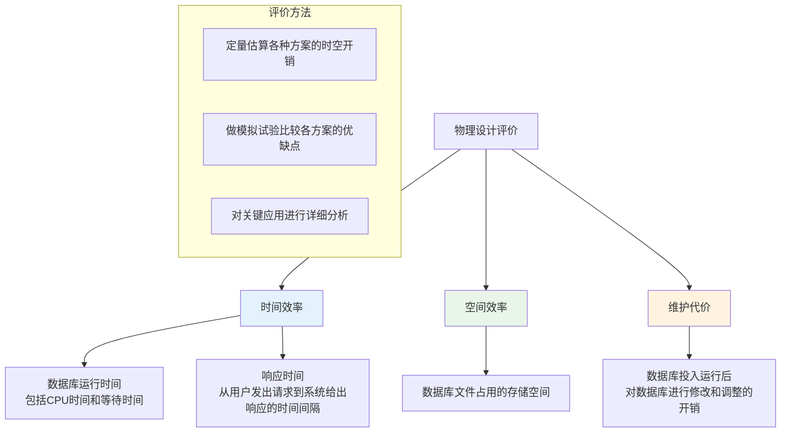

## 7.7 数据库实施

### 7.7.1 数据库实施的内容

```mermaid
flowchart TD
    A[数据库实施] --> B[建立数据库结构]
    A --> C[装入数据]
    A --> D[编制与调试应用程序]
    A --> E[数据库试运行]
    
    B --> B1[用DDL定义数据库结构]
    C --> C1[组织数据入库<br/>数据转换]
    D --> D1[编制应用程序<br/>调试应用程序]
    E --> E1[功能测试<br/>性能测试]
    
    style B fill:#e3f2fd
    style C fill:#e8f5e8
    style D fill:#fff3e0
    style E fill:#ffcdd2
```

### 7.7.2 数据载入

```mermaid
graph TD
    A[数据载入方式] --> B[人工载入]
    A --> C[计算机载入]
    
    B --> B1[数据量小时使用<br/>通过应用程序界面输入]
    
    C --> C1[批量载入<br/>数据转换程序<br/>数据导入工具]
    
    subgraph "数据转换"
        D[数据格式转换]
        E[数据内容转换]
        F[数据检验]
    end
    
    D --> D1[不同系统间的数据格式差异]
    E --> E1[编码方式的转换]
    F --> F1[数据的完整性检验]
    
    style B fill:#e3f2fd
    style C fill:#e8f5e8
```

## 7.8 数据库运行和维护

### 7.8.1 数据库运行和维护的内容

```mermaid
graph TD
    A[数据库运行维护] --> B[数据库的转储和恢复]
    A --> C[数据库的安全性、完整性控制]
    A --> D[数据库性能的监督、分析和改进]
    A --> E[数据库的重组织和重构造]
    
    B --> B1[定期转储<br/>故障恢复]
    C --> C1[用户权限管理<br/>数据完整性约束]
    D --> D1[性能监控<br/>查询优化<br/>索引调整]
    E --> E1[数据重组织<br/>模式重构造]
    
    style B fill:#ffcdd2
    style C fill:#e8f5e8
    style D fill:#fff3e0
    style E fill:#bbdefb
```

### 7.8.2 数据库性能调优

```mermaid
flowchart TD
    A[性能调优] --> B[监控系统性能]
    B --> C{发现性能瓶颈?}
    C -->|是| D[分析瓶颈原因]
    C -->|否| E[继续监控]
    
    D --> F[调整策略]
    F --> G[索引优化]
    F --> H[查询优化]
    F --> I[存储优化]
    F --> J[系统参数调整]
    
    G --> K[添加/删除索引]
    H --> L[重写SQL语句]
    I --> M[调整存储结构]
    J --> N[调整缓冲区大小]
    
    K --> O[测试性能改进]
    L --> O
    M --> O
    N --> O
    
    O --> C
    
    style C fill:#fff3e0
    style O fill:#e8f5e8
```

## 7.9 学习检查点

### 7.9.1 重点概念总结

```mermaid
mindmap
  root((数据库设计))
    设计过程
      需求分析
        信息要求
        处理要求
        安全完整性要求
      概念设计
        E-R模型
        实体联系属性
      逻辑设计
        E-R图转换
        模式优化
      物理设计
        存取方法
        索引设计
    设计方法
      自顶向下
      自底向上
      逐步扩张
      混合策略
    实施维护
      数据库建立
      数据装入
      性能调优
      运行维护
```

### 7.9.2 练习题

1. **概念设计练习**
   - 根据给定需求绘制E-R图
   - 分析实体、属性和联系
   - 确定联系的类型

2. **逻辑设计练习**
   - E-R图向关系模式转换
   - 关系模式优化
   - 范式分析和模式分解

3. **物理设计练习**
   - 选择合适的存取方法
   - 设计索引策略
   - 评估设计方案

### 7.9.3 思考题

1. 数据库设计为什么要分阶段进行？各阶段的主要任务是什么？
2. E-R模型的优点是什么？为什么广泛用于概念设计？
3. 如何根据应用特点选择合适的存取方法？
4. 数据库设计中如何平衡性能和存储空间的关系？

## 7.10 设计实例

### 7.10.1 学生管理系统设计

```mermaid
erDiagram
    STUDENT {
        string Sno PK "学号"
        string Sname "姓名"
        string Ssex "性别"
        date Sbirth "出生日期"
        string Sdept "系别"
    }
    
    COURSE {
        string Cno PK "课程号"
        string Cname "课程名"
        string Cpno FK "先修课程"
        int Ccredit "学分"
    }
    
    TEACHER {
        string Tno PK "教师号"
        string Tname "教师名"
        string Tsex "性别"
        date Tbirth "出生日期"
        string Title "职称"
        string Tdept "系别"
    }
    
    DEPT {
        string Dno PK "系号"
        string Dname "系名"
        string Dean "系主任"
    }
    
    STUDENT ||--o{ SC : "选修"
    COURSE ||--o{ SC : "被选修"
    TEACHER ||--o{ TC : "教授"
    COURSE ||--o{ TC : "被教授"
    DEPT ||--o{ STUDENT : "包含学生"
    DEPT ||--o{ TEACHER : "包含教师"
    COURSE ||--o{ COURSE : "先修关系"
    
    SC {
        string Sno FK
        string Cno FK
        int Grade "成绩"
    }
    
    TC {
        string Tno FK
        string Cno FK
    }
```

---

**本章小结**：数据库设计是一个复杂的工程过程，需要遵循科学的设计方法和步骤。通过需求分析、概念设计、逻辑设计、物理设计等阶段，可以设计出满足用户需求、性能良好的数据库系统。E-R模型是概念设计的有力工具，掌握E-R图的绘制和转换是数据库设计的关键技能。