# 第8章 关系查询处理和查询优化

## 学习目标
- 理解查询处理的基本概念和过程
- 掌握关系代数表达式的优化方法
- 了解查询执行计划的生成和选择
- 掌握连接算法的基本原理
- 理解查询优化器的工作原理
- 了解查询性能调优的基本方法

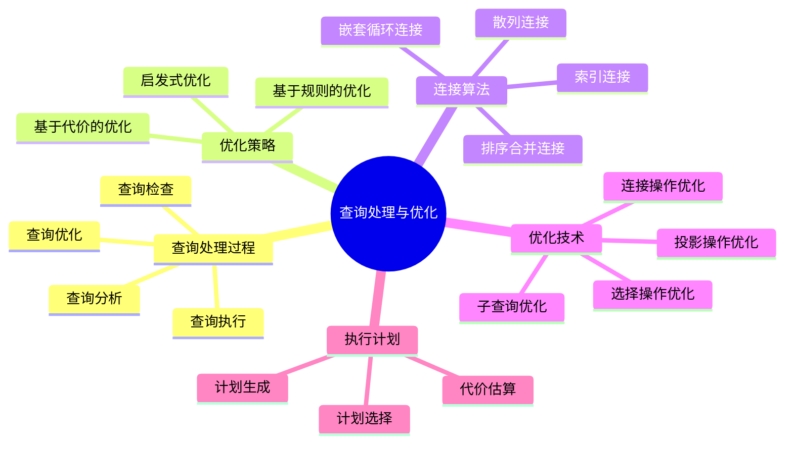

## 8.1 查询处理概述

### 8.1.1 查询处理的步骤

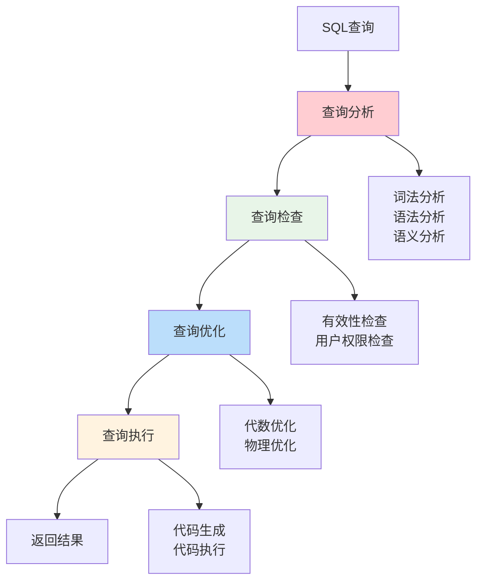

### 8.1.2 查询处理器的组成

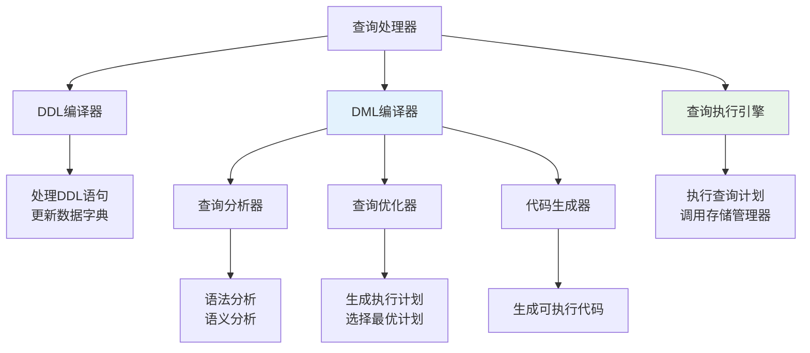

## 8.2 查询优化概述

### 8.2.1 查询优化的必要性

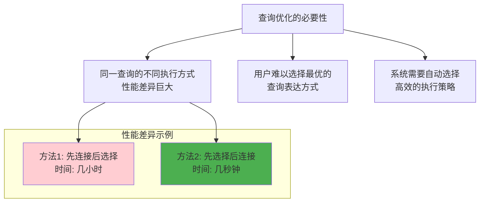

### 8.2.2 查询优化的分类

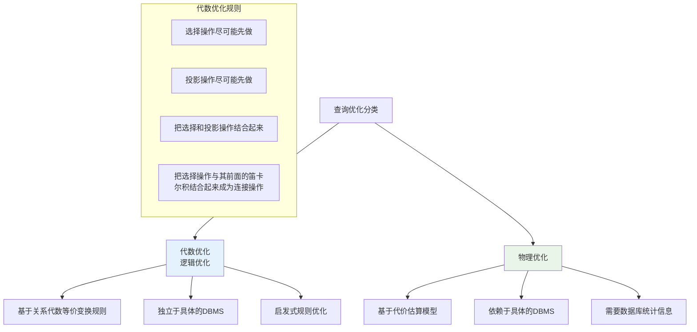

## 8.3 关系代数表达式的优化

### 8.3.1 关系代数等价变换规则

```mermaid
graph TD
    A[等价变换规则] --> B[选择操作]
    A --> C[投影操作]
    A --> D[连接和笛卡尔积]
    A --> E[并、交、差操作]
    
    B --> B1[选择操作的交换律<br/>σF1(σF2(R)) = σF2(σF1(R))]
    B --> B2[选择操作的合并<br/>σF1∧F2(R) = σF1(σF2(R))]
    B --> B3[选择对并的分配律<br/>σF(R∪S) = σF(R)∪σF(S)]
    
    C --> C1[投影操作的串接<br/>πA1(πA2(R)) = πA1(R)]
    C --> C2[选择与投影的交换<br/>πA(σF(R)) = σF(πA(R))]
    
    D --> D1[连接和笛卡尔积的交换律<br/>R⋈S = S⋈R]
    D --> D2[连接和笛卡尔积的结合律<br/>(R⋈S)⋈T = R⋈(S⋈T)]
    
    style B fill:#ffcdd2
    style C fill:#e8f5e8
    style D fill:#bbdefb
```

### 8.3.2 查询树的优化

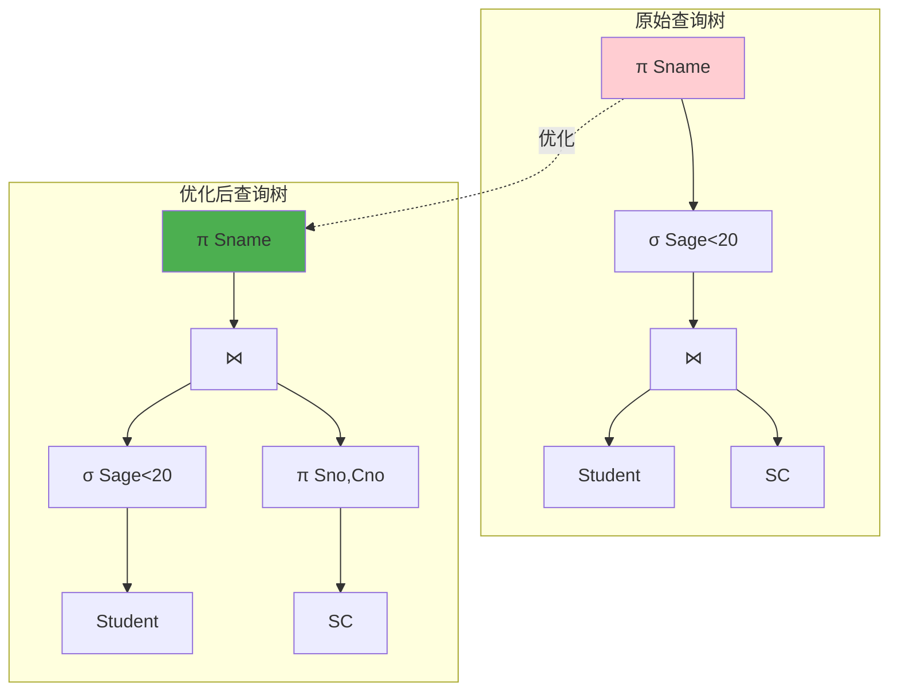

### 8.3.3 启发式优化规则

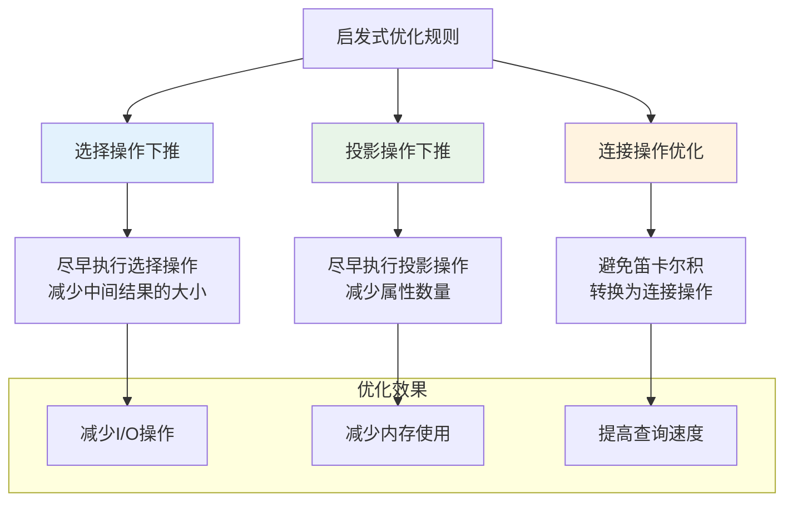

## 8.4 查询执行计划的生成

### 8.4.1 执行计划的表示

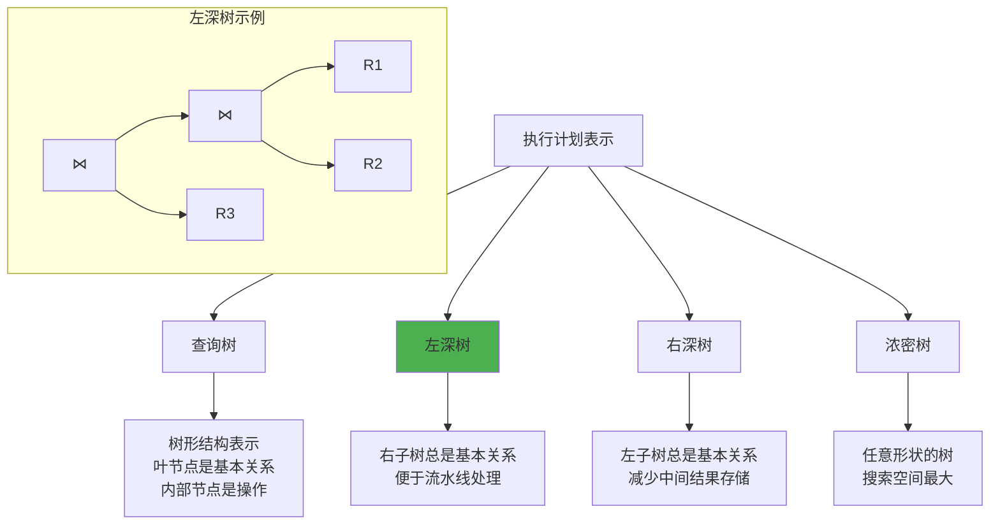

### 8.4.2 连接顺序的选择

对于n个关系的连接，可能的连接顺序数量：

```mermaid
graph TD
    A[连接顺序选择] --> B[动态规划算法]
    A --> C[贪心算法]
    A --> D[遗传算法]
    
    B --> B1[最优解<br/>时间复杂度O(3^n)]
    C --> C1[近似解<br/>时间复杂度O(n²)]
    D --> D1[启发式解<br/>适用于大规模连接]
    
    subgraph "连接顺序数量"
        E[2个关系: 1种]
        F[3个关系: 3种]
        G[4个关系: 15种]
        H[n个关系: (2n-2)!/(n-1)!种]
    end
    
    style B fill:#4caf50
    style C fill:#ff9800
    style D fill:#9c27b0
```

## 8.5 物理查询优化

### 8.5.1 连接算法

#### 嵌套循环连接（Nested Loop Join）

```mermaid
flowchart TD
    A[嵌套循环连接] --> B[简单嵌套循环]
    A --> C[块嵌套循环]
    A --> D[索引嵌套循环]
    
    B --> B1[对外层关系的每个元组<br/>扫描内层关系的所有元组]
    C --> C1[以块为单位进行嵌套循环<br/>减少I/O次数]
    D --> D1[利用内层关系的索引<br/>快速定位匹配元组]
    
    subgraph "算法复杂度"
        E[简单: O(|R|×|S|)]
        F[块: O(|R|/B + |R|×|S|/B)]
        G[索引: O(|R|×log|S|)]
    end
    
    B1 --> E
    C1 --> F
    D1 --> G
    
    style D fill:#4caf50
```

#### 排序合并连接（Sort-Merge Join）

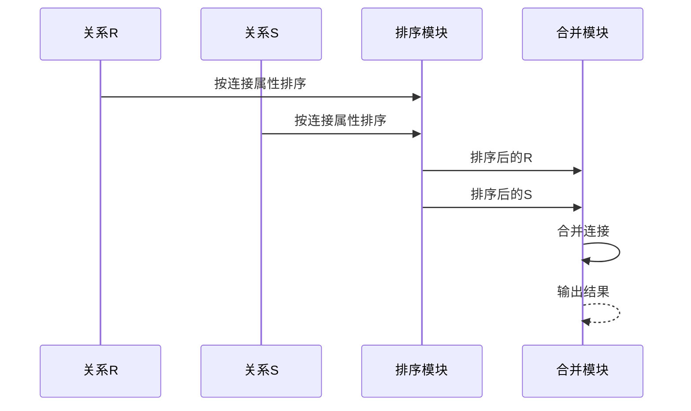

#### 散列连接（Hash Join）

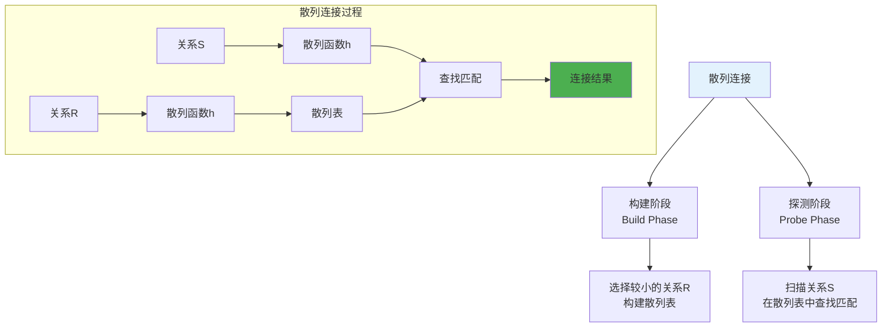

### 8.5.2 选择算法

```mermaid
graph TD
    A[选择算法] --> B[线性搜索]
    A --> C[二分搜索]
    A --> D[索引搜索]
    A --> E[散列搜索]
    
    B --> B1[顺序扫描所有记录<br/>适用于小关系或无索引]
    C --> C1[要求数据有序<br/>时间复杂度O(log n)]
    D --> D1[利用B+树索引<br/>快速定位记录]
    E --> E1[利用散列索引<br/>平均时间复杂度O(1)]
    
    subgraph "选择条件类型"
        F[等值选择<br/>A = value]
        G[范围选择<br/>A > value]
        H[复合选择<br/>A = v1 AND B > v2]
    end
    
    F --> E
    G --> D
    H --> I[多索引组合]
    
    style E fill:#4caf50
    style D fill:#8bc34a
```

### 8.5.3 代价估算模型

```mermaid
graph TD
    A[代价估算] --> B[I/O代价]
    A --> C[CPU代价]
    A --> D[通信代价]
    
    B --> B1[磁盘访问次数<br/>块传输时间]
    C --> C1[CPU处理时间<br/>比较操作次数]
    D --> D1[网络传输时间<br/>分布式环境]
    
    subgraph "统计信息"
        E[关系大小<br/>|R|]
        F[属性值域大小<br/>V(A,R)]
        G[选择率<br/>Selectivity]
        H[索引高度<br/>Height]
    end
    
    B1 --> E
    C1 --> F
    B1 --> G
    D1 --> H
    
    style B fill:#ffcdd2
    style C fill:#e8f5e8
    style D fill:#bbdefb
```

## 8.6 查询优化器

### 8.6.1 优化器的分类

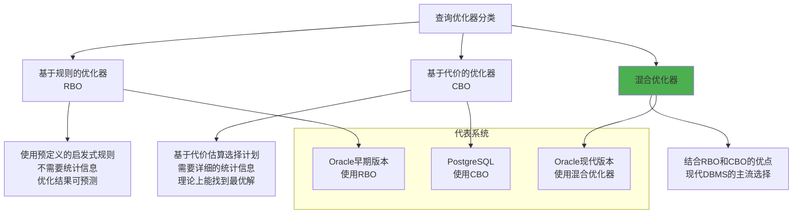

### 8.6.2 优化器的工作流程

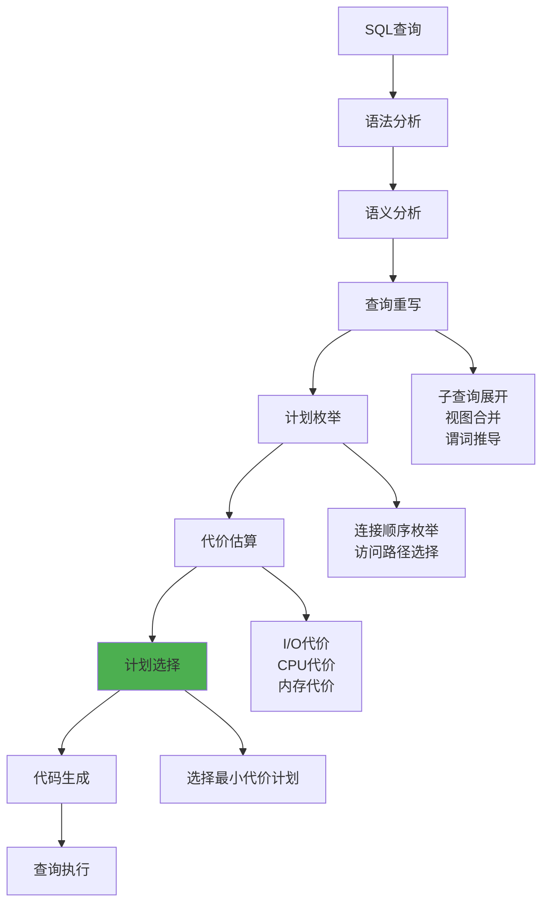

### 8.6.3 统计信息的维护

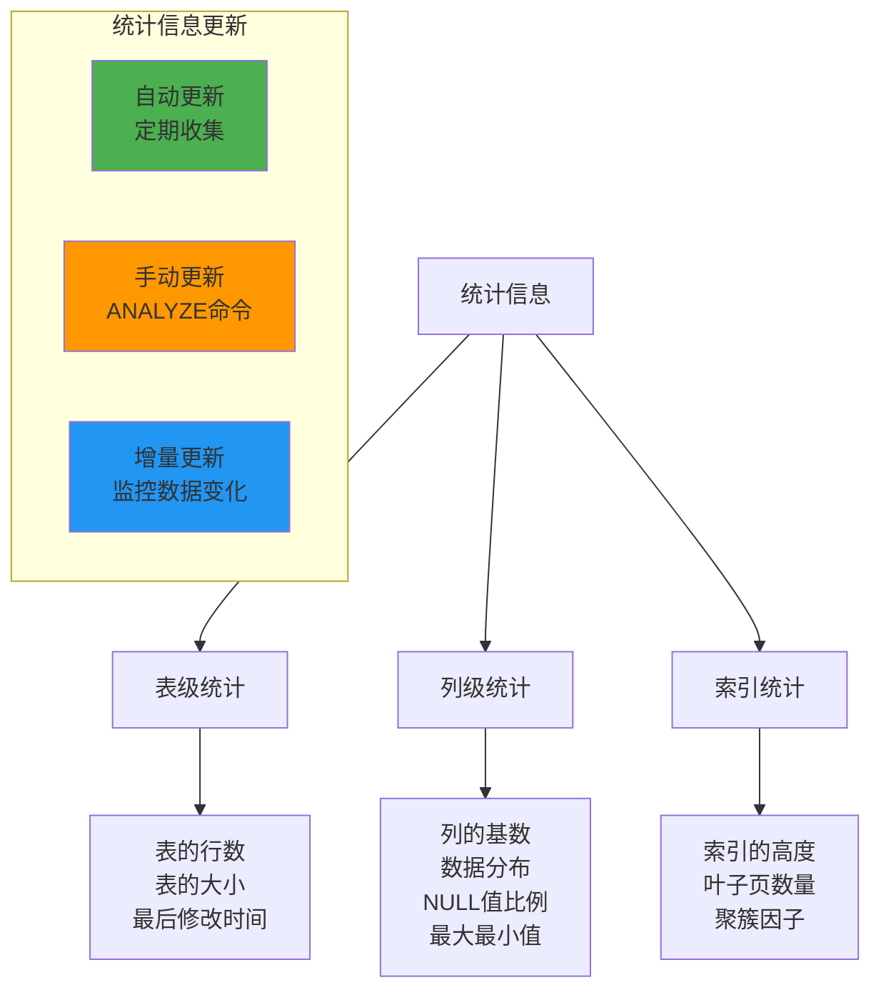

## 8.7 查询优化实例

### 8.7.1 多表连接优化

**原始查询：**
```sql
SELECT S.Sname, C.Cname, SC.Grade
FROM Student S, Course C, SC
WHERE S.Sno = SC.Sno 
  AND C.Cno = SC.Cno 
  AND S.Sdept = 'CS' 
  AND SC.Grade > 85;
```

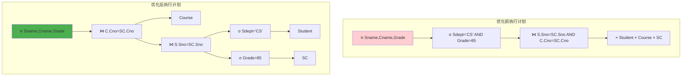

### 8.7.2 子查询优化

**原始查询：**
```sql
SELECT Sname 
FROM Student 
WHERE Sno IN (SELECT Sno FROM SC WHERE Cno = 'C1');
```

**优化为连接：**
```sql
SELECT DISTINCT S.Sname 
FROM Student S, SC 
WHERE S.Sno = SC.Sno AND SC.Cno = 'C1';
```

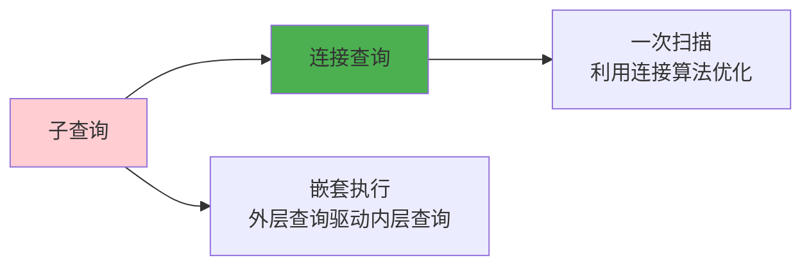

## 8.8 查询性能调优

### 8.8.1 性能调优策略

```mermaid
graph TD
    A[查询性能调优] --> B[索引优化]
    A --> C[查询重写]
    A --> D[统计信息更新]
    A --> E[系统参数调整]
    
    B --> B1[创建合适的索引<br/>删除无用的索引<br/>复合索引设计]
    
    C --> C1[避免全表扫描<br/>减少数据传输<br/>优化连接条件]
    
    D --> D1[及时更新统计信息<br/>确保优化器选择正确]
    
    E --> E1[调整缓冲区大小<br/>并行度设置<br/>内存分配]
    
    style B fill:#4caf50
    style C fill:#2196f3
    style D fill:#ff9800
    style E fill:#9c27b0
```

### 8.8.2 常见性能问题

```mermaid
graph TD
    A[常见性能问题] --> B[全表扫描]
    A --> C[索引失效]
    A --> D[连接顺序不当]
    A --> E[统计信息过期]
    
    B --> B1[缺少WHERE条件<br/>条件不能使用索引]
    C --> C1[函数包装列<br/>数据类型不匹配]
    D --> D1[大表作为驱动表<br/>连接条件选择性差]
    E --> E1[数据分布变化<br/>优化器选择错误计划]
    
    subgraph "解决方案"
        F[添加合适的WHERE条件]
        G[重写查询避免函数]
        H[调整连接顺序]
        I[更新统计信息]
    end
    
    B1 --> F
    C1 --> G
    D1 --> H
    E1 --> I
    
    style F fill:#4caf50
    style G fill:#4caf50
    style H fill:#4caf50
    style I fill:#4caf50
```

## 8.9 学习检查点

### 8.9.1 重点概念总结

```mermaid
mindmap
  root((查询优化))
    优化层次
      代数优化
        等价变换规则
        启发式规则
      物理优化
        连接算法选择
        访问路径选择
        代价估算
    连接算法
      嵌套循环连接
        简单嵌套循环
        块嵌套循环
        索引嵌套循环
      排序合并连接
      散列连接
    优化器
      基于规则RBO
      基于代价CBO
      混合优化器
    性能调优
      索引设计
      查询重写
      统计信息维护
```

### 8.9.2 练习题

1. **查询优化练习**
   - 给定SQL查询，画出查询树
   - 应用等价变换规则优化查询树
   - 分析不同执行计划的代价

2. **连接算法分析**
   - 比较不同连接算法的适用场景
   - 计算连接操作的I/O代价
   - 选择最优的连接算法

3. **性能调优实践**
   - 分析慢查询的原因
   - 设计索引优化方案
   - 重写查询提高性能

### 8.9.3 思考题

1. 为什么查询优化对数据库系统如此重要？
2. 基于规则的优化和基于代价的优化各有什么优缺点？
3. 如何选择合适的连接算法？
4. 统计信息对查询优化有什么影响？

---

**本章小结**：查询处理和优化是数据库系统的核心技术之一。通过代数优化和物理优化，可以显著提高查询性能。理解各种连接算法的原理和适用场景，掌握查询优化的基本方法，对于数据库应用开发和性能调优具有重要意义。现代数据库系统都配备了复杂的查询优化器，能够自动选择高效的执行计划。