# 第9章 数据库恢复技术

## 学习目标
- 理解数据库恢复的基本概念和重要性
- 掌握事务的概念和ACID特性
- 了解各种故障类型及其影响
- 掌握数据库恢复的基本技术
- 理解日志文件的作用和管理
- 掌握检查点技术和恢复策略
- 了解备份与恢复的实施方案

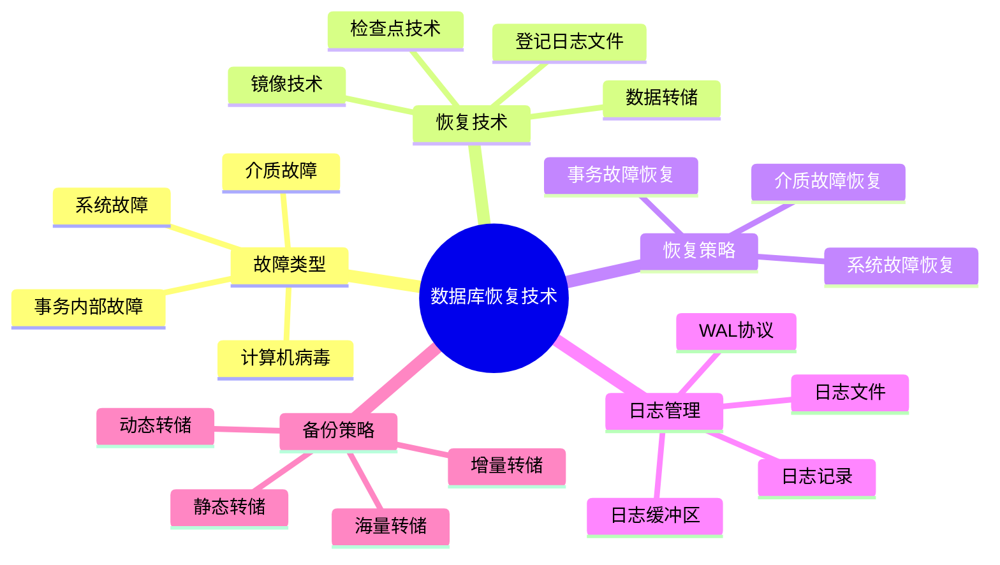

## 9.1 事务的基本概念

### 9.1.1 事务的定义

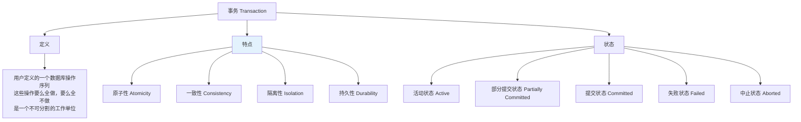

### 9.1.2 事务的ACID特性

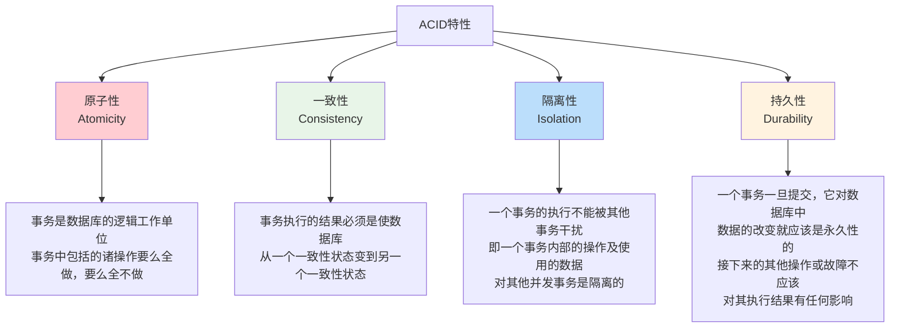

### 9.1.3 事务的状态转换

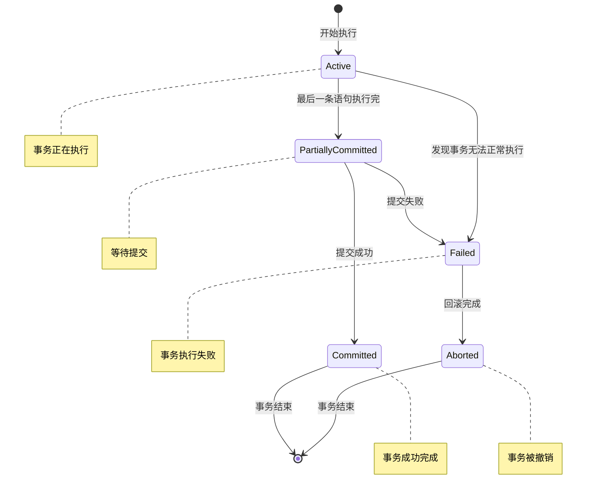

## 9.2 数据库恢复概述

### 9.2.1 故障的种类

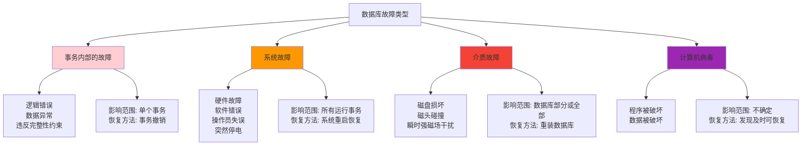

### 9.2.2 恢复的实现技术

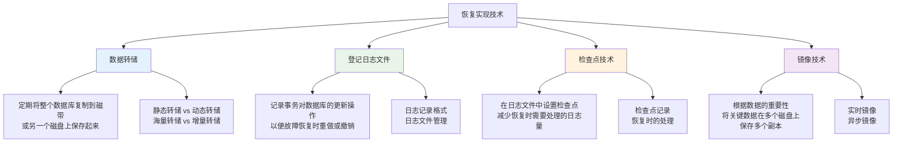

## 9.3 日志文件

### 9.3.1 日志记录的内容

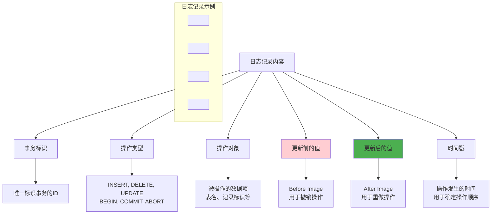

### 9.3.2 日志文件的组织

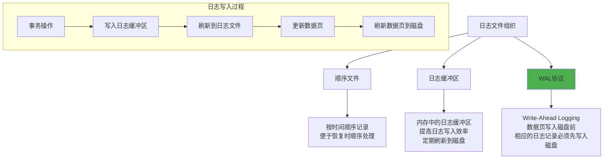

### 9.3.3 日志文件的管理

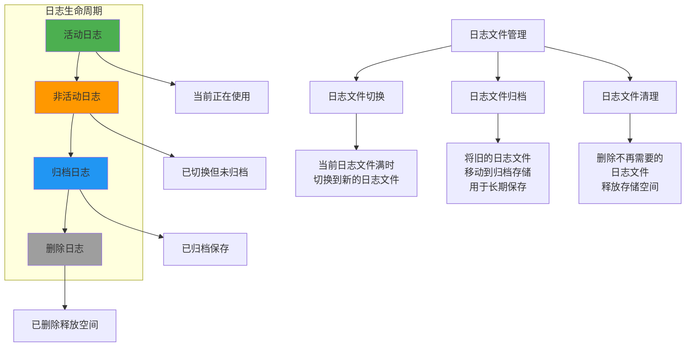

## 9.4 数据转储

### 9.4.1 转储的分类

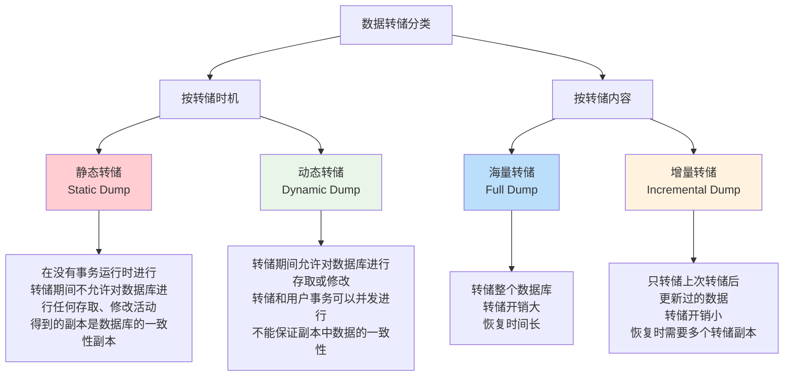

### 9.4.2 转储策略的选择

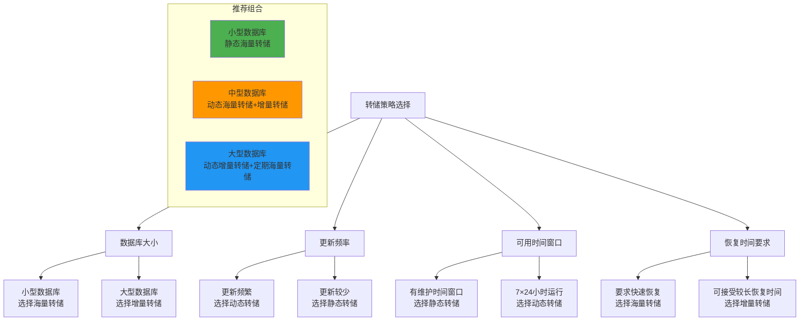

## 9.5 检查点技术

### 9.5.1 检查点的概念

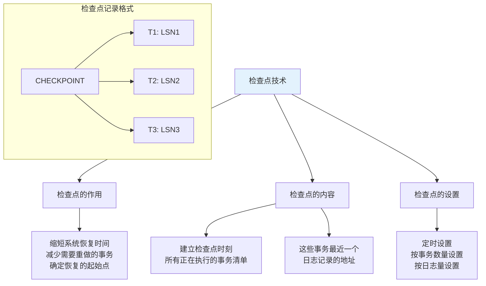

### 9.5.2 检查点的建立过程

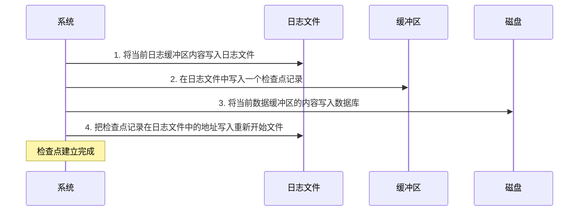

### 9.5.3 利用检查点进行恢复

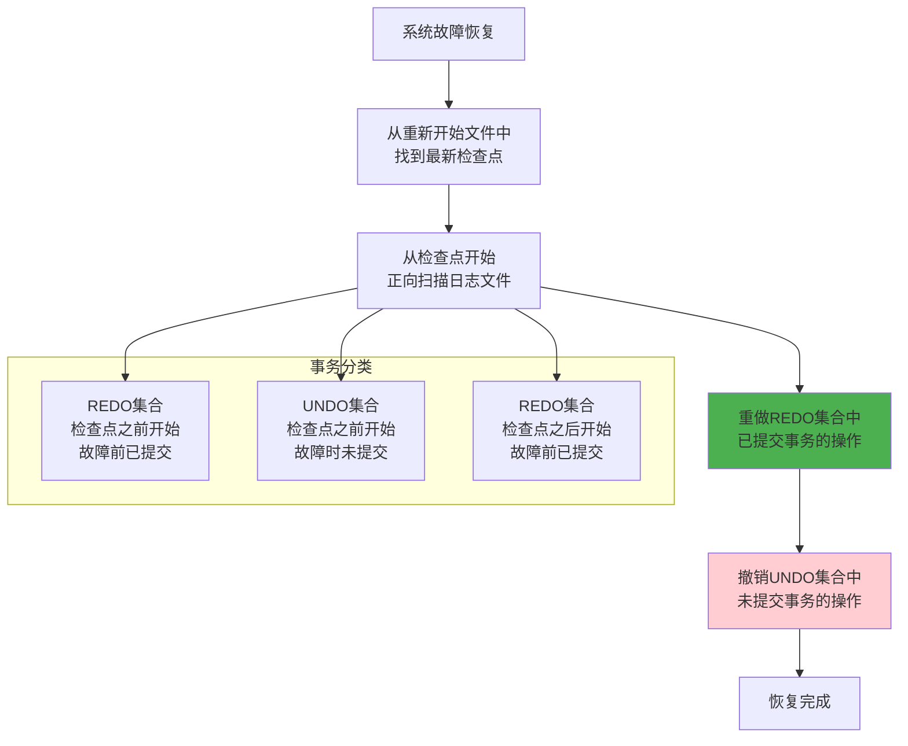

## 9.6 恢复策略

### 9.6.1 事务故障的恢复

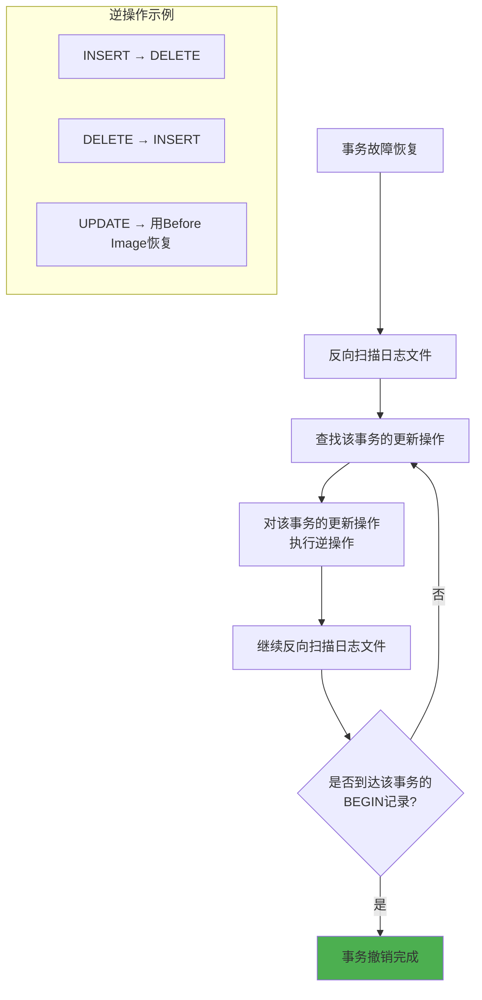

### 9.6.2 系统故障的恢复

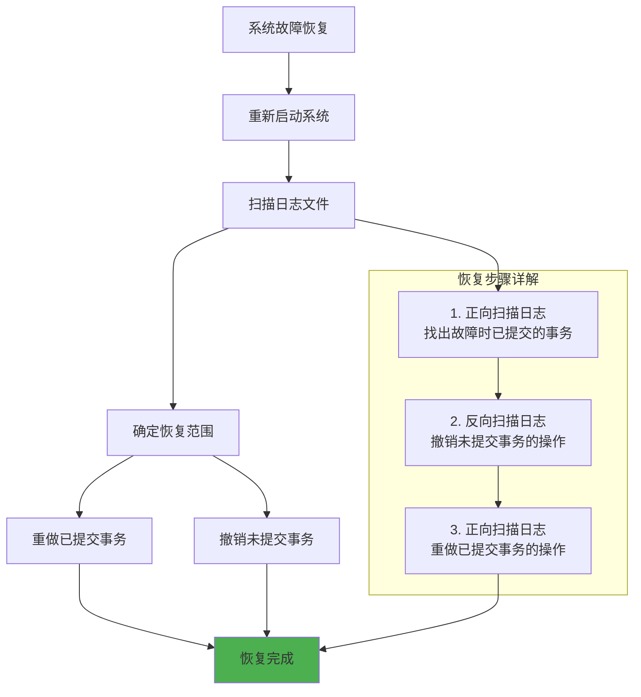

### 9.6.3 介质故障的恢复

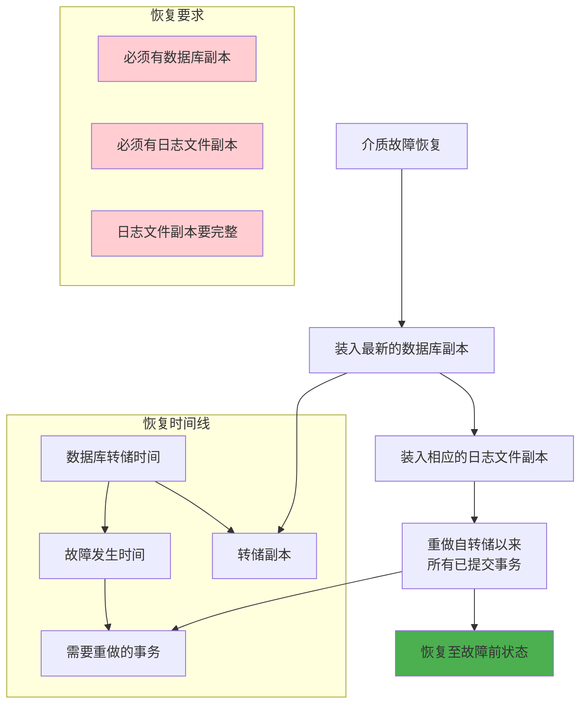

## 9.7 镜像技术

### 9.7.1 镜像的概念

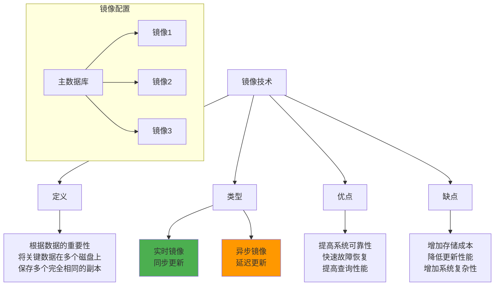

### 9.7.2 镜像的实现方式

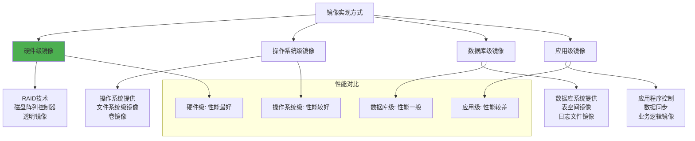

## 9.8 恢复技术的综合应用

### 9.8.1 恢复策略的组合

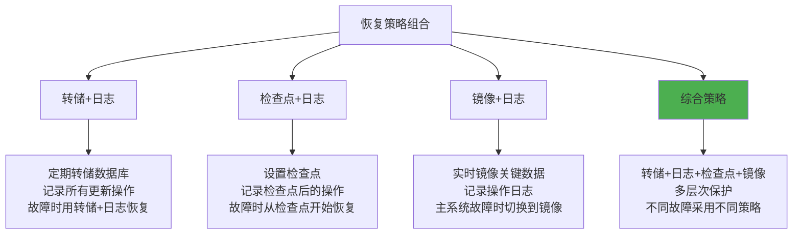

### 9.8.2 恢复方案设计

```mermaid
flowchart TD
    A[恢复方案设计] --> B[分析业务需求]
    B --> C[评估故障风险]
    C --> D[选择恢复技术]
    D --> E[制定恢复策略]
    E --> F[实施和测试]
    
    B --> B1[RTO要求<br/>RPO要求<br/>业务重要性]
    
    C --> C1[硬件故障概率<br/>软件故障概率<br/>人为错误概率<br/>自然灾害风险]
    
    D --> D1[转储策略<br/>日志策略<br/>检查点策略<br/>镜像策略]
    
    E --> E1[恢复流程<br/>责任分工<br/>时间安排<br/>资源配置]
    
    F --> F1[定期演练<br/>方案优化<br/>文档更新]
    
    style F fill:#4caf50
```

## 9.9 学习检查点

### 9.9.1 重点概念总结

```mermaid
mindmap
  root((数据库恢复))
    事务概念
      ACID特性
        原子性
        一致性
        隔离性
        持久性
      事务状态
        活动状态
        部分提交
        提交状态
        失败状态
        中止状态
    故障类型
      事务内部故障
      系统故障
      介质故障
      计算机病毒
    恢复技术
      数据转储
        静态转储
        动态转储
        海量转储
        增量转储
      日志文件
        WAL协议
        日志记录
        日志管理
      检查点技术
        检查点设置
        恢复优化
      镜像技术
        实时镜像
        异步镜像
```

### 9.9.2 练习题

1. **事务和ACID特性**
   - 解释事务的ACID特性
   - 分析事务状态转换过程
   - 设计事务处理示例

2. **恢复技术应用**
   - 比较不同转储策略的优缺点
   - 设计日志记录格式
   - 分析检查点技术的作用

3. **恢复策略设计**
   - 针对不同故障类型设计恢复方案
   - 计算恢复时间和存储开销
   - 优化恢复性能

### 9.9.3 思考题

1. 为什么需要WAL协议？它如何保证数据的一致性？
2. 检查点技术如何减少恢复时间？
3. 在什么情况下应该选择镜像技术？
4. 如何平衡恢复能力和系统性能？

---

**本章小结**：数据库恢复技术是保证数据库系统可靠性的重要手段。通过事务管理、日志记录、数据转储、检查点和镜像等技术的综合应用，可以有效应对各种故障情况，确保数据的安全性和一致性。在实际应用中，需要根据业务需求和系统特点，选择合适的恢复策略组合。

---
**上一章：** [第8章 关系查询处理和查询优化](第8章_关系查询处理和查询优化.md)  
**下一章：** [第10章 并发控制](第10章_并发控制.md)