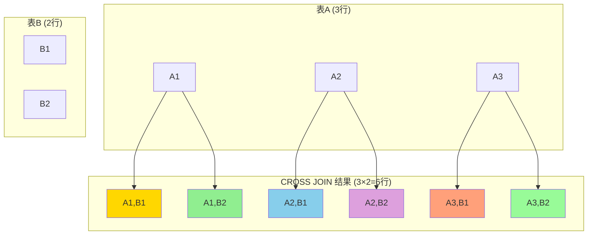
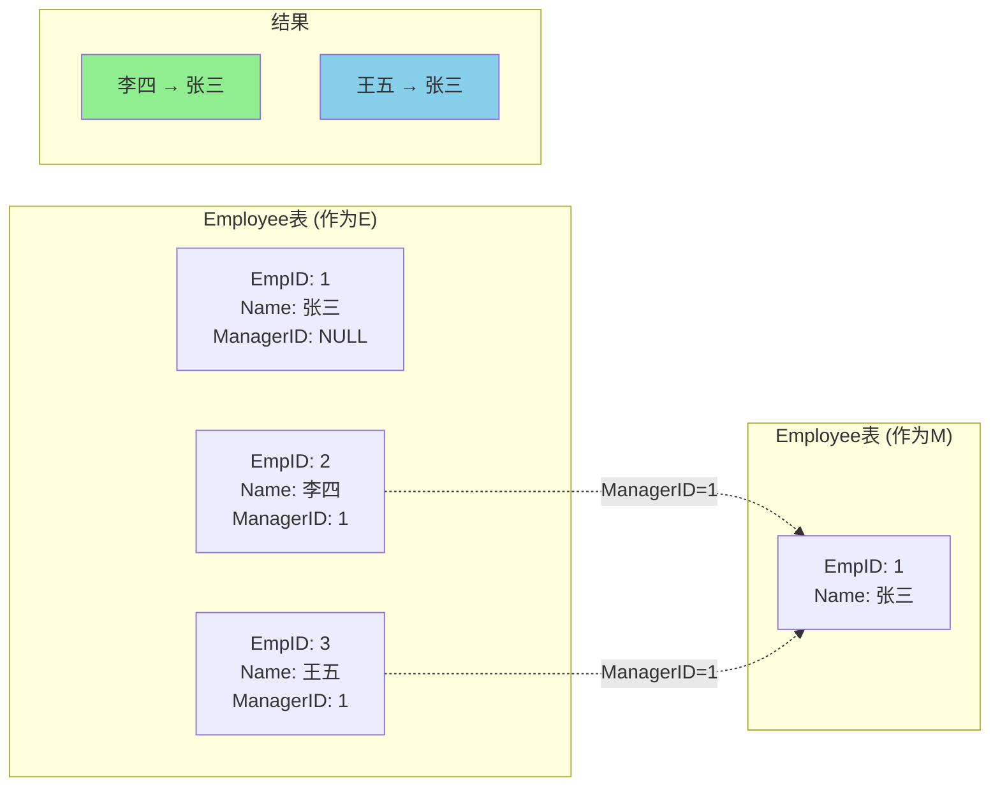
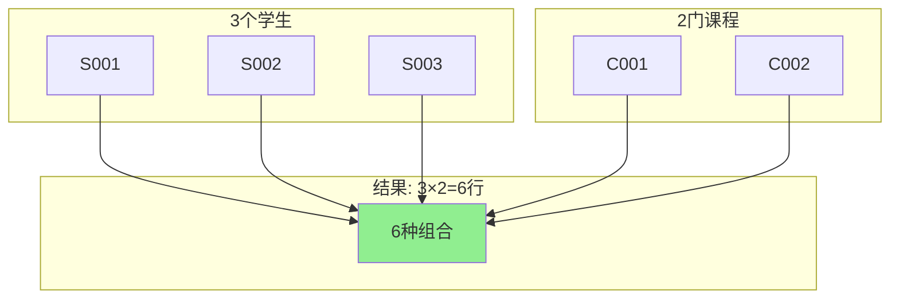
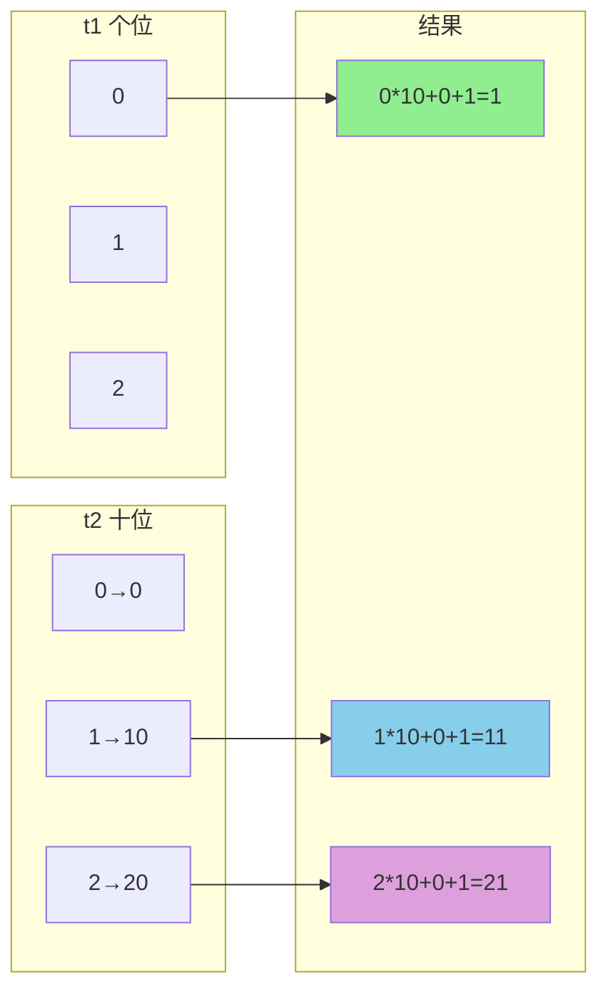
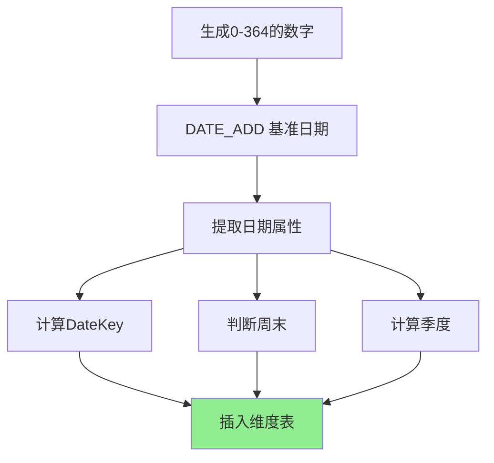
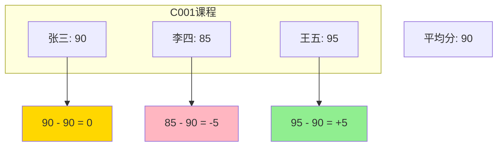
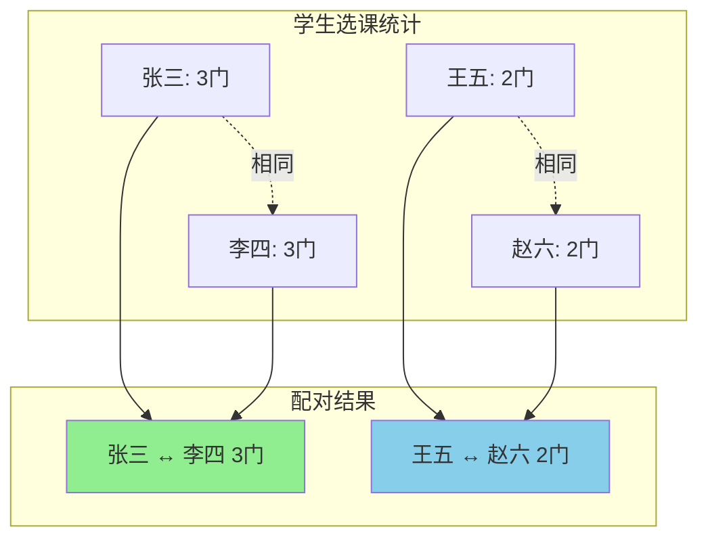
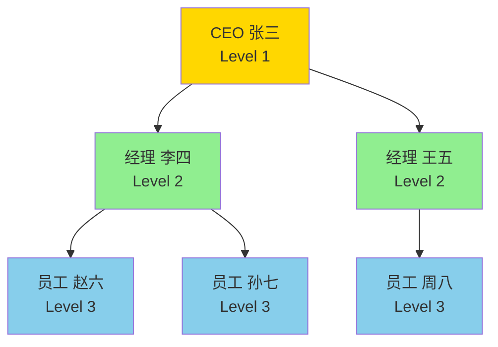
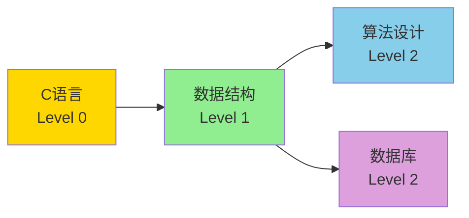

# 交叉连接与自连接

## 📌 交叉连接 (CROSS JOIN)

### 什么是交叉连接

交叉连接返回两个表的笛卡尔积（Cartesian Product），即第一个表的每一行与第二个表的每一行进行组合。

**结果集大小 = 表1行数 × 表2行数**

### 交叉连接示意图



### 基本语法

```sql
-- 显式交叉连接
SELECT *
FROM 表1
CROSS JOIN 表2;

-- 隐式交叉连接（逗号连接）
SELECT *
FROM 表1, 表2;
```

### 示例

```sql
-- 假设 Student 表有 3 行，Course 表有 5 行
SELECT S.Sname, C.Cname
FROM Student S
CROSS JOIN Course C;
-- 结果将有 3 × 5 = 15 行
```

### 实际应用场景

#### 场景1：生成所有可能的组合

```sql
-- 生成所有学生-课程的可能组合（用于初始化选课表）
SELECT S.Sno, C.Cno
FROM Student S
CROSS JOIN Course C;
```

#### 场景2：生成日期序列

```sql
-- 生成一个月的日期（使用数字表交叉连接）
SELECT DATE_ADD('2024-01-01', INTERVAL (t1.n + t2.n*10) DAY) AS Date
FROM 
    (SELECT 0 AS n UNION SELECT 1 UNION SELECT 2 UNION SELECT 3 UNION SELECT 4 
     UNION SELECT 5 UNION SELECT 6 UNION SELECT 7 UNION SELECT 8 UNION SELECT 9) t1
CROSS JOIN
    (SELECT 0 AS n UNION SELECT 1 UNION SELECT 2 UNION SELECT 3) t2
WHERE (t1.n + t2.n*10) < 31;
```

#### 场景3：创建测试数据

```sql
-- 为每个部门的每个职位生成工资等级
SELECT D.DeptName, P.Position, SL.Level
FROM Department D
CROSS JOIN Position P
CROSS JOIN SalaryLevel SL;
```

### ⚠️ 注意事项

1. **性能问题**
   - 交叉连接会产生大量数据
   - 避免在大表上使用无条件的交叉连接
   - 应该在 WHERE 子句中添加过滤条件

2. **实际使用**
   - 实际开发中较少直接使用
   - 通常会添加 WHERE 条件转换为内连接
   - 主要用于生成测试数据或特殊需求

```sql
-- 交叉连接 + WHERE 实际上是内连接
SELECT S.Sname, SC.Grade
FROM Student S
CROSS JOIN SC
WHERE S.Sno = SC.Sno;  -- 等价于 INNER JOIN
```

---

## 📌 自连接 (Self JOIN)

### 什么是自连接

自连接是表与自身进行连接，用于比较同一表中的不同行。

**关键点：**
- 同一个表作为两个不同的表参与连接
- 必须使用表别名区分
- 可以使用内连接、外连接等任何连接类型

### 自连接示意图



### 基本语法

```sql
SELECT A.列名, B.列名
FROM 表名 A
JOIN 表名 B
ON A.列名 = B.列名
WHERE 条件;
```

### 典型应用场景

#### 场景1：层次结构查询（员工-上级关系）

```sql
-- 员工表结构
CREATE TABLE Employee (
    EmpID INT,
    EmpName VARCHAR(50),
    ManagerID INT  -- 上级ID
);

-- 查询每个员工及其上级的姓名
SELECT 
    E.EmpName AS Employee,
    M.EmpName AS Manager
FROM Employee E
LEFT JOIN Employee M ON E.ManagerID = M.EmpID;
```

#### 场景2：比较同一表中的不同记录

```sql
-- 查询比"张三"成绩高的所有学生
SELECT S2.Sname, S2.Grade
FROM Score S1
JOIN Score S2 ON S1.Cno = S2.Cno
WHERE S1.Sname = '张三' AND S2.Grade > S1.Grade;
```

#### 场景3：查找成对数据

```sql
-- 查询选修了相同课程的学生对
SELECT 
    SC1.Sno AS Student1,
    SC2.Sno AS Student2,
    SC1.Cno AS Course
FROM SC SC1
JOIN SC SC2 ON SC1.Cno = SC2.Cno
WHERE SC1.Sno < SC2.Sno;  -- 避免重复和自我配对
```

**结果示例：**
```
Student1 | Student2 | Course
---------|----------|-------
S001     | S002     | C001
S001     | S003     | C001
S002     | S003     | C001
```

#### 场景4：查找序列或间隔

```sql
-- 查询成绩相差不超过5分的学生对
SELECT 
    S1.Sname AS Student1,
    S1.Grade AS Grade1,
    S2.Sname AS Student2,
    S2.Grade AS Grade2
FROM Score S1
JOIN Score S2 ON S1.Cno = S2.Cno
WHERE S1.Sno < S2.Sno 
  AND ABS(S1.Grade - S2.Grade) <= 5;
```

#### 场景5：查找重复记录

```sql
-- 查找同名学生
SELECT 
    S1.Sno AS Sno1,
    S2.Sno AS Sno2,
    S1.Sname
FROM Student S1
JOIN Student S2 ON S1.Sname = S2.Sname
WHERE S1.Sno < S2.Sno;
```

### 高级应用：递归查询

#### 场景6：查询组织结构树

```sql
-- 使用递归 CTE (Common Table Expression) 查询完整的组织层次
WITH RECURSIVE OrgTree AS (
    -- 基础查询：顶级员工
    SELECT EmpID, EmpName, ManagerID, 1 AS Level
    FROM Employee
    WHERE ManagerID IS NULL
    
    UNION ALL
    
    -- 递归查询：下级员工
    SELECT E.EmpID, E.EmpName, E.ManagerID, OT.Level + 1
    FROM Employee E
    JOIN OrgTree OT ON E.ManagerID = OT.EmpID
)
SELECT * FROM OrgTree ORDER BY Level, EmpID;
```

#### 场景7：查找路径

```sql
-- 查询从起点到终点的所有路径（图论问题）
WITH RECURSIVE Paths AS (
    -- 起点
    SELECT 
        NodeID,
        TargetID,
        CAST(NodeID AS CHAR(100)) AS Path,
        1 AS Depth
    FROM Graph
    WHERE NodeID = 'A'  -- 起点
    
    UNION ALL
    
    -- 递归扩展路径
    SELECT 
        G.NodeID,
        G.TargetID,
        CONCAT(P.Path, '->', G.TargetID),
        P.Depth + 1
    FROM Graph G
    JOIN Paths P ON G.NodeID = P.TargetID
    WHERE P.Depth < 10  -- 防止无限递归
      AND FIND_IN_SET(G.TargetID, REPLACE(P.Path, '->', ',')) = 0  -- 避免环路
)
SELECT Path
FROM Paths
WHERE TargetID = 'E';  -- 终点
```

### 💡 自连接优化技巧

1. **避免自我配对**
```sql
-- 使用 < 而不是 !=
WHERE T1.ID < T2.ID  -- 好：避免重复和自我配对

-- 不推荐
WHERE T1.ID != T2.ID  -- 差：包含重复配对
```

2. **使用索引**
```sql
-- 在连接列上创建索引
CREATE INDEX idx_manager ON Employee(ManagerID);
CREATE INDEX idx_emp ON Employee(EmpID);
```

3. **限制递归深度**
```sql
-- 防止无限递归
WHERE Depth < 10
```

## 📊 性能比较

| 连接类型 | 结果集 | 性能 | 复杂度 | 使用频率 |
|---------|-------|------|--------|---------|
| 交叉连接 | N×M | ⚠️ 慢 | 低 | ⭐ |
| 简单自连接 | 变化大 | 中等 | 中 | ⭐⭐⭐ |
| 递归自连接 | 变化大 | ⚠️ 慢 | 高 | ⭐⭐ |

## 📝 练习题

### 交叉连接练习

#### 题目
1. 生成所有学生与所有课程的配对表
2. 使用交叉连接生成1-100的数字序列
3. 创建一个日期维度表（包含一年的所有日期）

---

#### 答案与详解

##### 练习1：生成所有学生与所有课程的配对表

**答案：**
```sql
SELECT 
    S.Sno,
    S.Sname,
    C.Cno,
    C.Cname
FROM Student S
CROSS JOIN Course C
ORDER BY S.Sno, C.Cno;
```

**详解：**
- **用途**：生成所有可能的学生-课程组合
- **应用场景**：
  - 初始化选课系统（为每个学生创建所有课程的空选课记录）
  - 生成统计报表模板
  - 数据完整性检查
  
**示例结果：**
```
Sno   | Sname | Cno  | Cname
------|-------|------|-------
S001  | 张三  | C001 | 数据库
S001  | 张三  | C002 | 操作系统
S001  | 张三  | C003 | 网络
S002  | 李四  | C001 | 数据库
S002  | 李四  | C002 | 操作系统
...
```

**可视化：**


**实际应用扩展：**
```sql
-- 生成学生-课程配对表，并标注是否已选课
SELECT 
    S.Sno,
    S.Sname,
    C.Cno,
    C.Cname,
    CASE 
        WHEN SC.Sno IS NOT NULL THEN '已选'
        ELSE '未选'
    END AS Status,
    SC.Grade
FROM Student S
CROSS JOIN Course C
LEFT JOIN SC ON S.Sno = SC.Sno AND C.Cno = SC.Cno
ORDER BY S.Sno, C.Cno;
```

##### 练习2：使用交叉连接生成1-100的数字序列

**答案：**
```sql
-- 方法1：使用个位数和十位数的交叉连接
SELECT 
    t1.n + t2.n * 10 + 1 AS num
FROM 
    (SELECT 0 AS n UNION SELECT 1 UNION SELECT 2 UNION SELECT 3 UNION SELECT 4 
     UNION SELECT 5 UNION SELECT 6 UNION SELECT 7 UNION SELECT 8 UNION SELECT 9) t1
CROSS JOIN
    (SELECT 0 AS n UNION SELECT 1 UNION SELECT 2 UNION SELECT 3 UNION SELECT 4 
     UNION SELECT 5 UNION SELECT 6 UNION SELECT 7 UNION SELECT 8 UNION SELECT 9) t2
WHERE t1.n + t2.n * 10 < 100
ORDER BY num;

-- 方法2：使用递归CTE（更简洁，MySQL 8.0+）
WITH RECURSIVE Numbers AS (
    SELECT 1 AS num
    UNION ALL
    SELECT num + 1
    FROM Numbers
    WHERE num < 100
)
SELECT num FROM Numbers;
```

**详解：**

**方法1原理：**
- t1 代表个位数（0-9）
- t2 代表十位数（0-9）
- 交叉连接产生 10 × 10 = 100 种组合
- 公式：`十位数 * 10 + 个位数 + 1` = 最终数字

**计算示例：**


**应用场景：**
```sql
-- 应用1：生成指定月份的所有日期
SELECT 
    DATE_ADD('2024-01-01', INTERVAL num-1 DAY) AS DateValue
FROM (
    SELECT t1.n + t2.n * 10 + 1 AS num
    FROM 
        (SELECT 0 AS n UNION SELECT 1 UNION SELECT 2 UNION SELECT 3 UNION SELECT 4 
         UNION SELECT 5 UNION SELECT 6 UNION SELECT 7 UNION SELECT 8 UNION SELECT 9) t1
    CROSS JOIN
        (SELECT 0 AS n UNION SELECT 1 UNION SELECT 2 UNION SELECT 3) t2
    WHERE t1.n + t2.n * 10 < 31
) Numbers;

-- 应用2：生成测试数据
INSERT INTO TestTable (ID, Name)
SELECT 
    num,
    CONCAT('Test', num)
FROM Numbers
WHERE num <= 100;
```

##### 练习3：创建一个日期维度表（包含一年的所有日期）

**答案：**
```sql
-- 创建日期维度表
CREATE TABLE DateDimension (
    DateKey INT PRIMARY KEY,
    DateValue DATE,
    Year INT,
    Month INT,
    Day INT,
    Quarter INT,
    WeekOfYear INT,
    DayOfWeek INT,
    WeekdayName VARCHAR(10),
    IsWeekend BOOLEAN,
    IsHoliday BOOLEAN
);

-- 生成一年的日期数据（365天）
INSERT INTO DateDimension (DateKey, DateValue, Year, Month, Day, Quarter, WeekOfYear, DayOfWeek, WeekdayName, IsWeekend)
SELECT 
    YEAR(d.DateValue) * 10000 + MONTH(d.DateValue) * 100 + DAY(d.DateValue) AS DateKey,
    d.DateValue,
    YEAR(d.DateValue) AS Year,
    MONTH(d.DateValue) AS Month,
    DAY(d.DateValue) AS Day,
    QUARTER(d.DateValue) AS Quarter,
    WEEK(d.DateValue) AS WeekOfYear,
    DAYOFWEEK(d.DateValue) AS DayOfWeek,
    DAYNAME(d.DateValue) AS WeekdayName,
    CASE WHEN DAYOFWEEK(d.DateValue) IN (1, 7) THEN 1 ELSE 0 END AS IsWeekend
FROM (
    SELECT DATE_ADD('2024-01-01', INTERVAL num-1 DAY) AS DateValue
    FROM (
        SELECT t1.n + t2.n * 10 + t3.n * 100 + 1 AS num
        FROM 
            (SELECT 0 AS n UNION SELECT 1 UNION SELECT 2 UNION SELECT 3 UNION SELECT 4 
             UNION SELECT 5 UNION SELECT 6 UNION SELECT 7 UNION SELECT 8 UNION SELECT 9) t1
        CROSS JOIN
            (SELECT 0 AS n UNION SELECT 1 UNION SELECT 2 UNION SELECT 3 UNION SELECT 4 
             UNION SELECT 5 UNION SELECT 6 UNION SELECT 7 UNION SELECT 8 UNION SELECT 9) t2
        CROSS JOIN
            (SELECT 0 AS n UNION SELECT 1 UNION SELECT 2 UNION SELECT 3) t3
        WHERE t1.n + t2.n * 10 + t3.n * 100 < 365
    ) Numbers
) d;
```

**详解：**

**日期维度表的重要性：**
- 数据仓库的核心维度表
- 支持按日期的各种聚合分析
- 预计算日期属性，提高查询效率

**字段说明：**
- `DateKey`：日期主键（格式：YYYYMMDD，如 20240101）
- `DateValue`：实际日期
- `Year`, `Month`, `Day`：年月日
- `Quarter`：季度（1-4）
- `WeekOfYear`：年内第几周
- `DayOfWeek`：星期几（1=周日, 7=周六）
- `IsWeekend`：是否周末
- `IsHoliday`：是否节假日（需手动维护）

**生成逻辑图：**


**应用示例：**
```sql
-- 查询2024年第一季度的所有工作日
SELECT DateValue, WeekdayName
FROM DateDimension
WHERE Year = 2024 
  AND Quarter = 1
  AND IsWeekend = 0
ORDER BY DateValue;

-- 按月统计订单数量
SELECT 
    D.Year,
    D.Month,
    COUNT(O.OrderID) AS OrderCount,
    SUM(O.Amount) AS TotalAmount
FROM DateDimension D
LEFT JOIN Orders O ON DATE(O.OrderDate) = D.DateValue
WHERE D.Year = 2024
GROUP BY D.Year, D.Month
ORDER BY D.Month;
```

---

### 自连接练习

#### 题目
1. 查询每个学生的成绩及其与班级平均分的差值
2. 找出选修课程数量相同的学生对
3. 查询员工的完整管理层次（员工→直接上级→间接上级→...→CEO）
4. 找出所有"先修课程"关系（课程A是课程B的先修课程）

---

#### 答案与详解

##### 练习1：查询每个学生的成绩及其与班级平均分的差值

**答案：**
```sql
-- 方法1：使用自连接
SELECT 
    SC1.Sno,
    SC1.Cno,
    SC1.Grade AS StudentGrade,
    AVG(SC2.Grade) AS ClassAverage,
    SC1.Grade - AVG(SC2.Grade) AS Difference
FROM SC SC1
JOIN SC SC2 ON SC1.Cno = SC2.Cno
GROUP BY SC1.Sno, SC1.Cno, SC1.Grade
ORDER BY SC1.Cno, Difference DESC;

-- 方法2：使用子查询（更清晰）
SELECT 
    SC.Sno,
    SC.Cno,
    SC.Grade AS StudentGrade,
    Avg.ClassAverage,
    SC.Grade - Avg.ClassAverage AS Difference,
    CASE 
        WHEN SC.Grade > Avg.ClassAverage THEN '高于平均'
        WHEN SC.Grade = Avg.ClassAverage THEN '等于平均'
        ELSE '低于平均'
    END AS Performance
FROM SC
JOIN (
    SELECT Cno, AVG(Grade) AS ClassAverage
    FROM SC
    GROUP BY Cno
) Avg ON SC.Cno = Avg.Cno
ORDER BY SC.Cno, Difference DESC;
```

**详解：**

**方法1（自连接）：**
- SC1：当前学生的成绩记录
- SC2：同一课程的所有成绩记录
- `ON SC1.Cno = SC2.Cno`：连接条件（同一课程）
- `AVG(SC2.Grade)`：计算该课程的平均分

**方法2（子查询，推荐）：**
- 先计算每门课程的平均分
- 再与学生成绩连接
- 逻辑更清晰，性能更好（只计算一次平均分）

**可视化示例：**


**示例结果：**
```
Sno  | Cno  | StudentGrade | ClassAverage | Difference | Performance
-----|------|--------------|--------------|------------|-------------
S003 | C001 | 95           | 90.00        | +5.00      | 高于平均
S001 | C001 | 90           | 90.00        | 0.00       | 等于平均
S002 | C001 | 85           | 90.00        | -5.00      | 低于平均
```

##### 练习2：找出选修课程数量相同的学生对

**答案：**
```sql
SELECT 
    S1.Sno AS Student1,
    S1.Sname AS Name1,
    S2.Sno AS Student2,
    S2.Sname AS Name2,
    S1.CourseCount
FROM (
    SELECT S.Sno, S.Sname, COUNT(SC.Cno) AS CourseCount
    FROM Student S
    LEFT JOIN SC ON S.Sno = SC.Sno
    GROUP BY S.Sno, S.Sname
) S1
JOIN (
    SELECT S.Sno, S.Sname, COUNT(SC.Cno) AS CourseCount
    FROM Student S
    LEFT JOIN SC ON S.Sno = SC.Sno
    GROUP BY S.Sno, S.Sname
) S2 ON S1.CourseCount = S2.CourseCount AND S1.Sno < S2.Sno
ORDER BY S1.CourseCount DESC, S1.Sno;
```

**详解：**

**关键技巧：**
- `S1.Sno < S2.Sno`：避免重复配对和自我配对
  - 避免 (S001, S002) 和 (S002, S001) 重复
  - 避免 (S001, S001) 自我配对
- 先统计每个学生的选课数，再进行自连接

**条件说明：**
```
S1.Sno < S2.Sno 的作用：
- S001 < S002 ✓ 保留 (S001, S002)
- S002 < S001 ✗ 过滤 (S002, S001)
- S001 < S001 ✗ 过滤 (S001, S001)
```

**可视化：**


**示例结果：**
```
Student1 | Name1 | Student2 | Name2 | CourseCount
---------|-------|----------|-------|------------
S001     | 张三  | S002     | 李四  | 3
S003     | 王五  | S004     | 赵六  | 2
S005     | 孙七  | S006     | 周八  | 0
```

##### 练习3：查询员工的完整管理层次

**答案：**
```sql
-- 使用递归CTE查询完整管理层次
WITH RECURSIVE EmployeeHierarchy AS (
    -- 基础查询：所有员工及其直接上级
    SELECT 
        E.EmpID,
        E.EmpName,
        E.ManagerID,
        M.EmpName AS ManagerName,
        1 AS Level,
        CAST(E.EmpName AS CHAR(200)) AS Path
    FROM Employee E
    LEFT JOIN Employee M ON E.ManagerID = M.EmpID
    WHERE E.ManagerID IS NULL  -- 从CEO开始
    
    UNION ALL
    
    -- 递归查询：下级员工
    SELECT 
        E.EmpID,
        E.EmpName,
        E.ManagerID,
        EH.EmpName AS ManagerName,
        EH.Level + 1,
        CAST(CONCAT(EH.Path, ' → ', E.EmpName) AS CHAR(200))
    FROM Employee E
    JOIN EmployeeHierarchy EH ON E.ManagerID = EH.EmpID
)
SELECT 
    EmpID,
    EmpName,
    ManagerName,
    Level,
    Path AS HierarchyPath
FROM EmployeeHierarchy
ORDER BY Level, EmpID;

-- 非递归方法：查询每个员工到CEO的路径（最多5层）
SELECT 
    E1.EmpID,
    E1.EmpName AS Employee,
    E2.EmpName AS Manager1,
    E3.EmpName AS Manager2,
    E4.EmpName AS Manager3,
    E5.EmpName AS CEO
FROM Employee E1
LEFT JOIN Employee E2 ON E1.ManagerID = E2.EmpID
LEFT JOIN Employee E3 ON E2.ManagerID = E3.EmpID
LEFT JOIN Employee E4 ON E3.ManagerID = E4.EmpID
LEFT JOIN Employee E5 ON E4.ManagerID = E5.EmpID
ORDER BY E1.EmpID;
```

**详解：**

**递归CTE方法（推荐）：**
1. **基础查询**：从最高层（CEO，ManagerID IS NULL）开始
2. **递归部分**：逐层向下查找下级员工
3. **Level**：记录层级深度
4. **Path**：记录完整路径

**组织结构示例：**


**递归执行过程：**
```
第1次：CEO 张三 (Level 1)
      Path: 张三
      
第2次：经理 李四, 王五 (Level 2)
      Path: 张三 → 李四
      Path: 张三 → 王五
      
第3次：员工 赵六, 孙七, 周八 (Level 3)
      Path: 张三 → 李四 → 赵六
      Path: 张三 → 李四 → 孙七
      Path: 张三 → 王五 → 周八
```

**结果示例：**
```
EmpID | EmpName | ManagerName | Level | HierarchyPath
------|---------|-------------|-------|------------------
1     | 张三    | NULL        | 1     | 张三
2     | 李四    | 张三        | 2     | 张三 → 李四
3     | 王五    | 张三        | 2     | 张三 → 王五
4     | 赵六    | 李四        | 3     | 张三 → 李四 → 赵六
5     | 孙七    | 李四        | 3     | 张三 → 李四 → 孙七
6     | 周八    | 王五        | 3     | 张三 → 王五 → 周八
```

##### 练习4：找出所有"先修课程"关系

**假设表结构：**
```sql
CREATE TABLE Prerequisite (
    CourseID VARCHAR(10),  -- 课程ID
    PrereqID VARCHAR(10)   -- 先修课程ID
);
```

**答案：**
```sql
-- 查询直接先修关系
SELECT 
    C1.Cno AS CourseID,
    C1.Cname AS CourseName,
    C2.Cno AS PrereqID,
    C2.Cname AS PrereqName,
    1 AS Level
FROM Prerequisite P
JOIN Course C1 ON P.CourseID = C1.Cno
JOIN Course C2 ON P.PrereqID = C2.Cno;

-- 查询完整先修关系链（包括间接先修）
WITH RECURSIVE PrereqChain AS (
    -- 直接先修关系
    SELECT 
        P.CourseID,
        P.PrereqID,
        1 AS Level,
        CAST(CONCAT(P.PrereqID, ' → ', P.CourseID) AS CHAR(200)) AS Chain
    FROM Prerequisite P
    
    UNION ALL
    
    -- 间接先修关系
    SELECT 
        PC.CourseID,
        P.PrereqID,
        PC.Level + 1,
        CAST(CONCAT(P.PrereqID, ' → ', PC.Chain) AS CHAR(200))
    FROM PrereqChain PC
    JOIN Prerequisite P ON PC.PrereqID = P.CourseID
    WHERE PC.Level < 5  -- 防止循环依赖
)
SELECT 
    C1.Cname AS CourseName,
    C2.Cname AS PrerequisiteName,
    PC.Level,
    PC.Chain AS PrerequisiteChain
FROM PrereqChain PC
JOIN Course C1 ON PC.CourseID = C1.Cno
JOIN Course C2 ON PC.PrereqID = C2.Cno
ORDER BY PC.CourseID, PC.Level;
```

**详解：**

**先修课程关系示例：**
```
C语言 → 数据结构 → 算法设计
            ↓
          数据库
```

**可视化：**


**递归查询结果：**
```
CourseName | PrerequisiteName | Level | PrerequisiteChain
-----------|------------------|-------|----------------------
数据结构   | C语言            | 1     | C语言 → 数据结构
算法设计   | C语言            | 2     | C语言 → 数据结构 → 算法设计
算法设计   | 数据结构         | 1     | 数据结构 → 算法设计
数据库     | C语言            | 2     | C语言 → 数据结构 → 数据库
数据库     | 数据结构         | 1     | 数据结构 → 数据库
```

**应用场景：**
```sql
-- 查询学习某门课程需要先修的所有课程
SELECT DISTINCT PrerequisiteName
FROM PrereqChain PC
JOIN Course C ON PC.PrereqID = C.Cno
WHERE PC.CourseID = 'C003'  -- 算法设计
ORDER BY Level;

-- 结果：C语言, 数据结构
```

## ⚠️ 常见错误

### 错误1：忘记使用表别名
```sql
-- 错误：无法区分是哪个表的列
SELECT Sname, Grade
FROM Student
JOIN Student ON Student.Sno = Student.Sno;

-- 正确
SELECT S1.Sname, S2.Grade
FROM Student S1
JOIN Student S2 ON S1.Sno = S2.Sno;
```

### 错误2：交叉连接忘记添加过滤条件
```sql
-- 危险：会产生巨大的结果集
SELECT * FROM BigTable1 CROSS JOIN BigTable2;

-- 应该添加 WHERE 条件
SELECT * FROM BigTable1 CROSS JOIN BigTable2 WHERE 条件;
```

### 错误3：递归查询没有终止条件
```sql
-- 错误：可能无限递归
WITH RECURSIVE Tree AS (
    SELECT * FROM Node WHERE ParentID IS NULL
    UNION ALL
    SELECT N.* FROM Node N JOIN Tree T ON N.ParentID = T.ID
)
SELECT * FROM Tree;

-- 正确：添加深度限制
WITH RECURSIVE Tree AS (
    SELECT *, 1 AS Level FROM Node WHERE ParentID IS NULL
    UNION ALL
    SELECT N.*, T.Level + 1 
    FROM Node N 
    JOIN Tree T ON N.ParentID = T.ID
    WHERE T.Level < 10  -- 终止条件
)
SELECT * FROM Tree;
```

## 🔗 相关内容

- [内连接详解](内连接详解.md)
- [外连接详解](外连接详解.md)
- [连接查询优化与实践](连接查询优化与实践.md)

