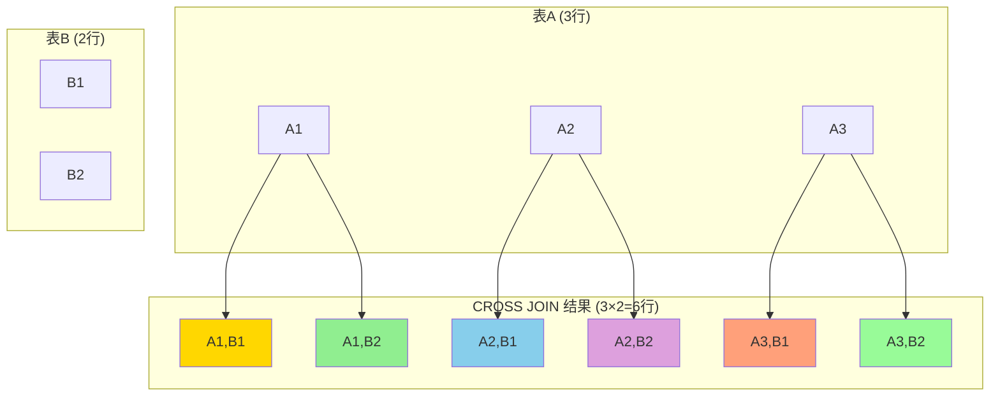
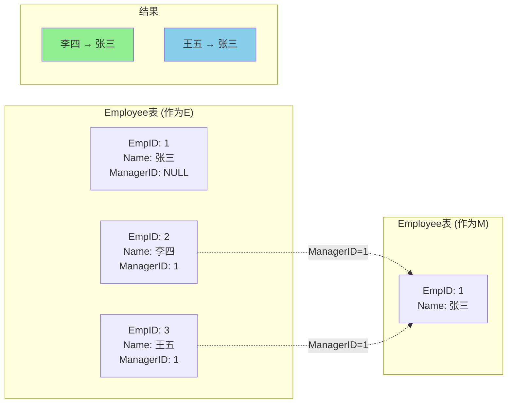

# 交叉连接与自连接

## 📌 交叉连接 (CROSS JOIN)

### 什么是交叉连接

交叉连接返回两个表的笛卡尔积（Cartesian Product），即第一个表的每一行与第二个表的每一行进行组合。

**结果集大小 = 表1行数 × 表2行数**

### 交叉连接示意图



### 基本语法

```sql
-- 显式交叉连接
SELECT *
FROM 表1
CROSS JOIN 表2;

-- 隐式交叉连接（逗号连接）
SELECT *
FROM 表1, 表2;
```

### 示例

```sql
-- 假设 Student 表有 3 行，Course 表有 5 行
SELECT S.Sname, C.Cname
FROM Student S
CROSS JOIN Course C;
-- 结果将有 3 × 5 = 15 行
```

### 实际应用场景

#### 场景1：生成所有可能的组合

```sql
-- 生成所有学生-课程的可能组合（用于初始化选课表）
SELECT S.Sno, C.Cno
FROM Student S
CROSS JOIN Course C;
```

#### 场景2：生成日期序列

```sql
-- 生成一个月的日期（使用数字表交叉连接）
SELECT DATE_ADD('2024-01-01', INTERVAL (t1.n + t2.n*10) DAY) AS Date
FROM 
    (SELECT 0 AS n UNION SELECT 1 UNION SELECT 2 UNION SELECT 3 UNION SELECT 4 
     UNION SELECT 5 UNION SELECT 6 UNION SELECT 7 UNION SELECT 8 UNION SELECT 9) t1
CROSS JOIN
    (SELECT 0 AS n UNION SELECT 1 UNION SELECT 2 UNION SELECT 3) t2
WHERE (t1.n + t2.n*10) < 31;
```

#### 场景3：创建测试数据

```sql
-- 为每个部门的每个职位生成工资等级
SELECT D.DeptName, P.Position, SL.Level
FROM Department D
CROSS JOIN Position P
CROSS JOIN SalaryLevel SL;
```

### ⚠️ 注意事项

1. **性能问题**
   - 交叉连接会产生大量数据
   - 避免在大表上使用无条件的交叉连接
   - 应该在 WHERE 子句中添加过滤条件

2. **实际使用**
   - 实际开发中较少直接使用
   - 通常会添加 WHERE 条件转换为内连接
   - 主要用于生成测试数据或特殊需求

```sql
-- 交叉连接 + WHERE 实际上是内连接
SELECT S.Sname, SC.Grade
FROM Student S
CROSS JOIN SC
WHERE S.Sno = SC.Sno;  -- 等价于 INNER JOIN
```

---

## 📌 自连接 (Self JOIN)

### 什么是自连接

自连接是表与自身进行连接，用于比较同一表中的不同行。

**关键点：**
- 同一个表作为两个不同的表参与连接
- 必须使用表别名区分
- 可以使用内连接、外连接等任何连接类型

### 自连接示意图



### 基本语法

```sql
SELECT A.列名, B.列名
FROM 表名 A
JOIN 表名 B
ON A.列名 = B.列名
WHERE 条件;
```

### 典型应用场景

#### 场景1：层次结构查询（员工-上级关系）

```sql
-- 员工表结构
CREATE TABLE Employee (
    EmpID INT,
    EmpName VARCHAR(50),
    ManagerID INT  -- 上级ID
);

-- 查询每个员工及其上级的姓名
SELECT 
    E.EmpName AS Employee,
    M.EmpName AS Manager
FROM Employee E
LEFT JOIN Employee M ON E.ManagerID = M.EmpID;
```

#### 场景2：比较同一表中的不同记录

```sql
-- 查询比"张三"成绩高的所有学生
SELECT S2.Sname, S2.Grade
FROM Score S1
JOIN Score S2 ON S1.Cno = S2.Cno
WHERE S1.Sname = '张三' AND S2.Grade > S1.Grade;
```

#### 场景3：查找成对数据

```sql
-- 查询选修了相同课程的学生对
SELECT 
    SC1.Sno AS Student1,
    SC2.Sno AS Student2,
    SC1.Cno AS Course
FROM SC SC1
JOIN SC SC2 ON SC1.Cno = SC2.Cno
WHERE SC1.Sno < SC2.Sno;  -- 避免重复和自我配对
```

**结果示例：**
```
Student1 | Student2 | Course
---------|----------|-------
S001     | S002     | C001
S001     | S003     | C001
S002     | S003     | C001
```

#### 场景4：查找序列或间隔

```sql
-- 查询成绩相差不超过5分的学生对
SELECT 
    S1.Sname AS Student1,
    S1.Grade AS Grade1,
    S2.Sname AS Student2,
    S2.Grade AS Grade2
FROM Score S1
JOIN Score S2 ON S1.Cno = S2.Cno
WHERE S1.Sno < S2.Sno 
  AND ABS(S1.Grade - S2.Grade) <= 5;
```

#### 场景5：查找重复记录

```sql
-- 查找同名学生
SELECT 
    S1.Sno AS Sno1,
    S2.Sno AS Sno2,
    S1.Sname
FROM Student S1
JOIN Student S2 ON S1.Sname = S2.Sname
WHERE S1.Sno < S2.Sno;
```

### 高级应用：递归查询

#### 场景6：查询组织结构树

```sql
-- 使用递归 CTE (Common Table Expression) 查询完整的组织层次
WITH RECURSIVE OrgTree AS (
    -- 基础查询：顶级员工
    SELECT EmpID, EmpName, ManagerID, 1 AS Level
    FROM Employee
    WHERE ManagerID IS NULL
    
    UNION ALL
    
    -- 递归查询：下级员工
    SELECT E.EmpID, E.EmpName, E.ManagerID, OT.Level + 1
    FROM Employee E
    JOIN OrgTree OT ON E.ManagerID = OT.EmpID
)
SELECT * FROM OrgTree ORDER BY Level, EmpID;
```

#### 场景7：查找路径

```sql
-- 查询从起点到终点的所有路径（图论问题）
WITH RECURSIVE Paths AS (
    -- 起点
    SELECT 
        NodeID,
        TargetID,
        CAST(NodeID AS CHAR(100)) AS Path,
        1 AS Depth
    FROM Graph
    WHERE NodeID = 'A'  -- 起点
    
    UNION ALL
    
    -- 递归扩展路径
    SELECT 
        G.NodeID,
        G.TargetID,
        CONCAT(P.Path, '->', G.TargetID),
        P.Depth + 1
    FROM Graph G
    JOIN Paths P ON G.NodeID = P.TargetID
    WHERE P.Depth < 10  -- 防止无限递归
      AND FIND_IN_SET(G.TargetID, REPLACE(P.Path, '->', ',')) = 0  -- 避免环路
)
SELECT Path
FROM Paths
WHERE TargetID = 'E';  -- 终点
```

### 💡 自连接优化技巧

1. **避免自我配对**
```sql
-- 使用 < 而不是 !=
WHERE T1.ID < T2.ID  -- 好：避免重复和自我配对

-- 不推荐
WHERE T1.ID != T2.ID  -- 差：包含重复配对
```

2. **使用索引**
```sql
-- 在连接列上创建索引
CREATE INDEX idx_manager ON Employee(ManagerID);
CREATE INDEX idx_emp ON Employee(EmpID);
```

3. **限制递归深度**
```sql
-- 防止无限递归
WHERE Depth < 10
```

## 📊 性能比较

| 连接类型 | 结果集 | 性能 | 复杂度 | 使用频率 |
|---------|-------|------|--------|---------|
| 交叉连接 | N×M | ⚠️ 慢 | 低 | ⭐ |
| 简单自连接 | 变化大 | 中等 | 中 | ⭐⭐⭐ |
| 递归自连接 | 变化大 | ⚠️ 慢 | 高 | ⭐⭐ |

## 📝 练习题

### 交叉连接练习
1. 生成所有学生与所有课程的配对表
2. 使用交叉连接生成1-100的数字序列
3. 创建一个日期维度表（包含一年的所有日期）

### 自连接练习
1. 查询每个学生的成绩及其与班级平均分的差值
2. 找出选修课程数量相同的学生对
3. 查询员工的完整管理层次（员工→直接上级→间接上级→...→CEO）
4. 找出所有"先修课程"关系（课程A是课程B的先修课程）

## ⚠️ 常见错误

### 错误1：忘记使用表别名
```sql
-- 错误：无法区分是哪个表的列
SELECT Sname, Grade
FROM Student
JOIN Student ON Student.Sno = Student.Sno;

-- 正确
SELECT S1.Sname, S2.Grade
FROM Student S1
JOIN Student S2 ON S1.Sno = S2.Sno;
```

### 错误2：交叉连接忘记添加过滤条件
```sql
-- 危险：会产生巨大的结果集
SELECT * FROM BigTable1 CROSS JOIN BigTable2;

-- 应该添加 WHERE 条件
SELECT * FROM BigTable1 CROSS JOIN BigTable2 WHERE 条件;
```

### 错误3：递归查询没有终止条件
```sql
-- 错误：可能无限递归
WITH RECURSIVE Tree AS (
    SELECT * FROM Node WHERE ParentID IS NULL
    UNION ALL
    SELECT N.* FROM Node N JOIN Tree T ON N.ParentID = T.ID
)
SELECT * FROM Tree;

-- 正确：添加深度限制
WITH RECURSIVE Tree AS (
    SELECT *, 1 AS Level FROM Node WHERE ParentID IS NULL
    UNION ALL
    SELECT N.*, T.Level + 1 
    FROM Node N 
    JOIN Tree T ON N.ParentID = T.ID
    WHERE T.Level < 10  -- 终止条件
)
SELECT * FROM Tree;
```

## 🔗 相关内容

- [内连接详解](内连接详解.md)
- [外连接详解](外连接详解.md)
- [连接查询优化与实践](连接查询优化与实践.md)

