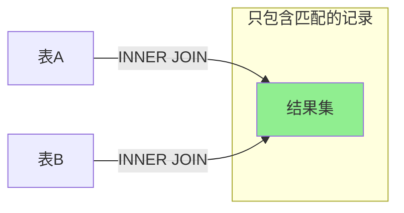
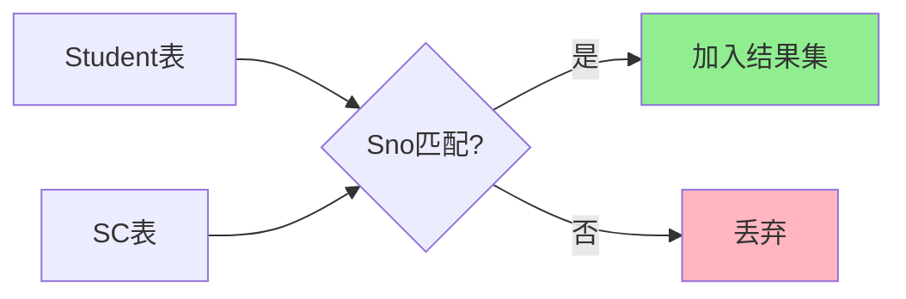
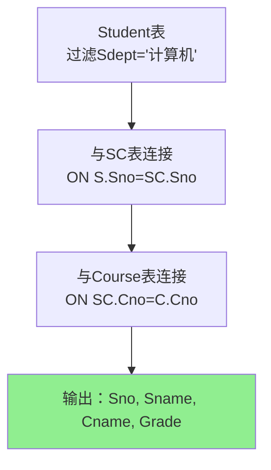
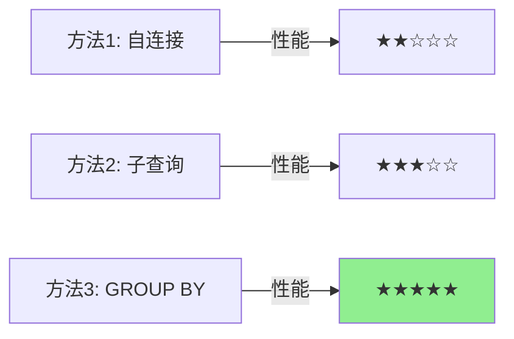
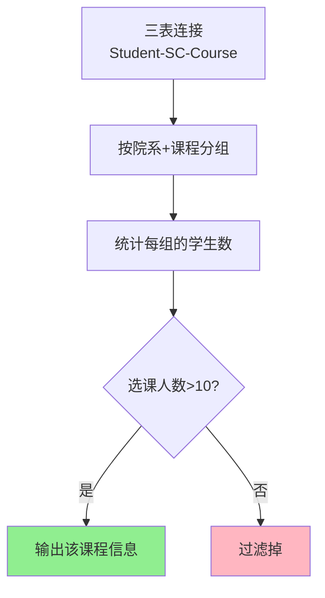

# 内连接详解 (INNER JOIN)

## 📌 什么是内连接

内连接（INNER JOIN）是最常用的连接类型，它返回两个表中满足连接条件的记录。只有当连接条件为真时，记录才会出现在结果集中。

### 内连接示意图



### 内连接文氏图


## 🔍 基本语法

```sql
SELECT 列名
FROM 表1
INNER JOIN 表2
ON 表1.列名 = 表2.列名;
```

或使用 WHERE 子句（传统写法）：

```sql
SELECT 列名
FROM 表1, 表2
WHERE 表1.列名 = 表2.列名;
```

## 📊 内连接的类型

### 1. 等值连接 (Equi Join)

使用等号（=）作为连接条件的连接。

**示例：**

```sql
-- 查询学生及其选课信息
SELECT Student.Sno, Student.Sname, SC.Cno, SC.Grade
FROM Student
INNER JOIN SC
ON Student.Sno = SC.Sno;
```

**执行过程：**
1. 扫描 Student 表和 SC 表
2. 对每一对记录检查连接条件 `Student.Sno = SC.Sno`
3. 条件为真的记录组合加入结果集

**数据流程图：**



### 2. 自然连接 (Natural Join)

自动匹配两个表中所有同名列的连接。

**示例：**

```sql
-- 自然连接（自动按同名列连接）
SELECT *
FROM Student
NATURAL JOIN SC;
```

**注意事项：**
- 自动消除重复列
- 使用所有同名列作为连接条件
- 可能产生意外结果，建议显式指定连接条件

### 3. 非等值连接 (Non-Equi Join)

使用除等号以外的比较运算符（<, >, <=, >=, !=）的连接。

**示例：**

```sql
-- 查询每个学生的成绩等级
SELECT Student.Sname, SC.Grade, GradeLevel.Level
FROM Student
INNER JOIN SC ON Student.Sno = SC.Sno
INNER JOIN GradeLevel ON SC.Grade BETWEEN GradeLevel.LowScore AND GradeLevel.HighScore;
```

## 💡 实际应用场景

### 场景1：查询学生选课详情

```sql
-- 查询学生姓名、课程名称和成绩
SELECT S.Sno, S.Sname, C.Cname, SC.Grade
FROM Student S
INNER JOIN SC ON S.Sno = SC.Sno
INNER JOIN Course C ON SC.Cno = C.Cno;
```

### 场景2：多表连接

```sql
-- 查询选修了"数据库"课程的学生信息及成绩
SELECT S.Sno, S.Sname, S.Sdept, SC.Grade
FROM Student S
INNER JOIN SC ON S.Sno = SC.Sno
INNER JOIN Course C ON SC.Cno = C.Cno
WHERE C.Cname = '数据库';
```

### 场景3：带聚合函数的连接

```sql
-- 查询每个学生的平均成绩
SELECT S.Sno, S.Sname, AVG(SC.Grade) AS AvgGrade
FROM Student S
INNER JOIN SC ON S.Sno = SC.Sno
GROUP BY S.Sno, S.Sname
HAVING AVG(SC.Grade) > 80;
```

## ⚠️ 注意事项

1. **NULL 值处理**
   - 内连接会自动排除包含 NULL 的记录
   - 如果连接列存在 NULL，该记录不会出现在结果中

2. **性能考虑**
   - 在连接列上建立索引可以显著提高查询效率
   - 连接顺序会影响性能（小表驱动大表）
   - 尽量减少连接表的数量

3. **表别名**
   - 使用别名可以简化 SQL 语句
   - 避免列名歧义
   - 提高代码可读性

## 📝 练习题

### 题目

1. 查询计算机系学生的选课情况（学号、姓名、课程名、成绩）
2. 查询同时选修了"数据库"和"操作系统"两门课程的学生
3. 查询每个院系选课人数超过10人的课程信息

---

### 答案与详解

#### 练习1：查询计算机系学生的选课情况

**答案：**
```sql
SELECT S.Sno, S.Sname, C.Cname, SC.Grade
FROM Student S
INNER JOIN SC ON S.Sno = SC.Sno
INNER JOIN Course C ON SC.Cno = C.Cno
WHERE S.Sdept = '计算机';
```

**详解：**
- **连接顺序**：Student → SC → Course（三表连接）
- **连接条件**：
  - `S.Sno = SC.Sno`：关联学生和选课记录
  - `SC.Cno = C.Cno`：关联选课记录和课程信息
- **过滤条件**：`S.Sdept = '计算机'`（只查询计算机系学生）
- **优化建议**：在 `Student.Sdept`、`SC.Sno`、`SC.Cno` 上建立索引

**执行流程：**


#### 练习2：查询同时选修了"数据库"和"操作系统"的学生

**答案：**
```sql
-- 方法1：使用自连接
SELECT DISTINCT S.Sno, S.Sname
FROM Student S
INNER JOIN SC SC1 ON S.Sno = SC1.Sno
INNER JOIN Course C1 ON SC1.Cno = C1.Cno
INNER JOIN SC SC2 ON S.Sno = SC2.Sno
INNER JOIN Course C2 ON SC2.Cno = C2.Cno
WHERE C1.Cname = '数据库' 
  AND C2.Cname = '操作系统';

-- 方法2：使用子查询（更简洁）
SELECT S.Sno, S.Sname
FROM Student S
WHERE S.Sno IN (
    SELECT SC.Sno FROM SC
    INNER JOIN Course C ON SC.Cno = C.Cno
    WHERE C.Cname = '数据库'
)
AND S.Sno IN (
    SELECT SC.Sno FROM SC
    INNER JOIN Course C ON SC.Cno = C.Cno
    WHERE C.Cname = '操作系统'
);

-- 方法3：使用GROUP BY和HAVING（推荐，性能最好）
SELECT S.Sno, S.Sname
FROM Student S
INNER JOIN SC ON S.Sno = SC.Sno
INNER JOIN Course C ON SC.Cno = C.Cno
WHERE C.Cname IN ('数据库', '操作系统')
GROUP BY S.Sno, S.Sname
HAVING COUNT(DISTINCT C.Cname) = 2;
```

**详解：**
- **难点**：需要确保学生"同时"选修两门课程
- **方法1（自连接）**：
  - 将 SC 表自连接，SC1 匹配"数据库"，SC2 匹配"操作系统"
  - 需要 DISTINCT 去重
- **方法2（子查询）**：
  - 两个独立的子查询分别查找选修两门课的学生
  - 使用 AND 确保同时满足
- **方法3（GROUP BY）**：**最推荐**
  - 先筛选出选修了这两门课的所有记录
  - 按学生分组，统计不同课程数
  - HAVING 确保恰好选修了2门（都选修）

**性能对比：**


#### 练习3：查询每个院系选课人数超过10人的课程信息

**答案：**
```sql
SELECT S.Sdept, C.Cno, C.Cname, COUNT(DISTINCT S.Sno) AS StudentCount
FROM Student S
INNER JOIN SC ON S.Sno = SC.Sno
INNER JOIN Course C ON SC.Cno = C.Cno
GROUP BY S.Sdept, C.Cno, C.Cname
HAVING COUNT(DISTINCT S.Sno) > 10
ORDER BY S.Sdept, StudentCount DESC;
```

**详解：**
- **关键点**：
  - 按"院系"和"课程"双维度分组
  - 使用 `COUNT(DISTINCT S.Sno)` 统计不同学生数（避免重复计数）
  - HAVING 子句过滤选课人数 > 10 的组
- **注意事项**：
  - 不能用 `COUNT(*)` 或 `COUNT(S.Sno)`，因为可能有重复记录
  - GROUP BY 必须包含 SELECT 中的非聚合列
- **结果解读**：每行代表一个院系的一门课程及其选课人数

**查询逻辑图：**


**示例结果：**
```
Sdept    | Cno  | Cname        | StudentCount
---------|------|--------------|-------------
计算机   | C001 | 数据库       | 15
计算机   | C002 | 操作系统     | 12
电子     | C001 | 数据库       | 11
```

## 🔗 相关内容

- [外连接详解](外连接详解.md)
- [交叉连接与自连接](交叉连接与自连接.md)
- [连接查询优化与实践](连接查询优化与实践.md)

