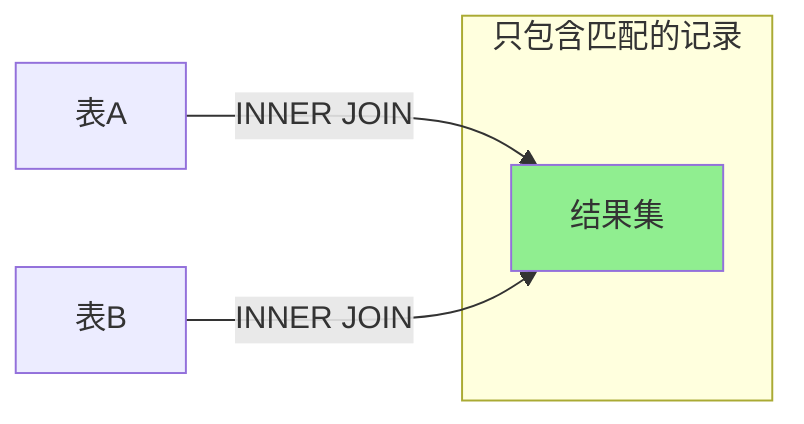
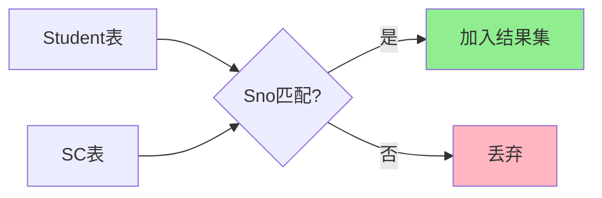
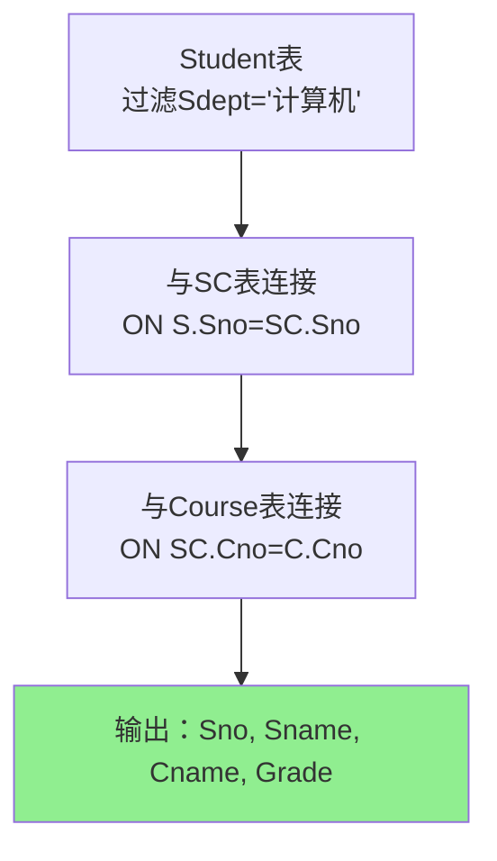
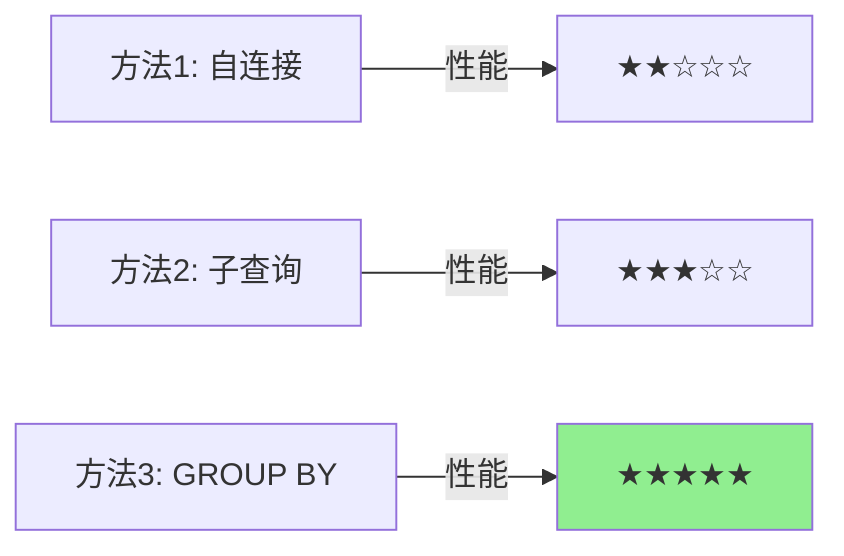
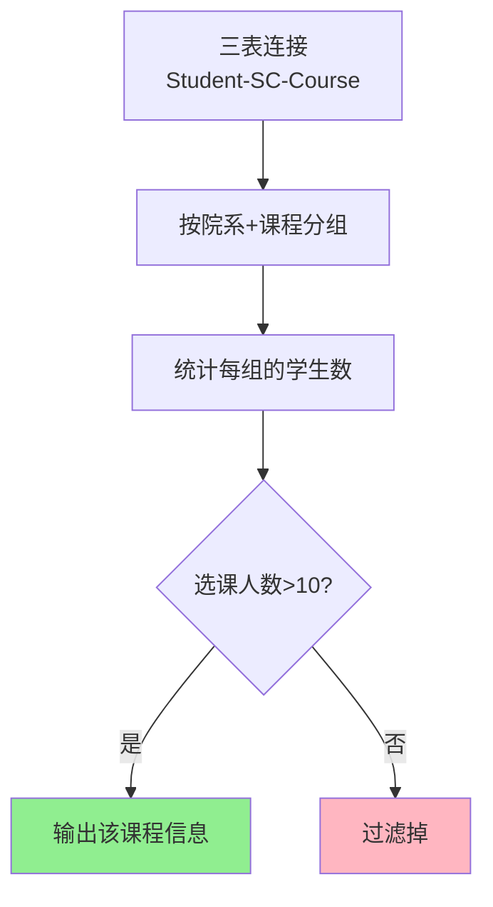

# 内连接详解 (INNER JOIN)

## 📌 什么是内连接

内连接（INNER JOIN）是最常用的连接类型，**只返回两个表中都有匹配的记录**。

**通俗理解：** 就像两个班级的学生互相配对，只有双方都存在的配对才会出现在结果中。

### 📊 示例数据准备

为了更好地理解内连接，我们先准备一些示例数据：

**Student 表（学生表）：**
```
+------+--------+--------+------+
| Sno  | Sname  | Ssex   | Sage |
+------+--------+--------+------+
| S001 | 张三   | 男     | 20   |
| S002 | 李四   | 女     | 19   |
| S003 | 王五   | 男     | 21   |
| S004 | 赵六   | 女     | 20   |
+------+--------+--------+------+
```

**SC 表（选课表）：**
```
+------+------+-------+
| Sno  | Cno  | Grade |
+------+------+-------+
| S001 | C001 | 90    |
| S001 | C002 | 85    |
| S002 | C001 | 88    |
| S003 | C003 | 92    |
+------+------+-------+
```

**注意：** S004（赵六）没有选任何课，SC表中也没有她的记录！

### 🎯 内连接的核心概念

**内连接只返回"匹配"的记录：**
- 张三（S001）在 SC 表中有选课记录 → ✅ **会出现在结果中**
- 李四（S002）在 SC 表中有选课记录 → ✅ **会出现在结果中**
- 王五（S003）在 SC 表中有选课记录 → ✅ **会出现在结果中**
- 赵六（S004）在 SC 表中没有记录 → ❌ **不会出现在结果中**

### 内连接示意图



### 内连接文氏图


## 🔍 基本语法

```sql
SELECT 列名
FROM 表1
INNER JOIN 表2
ON 表1.列名 = 表2.列名;
```

或使用 WHERE 子句（传统写法）：

```sql
SELECT 列名
FROM 表1, 表2
WHERE 表1.列名 = 表2.列名;
```

## 🌟 第一个完整示例

让我们用上面的数据做一个完整的内连接查询：

```sql
-- 查询学生及其选课信息
SELECT Student.Sno, Student.Sname, SC.Cno, SC.Grade
FROM Student
INNER JOIN SC
ON Student.Sno = SC.Sno;
```

**执行结果：**
```
+------+--------+------+-------+
| Sno  | Sname  | Cno  | Grade |
+------+--------+------+-------+
| S001 | 张三   | C001 | 90    |  ← 张三的第1门课
| S001 | 张三   | C002 | 85    |  ← 张三的第2门课
| S002 | 李四   | C001 | 88    |  ← 李四的课
| S003 | 王五   | C003 | 92    |  ← 王五的课
+------+--------+------+-------+
```

**关键观察：**
- ✅ 张三选了2门课，所以出现了2行
- ✅ 李四、王五各选了1门课，各出现1行
- ❌ **赵六（S004）没有出现！** 因为她没有选课记录，内连接不会保留她

**为什么赵六不见了？** 因为内连接要求两个表都有匹配的记录。赵六在 Student 表中存在，但在 SC 表中不存在，所以被过滤掉了。

## 📊 内连接的类型

### 1. 等值连接 (Equi Join)

**什么是等值连接？** 就是用等号（=）连接两个表的列。这是最常见的连接方式。

#### 示例1：基础等值连接

**需求：** 我想知道每个学生选了什么课，成绩多少？

```sql
SELECT Student.Sno, Student.Sname, SC.Cno, SC.Grade
FROM Student
INNER JOIN SC
ON Student.Sno = SC.Sno;  -- 等号连接！
```

**执行过程（逐步演示）：**

```
第1步：取 Student 表第1行（张三 S001）
  → 在 SC 表中找所有 Sno = 'S001' 的记录
  → 找到2条：(S001, C001, 90) 和 (S001, C002, 85)
  → 生成2行结果

第2步：取 Student 表第2行（李四 S002）
  → 在 SC 表中找所有 Sno = 'S002' 的记录
  → 找到1条：(S002, C001, 88)
  → 生成1行结果

第3步：取 Student 表第3行（王五 S003）
  → 在 SC 表中找所有 Sno = 'S003' 的记录
  → 找到1条：(S003, C003, 92)
  → 生成1行结果

第4步：取 Student 表第4行（赵六 S004）
  → 在 SC 表中找所有 Sno = 'S004' 的记录
  → 找到0条！
  → 不生成结果（被过滤掉）
```

**最终结果：** 共4行（张三2行 + 李四1行 + 王五1行）

**数据流程图：**



#### 示例2：三表等值连接

现在我们再加一个 Course 表（课程表）：

**Course 表：**
```
+------+--------------+--------+
| Cno  | Cname        | Credit |
+------+--------------+--------+
| C001 | 数据库       | 4      |
| C002 | 操作系统     | 3      |
| C003 | 计算机网络   | 3      |
| C004 | 人工智能     | 4      |  ← 注意：没人选这门课
+------+--------------+--------+
```

**需求：** 我想知道每个学生选了什么课（显示课程名），成绩多少？

```sql
SELECT S.Sno, S.Sname, C.Cname, SC.Grade
FROM Student S
INNER JOIN SC ON S.Sno = SC.Sno       -- 第一次连接
INNER JOIN Course C ON SC.Cno = C.Cno  -- 第二次连接
ORDER BY S.Sno;
```

**执行结果：**
```
+------+--------+--------------+-------+
| Sno  | Sname  | Cname        | Grade |
+------+--------+--------------+-------+
| S001 | 张三   | 数据库       | 90    |
| S001 | 张三   | 操作系统     | 85    |
| S002 | 李四   | 数据库       | 88    |
| S003 | 王五   | 计算机网络   | 92    |
+------+--------+--------------+-------+
```

**观察：**
- ❌ 赵六（S004）仍然不见了（她没选课）
- ❌ 人工智能课程（C004）也不见了（没人选）
- ✅ 只显示了"有学生选"且"存在课程信息"的记录

### 2. 自然连接 (Natural Join)

**什么是自然连接？** 数据库自动找两个表中同名的列，然后用这些列进行连接。**不需要你写 ON 条件！**

**⚠️ 警告：** 虽然方便，但很危险！容易出错，实际工作中不推荐使用。

#### 示例：自然连接的效果

```sql
-- 自然连接（数据库自动找同名列 Sno）
SELECT *
FROM Student
NATURAL JOIN SC;
```

**数据库的自动处理：**
```
1. 数据库发现两个表都有 Sno 列
2. 自动生成连接条件：Student.Sno = SC.Sno
3. 自动去掉重复的 Sno 列（只保留一个）
```

**结果：**
```
+------+--------+------+------+------+-------+
| Sno  | Sname  | Ssex | Sage | Cno  | Grade |
+------+--------+------+------+------+-------+
| S001 | 张三   | 男   | 20   | C001 | 90    |
| S001 | 张三   | 男   | 20   | C002 | 85    |
| S002 | 李四   | 女   | 19   | C001 | 88    |
| S003 | 王五   | 男   | 21   | C003 | 92    |
+------+--------+------+------+------+-------+
```

**等价于：**
```sql
SELECT Student.Sno, Sname, Ssex, Sage, Cno, Grade
FROM Student
INNER JOIN SC ON Student.Sno = SC.Sno;
```

#### ⚠️ 为什么不推荐？

**危险示例：** 假如两个表有多个同名列

```sql
-- 假设 Student 和 SC 表都有 UpdateTime 列（更新时间）
-- NATURAL JOIN 会同时用 Sno 和 UpdateTime 连接！
SELECT *
FROM Student
NATURAL JOIN SC;
-- 等价于：ON Student.Sno = SC.Sno AND Student.UpdateTime = SC.UpdateTime
-- 结果可能完全不是你想要的！
```

**建议：** 始终使用显式的 INNER JOIN ... ON 语法，清楚地指定连接条件。

### 3. 非等值连接 (Non-Equi Join)

**什么是非等值连接？** 不用等号（=），而是用其他比较符号：`>`, `<`, `>=`, `<=`, `BETWEEN`, `!=` 等。

**实际场景：** 根据分数范围给成绩评级。

#### 示例数据准备

**GradeLevel 表（成绩等级表）：**
```
+-------+----------+-----------+
| Level | LowScore | HighScore |
+-------+----------+-----------+
| A     | 90       | 100       |
| B     | 80       | 89        |
| C     | 70       | 79        |
| D     | 60       | 69        |
| F     | 0        | 59        |
+-------+----------+-----------+
```

**需求：** 我想知道每个学生的成绩是什么等级（A/B/C/D/F）？

```sql
SELECT S.Sname, SC.Cno, SC.Grade, GL.Level
FROM Student S
INNER JOIN SC ON S.Sno = SC.Sno  -- 等值连接
INNER JOIN GradeLevel GL 
  ON SC.Grade BETWEEN GL.LowScore AND GL.HighScore;  -- 非等值连接！
```

**执行过程（以张三的数据库课90分为例）：**
```
1. 张三的数据库课 Grade = 90
2. 检查 GradeLevel 表：
   - 90 BETWEEN 90 AND 100? ✅ 是的！→ Level = 'A'
   - 90 BETWEEN 80 AND 89?  ✗ 不是
   - 90 BETWEEN 70 AND 79?  ✗ 不是
   ...
3. 找到匹配：等级 A
```

**执行结果：**
```
+--------+------+-------+-------+
| Sname  | Cno  | Grade | Level |
+--------+------+-------+-------+
| 张三   | C001 | 90    | A     |  ← 90分 → A等级
| 张三   | C002 | 85    | B     |  ← 85分 → B等级
| 李四   | C001 | 88    | B     |  ← 88分 → B等级
| 王五   | C003 | 92    | A     |  ← 92分 → A等级
+--------+------+-------+-------+
```

#### 其他非等值连接示例

**示例：找出成绩相近的学生对（分数差不超过5分）**

```sql
SELECT 
    S1.Sname AS Student1,
    SC1.Grade AS Grade1,
    S2.Sname AS Student2,
    SC2.Grade AS Grade2,
    ABS(SC1.Grade - SC2.Grade) AS Difference
FROM Student S1
JOIN SC SC1 ON S1.Sno = SC1.Sno
JOIN Student S2 ON S1.Sno < S2.Sno  -- 避免重复配对
JOIN SC SC2 ON S2.Sno = SC2.Sno
WHERE SC1.Cno = SC2.Cno  -- 同一门课
  AND ABS(SC1.Grade - SC2.Grade) <= 5;  -- 非等值条件！
```

**假设结果：**
```
+----------+--------+----------+--------+------------+
| Student1 | Grade1 | Student2 | Grade2 | Difference |
+----------+--------+----------+--------+------------+
| 张三     | 90     | 李四     | 88     | 2          |  ← 两人分数只差2分
+----------+--------+----------+--------+------------+
```

## 💡 实际应用场景

### 场景1：查询学生选课详情

```sql
-- 查询学生姓名、课程名称和成绩
SELECT S.Sno, S.Sname, C.Cname, SC.Grade
FROM Student S
INNER JOIN SC ON S.Sno = SC.Sno
INNER JOIN Course C ON SC.Cno = C.Cno;
```

### 场景2：多表连接

```sql
-- 查询选修了"数据库"课程的学生信息及成绩
SELECT S.Sno, S.Sname, S.Sdept, SC.Grade
FROM Student S
INNER JOIN SC ON S.Sno = SC.Sno
INNER JOIN Course C ON SC.Cno = C.Cno
WHERE C.Cname = '数据库';
```

### 场景3：带聚合函数的连接

```sql
-- 查询每个学生的平均成绩
SELECT S.Sno, S.Sname, AVG(SC.Grade) AS AvgGrade
FROM Student S
INNER JOIN SC ON S.Sno = SC.Sno
GROUP BY S.Sno, S.Sname
HAVING AVG(SC.Grade) > 80;
```

## ⚠️ 注意事项

1. **NULL 值处理**
   - 内连接会自动排除包含 NULL 的记录
   - 如果连接列存在 NULL，该记录不会出现在结果中

2. **性能考虑**
   - 在连接列上建立索引可以显著提高查询效率
   - 连接顺序会影响性能（小表驱动大表）
   - 尽量减少连接表的数量

3. **表别名**
   - 使用别名可以简化 SQL 语句
   - 避免列名歧义
   - 提高代码可读性

## 📝 练习题

### 题目

1. 查询计算机系学生的选课情况（学号、姓名、课程名、成绩）
2. 查询同时选修了"数据库"和"操作系统"两门课程的学生
3. 查询每个院系选课人数超过10人的课程信息

---

### 答案与详解

#### 练习1：查询计算机系学生的选课情况

**答案：**
```sql
SELECT S.Sno, S.Sname, C.Cname, SC.Grade
FROM Student S
INNER JOIN SC ON S.Sno = SC.Sno
INNER JOIN Course C ON SC.Cno = C.Cno
WHERE S.Sdept = '计算机';
```

**详解：**
- **连接顺序**：Student → SC → Course（三表连接）
- **连接条件**：
  - `S.Sno = SC.Sno`：关联学生和选课记录
  - `SC.Cno = C.Cno`：关联选课记录和课程信息
- **过滤条件**：`S.Sdept = '计算机'`（只查询计算机系学生）
- **优化建议**：在 `Student.Sdept`、`SC.Sno`、`SC.Cno` 上建立索引

**执行流程：**


#### 练习2：查询同时选修了"数据库"和"操作系统"的学生

**答案：**
```sql
-- 方法1：使用自连接
SELECT DISTINCT S.Sno, S.Sname
FROM Student S
INNER JOIN SC SC1 ON S.Sno = SC1.Sno
INNER JOIN Course C1 ON SC1.Cno = C1.Cno
INNER JOIN SC SC2 ON S.Sno = SC2.Sno
INNER JOIN Course C2 ON SC2.Cno = C2.Cno
WHERE C1.Cname = '数据库' 
  AND C2.Cname = '操作系统';

-- 方法2：使用子查询（更简洁）
SELECT S.Sno, S.Sname
FROM Student S
WHERE S.Sno IN (
    SELECT SC.Sno FROM SC
    INNER JOIN Course C ON SC.Cno = C.Cno
    WHERE C.Cname = '数据库'
)
AND S.Sno IN (
    SELECT SC.Sno FROM SC
    INNER JOIN Course C ON SC.Cno = C.Cno
    WHERE C.Cname = '操作系统'
);

-- 方法3：使用GROUP BY和HAVING（推荐，性能最好）
SELECT S.Sno, S.Sname
FROM Student S
INNER JOIN SC ON S.Sno = SC.Sno
INNER JOIN Course C ON SC.Cno = C.Cno
WHERE C.Cname IN ('数据库', '操作系统')
GROUP BY S.Sno, S.Sname
HAVING COUNT(DISTINCT C.Cname) = 2;
```

**详解：**
- **难点**：需要确保学生"同时"选修两门课程
- **方法1（自连接）**：
  - 将 SC 表自连接，SC1 匹配"数据库"，SC2 匹配"操作系统"
  - 需要 DISTINCT 去重
- **方法2（子查询）**：
  - 两个独立的子查询分别查找选修两门课的学生
  - 使用 AND 确保同时满足
- **方法3（GROUP BY）**：**最推荐**
  - 先筛选出选修了这两门课的所有记录
  - 按学生分组，统计不同课程数
  - HAVING 确保恰好选修了2门（都选修）

**性能对比：**


#### 练习3：查询每个院系选课人数超过10人的课程信息

**答案：**
```sql
SELECT S.Sdept, C.Cno, C.Cname, COUNT(DISTINCT S.Sno) AS StudentCount
FROM Student S
INNER JOIN SC ON S.Sno = SC.Sno
INNER JOIN Course C ON SC.Cno = C.Cno
GROUP BY S.Sdept, C.Cno, C.Cname
HAVING COUNT(DISTINCT S.Sno) > 10
ORDER BY S.Sdept, StudentCount DESC;
```

**详解：**
- **关键点**：
  - 按"院系"和"课程"双维度分组
  - 使用 `COUNT(DISTINCT S.Sno)` 统计不同学生数（避免重复计数）
  - HAVING 子句过滤选课人数 > 10 的组
- **注意事项**：
  - 不能用 `COUNT(*)` 或 `COUNT(S.Sno)`，因为可能有重复记录
  - GROUP BY 必须包含 SELECT 中的非聚合列
- **结果解读**：每行代表一个院系的一门课程及其选课人数

**查询逻辑图：**


**示例结果：**
```
Sdept    | Cno  | Cname        | StudentCount
---------|------|--------------|-------------
计算机   | C001 | 数据库       | 15
计算机   | C002 | 操作系统     | 12
电子     | C001 | 数据库       | 11
```

## 🔗 相关内容

- [外连接详解](外连接详解.md)
- [交叉连接与自连接](交叉连接与自连接.md)
- [连接查询优化与实践](连接查询优化与实践.md)

