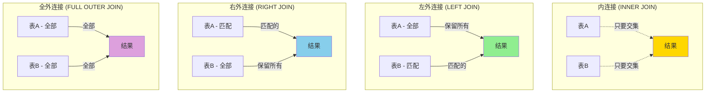
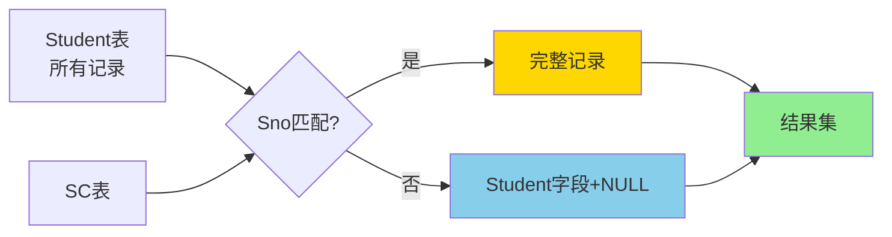
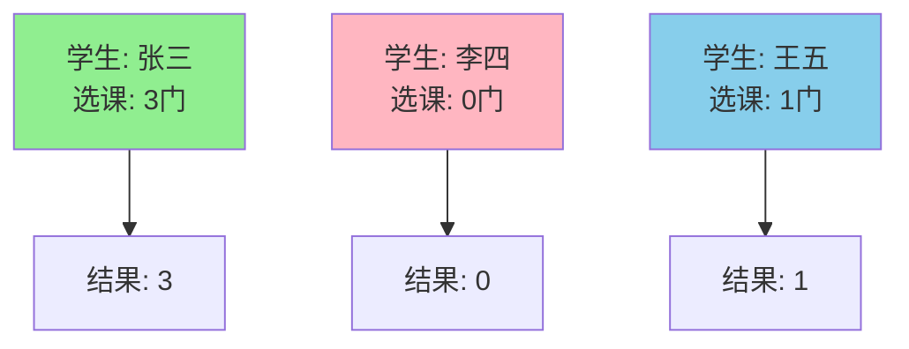
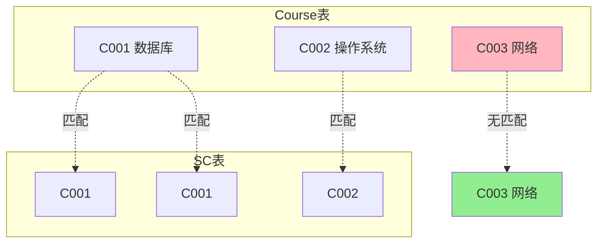
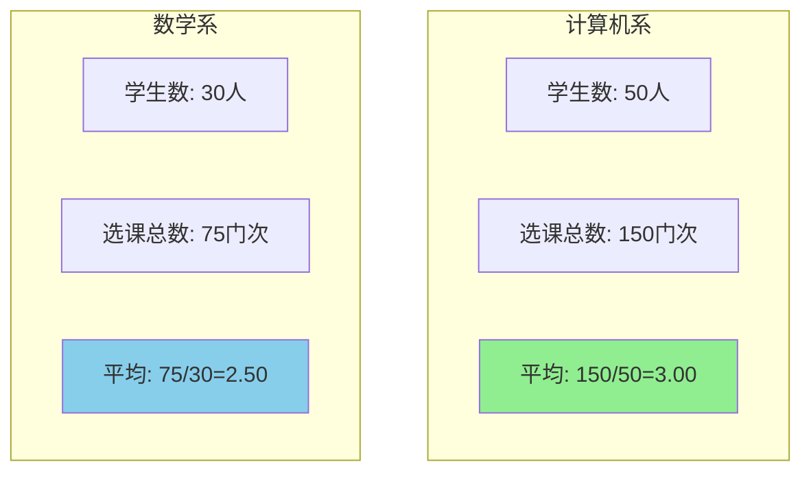
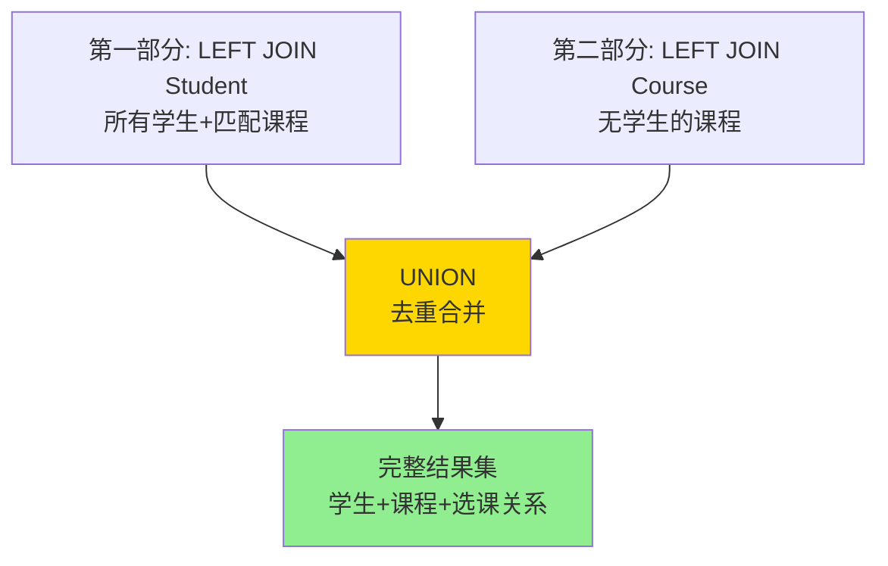

# 外连接详解 (OUTER JOIN)

## 📌 什么是外连接

外连接（OUTER JOIN）不仅返回满足连接条件的记录，还会返回不满足连接条件的记录，用 NULL 填充缺失的列值。

**与内连接的区别：**
- **内连接**：只返回匹配的记录
- **外连接**：返回匹配的记录 + 不匹配的记录（用 NULL 填充）

### 内连接 vs 外连接对比图



## 🔍 外连接的类型

### 1. 左外连接 (LEFT OUTER JOIN / LEFT JOIN)

保留左表的所有记录，即使右表没有匹配的记录。

**语法：**
```sql
SELECT 列名
FROM 表1
LEFT JOIN 表2
ON 表1.列名 = 表2.列名;
```

**示例：**

```sql
-- 查询所有学生及其选课情况（包括未选课的学生）
SELECT S.Sno, S.Sname, SC.Cno, SC.Grade
FROM Student S
LEFT JOIN SC ON S.Sno = SC.Sno;
```

**结果说明：**
- 所有学生都会出现在结果中
- 没有选课的学生，SC.Cno 和 SC.Grade 显示为 NULL

**数据流程图：**



**应用场景：**
- 查询所有客户及其订单（包括没有订单的客户）
- 查询所有部门及其员工（包括没有员工的部门）
- 找出未参与某项活动的人员

### 2. 右外连接 (RIGHT OUTER JOIN / RIGHT JOIN)

保留右表的所有记录，即使左表没有匹配的记录。

**语法：**
```sql
SELECT 列名
FROM 表1
RIGHT JOIN 表2
ON 表1.列名 = 表2.列名;
```

**示例：**

```sql
-- 查询所有课程及其选课学生（包括无人选修的课程）
SELECT C.Cno, C.Cname, S.Sno, S.Sname
FROM Student S
RIGHT JOIN Course C ON S.Sno = SC.Sno AND SC.Cno = C.Cno;
```

**注意：**
- 右外连接可以通过调整表的顺序改写为左外连接
- 实际开发中，左外连接更常用

**等价改写：**
```sql
-- 上面的右连接等价于：
SELECT C.Cno, C.Cname, S.Sno, S.Sname
FROM Course C
LEFT JOIN (SC INNER JOIN Student S ON SC.Sno = S.Sno) ON C.Cno = SC.Cno;
```

### 3. 全外连接 (FULL OUTER JOIN)

保留两个表的所有记录，不管是否有匹配。

**语法：**
```sql
SELECT 列名
FROM 表1
FULL OUTER JOIN 表2
ON 表1.列名 = 表2.列名;
```

**示例：**

```sql
-- 查询所有学生和所有课程的完整匹配情况
SELECT S.Sno, S.Sname, C.Cno, C.Cname, SC.Grade
FROM Student S
FULL OUTER JOIN SC ON S.Sno = SC.Sno
FULL OUTER JOIN Course C ON SC.Cno = C.Cno;
```

**结果包含：**
- 有选课记录的学生-课程组合
- 没有选课的学生（课程信息为 NULL）
- 没有学生选修的课程（学生信息为 NULL）

**注意：**
- MySQL 不直接支持 FULL OUTER JOIN
- 可以用 LEFT JOIN UNION RIGHT JOIN 实现

## 💡 实际应用场景

### 场景1：找出未选课的学生

```sql
-- 使用左外连接 + WHERE 过滤
SELECT S.Sno, S.Sname
FROM Student S
LEFT JOIN SC ON S.Sno = SC.Sno
WHERE SC.Sno IS NULL;
```

### 场景2：统计每个学生的选课数量（包括未选课的学生）

```sql
SELECT S.Sno, S.Sname, COUNT(SC.Cno) AS CourseCount
FROM Student S
LEFT JOIN SC ON S.Sno = SC.Sno
GROUP BY S.Sno, S.Sname;
```

**注意：**
- 使用 `COUNT(SC.Cno)` 而不是 `COUNT(*)`
- `COUNT(*)` 会统计 NULL 行，导致未选课学生显示为 1

### 场景3：查询学生选课情况，显示未选课原因

```sql
SELECT 
    S.Sno, 
    S.Sname,
    COALESCE(C.Cname, '未选课') AS CourseName,
    COALESCE(CAST(SC.Grade AS CHAR), '无成绩') AS Grade
FROM Student S
LEFT JOIN SC ON S.Sno = SC.Sno
LEFT JOIN Course C ON SC.Cno = C.Cno;
```

### 场景4：MySQL中实现全外连接

```sql
-- 使用 UNION 模拟 FULL OUTER JOIN
SELECT S.Sno, S.Sname, SC.Cno, SC.Grade
FROM Student S
LEFT JOIN SC ON S.Sno = SC.Sno

UNION

SELECT S.Sno, S.Sname, SC.Cno, SC.Grade
FROM SC
RIGHT JOIN Student S ON S.Sno = SC.Sno
WHERE S.Sno IS NULL;
```

## 🎯 NULL 值处理

### 1. 判断 NULL

```sql
-- 正确写法
WHERE SC.Sno IS NULL

-- 错误写法（不会得到预期结果）
WHERE SC.Sno = NULL
```

### 2. 处理 NULL（使用 COALESCE 或 IFNULL）

```sql
-- COALESCE：返回第一个非 NULL 值
SELECT S.Sname, COALESCE(SC.Grade, 0) AS Grade
FROM Student S
LEFT JOIN SC ON S.Sno = SC.Sno;

-- IFNULL (MySQL)
SELECT S.Sname, IFNULL(SC.Grade, 0) AS Grade
FROM Student S
LEFT JOIN SC ON S.Sno = SC.Sno;
```

## 📊 性能对比

| 连接类型 | 结果集大小 | 性能 | 使用频率 |
|---------|----------|------|---------|
| INNER JOIN | 最小 | 最快 | ⭐⭐⭐⭐⭐ |
| LEFT JOIN | 中等 | 较快 | ⭐⭐⭐⭐ |
| RIGHT JOIN | 中等 | 较快 | ⭐⭐ |
| FULL OUTER JOIN | 最大 | 最慢 | ⭐ |

## ⚠️ 常见错误

### 错误1：混淆 WHERE 和 ON

```sql
-- 错误：WHERE 会在连接后过滤，破坏外连接效果
SELECT S.Sno, S.Sname, SC.Grade
FROM Student S
LEFT JOIN SC ON S.Sno = SC.Sno
WHERE SC.Grade > 80;  -- 这会排除所有未选课的学生！

-- 正确：应该在 ON 中添加条件
SELECT S.Sno, S.Sname, SC.Grade
FROM Student S
LEFT JOIN SC ON S.Sno = SC.Sno AND SC.Grade > 80;
```

### 错误2：聚合函数使用不当

```sql
-- 错误：COUNT(*) 会计入 NULL 行
SELECT S.Sno, COUNT(*) AS CourseCount
FROM Student S
LEFT JOIN SC ON S.Sno = SC.Sno
GROUP BY S.Sno;

-- 正确：COUNT(列名) 不计入 NULL
SELECT S.Sno, COUNT(SC.Cno) AS CourseCount
FROM Student S
LEFT JOIN SC ON S.Sno = SC.Sno
GROUP BY S.Sno;
```

## 📝 练习题

### 题目

1. 查询所有学生及其选课数量（包括未选课的学生显示为0）
2. 找出所有没有被任何学生选修的课程
3. 查询每个院系的学生人数和平均选课数
4. 使用 UNION 实现完整的全外连接查询

---

### 答案与详解

#### 练习1：查询所有学生及其选课数量（包括未选课的学生显示为0）

**答案：**
```sql
SELECT 
    S.Sno, 
    S.Sname, 
    COUNT(SC.Cno) AS CourseCount
FROM Student S
LEFT JOIN SC ON S.Sno = SC.Sno
GROUP BY S.Sno, S.Sname
ORDER BY CourseCount DESC;
```

**详解：**
- **为什么用 LEFT JOIN？**
  - 需要保留所有学生，包括未选课的学生
  - 如果用 INNER JOIN，未选课的学生会被排除
- **为什么用 `COUNT(SC.Cno)` 而不是 `COUNT(*)`？**
  - `COUNT(*)` 会计入所有行，包括 NULL 行
  - 未选课的学生会被计为 1 而不是 0
  - `COUNT(SC.Cno)` 不计入 NULL，正确返回 0
- **GROUP BY 原因**：需要按学生分组统计每个学生的选课数

**对比示例：**


**错误示例对比：**
```sql
-- ❌ 错误1：使用 INNER JOIN（未选课学生不显示）
SELECT S.Sno, S.Sname, COUNT(SC.Cno) AS CourseCount
FROM Student S
INNER JOIN SC ON S.Sno = SC.Sno  -- 错误！
GROUP BY S.Sno, S.Sname;

-- ❌ 错误2：使用 COUNT(*)（未选课学生显示1）
SELECT S.Sno, S.Sname, COUNT(*) AS CourseCount  -- 错误！
FROM Student S
LEFT JOIN SC ON S.Sno = SC.Sno
GROUP BY S.Sno, S.Sname;

-- ✅ 正确：LEFT JOIN + COUNT(列名)
SELECT S.Sno, S.Sname, COUNT(SC.Cno) AS CourseCount
FROM Student S
LEFT JOIN SC ON S.Sno = SC.Sno
GROUP BY S.Sno, S.Sno;
```

#### 练习2：找出所有没有被任何学生选修的课程

**答案：**
```sql
-- 方法1：使用 LEFT JOIN + WHERE IS NULL（推荐）
SELECT C.Cno, C.Cname
FROM Course C
LEFT JOIN SC ON C.Cno = SC.Cno
WHERE SC.Cno IS NULL;

-- 方法2：使用 NOT EXISTS
SELECT C.Cno, C.Cname
FROM Course C
WHERE NOT EXISTS (
    SELECT 1 FROM SC WHERE SC.Cno = C.Cno
);

-- 方法3：使用 NOT IN（注意NULL问题）
SELECT C.Cno, C.Cname
FROM Course C
WHERE C.Cno NOT IN (
    SELECT Cno FROM SC WHERE Cno IS NOT NULL
);
```

**详解：**

**方法1（LEFT JOIN + IS NULL）**：
- **原理**：左连接保留所有课程，未被选修的课程在 SC 表中没有匹配，对应字段为 NULL
- **判断条件**：`WHERE SC.Cno IS NULL` 筛选出没有匹配的课程
- **优点**：性能好，逻辑清晰
- **注意**：必须用 `IS NULL` 而不是 `= NULL`

**方法2（NOT EXISTS）**：
- **原理**：对每门课程，检查是否存在选课记录
- **优点**：语义清晰，短路求值（找到一条就停止）
- **性能**：通常比 NOT IN 好

**方法3（NOT IN）**：
- **原理**：课程号不在选课表的课程号列表中
- **⚠️ 重要**：如果子查询包含 NULL，NOT IN 可能返回空结果
- **解决**：添加 `WHERE Cno IS NOT NULL`

**可视化对比：**


**性能对比：**
| 方法 | 性能 | 可读性 | 推荐度 |
|------|------|--------|--------|
| LEFT JOIN + IS NULL | ★★★★★ | ★★★★☆ | ⭐⭐⭐⭐⭐ |
| NOT EXISTS | ★★★★☆ | ★★★★★ | ⭐⭐⭐⭐ |
| NOT IN | ★★☆☆☆ | ★★★☆☆ | ⭐⭐ |

#### 练习3：查询每个院系的学生人数和平均选课数

**答案：**
```sql
SELECT 
    S.Sdept AS Department,
    COUNT(DISTINCT S.Sno) AS StudentCount,
    COUNT(SC.Cno) AS TotalCourseSelections,
    ROUND(COUNT(SC.Cno) * 1.0 / COUNT(DISTINCT S.Sno), 2) AS AvgCoursesPerStudent
FROM Student S
LEFT JOIN SC ON S.Sno = SC.Sno
GROUP BY S.Sdept
ORDER BY AvgCoursesPerStudent DESC;
```

**详解：**
- **为什么用 LEFT JOIN？**
  - 确保统计所有学生，包括未选课的学生
  - 如果用 INNER JOIN，未选课的学生会被排除，导致平均值偏高
  
- **关键计算：**
  - `COUNT(DISTINCT S.Sno)`：院系的学生总数（去重）
  - `COUNT(SC.Cno)`：该院系所有学生的选课总数
  - 平均选课数 = 选课总数 / 学生总数
  
- **注意事项：**
  - 使用 `* 1.0` 进行浮点数除法（避免整数除法）
  - `ROUND(..., 2)` 保留两位小数
  - 必须用 `COUNT(DISTINCT S.Sno)` 避免重复计数学生

**计算示例：**


**错误示例：**
```sql
-- ❌ 错误1：使用 INNER JOIN（排除未选课学生）
SELECT S.Sdept, COUNT(DISTINCT S.Sno), AVG(CourseCount)
FROM Student S
INNER JOIN (
    SELECT Sno, COUNT(*) AS CourseCount FROM SC GROUP BY Sno
) T ON S.Sno = T.Sno
GROUP BY S.Sdept;
-- 问题：未选课的学生不被计入学生总数

-- ❌ 错误2：不使用 DISTINCT（重复计数学生）
SELECT S.Sdept, COUNT(S.Sno) AS StudentCount  -- 错误！
FROM Student S
LEFT JOIN SC ON S.Sno = SC.Sno
GROUP BY S.Sdept;
-- 问题：每个选课记录都计数一次学生

-- ✅ 正确写法
SELECT S.Sdept, COUNT(DISTINCT S.Sno) AS StudentCount
FROM Student S
LEFT JOIN SC ON S.Sno = SC.Sno
GROUP BY S.Sdept;
```

#### 练习4：使用 UNION 实现完整的全外连接查询

**题目场景：**查询所有学生和所有课程的完整选课关系，包括未选课的学生和未被选的课程。

**答案：**
```sql
-- 完整的全外连接（包含所有学生-课程组合的选课情况）
SELECT 
    COALESCE(S.Sno, SC.Sno) AS Sno,
    S.Sname,
    COALESCE(C.Cno, SC.Cno) AS Cno,
    C.Cname,
    SC.Grade
FROM Student S
LEFT JOIN SC ON S.Sno = SC.Sno
LEFT JOIN Course C ON SC.Cno = C.Cno

UNION

SELECT 
    SC.Sno,
    S.Sname,
    C.Cno,
    C.Cname,
    SC.Grade
FROM Course C
LEFT JOIN SC ON C.Cno = SC.Cno
LEFT JOIN Student S ON SC.Sno = S.Sno
WHERE SC.Sno IS NULL OR S.Sno IS NULL;
```

**详解：**

**UNION 的两部分：**

1. **第一部分（LEFT JOIN Student）**：
   - 保留所有学生及其选课记录
   - 包括未选课的学生（Grade 为 NULL）

2. **第二部分（LEFT JOIN Course）**：
   - 保留所有课程
   - 筛选出未被任何学生选修的课程
   - `WHERE SC.Sno IS NULL OR S.Sno IS NULL` 避免与第一部分重复

**UNION vs UNION ALL：**
- `UNION`：自动去重，合并结果
- `UNION ALL`：不去重，保留所有记录

**可视化示例：**


**完整示例数据：**

假设：
- Student: S001(张三), S002(李四), S003(王五)
- Course: C001(数据库), C002(操作系统), C003(网络)
- SC: (S001, C001, 90), (S001, C002, 85), (S002, C001, 88)

**结果集：**
```
Sno   | Sname | Cno  | Cname      | Grade
------|-------|------|------------|-------
S001  | 张三  | C001 | 数据库     | 90      ← 有选课记录
S001  | 张三  | C002 | 操作系统   | 85      ← 有选课记录
S002  | 李四  | C001 | 数据库     | 88      ← 有选课记录
S003  | 王五  | NULL | NULL       | NULL    ← 未选课学生（第一部分）
NULL  | NULL  | C003 | 网络       | NULL    ← 未被选课程（第二部分）
```

**MySQL实现全外连接的替代方案：**
```sql
-- 方案1：UNION（如上）

-- 方案2：使用 COALESCE 简化
SELECT 
    COALESCE(L.Sno, R.Sno) AS Sno,
    COALESCE(L.Sname, R.Sname) AS Sname,
    COALESCE(L.Cno, R.Cno) AS Cno,
    COALESCE(L.Cname, R.Cname) AS Cname,
    COALESCE(L.Grade, R.Grade) AS Grade
FROM (
    SELECT S.Sno, S.Sname, C.Cno, C.Cname, SC.Grade
    FROM Student S
    LEFT JOIN SC ON S.Sno = SC.Sno
    LEFT JOIN Course C ON SC.Cno = C.Cno
) L
LEFT JOIN (
    SELECT S.Sno, S.Sname, C.Cno, C.Cname, SC.Grade
    FROM Course C
    LEFT JOIN SC ON C.Cno = SC.Cno
    LEFT JOIN Student S ON SC.Sno = S.Sno
) R ON L.Sno = R.Sno AND L.Cno = R.Cno;
```

## 🔗 相关内容

- [内连接详解](内连接详解.md)
- [交叉连接与自连接](交叉连接与自连接.md)
- [连接查询优化与实践](连接查询优化与实践.md)

