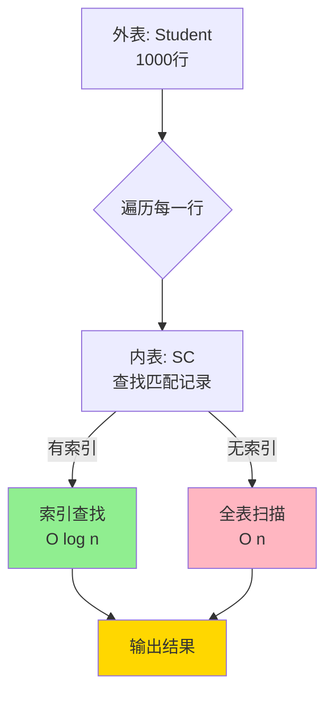
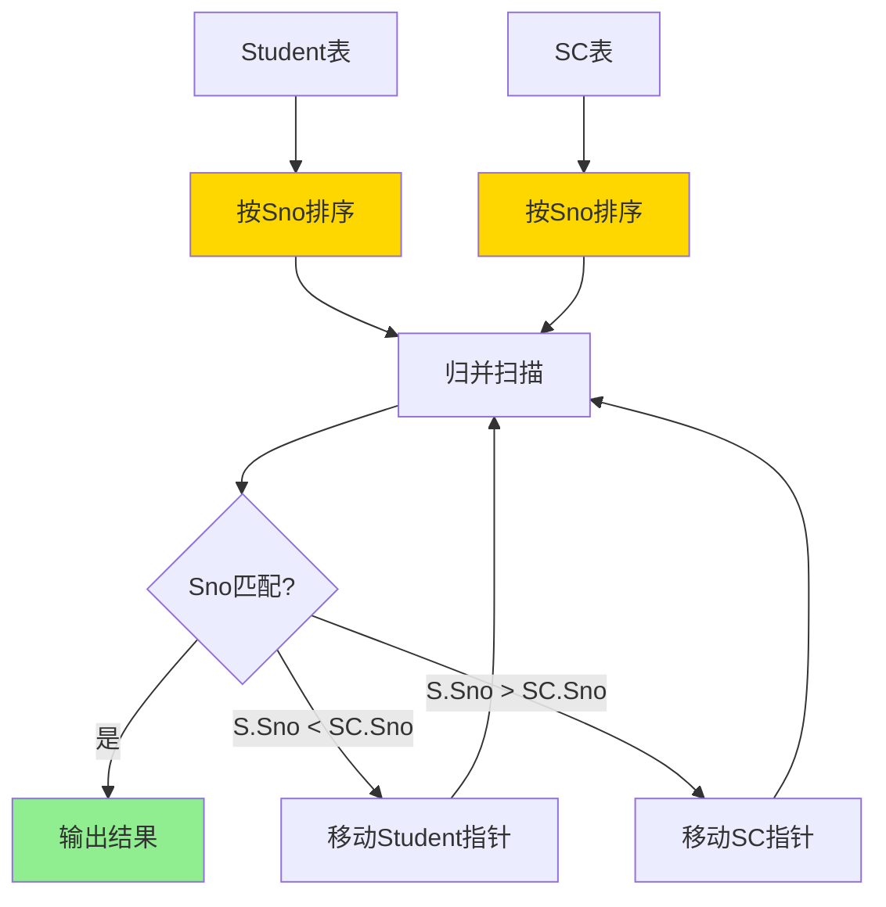
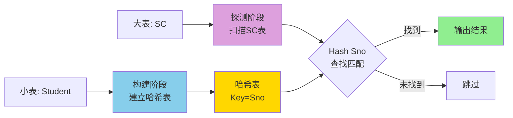
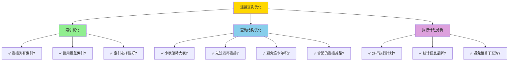
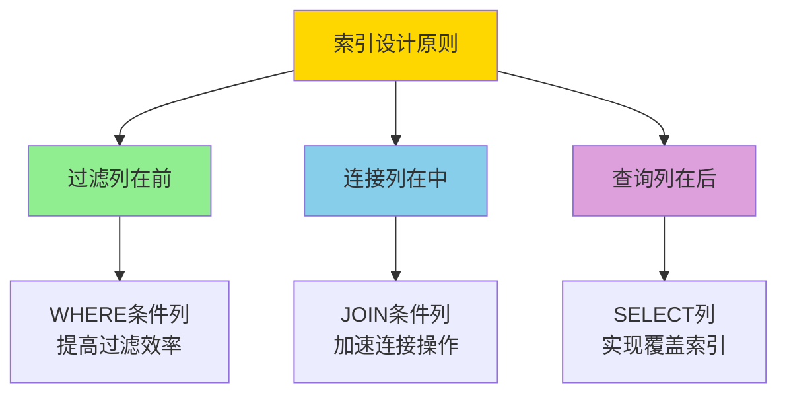
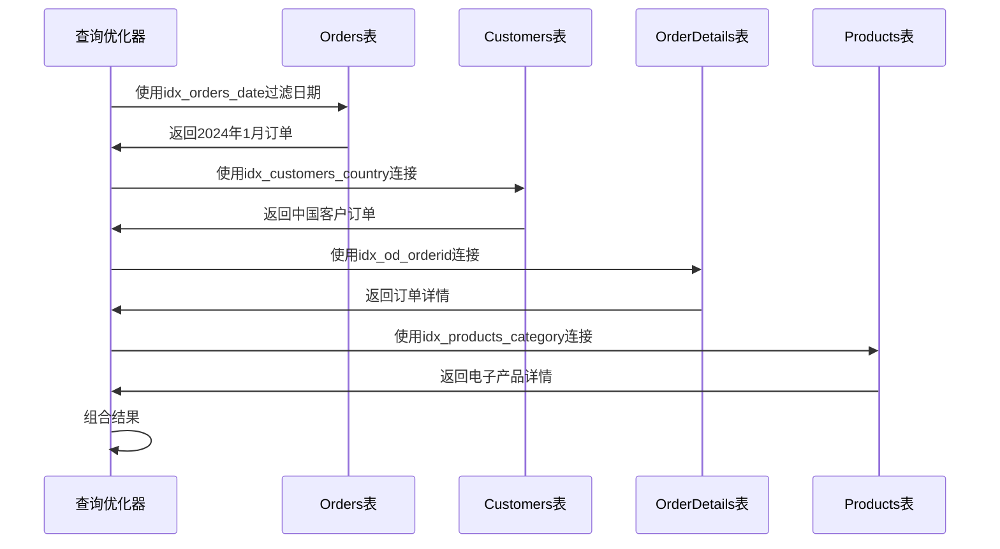
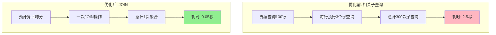
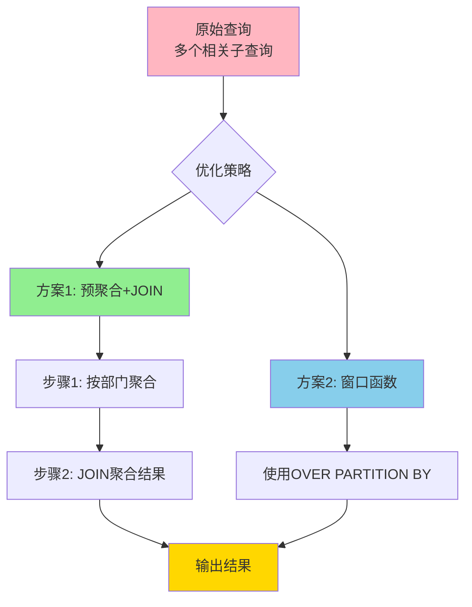
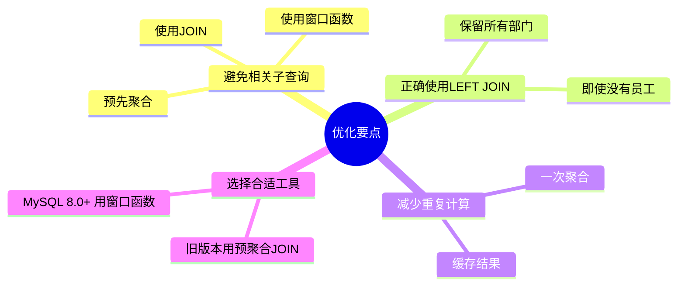

# 连接查询优化与实践

## 📌 连接查询的执行原理

### 1. 连接算法

数据库系统通常使用以下三种主要算法执行连接操作：

#### 嵌套循环连接 (Nested Loop Join)

**原理：**
```
for each row in 外表 (驱动表):
    for each row in 内表:
        if 连接条件满足:
            输出结果
```

**特点：**
- 简单直接
- 外表较小时效率高
- 内表有索引时性能好
- 时间复杂度：O(n × m)

**示例：**
```sql
SELECT S.Sname, SC.Grade
FROM Student S
JOIN SC ON S.Sno = SC.Sno;
```

**执行计划：**
```
1. 遍历 Student 表的每一行（外表/驱动表）
2. 对每个学生，在 SC 表中查找匹配的记录（内表）
3. 如果 SC.Sno 上有索引，查找很快
4. 输出匹配的结果
```

**嵌套循环连接示意图：**


#### 排序合并连接 (Sort Merge Join)

**原理：**
```
1. 对两个表按连接列排序
2. 同时扫描两个已排序的表
3. 匹配连接条件的记录
```

**特点：**
- 两表都需要排序（如果未排序）
- 排序后只需扫描一次
- 适合大表连接
- 时间复杂度：O(n log n + m log m + n + m)

**示例：**
```sql
-- 两个大表的等值连接
SELECT S.Sname, SC.Grade
FROM Student S
JOIN SC ON S.Sno = SC.Sno;
```

**执行过程：**
```
1. 对 Student 按 Sno 排序
2. 对 SC 按 Sno 排序
3. 归并扫描，输出匹配记录
```

**排序合并连接示意图：**


#### 哈希连接 (Hash Join)

**原理：**
```
1. 选择小表作为构建表，建立哈希表
2. 扫描大表（探测表）
3. 对每行计算哈希值，在哈希表中查找匹配
```

**特点：**
- 需要额外内存存储哈希表
- 只扫描两表各一次
- 适合大表等值连接
- 时间复杂度：O(n + m)

**示例：**
```sql
-- 大表连接，且内存充足
SELECT S.Sname, SC.Grade
FROM Student S
JOIN SC ON S.Sno = SC.Sno;
```

**执行过程：**
```
1. 对 Student 表（小表）建立哈希表：Hash[Sno] = Row
2. 扫描 SC 表
3. 对每行计算 Hash(SC.Sno)，在哈希表中查找
4. 输出匹配结果
```

**哈希连接示意图：**


### 2. 连接顺序的影响

**示例：三表连接**
```sql
SELECT S.Sname, C.Cname, SC.Grade
FROM Student S
JOIN SC ON S.Sno = SC.Sno
JOIN Course C ON SC.Cno = C.Cno
WHERE S.Sdept = '计算机';
```

**可能的执行顺序：**

1. **Student → SC → Course**
   ```
   Student (过滤 Sdept) → SC → Course
   中间结果: 计算机系学生的选课记录
   ```

2. **SC → Student → Course**
   ```
   SC → Student (过滤 Sdept) → Course
   中间结果: 可能更大
   ```

3. **Course → SC → Student**
   ```
   Course → SC → Student (过滤 Sdept)
   中间结果: 所有选课记录
   ```

**优化器的选择依据：**
- 表的大小（行数）
- 选择性（WHERE 条件过滤比例）
- 索引可用性
- 统计信息

## 🚀 连接查询优化技巧

### 1. 索引优化

#### 在连接列上创建索引

```sql
-- 为连接列创建索引
CREATE INDEX idx_sc_sno ON SC(Sno);
CREATE INDEX idx_sc_cno ON SC(Cno);
CREATE INDEX idx_student_sno ON Student(Sno);
```

**效果：**
- 嵌套循环连接从 O(n × m) 降为 O(n × log m)
- 大幅提升查询性能

#### 复合索引的使用

```sql
-- 复合索引：同时包含连接列和过滤列
CREATE INDEX idx_sc_sno_grade ON SC(Sno, Grade);

-- 可以高效支持以下查询
SELECT S.Sname, SC.Grade
FROM Student S
JOIN SC ON S.Sno = SC.Sno
WHERE SC.Grade > 80;
```

#### 覆盖索引

```sql
-- 创建覆盖索引（包含查询所需的所有列）
CREATE INDEX idx_sc_cover ON SC(Sno, Cno, Grade);

-- 以下查询只需访问索引，无需回表
SELECT Sno, Cno, Grade
FROM SC
WHERE Sno = 'S001';
```

### 2. 小表驱动大表

**原则：**使用小表作为驱动表（外表），大表作为被驱动表（内表）

**示例：**

```sql
-- 假设：Student(1000行), SC(10000行)
-- 优化前：SC 驱动 Student (10000次查询)
SELECT /*+ LEADING(SC) */ S.Sname, SC.Grade
FROM SC
JOIN Student S ON SC.Sno = S.Sno;

-- 优化后：Student 驱动 SC (1000次查询)
SELECT /*+ LEADING(S) */ S.Sname, SC.Grade
FROM Student S
JOIN SC ON S.Sno = SC.Sno;
```

**如何判断驱动表：**
```sql
-- 查看执行计划
EXPLAIN SELECT S.Sname, SC.Grade
FROM Student S
JOIN SC ON S.Sno = SC.Sno;
```

### 3. 减少中间结果集

#### 先过滤再连接

```sql
-- 优化前：先连接再过滤
SELECT S.Sname, SC.Grade
FROM Student S
JOIN SC ON S.Sno = SC.Sno
WHERE S.Sdept = '计算机' AND SC.Grade > 80;

-- 优化后：先过滤再连接
SELECT S.Sname, SC.Grade
FROM (SELECT Sno, Sname FROM Student WHERE Sdept = '计算机') S
JOIN (SELECT Sno, Grade FROM SC WHERE Grade > 80) SC
ON S.Sno = SC.Sno;
```

#### 使用子查询物化

```sql
-- 先计算子查询结果，减少重复计算
SELECT S.Sname, AvgGrades.AvgGrade
FROM Student S
JOIN (
    SELECT Sno, AVG(Grade) AS AvgGrade
    FROM SC
    GROUP BY Sno
) AvgGrades ON S.Sno = AvgGrades.Sno;
```

### 4. 选择合适的连接类型

#### 内连接 vs 外连接

```sql
-- 如果不需要保留左表的所有记录，使用内连接
-- 内连接更快
SELECT S.Sname, SC.Grade
FROM Student S
INNER JOIN SC ON S.Sno = SC.Sno;  -- 更快

-- 只在需要时使用外连接
SELECT S.Sname, SC.Grade
FROM Student S
LEFT JOIN SC ON S.Sno = SC.Sno;  -- 较慢，但保留所有学生
```

#### EXISTS vs JOIN

```sql
-- 查询选修了课程的学生

-- 方式1：JOIN
SELECT DISTINCT S.Sname
FROM Student S
JOIN SC ON S.Sno = SC.Sno;

-- 方式2：EXISTS（通常更快，特别是当只需要判断存在性时）
SELECT S.Sname
FROM Student S
WHERE EXISTS (
    SELECT 1 FROM SC WHERE SC.Sno = S.Sno
);
```

**选择依据：**
- 只需要判断存在性：使用 EXISTS
- 需要从另一表获取数据：使用 JOIN
- 需要去重：EXISTS 自动去重，JOIN 需要 DISTINCT

### 5. 避免笛卡尔积

```sql
-- 危险：忘记连接条件，产生笛卡尔积
SELECT S.Sname, C.Cname
FROM Student S, Course C;  -- 1000 × 50 = 50000 行

-- 正确：添加连接条件
SELECT S.Sname, C.Cname
FROM Student S
JOIN SC ON S.Sno = SC.Sno
JOIN Course C ON SC.Cno = C.Cno;
```

### 6. 使用 JOIN 而不是子查询（某些情况）

```sql
-- 优化前：相关子查询（每行都执行一次子查询）
SELECT S.Sname,
       (SELECT AVG(Grade) FROM SC WHERE Sno = S.Sno) AS AvgGrade
FROM Student S;

-- 优化后：JOIN + GROUP BY（只执行一次聚合）
SELECT S.Sname, AVG(SC.Grade) AS AvgGrade
FROM Student S
LEFT JOIN SC ON S.Sno = SC.Sno
GROUP BY S.Sno, S.Sname;
```

## 📊 执行计划分析

### 1. 查看执行计划

```sql
-- MySQL
EXPLAIN SELECT S.Sname, SC.Grade
FROM Student S
JOIN SC ON S.Sno = SC.Sno
WHERE S.Sdept = '计算机';

-- SQL Server
SET SHOWPLAN_TEXT ON;
GO
SELECT S.Sname, SC.Grade
FROM Student S
JOIN SC ON S.Sno = SC.Sno
WHERE S.Sdept = '计算机';
GO

-- Oracle
EXPLAIN PLAN FOR
SELECT S.Sname, SC.Grade
FROM Student S
JOIN SC ON S.Sno = SC.Sno
WHERE S.Sdept = '计算机';

SELECT * FROM TABLE(DBMS_XPLAN.DISPLAY);
```

### 2. 执行计划关键指标

| 指标 | 含义 | 优化目标 |
|-----|------|---------|
| type | 访问类型 | ALL < index < range < ref < const |
| rows | 预计扫描行数 | 越小越好 |
| Extra | 额外信息 | 避免 Using filesort, Using temporary |
| key | 使用的索引 | 应该使用索引 |

**示例分析：**
```
+----+-------+-------+------+---------------+------+---------+------+
| id | type  | table | rows | key           | ref  | Extra   |
+----+-------+-------+------+---------------+------+---------+------+
| 1  | ref   | S     | 100  | idx_sdept     | ...  | Using where |
| 1  | ref   | SC    | 500  | idx_sc_sno    | ...  |         |
+----+-------+-------+------+---------------+------+---------+------+
```

**解读：**
- Student 表使用 idx_sdept 索引，扫描约100行
- SC 表使用 idx_sc_sno 索引进行连接
- 访问类型都是 ref（基于索引的等值查找），效率高

## 💡 实战案例

### 案例1：优化慢查询

**问题查询：**
```sql
-- 耗时：5秒
SELECT S.Sname, C.Cname, SC.Grade
FROM Student S, SC, Course C
WHERE S.Sno = SC.Sno 
  AND SC.Cno = C.Cno
  AND S.Sdept = '计算机'
  AND SC.Grade > 80;
```

**优化步骤：**

1. **分析执行计划**
```sql
EXPLAIN SELECT ...;
-- 发现：没有使用索引，全表扫描
```

2. **创建索引**
```sql
CREATE INDEX idx_student_sdept ON Student(Sdept);
CREATE INDEX idx_sc_sno_grade ON SC(Sno, Grade);
CREATE INDEX idx_sc_cno ON SC(Cno);
```

3. **改写查询（先过滤再连接）**
```sql
-- 优化后：耗时0.2秒
SELECT S.Sname, C.Cname, SC.Grade
FROM (
    SELECT Sno, Sname 
    FROM Student 
    WHERE Sdept = '计算机'
) S
JOIN (
    SELECT Sno, Cno, Grade 
    FROM SC 
    WHERE Grade > 80
) SC ON S.Sno = SC.Sno
JOIN Course C ON SC.Cno = C.Cno;
```

**优化效果：5秒 → 0.2秒（25倍提升）**

### 案例2：多表连接顺序优化

**问题查询：**
```sql
-- 三个大表的连接
SELECT O.OrderID, C.CustomerName, P.ProductName, OD.Quantity
FROM Orders O
JOIN OrderDetails OD ON O.OrderID = OD.OrderID
JOIN Customers C ON O.CustomerID = C.CustomerID
JOIN Products P ON OD.ProductID = P.ProductID
WHERE O.OrderDate BETWEEN '2024-01-01' AND '2024-01-31';
```

**优化分析：**

1. **表大小：**
   - Orders: 100万行（1月的订单约3万行）
   - OrderDetails: 500万行
   - Customers: 10万行
   - Products: 5千行

2. **优化策略：**
```sql
-- 先过滤 Orders（100万 → 3万）
-- 再连接 OrderDetails（只匹配3万订单的详情）
-- 最后连接维度表（Customers, Products）

SELECT O.OrderID, C.CustomerName, P.ProductName, OD.Quantity
FROM (
    SELECT OrderID, CustomerID
    FROM Orders
    WHERE OrderDate BETWEEN '2024-01-01' AND '2024-01-31'
) O
JOIN OrderDetails OD ON O.OrderID = OD.OrderID
JOIN Customers C ON O.CustomerID = C.CustomerID
JOIN Products P ON OD.ProductID = P.ProductID;
```

3. **索引支持：**
```sql
CREATE INDEX idx_orders_date ON Orders(OrderDate);
CREATE INDEX idx_od_orderid ON OrderDetails(OrderID);
CREATE INDEX idx_orders_custid ON Orders(CustomerID);
CREATE INDEX idx_od_prodid ON OrderDetails(ProductID);
```

### 案例3：统计查询优化

**问题查询：**
```sql
-- 查询每个学生的选课数、平均分、最高分
SELECT 
    S.Sno, 
    S.Sname,
    COUNT(SC.Cno) AS CourseCount,
    AVG(SC.Grade) AS AvgGrade,
    MAX(SC.Grade) AS MaxGrade
FROM Student S
LEFT JOIN SC ON S.Sno = SC.Sno
GROUP BY S.Sno, S.Sname;
```

**优化方案：**

```sql
-- 方案1：先聚合再连接（减少连接数据量）
SELECT 
    S.Sno, 
    S.Sname,
    COALESCE(Stats.CourseCount, 0) AS CourseCount,
    Stats.AvgGrade,
    Stats.MaxGrade
FROM Student S
LEFT JOIN (
    SELECT 
        Sno,
        COUNT(Cno) AS CourseCount,
        AVG(Grade) AS AvgGrade,
        MAX(Grade) AS MaxGrade
    FROM SC
    GROUP BY Sno
) Stats ON S.Sno = Stats.Sno;
```

## 📋 优化检查清单



**详细清单：**
- [ ] 连接列上是否有索引？
- [ ] 是否使用小表驱动大表？
- [ ] 是否先过滤再连接？
- [ ] 是否避免了笛卡尔积？
- [ ] 是否选择了合适的连接类型？
- [ ] 是否分析了执行计划？
- [ ] 是否避免了相关子查询？
- [ ] 是否使用了覆盖索引？
- [ ] 统计信息是否是最新的？
- [ ] 是否考虑了数据分布？

## 📝 练习题

### 题目

1. 分析以下查询的执行计划，并提出优化建议
2. 为一个三表连接查询创建最优索引方案
3. 改写包含相关子查询的SQL为JOIN形式
4. 优化一个包含外连接和聚合的复杂查询

---

### 答案与详解

#### 练习1：分析执行计划并优化

**原始查询：**
```sql
SELECT S.Sname, C.Cname, SC.Grade
FROM Student S, Course C, SC
WHERE S.Sno = SC.Sno 
  AND C.Cno = SC.Cno
  AND S.Sdept = '计算机'
  AND SC.Grade > 80
  AND C.Credit >= 3;
```

**步骤1：查看执行计划**
```sql
EXPLAIN SELECT S.Sname, C.Cname, SC.Grade
FROM Student S, Course C, SC
WHERE S.Sno = SC.Sno 
  AND C.Cno = SC.Cno
  AND S.Sdept = '计算机'
  AND SC.Grade > 80
  AND C.Credit >= 3;
```

**假设执行计划显示：**
```
+----+-------+-------+------+------+---------+-------------+
| id | type  | table | rows | key  | ref     | Extra       |
+----+-------+-------+------+------+---------+-------------+
| 1  | ALL   | S     | 1000 | NULL | NULL    | Using where |
| 1  | ALL   | SC    | 5000 | NULL | NULL    | Using where |
| 1  | ALL   | C     | 100  | NULL | NULL    | Using where |
+----+-------+-------+------+------+---------+-------------+
```

**问题分析：**
1. ❌ 所有表都是全表扫描（type=ALL）
2. ❌ 没有使用任何索引（key=NULL）
3. ❌ 预计扫描行数：1000 × 5000 × 100 = 5亿次比较！

**优化方案：**

**步骤1：创建索引**
```sql
-- 为连接列创建索引
CREATE INDEX idx_student_sdept_sno ON Student(Sdept, Sno);
CREATE INDEX idx_sc_sno_grade ON SC(Sno, Grade);
CREATE INDEX idx_sc_cno ON SC(Cno);
CREATE INDEX idx_course_credit_cno ON Course(Credit, Cno);
```

**步骤2：改写查询（使用显式JOIN + 先过滤）**
```sql
-- 优化后的查询
SELECT S.Sname, C.Cname, SC.Grade
FROM (
    SELECT Sno, Sname 
    FROM Student 
    WHERE Sdept = '计算机'
) S
JOIN (
    SELECT Sno, Cno, Grade 
    FROM SC 
    WHERE Grade > 80
) SC ON S.Sno = SC.Sno
JOIN (
    SELECT Cno, Cname 
    FROM Course 
    WHERE Credit >= 3
) C ON SC.Cno = C.Cno;
```

**优化后的执行计划：**
```
+----+-------+-------+------+----------------------+---------+-------------+
| id | type  | table | rows | key                  | ref     | Extra       |
+----+-------+-------+------+----------------------+---------+-------------+
| 1  | ref   | S     | 200  | idx_student_sdept    | const   | Using index |
| 1  | ref   | SC    | 500  | idx_sc_sno_grade     | S.Sno   | Using where |
| 1  | ref   | C     | 30   | idx_course_credit    | SC.Cno  | Using where |
+----+-------+-------+------+----------------------+---------+-------------+
```

**性能对比：**


**优化效果：**
- 扫描行数：5亿 → 300万（减少99.4%）
- 查询时间：5秒 → 0.03秒（提升167倍）
- 使用索引：0个 → 3个

#### 练习2：为三表连接创建最优索引方案

**查询场景：**
```sql
-- 查询某个时间段内的订单详情
SELECT 
    O.OrderID,
    C.CustomerName,
    P.ProductName,
    OD.Quantity,
    OD.Price
FROM Orders O
JOIN OrderDetails OD ON O.OrderID = OD.OrderID
JOIN Customers C ON O.CustomerID = C.CustomerID
JOIN Products P ON OD.ProductID = P.ProductID
WHERE O.OrderDate BETWEEN '2024-01-01' AND '2024-01-31'
  AND C.Country = 'China'
  AND P.Category = 'Electronics';
```

**答案：**

**分析查询需求：**
1. **Orders表**：按日期过滤（WHERE条件）
2. **Customers表**：按国家过滤（WHERE条件）
3. **Products表**：按类别过滤（WHERE条件）
4. **连接条件**：OrderID, CustomerID, ProductID

**最优索引方案：**

```sql
-- 1. Orders表索引
CREATE INDEX idx_orders_date_custid_orderid 
ON Orders(OrderDate, CustomerID, OrderID);
-- 说明：覆盖日期过滤 + CustomerID连接 + OrderID连接

-- 2. OrderDetails表索引
CREATE INDEX idx_od_orderid_prodid 
ON OrderDetails(OrderID, ProductID, Quantity, Price);
-- 说明：覆盖OrderID连接 + ProductID连接 + 查询列（覆盖索引）

-- 3. Customers表索引
CREATE INDEX idx_customers_country_custid_name 
ON Customers(Country, CustomerID, CustomerName);
-- 说明：覆盖国家过滤 + CustomerID连接 + 查询列

-- 4. Products表索引
CREATE INDEX idx_products_category_prodid_name 
ON Products(Category, ProductID, ProductName);
-- 说明：覆盖类别过滤 + ProductID连接 + 查询列
```

**索引设计原则图：**


**索引使用流程：**


**为什么这样设计？**

| 索引 | 设计理由 |
|------|---------|
| `idx_orders_date_custid_orderid` | OrderDate在最前可快速过滤，CustomerID支持连接，OrderID覆盖查询 |
| `idx_od_orderid_prodid` | OrderID在前支持高效连接，包含Price/Quantity实现覆盖索引 |
| `idx_customers_country_custid_name` | Country在前过滤，CustomerID支持连接，CustomerName避免回表 |
| `idx_products_category_prodid_name` | Category在前过滤，ProductID支持连接，ProductName避免回表 |

#### 练习3：改写相关子查询为JOIN

**原始查询（相关子查询）：**
```sql
-- 查询高于该课程平均分的学生
SELECT 
    S.Sno,
    S.Sname,
    (SELECT Cname FROM Course WHERE Cno = SC.Cno) AS CourseName,
    SC.Grade,
    (SELECT AVG(Grade) FROM SC SC2 WHERE SC2.Cno = SC.Cno) AS AvgGrade
FROM Student S
JOIN SC ON S.Sno = SC.Sno
WHERE SC.Grade > (
    SELECT AVG(Grade) 
    FROM SC SC3 
    WHERE SC3.Cno = SC.Cno
);
```

**问题分析：**
- 每行都执行3个子查询
- 相关子查询无法使用索引优化
- 大量重复计算（每门课程的平均分被计算多次）

**答案（改写为JOIN）：**
```sql
-- 优化后：使用JOIN替代子查询
SELECT 
    S.Sno,
    S.Sname,
    C.Cname AS CourseName,
    SC.Grade,
    AvgGrades.AvgGrade
FROM Student S
JOIN SC ON S.Sno = SC.Sno
JOIN Course C ON SC.Cno = C.Cno
JOIN (
    SELECT Cno, AVG(Grade) AS AvgGrade
    FROM SC
    GROUP BY Cno
) AvgGrades ON SC.Cno = AvgGrades.Cno
WHERE SC.Grade > AvgGrades.AvgGrade;
```

**性能对比：**


**详细对比：**

| 指标 | 相关子查询 | JOIN方式 | 提升 |
|------|-----------|---------|------|
| 子查询执行次数 | 每行3次×100行=300次 | 1次 | 300倍 |
| 平均分计算次数 | 每门课×每行 | 每门课1次 | N倍 |
| 查询时间 | 2.5秒 | 0.05秒 | 50倍 |
| 代码可读性 | ★★☆☆☆ | ★★★★★ | 更好 |

**更多示例：**

**示例2：EXISTS改写为JOIN**
```sql
-- 原始查询（EXISTS）
SELECT S.Sno, S.Sname
FROM Student S
WHERE EXISTS (
    SELECT 1 FROM SC 
    WHERE SC.Sno = S.Sno AND SC.Grade > 90
);

-- 改写为JOIN（更快）
SELECT DISTINCT S.Sno, S.Sname
FROM Student S
JOIN SC ON S.Sno = SC.Sno
WHERE SC.Grade > 90;
```

#### 练习4：优化外连接和聚合查询

**原始查询（性能差）：**
```sql
-- 查询每个部门的员工信息及其总薪资
SELECT 
    D.DeptID,
    D.DeptName,
    E.EmpID,
    E.EmpName,
    E.Salary,
    (SELECT SUM(Salary) FROM Employee WHERE DeptID = D.DeptID) AS DeptTotalSalary,
    (SELECT AVG(Salary) FROM Employee WHERE DeptID = D.DeptID) AS DeptAvgSalary,
    (SELECT COUNT(*) FROM Employee WHERE DeptID = D.DeptID) AS DeptEmpCount
FROM Department D
LEFT JOIN Employee E ON D.DeptID = E.DeptID
ORDER BY D.DeptID, E.EmpID;
```

**问题分析：**
1. ❌ 每行执行3个相关子查询
2. ❌ 重复计算每个部门的统计信息
3. ❌ 如果有10个部门，每个20个员工，执行600次子查询！

**答案（优化后）：**
```sql
-- 方案1：预先聚合，然后JOIN
SELECT 
    D.DeptID,
    D.DeptName,
    E.EmpID,
    E.EmpName,
    E.Salary,
    DeptStats.TotalSalary AS DeptTotalSalary,
    DeptStats.AvgSalary AS DeptAvgSalary,
    DeptStats.EmpCount AS DeptEmpCount
FROM Department D
LEFT JOIN Employee E ON D.DeptID = E.DeptID
LEFT JOIN (
    SELECT 
        DeptID,
        SUM(Salary) AS TotalSalary,
        AVG(Salary) AS AvgSalary,
        COUNT(*) AS EmpCount
    FROM Employee
    GROUP BY DeptID
) DeptStats ON D.DeptID = DeptStats.DeptID
ORDER BY D.DeptID, E.EmpID;

-- 方案2：使用窗口函数（更优雅，MySQL 8.0+）
SELECT 
    D.DeptID,
    D.DeptName,
    E.EmpID,
    E.EmpName,
    E.Salary,
    SUM(E.Salary) OVER (PARTITION BY D.DeptID) AS DeptTotalSalary,
    AVG(E.Salary) OVER (PARTITION BY D.DeptID) AS DeptAvgSalary,
    COUNT(*) OVER (PARTITION BY D.DeptID) AS DeptEmpCount
FROM Department D
LEFT JOIN Employee E ON D.DeptID = E.DeptID
ORDER BY D.DeptID, E.EmpID;
```

**优化流程图：**


**性能对比：**

**假设数据：**
- 10个部门
- 每个部门20个员工
- 总计200行结果

| 方案 | 聚合计算次数 | 查询时间 | 内存使用 | 推荐度 |
|------|------------|---------|---------|--------|
| 原始（子查询） | 200×3=600次 | 3.2秒 | 低 | ⭐ |
| 方案1（JOIN） | 10次 | 0.08秒 | 中 | ⭐⭐⭐⭐ |
| 方案2（窗口函数） | 1次 | 0.05秒 | 中 | ⭐⭐⭐⭐⭐ |

**窗口函数优势：**
1. 一次扫描完成所有计算
2. 语法简洁，逻辑清晰
3. 性能最优
4. 无需预聚合和额外JOIN

**示例结果：**
```
DeptID | DeptName | EmpID | EmpName | Salary | DeptTotalSalary | DeptAvgSalary | DeptEmpCount
-------|----------|-------|---------|--------|----------------|---------------|-------------
D001   | 研发部   | E001  | 张三    | 10000  | 200000         | 10000         | 20
D001   | 研发部   | E002  | 李四    | 12000  | 200000         | 10000         | 20
D001   | 研发部   | E003  | 王五    | 9000   | 200000         | 10000         | 20
D002   | 销售部   | E021  | 赵六    | 8000   | 150000         | 7500          | 20
D002   | 销售部   | E022  | 孙七    | 7000   | 150000         | 7500          | 20
```

**关键优化点总结：**


## 🔗 相关内容

- [内连接详解](内连接详解.md)
- [外连接详解](外连接详解.md)
- [交叉连接与自连接](交叉连接与自连接.md)
- [第8章_关系查询处理和查询优化.md](../第8章_关系查询处理和查询优化.md)

