# DBMS系统架构与工作原理详解

## 📚 概述

数据库管理系统（DBMS - Database Management System）是管理数据库的系统软件，它提供数据定义、数据操纵、数据控制等功能。本文详细讲解DBMS及相关系统的架构、组件和工作原理。

## 🏗️ DBMS系统架构总览

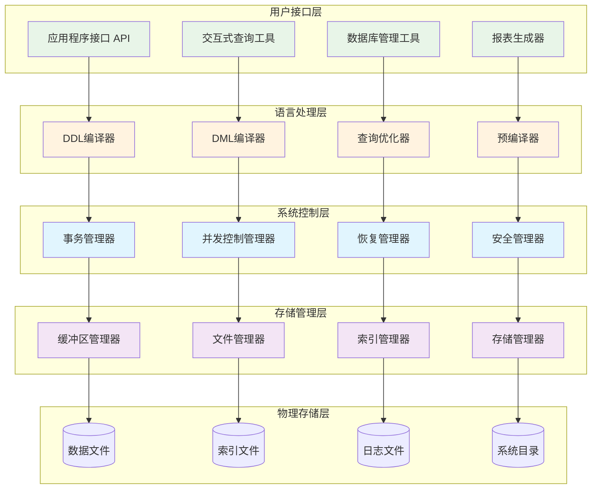

## 🔧 DBMS核心组件详解

### 1. 查询处理器 (Query Processor)

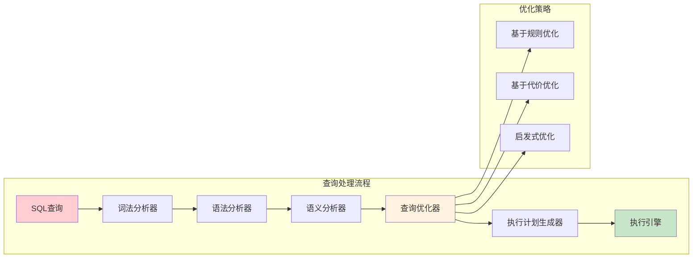

### 2. 存储引擎 (Storage Engine)

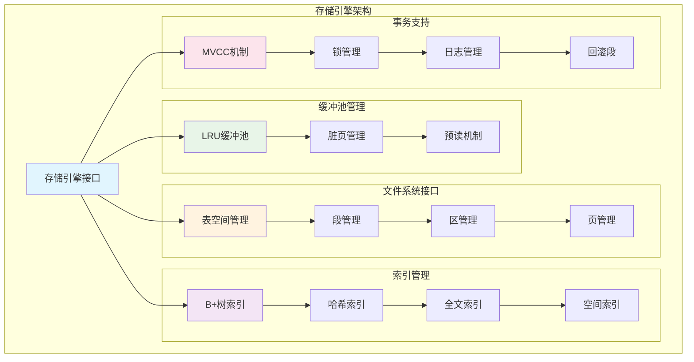

## 🔄 DBMS工作流程详解

### 1. 查询执行完整流程

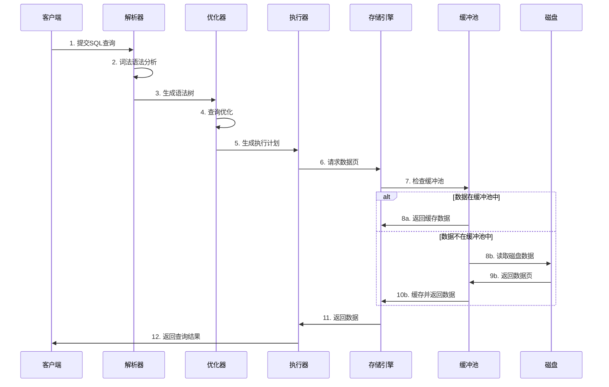

### 2. 事务处理流程

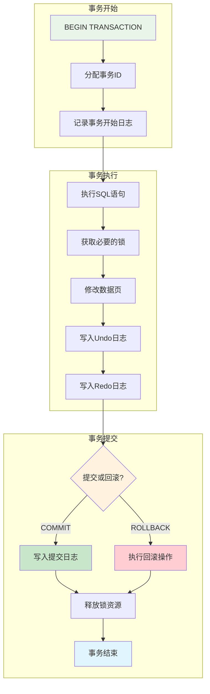

## 🗄️ 相关数据管理系统对比

### 1. 各类数据管理系统概览

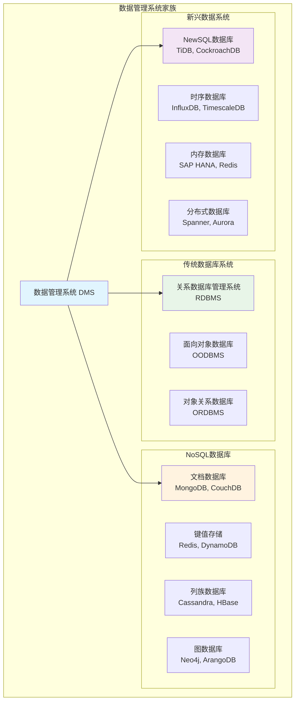

### 2. RDBMS vs NoSQL 架构对比

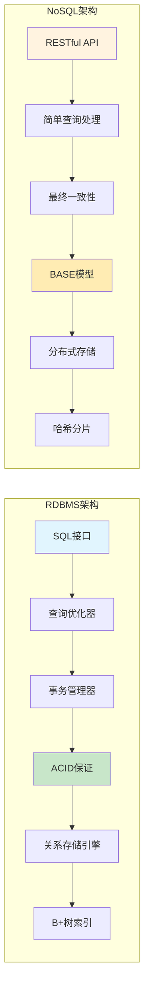

## ⚙️ DBMS内部工作机制

### 1. 缓冲池管理机制

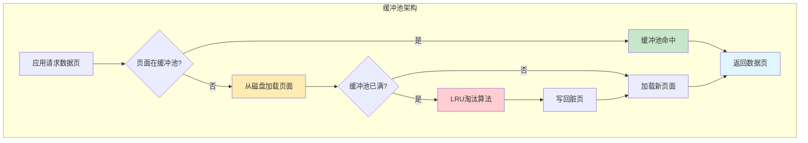

### 2. 锁管理机制

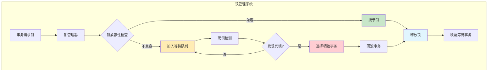

### 3. 日志管理机制

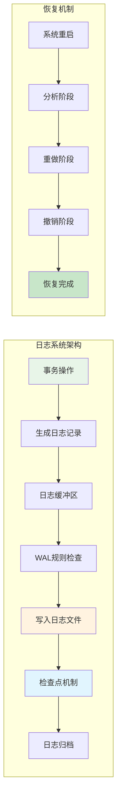

## 🔍 不同存储引擎对比

### 1. InnoDB vs MyISAM

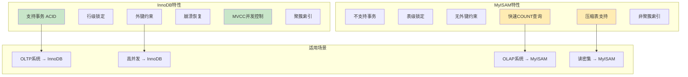

### 2. 列存储 vs 行存储

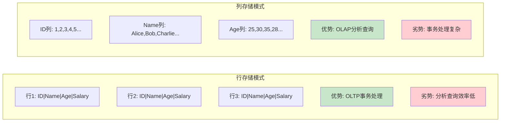

## 🌐 分布式数据库系统

### 1. 分布式DBMS架构

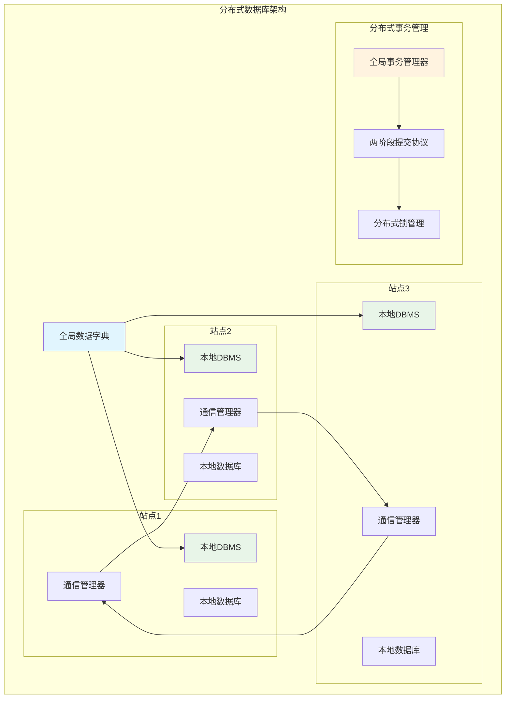

### 2. CAP定理与一致性模型

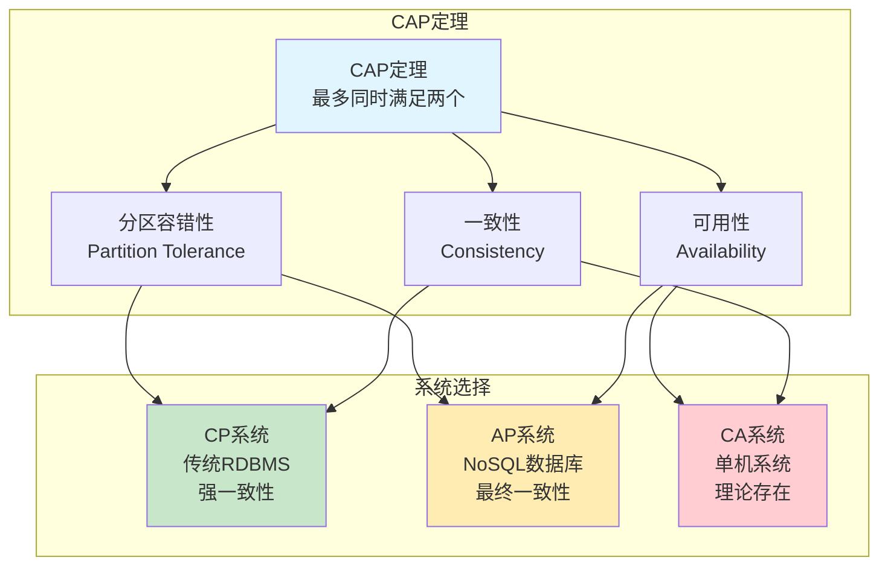

## 🚀 现代数据库发展趋势

### 1. 云原生数据库架构

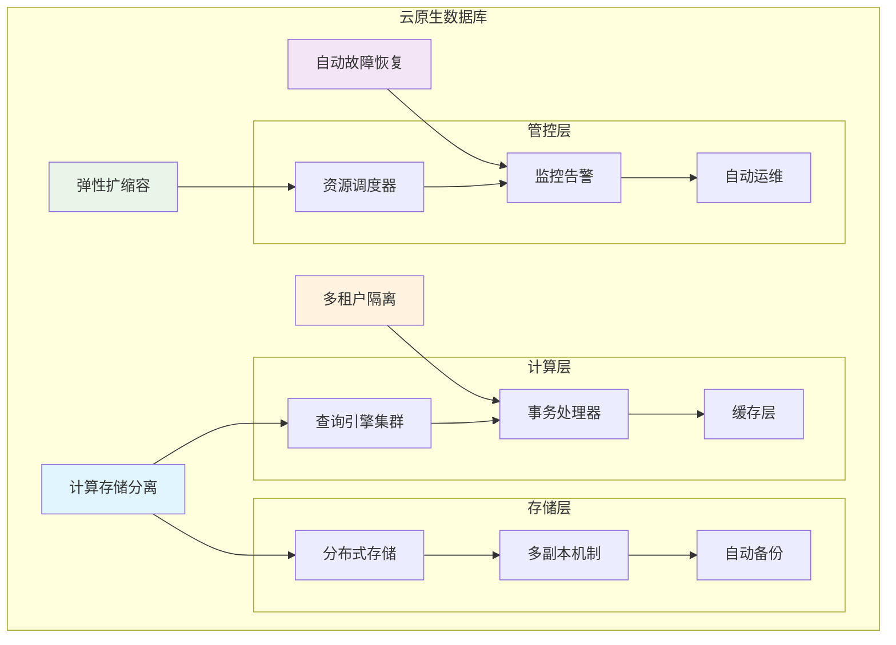

### 2. HTAP混合事务分析处理

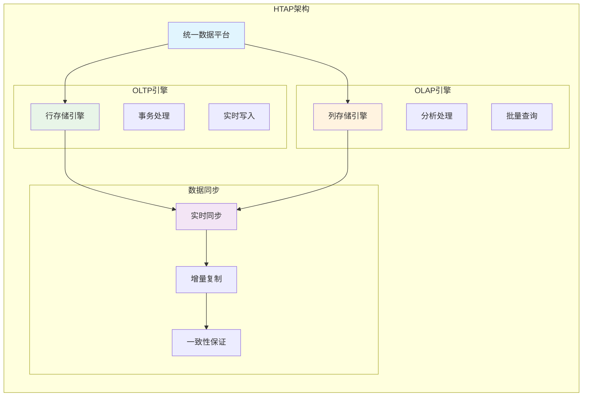

## 📊 性能优化策略

### 1. 查询优化技术

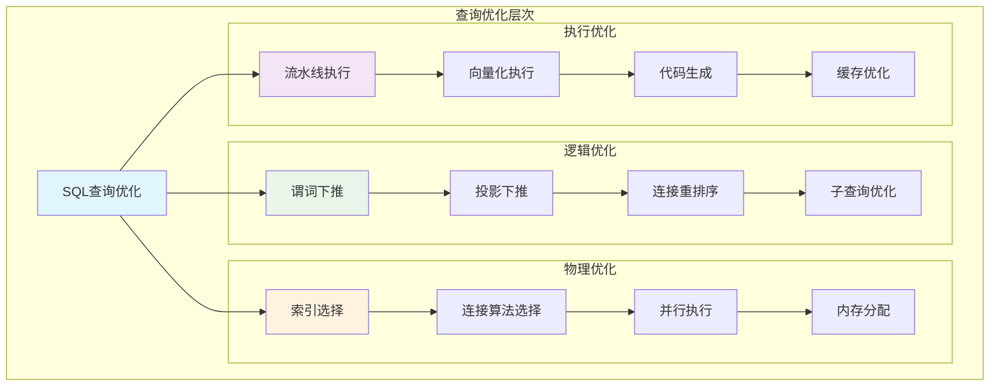

## 📝 总结

### DBMS核心特点
1. **数据独立性**：物理独立性和逻辑独立性
2. **并发控制**：多用户同时访问数据库
3. **事务管理**：ACID特性保证数据一致性
4. **恢复机制**：故障后的数据恢复能力
5. **安全控制**：用户权限和数据保护

### 发展趋势
1. **云原生化**：计算存储分离，弹性扩缩容
2. **智能化**：自动调优，智能运维
3. **多模型**：支持多种数据模型和查询语言
4. **实时化**：HTAP混合处理，实时分析
5. **分布式**：全球化部署，多地多活

DBMS作为数据管理的核心系统，其架构设计和工作原理直接影响着数据库系统的性能、可靠性和可扩展性。理解这些原理对于数据库设计、优化和管理具有重要意义。