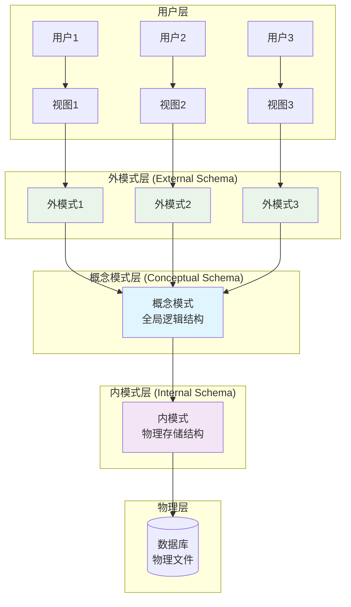
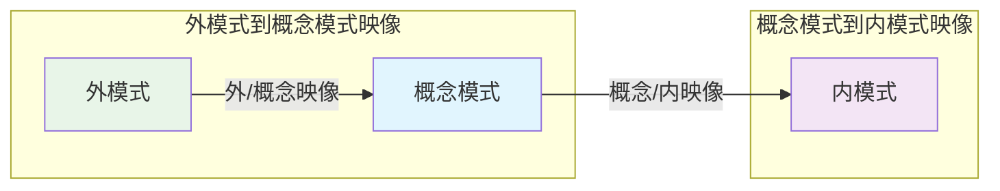
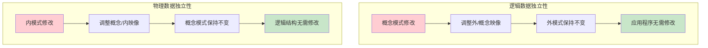
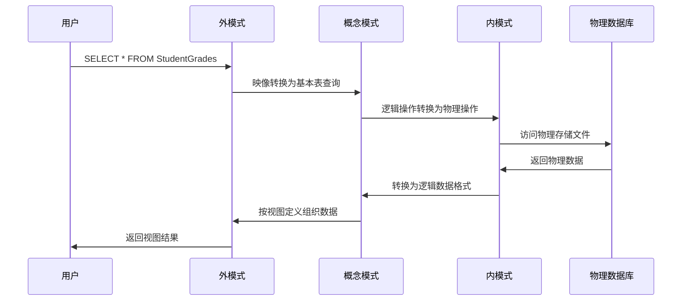
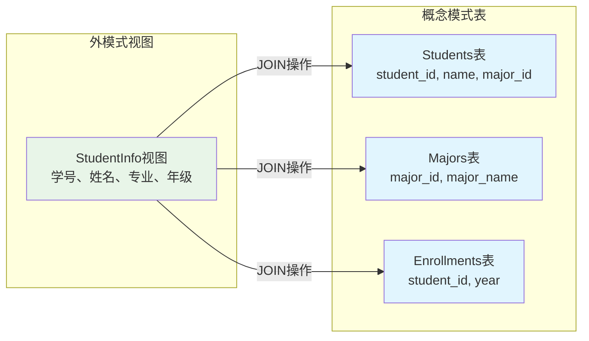
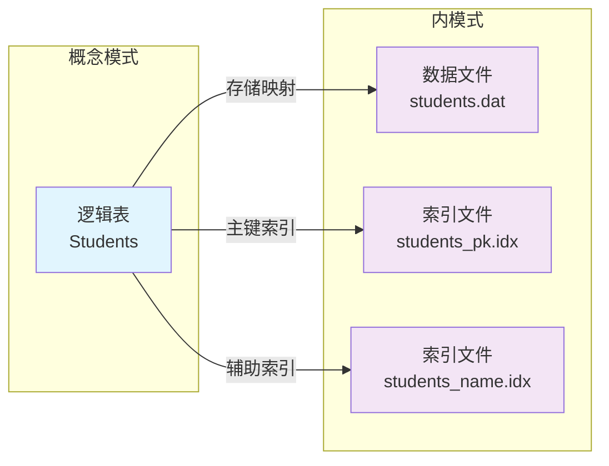
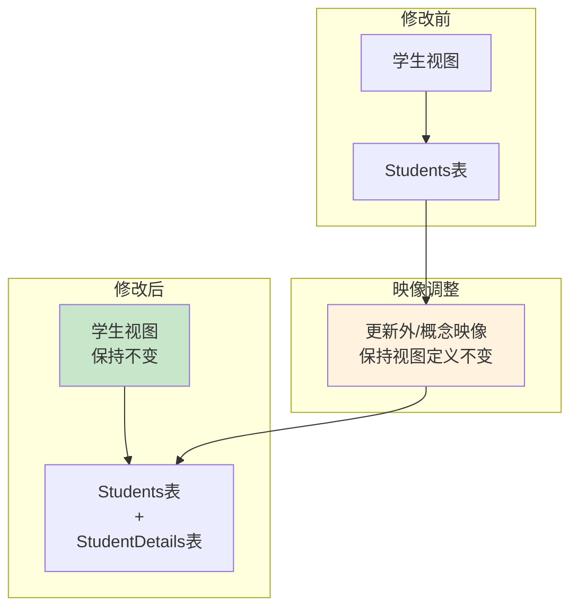
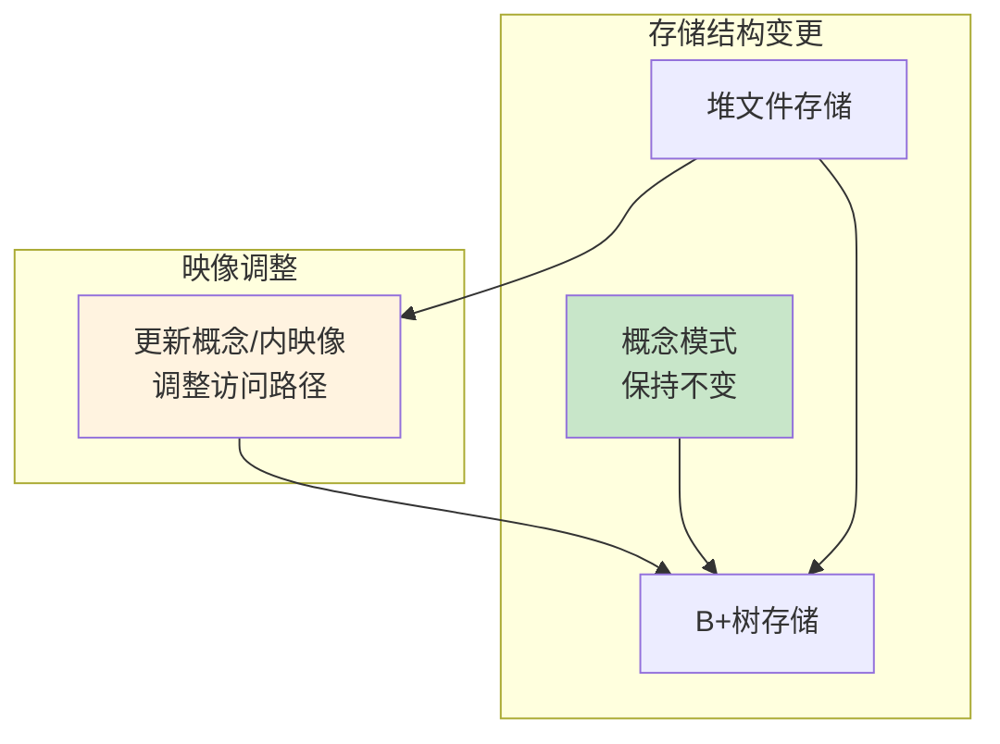
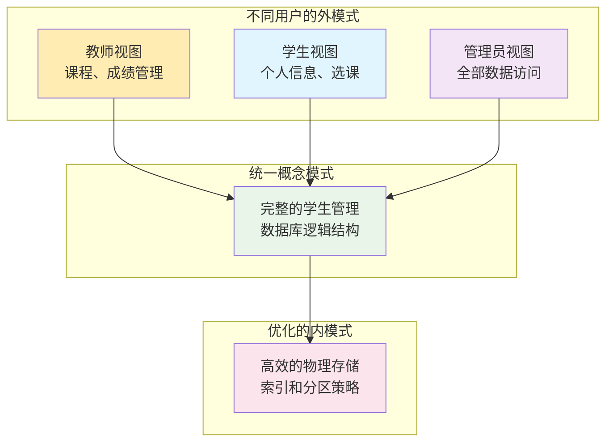
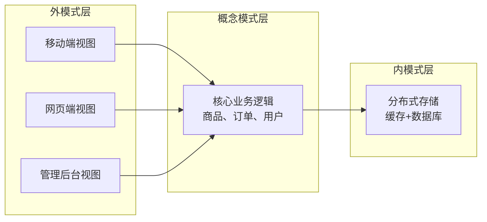

# 数据库三级模式结构：内外模式联系详解

## 📚 概述

数据库系统的三级模式结构是数据库系统的核心架构，包括**外模式**、**概念模式**和**内模式**。理解内外模式之间的联系对于掌握数据库系统的工作原理至关重要。

## 🏗️ 三级模式结构回顾



## 🔗 内外模式联系的核心机制

### 1. 映像机制 (Mapping)

内外模式之间通过**两级映像**建立联系：



### 2. 数据独立性保障



## 🎯 内外模式联系的具体表现

### 1. 视图定义与实现

**外模式层面**：
```sql
-- 学生成绩视图（外模式）
CREATE VIEW StudentGrades AS
SELECT s.student_id, s.name, c.course_name, sc.grade
FROM Students s, Courses c, StudentCourses sc
WHERE s.student_id = sc.student_id 
  AND c.course_id = sc.course_id;
```

**概念模式层面**：
```sql
-- 基本表结构（概念模式）
CREATE TABLE Students (
    student_id INT PRIMARY KEY,
    name VARCHAR(50),
    major VARCHAR(30)
);

CREATE TABLE Courses (
    course_id INT PRIMARY KEY,
    course_name VARCHAR(50),
    credits INT
);

CREATE TABLE StudentCourses (
    student_id INT,
    course_id INT,
    grade DECIMAL(3,1),
    PRIMARY KEY (student_id, course_id)
);
```

**内模式层面**：
```
-- 物理存储结构（内模式）
Students表：
- 存储文件：students.dat
- 索引文件：students_pk.idx (主键索引)
- 页面大小：4KB
- 存储方式：堆文件组织

StudentCourses表：
- 存储文件：student_courses.dat  
- 索引文件：sc_pk.idx (复合主键索引)
- 聚簇索引：按student_id聚簇
```

### 2. 查询处理过程



## 🔄 映像转换示例

### 外模式到概念模式映像



### 概念模式到内模式映像



## 🛡️ 数据独立性实现

### 逻辑数据独立性示例

**场景**：在概念模式中添加新表，不影响现有外模式



### 物理数据独立性示例

**场景**：改变存储结构，不影响概念模式



## 📋 内外模式联系的关键特点

### 1. 多对一关系
- **多个外模式** → **一个概念模式**
- **一个概念模式** → **一个内模式**

### 2. 透明性
- 外模式用户不需要了解内模式的存储细节
- 概念模式不需要关心具体的物理实现

### 3. 灵活性
- 可以根据不同用户需求定义不同的外模式
- 可以独立优化物理存储结构

### 4. 安全性
- 通过外模式限制用户访问权限
- 隐藏敏感数据和复杂的内部结构

## 🎓 实际应用场景

### 场景1：学生管理系统



### 场景2：电商系统



## 🔧 设计原则与最佳实践

### 1. 外模式设计原则
- **最小权限原则**：只暴露用户需要的数据
- **简化原则**：隐藏复杂的表连接关系
- **安全原则**：通过视图控制数据访问

### 2. 映像设计原则
- **效率原则**：优化映像转换性能
- **维护性原则**：映像关系清晰易维护
- **扩展性原则**：支持模式演化

### 3. 内模式设计原则
- **性能优化**：选择合适的存储结构和索引
- **空间效率**：优化存储空间利用
- **并发支持**：支持多用户并发访问

## 📝 总结

内外模式的联系是数据库系统架构的核心，通过两级映像机制实现了：

1. **数据独立性**：逻辑独立性和物理独立性
2. **多用户支持**：不同用户看到不同的数据视图
3. **安全控制**：通过外模式限制数据访问
4. **性能优化**：通过内模式优化物理存储
5. **系统维护**：支持模式演化和系统升级

这种三级模式结构使得数据库系统具有良好的**可维护性**、**可扩展性**和**安全性**，是现代数据库管理系统的基础架构。