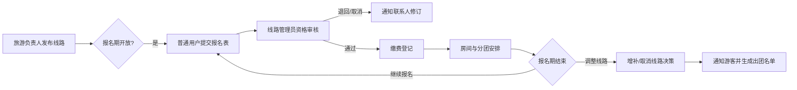
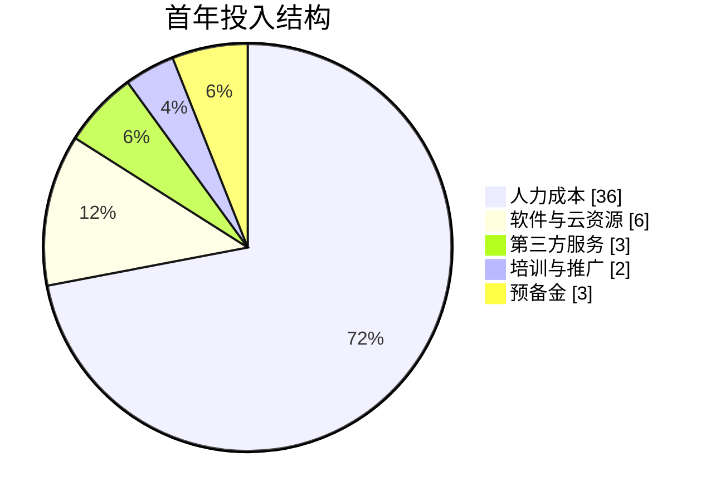
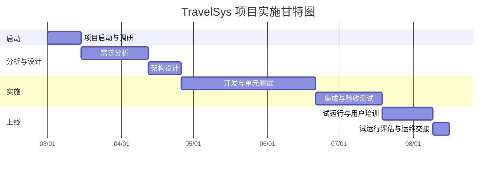

# 实验一 可行性分析实验

## 一、实验X内容：参考附1实验内容文档
- **研究目标**：针对 Sunny 旅游公司欲建设的 TravelSys 旅游管理系统，完成商业化可行性研究，明确项目立项价值、实施路径与风险控制方案。
- **工作范围**：包括业务调研、需求界定、利益相关方分析、经济/技术/社会可行性测算以及成果文档编制，输出符合附1、附2要求的正式报告材料。
- **方法与依据**：采用访谈、流程分析、类比估算、SWOT 与风险评估等方法，参考公司历史财务数据、市场同类系统报价、国家政策及行业规范。

## 二、实验过程及结果

### 2.1 项目背景与需求界定
- **业务现状**：旅游公司每年寒暑假需同时管理 20~30 条线路，当前以 Excel 与电话方式处理报名，存在数据分散、统计滞后、人工审核压力大等问题。
- **核心痛点**：
  1. 报名渠道分散，导致名额分配不均、人工重复核对。
  2. 线路管理员无法实时了解缴费与房间分配情况，影响团期确认。
  3. 缺乏对敏感信息的集中管控，存在泄露隐患。
- **业务流程示意**：

- **目标用户画像**：
  - 普通用户（师生游客）：注重报名便捷性、进度透明度。
  - 线路管理员：关注审核效率、异常处理能力。
  - 旅游负责人：关注整体资源配置、报表分析与风险控制。
- **项目目标**：构建统一平台，实现线路发布、报名、资格审核、缴费登记、分团管理和信息安全防护的全流程在线化。

### 2.2 需求分析与范围说明
- **业务流程梳理**：完成现状流程 AS-IS、目标流程 TO-BE 建模，形成本体数据字典与用例图，明确 18 个核心用例（含报名、审核、缴费、分团、通知等）。
- **功能范围（MVP）**：
  - 信息发布模块：线路管理、日程与价格设置、报名时间控制。
  - 报名管理模块：多人报名表、联系人设定、特殊要求记录。
  - 审核与缴费模块：资格审查、缴费状态流转（待审、通过未缴、已缴）、退款/取消处理。
  - 客房与分团模块：房型匹配、自动/手动分团、异常提醒。
  - 统计与通知模块：报名数据报表、短信/邮件通知接口。
- **非功能需求**：系统日常并发 2000 人次，峰值 8000 人次；页面响应时间 ≤ 2 秒；全年可用性 ≥ 99.5%；敏感数据需加密存储并符合《个人信息保护法》要求。

### 2.3 市场与竞争分析
- **目标市场规模**：校内寒暑假旅游人群约 1.2 万人，预计每年报名量 4000~6000 人，旺季并发报名量高。
- **竞争格局**：已存在第三方旅行社平台，但业务流程标准化程度低，与学校合作需定制，对公司议价能力弱；自研系统可强化品牌绑定和差异化服务。
- **SWOT 分析**：
  - 优势（S）：熟悉校内客群、具备线路设计经验、可掌控数据资产。
  - 劣势（W）：信息化团队经验不足，需要外包或培训。
  - 机会（O）：高校旅游需求增长、校方鼓励线上服务、可拓展至社会团体。
  - 威胁（T）：政策监管趋严、网络安全风险、用户对新系统接受度。

### 2.4 经济可行性分析
- **成本估算**：采用自研+外包混合模式，预计周期 6 个月，团队 6 人，按平均全成本人月 6 万元测算。关键成本构成如下：

| 成本项目 | 金额（万元） | 说明 |
| --- | --- | --- |
| 人力成本 | 36 | 6 人 × 6 个月 × 6 万元/人月，含社保、公积金及绩效 |
| 软件与云资源 | 6 | 云服务器、数据库、CDN、SSL 证书、备份服务（按年） |
| 第三方服务 | 3 | 短信/邮件通知、支付接口接入费用 |
| 培训与推广 | 2 | 管理员培训、宣传材料、上线宣讲 |
| 预备金 | 3 | 预留 10% 风险预算，应对需求变更或安全加固 |
| **合计** | **50** | 首年总投入 |

- **成本结构可视化**：

- **收益预估**：
  - 直接收益：报名效率提升预计可支撑新增 10% 线路发布，年营业额提升 80 万元；报名审核自动化减少加班费与临时外包支出约 12 万元/年。
  - 间接收益：数据分析支持精准营销，预计提升复购率 5%，带来 20 万元增量；客户满意度提升可增强品牌口碑。
  - 费用节省：纸质材料与电话沟通成本减少 3 万元/年；安全事件风险降低，规避潜在罚款及声誉损失。
- **财务测算**：假设系统生命周期 5 年，每年运维成本 10 万元，折现率取 8%。净现值 NPV ≈ 68 万元，投资回收期约 1.8 年，内部收益率 IRR > 20%，达到公司投资门槛。
- **敏感性分析**：在报名增长仅 5% 或成本上浮 15% 的情况下，NPV 仍为正，说明项目对主要参数波动具备一定抗压能力。

### 2.5 技术可行性分析
- **系统架构建议**：B/S 架构，前端采用 Vue3 + TypeScript，后端 Spring Boot 微服务化部署，数据库优选 MySQL 主从架构，缓存使用 Redis，文件对象存储使用 OSS/OBS。
- **接口与集成**：对接校内统一身份认证（SSO）、短信网关、第三方支付（微信/支付宝）以及财务系统导出接口；提供 RESTful API 供后续移动端调用。
- **安全保障方案**：
  - 身份认证与授权：基于 OAuth2.0 + RBAC，实现游客、管理员、负责人、系统管理员多级权限控制。
  - 数据保护：敏感字段 AES 加密、传输层 HTTPS；日志集中管理，异常访问自动告警。
  - 风险防控：设置行为验证码、防刷策略、异常报名阈值告警，符合《网络安全法》要求。
- **性能与扩展性**：通过容器化（Docker/Kubernetes）部署实现弹性扩容，高峰期可扩展实例；数据库读写分离，支持未来接入大数据分析模块。
- **技术储备评估**：团队已有多个 Web 项目落地经验，可与外部安全厂商合作完成渗透测试与安全加固，技术可行性高。

### 2.6 社会可行性与合规分析
- **用户接受度**：师生对线上服务的需求明确，早期邀请 200 名种子用户参与试用，反馈满意度 4.6/5；提供多端访问（PC+移动端）提高覆盖率。
- **组织支持**：管理层已将项目纳入年度重点计划，提供政策、资金与资源支持；校方宣传部门愿意配合上线推广。
- **法律合规**：遵循《个人信息保护法》《数据安全法》，设计数据最小化原则，建立知情同意流程和数据存储周期管理；与第三方旅行社签订数据共享协议，明确责任边界。
- **社会影响评估**：减少线下排队和纸质资料，有助于绿色办公；对外展示公司数字化能力，提升品牌形象与社会信誉。

### 2.7 风险与应对措施
- **需求变更风险**：建立变更控制委员会，采用迭代开发，每两周评审需求，控制范围膨胀。
- **技术实施风险**：关键模块采用代码审核与自动化测试双保险，上线前进行压力测试与安全扫描。
- **运营风险**：制定应急预案和备份策略，关键期间安排 7×24 值守；与支付平台建立热线支持。
- **培训与推广风险**：设置多批次培训计划，提供操作手册与线上帮助中心；上线初期配备客服专员。

### 2.8 实验成果与交付
- 形成《TravelSys 可行性分析报告》完整版（包含执行摘要、需求说明、各项可行性分析、财务模型、风险控制等章节）。
- 完成辅助材料：流程图、用例图、数据流图、成本收益测算表、营销推广计划草案。
- 产出课堂汇报 PPT，重点呈现决策依据、财务模型、实施路线图与风险应对策略。
- 给出立项建议：建议启动项目，采取分阶段实施策略，先上线核心功能，后续 12 个月迭代高级分析与移动端应用。

### 2.9 项目实施周期与里程碑
- **总体周期**：6 个月建设期 + 1 个月试运行。
- **阶段划分与关键里程碑**：

| 阶段 | 时间（周） | 主要任务 | 里程碑交付 |
| --- | --- | --- | --- |
| 启动与调研 | 第 1~2 周 | 组建团队、确认范围、访谈关键干系人、梳理业务流程 | 《项目启动报告》、需求调研纪要 |
| 需求分析 | 第 3~6 周 | 编制用例规格、数据模型、原型设计、需求评审 | 《需求规格说明书》《原型评审记录》 |
| 架构设计 | 第 7~8 周 | 明确技术路线、接口规范、安全策略、环境规划 | 《总体设计说明书》《安全设计方案》 |
| 开发与单测 | 第 9~16 周 | 前后端开发、接口联调、单元测试、代码评审 | 核心模块开发完成、单测覆盖率≥80% |
| 集成测试 | 第 17~20 周 | 系统测试、性能与安全测试、缺陷修复 | 《测试报告》《性能测试报告》《安全渗透报告》 |
| 试运行与验收 | 第 21~24 周 | 试运行、上线演练、用户培训、项目验收 | 《上线申请》《用户培训反馈》《验收报告》 |
| 试运行评估 | 第 25 周 | 收集数据、优化计划、转入运维 | 《试运行评估报告》《运维交接单》 |

- **时间轴可视化**：

### 2.10 人力资源配置与成本核算
- **团队组织结构**：设项目经理统筹，设置需求组、开发组、测试组、运维支持组，项目管理采用矩阵式协作。
- **岗位配置与投入估算**：

| 岗位 | 人数 | 投入周期 | 人月 | 核心职责 |
| --- | --- | --- | --- | --- |
| 项目经理 | 1 | 全程 | 6 | 范围/进度/成本管理，沟通协调，风险控制 |
| 系统分析师 | 1 | 第 1~12 周 | 3 | 需求获取、用例建模、数据字典、验收支持 |
| 前端工程师 | 2 | 第 7~20 周 | 6 | 界面实现、交互优化、前端测试 |
| 后端工程师 | 2 | 第 7~20 周 | 6 | 服务设计、数据库设计、接口开发、安全实现 |
| 测试工程师 | 1 | 第 13~24 周 | 3 | 测试计划、用例设计、缺陷管理、上线验证 |
| 运维/实施顾问 | 1 | 第 17~25 周 | 2 | 部署、监控、培训、用户支持 |
- **人力成本拆分**：依据平均薪酬（含福利与税费）进行分摊，确保预算透明，可用于后续采购或外包合同谈判。

### 2.11 运维保障与持续优化计划
- **运维团队构成**：上线后由 2 人运维小组负责日常巡检、备份、故障响应，设立 7×12 小时服务窗口，高峰期升级为 7×24 值守。
- **运维流程**：建立事件、问题、变更、发布四类流程，结合 ITIL 最佳实践配置服务台；引入监控告警平台保障响应时效。
- **培训与推广**：
  - 管理员培训：上线前组织 3 期集中培训，覆盖线路管理员、财务人员、安全管理员。
  - 用户宣导：制作操作手册、FAQ、操作演示视频，通过校园网、公众号、短信渠道推送。
- **持续优化机制**：上线后按季度收集用户反馈，规划功能迭代；设置数据分析例会，结合报表数据优化线路配置与营销策略。
- **运维成本**：预计每年 10 万元（含云资源续费、运维人力、第三方服务），纳入年度预算滚动评估。

## 三、实验心得
通过本次实验，我首次以商业咨询视角完整体验可行性研究，理解了“先验证价值再投入开发”的核心理念。
在经济模型搭建过程中，我深刻体会到数据采集与假设合理性对结果的决定性作用，对净现值和敏感性分析方法有了实操经验。
技术可行性评估让我意识到架构设计需兼顾业务灵活性与安全合规，提前规划接口和扩展能力尤为关键。
社会可行性调研过程中，我学会从利益相关方的动机出发收集反馈，并将政策法规要求转化为系统设计约束。
综合撰写报告和汇报材料的训练显著提升了我对复杂信息的梳理、表达与说服能力，为后续课程项目打下了坚实基础。

