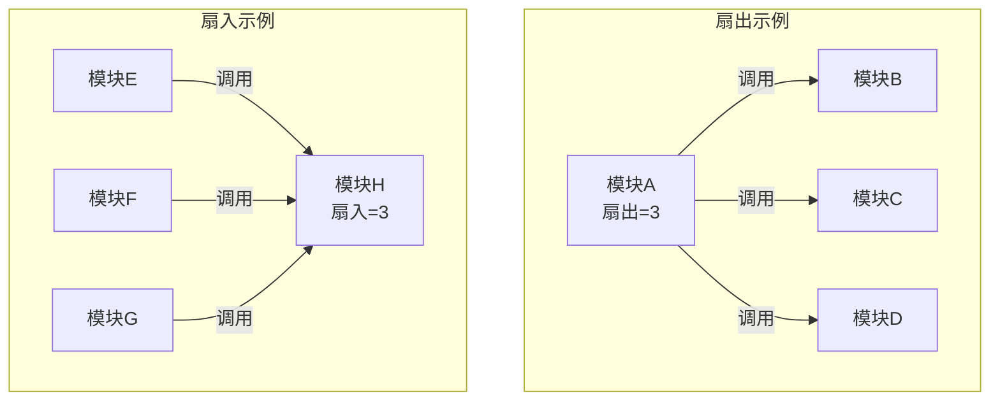
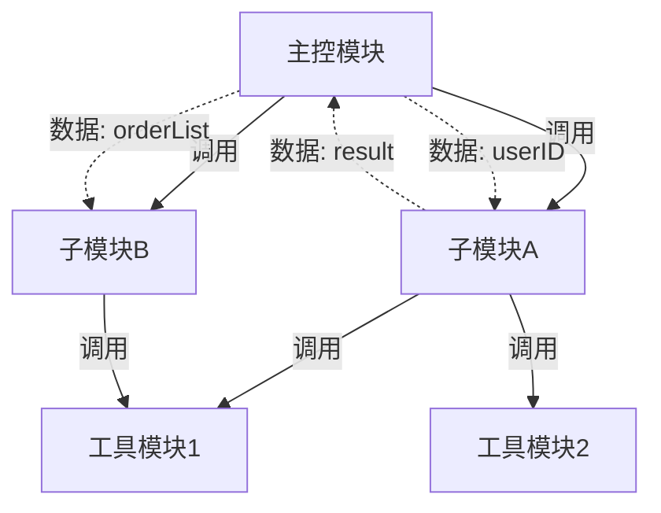
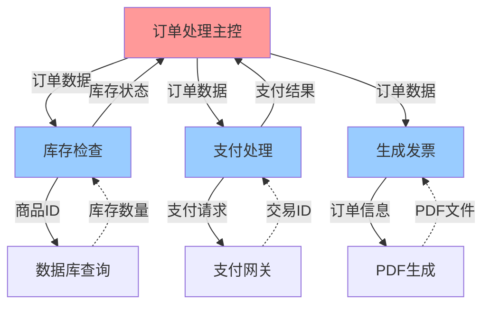
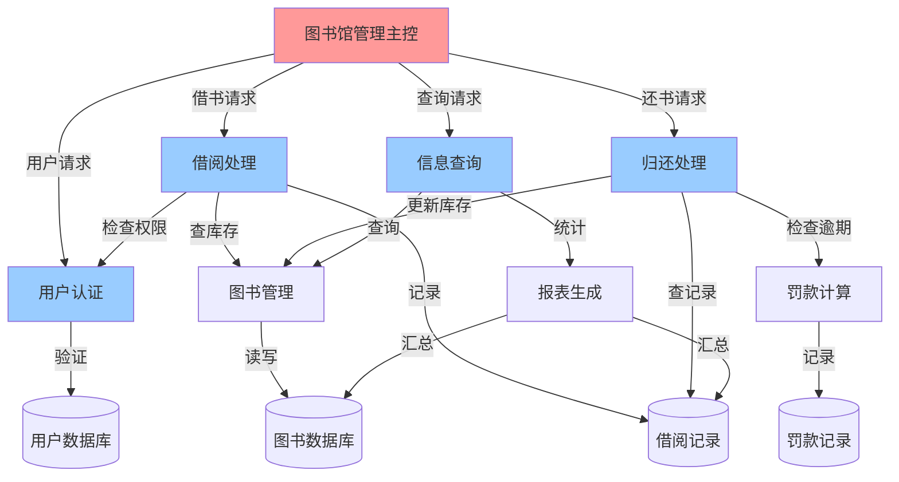

# 模块化设计学习指南

> 模块化是软件设计的核心思想,通过将大型系统分解为相对独立的模块，降低复杂度、提高可维护性。就像把一张大饼切成小块，每一块都有明确的功能和边界。

## 📚 目录导航

- [学习目标](#学习目标)
- [核心概念](#核心概念)
- [模块化原则](#模块化原则)
- [模块划分方法](#模块划分方法)
- [耦合与内聚](#耦合与内聚)
- [模块结构图](#模块结构图)
- [案例实践：图书管理系统](#案例实践图书管理系统)
- [常见问题与对策](#常见问题与对策)
- [推荐资源](#推荐资源)
- [复盘清单](#复盘清单)

## 学习目标


- 理解模块化的基本概念与"分而治之"思想。
- 掌握高内聚低耦合原则及其应用。
- 能够对实际系统进行合理的模块划分。
- 学会评估模块设计的质量并进行优化。

## 核心概念

### 什么是模块？


- **模块（Module）**：具有特定功能的程序单元，对外提供明确的接口，内部实现细节对外隐藏。
- **"切饼比喻"**：
  - 整块大饼 = 完整系统（复杂、难以处理）
  - 切成小块 = 模块划分（每块独立、易于管理）
  - 切口平整 = 接口清晰（模块间交互规范）
  - 各块可分别品尝 = 模块可独立开发、测试、维护

### 模块化的核心思想

- **分而治之（Divide and Conquer）**：将复杂问题分解为多个简单子问题。
- **信息隐藏（Information Hiding）**：模块内部实现细节对外部不可见，仅通过接口交互。
- **抽象（Abstraction）**：关注"做什么"，而非"怎么做"。

## 模块化原则


### 1. 高内聚（High Cohesion）
- **定义**：模块内部各元素紧密相关，共同完成单一明确的任务。
- **好处**：模块功能清晰、易于理解和维护。
- **示例**：
  - ✅ 良好：`用户认证模块` 只负责登录、注销、密码验证。
  - ❌ 不佳：`用户模块` 混杂了认证、订单处理、报表生成等不相关功能。

### 2. 低耦合（Low Coupling）
- **定义**：模块间依赖关系尽可能少且清晰。
- **好处**：修改一个模块不会影响其他模块，提高系统灵活性。
- **示例**：
  - ✅ 良好：`订单模块` 通过接口调用 `库存模块`，不直接访问其内部数据。
  - ❌ 不佳：`订单模块` 直接读写 `库存模块` 的数据库表。

### 3. 单一职责原则（Single Responsibility Principle）
- 一个模块只负责一个业务职责，避免功能过载。

### 4. 接口隔离原则（Interface Segregation）
- 模块提供的接口应该细粒度、专用，不强迫调用者依赖不需要的接口。

## 模块划分方法


### 1. 按功能划分（Function-Oriented）
- 根据业务功能将系统分解为多个功能模块。
- 适用于功能明确、边界清晰的系统。
- 示例：电商系统 → 用户模块、商品模块、订单模块、支付模块。

### 2. 按数据流划分（Data Flow-Oriented）
- 根据数据的流向和处理过程划分模块。
- 适用于数据处理型系统（如数据分析平台）。
- 示例：数据采集 → 数据清洗 → 数据分析 → 结果展示。

### 3. 按层次划分（Layered Architecture）
- 将系统分为多个层次，每层负责不同的职责。
- 常见分层：表示层、业务逻辑层、数据访问层。


## 耦合与内聚

### 耦合类型（从低到高）


| 耦合类型 | 描述 | 示例 | 优劣 |
| -------- | ---- | ---- | ---- |
| 数据耦合 | 模块间仅通过参数传递简单数据 | `calculateTax(amount)` | ✅ 最佳 |
| 标记耦合 | 传递复杂数据结构，但只用部分 | `processOrder(orderObject)` | ⚠️ 可接受 |
| 控制耦合 | 通过标志控制其他模块行为 | `process(data, flag)` | ⚠️ 需谨慎 |
| 公共耦合 | 多个模块访问同一全局数据 | 共享全局变量 | ❌ 应避免 |
| 内容耦合 | 直接访问其他模块内部数据 | 直接修改其他模块变量 | ❌ 严重问题 |

### 内聚类型（从低到高）

| 内聚类型 | 描述 | 示例 | 优劣 |
| -------- | ---- | ---- | ---- |
| 偶然内聚 | 模块内元素毫无关联 | 杂项工具类 | ❌ 最差 |
| 逻辑内聚 | 元素完成类似操作但无关联 | 所有输入处理放一起 | ❌ 不佳 |
| 时间内聚 | 元素在同一时间执行 | 初始化模块 | ⚠️ 勉强 |
| 过程内聚 | 元素按特定顺序执行 | 流程控制模块 | ⚠️ 一般 |
| 通信内聚 | 元素操作同一数据 | 文件操作模块 | ✅ 较好 |
| 顺序内聚 | 输出是下一个输入 | 数据处理链 | ✅ 良好 |
| 功能内聚 | 所有元素共同完成单一功能 | 用户认证模块 | ✅ 最佳 |

### 扇入与扇出（Fan-in & Fan-out）



- **扇出（Fan-out）**：一个模块直接调用（或控制）的其他模块数量。
  - 扇出过大 → 模块过于复杂，难以理解和维护。
  - 建议：扇出不超过 7±2（人类短期记忆容量）。
  
- **扇入（Fan-in）**：有多少个模块直接调用该模块。
  - 扇入高 → 模块复用性好，但需保证稳定性。
  - 公共服务模块（如日志、工具类）通常扇入较高。

- **设计原则**：
  - 追求高扇入、合理扇出的设计。
  - 顶层模块：扇出适中，扇入低（作为控制中心）。
  - 底层公共模块：扇入高，扇出低（被广泛复用）。

## 模块结构图（Structure Chart）

模块结构图用于表示模块之间的层次关系、调用关系和数据传递，是模块化设计的核心文档。

### 结构图基本元素



- **调用关系**：实线箭头表示模块调用。
- **数据传递**：虚线标注传递的数据。
- **控制标志**：如果传递控制标志（flag），需特别标注。

### 结构图设计示例：订单处理系统



**分析**：
- `订单处理主控` 扇出 = 3，负责协调流程。
- `数据库查询` 扇入高（被多个模块调用），是公共基础模块。
- 数据流清晰，避免模块间直接共享全局数据。

### 扇入扇出度量表

| 模块 | 扇入 | 扇出 | 评价 |
| ---- | ---- | ---- | ---- |
| 订单处理主控 | 0 | 3 | ✅ 顶层控制模块，合理 |
| 库存检查 | 1 | 1 | ✅ 功能单一 |
| 支付处理 | 1 | 1 | ✅ 职责明确 |
| 数据库查询 | 3 | 0 | ✅ 高复用公共模块 |

## 案例实践：图书管理系统

### 需求概述
一个图书管理系统需要支持：
- 用户注册、登录、权限管理
- 图书信息管理（增删改查）
- 借阅与归还管理
- 逾期罚款计算
- 借阅统计报表

### 模块划分方案


### 模块接口设计示例

**用户管理模块接口**：
```text
- register(username, password, email) → userId
- login(username, password) → token
- verifyPermission(userId, operation) → boolean
- getUserInfo(userId) → userObject
```

**借阅管理模块接口**：
```text
- borrowBook(userId, bookId) → borrowRecordId
- returnBook(borrowRecordId) → status
- renewBook(borrowRecordId) → newDueDate
- checkOverdue(userId) → overdueList
```

### 模块依赖关系


- **低耦合体现**：各模块通过接口交互，不直接访问对方内部数据。
- **高内聚体现**：每个模块职责单一，如"借阅管理"只处理借还书逻辑。

### 系统结构图



### 扇入扇出分析

| 模块 | 扇入 | 扇出 | 说明 |
| ---- | ---- | ---- | ---- |
| 图书馆管理主控 | 0 | 4 | 顶层控制模块，协调各子模块 |
| 用户认证 | 2 | 1 | 被主控和借阅处理调用 |
| 借阅处理 | 1 | 3 | 调用认证、图书管理、记录模块 |
| 归还处理 | 1 | 3 | 调用记录、图书管理、罚款计算 |
| 信息查询 | 1 | 2 | 调用图书管理和报表生成 |
| 图书管理 | 3 | 1 | ✅ 高扇入公共模块，复用性好 |
| 罚款计算 | 1 | 1 | 功能单一 |
| 报表生成 | 1 | 2 | 汇总多个数据源 |

**设计优点**：
- `图书管理` 模块扇入为 3，是核心公共服务，体现高复用。
- 顶层主控模块扇出适中（4），职责清晰。
- 各功能模块扇出均不超过 3，复杂度可控。
- 数据库访问集中在对应业务模块，避免跨层访问。

## 常见问题与对策

| 问题 | 表现 | 对策 |
| ---- | ---- | ---- |
| 模块划分过细 | 模块数量过多，管理复杂 | 合并功能相近且紧密相关的模块 |
| 模块划分过粗 | 单个模块功能过载，难以维护 | 按单一职责原则进一步拆分 |
| 循环依赖 | 模块A依赖B，B又依赖A | 引入中间层或重构接口打破循环 |
| 接口不稳定 | 频繁修改接口导致连锁变更 | 设计稳定的抽象接口，使用版本控制 |
| 全局变量滥用 | 模块间通过全局变量通信 | 改为参数传递或依赖注入 |
| 扇出过大 | 顶层模块调用过多子模块 | 按功能分组，引入中间层管理模块 |
| 扇入过低 | 大量模块无法复用 | 提炼公共功能为共享模块 |

## 推荐资源

- **在线课程**：
  - [Software Design and Architecture - Coursera](https://www.coursera.org/specializations/software-design-architecture)
  - [MIT 6.005: Software Construction](https://web.mit.edu/6.005/)
- **设计原则**：
  - [SOLID Principles - OODesign](https://www.oodesign.com/design-principles.html)
  - [Martin Fowler: Refactoring](https://refactoring.com/)
- **实践资源**：
  - [Clean Architecture - Uncle Bob](https://blog.cleancoder.com/uncle-bob/2012/08/13/the-clean-architecture.html)
  - [Modular Programming - GeeksforGeeks](https://www.geeksforgeeks.org/modular-approach-in-programming/)

## 复盘清单

- [ ] 能否清晰解释"模块"的定义及信息隐藏原则？
- [ ] 是否理解高内聚低耦合的含义及其重要性？
- [ ] 能否根据需求对系统进行合理的模块划分？
- [ ] 是否掌握至少三种模块划分方法及其适用场景？
- [ ] 能否识别并评估不同的耦合类型与内聚类型？
- [ ] 是否理解扇入、扇出的定义及其对设计的影响？
- [ ] 能否绘制模块结构图，标注调用关系与数据流？
- [ ] 是否能计算并分析各模块的扇入扇出指标？
- [ ] 是否为案例系统设计了清晰的模块接口？
- [ ] 能否识别循环依赖、高耦合等设计问题？

---

**最后更新**：2025 年 10 月

**维护人**：陈星宇（GitHub：guangxiangdebizi）

