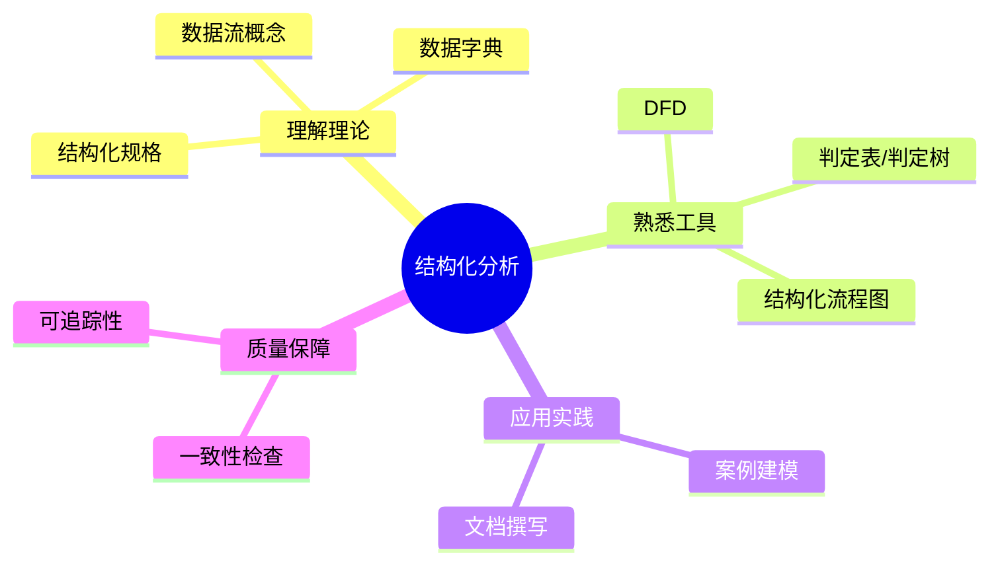
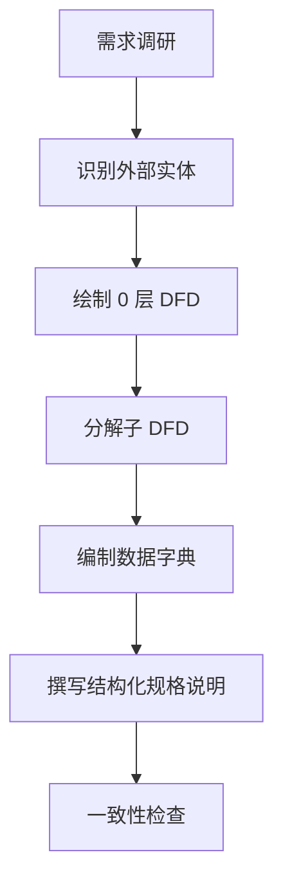
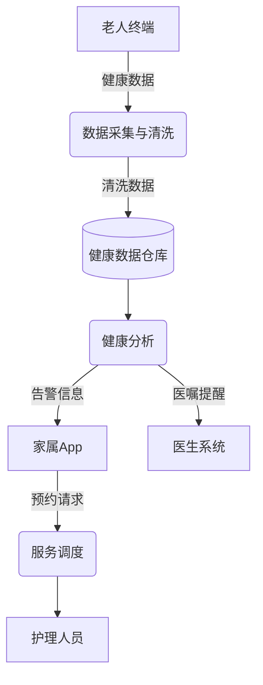
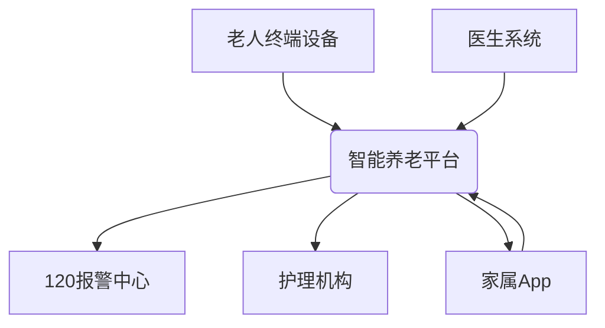
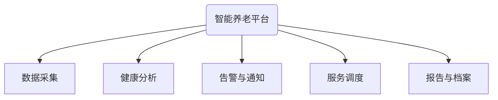

# 结构化分析学习指南

> 结构化分析（Structured Analysis & Design Method，SADM）是软件工程中用于需求分析与系统设计的重要方法。本指南结合智能养老系统案例，帮助快速掌握核心概念与实践步骤。

## 📚 目录导航

- [学习目标](#学习目标)
- [核心概念](#核心概念)
- [方法流程](#方法流程)
- [建模工具与示例](#建模工具与示例)
- [智能养老系统案例](#智能养老系统案例)
- [实践建议与常见问题](#实践建议与常见问题)
- [推荐资源](#推荐资源)
- [复盘清单](#复盘清单)

## 学习目标



- 掌握结构化分析的核心思想：以数据流和加工为主线描述系统。
- 熟练运用 DFD、数据字典、结构化语言等工具表达需求。
- 能够在真实项目（如智能养老平台）中应用结构化分析。
- 建立与其他建模方法（UML、用例分析）的互补关系。

## 核心概念

- **数据流图（DFD）**：用图形化方式表示数据在系统中的流动与处理。
- **加工（Process）**：对输入数据进行转换或处理的功能单元。
- **数据存储（Data Store）**：系统内部的数据集合，如数据库、文件。
- **外部实体（External Entity）**：系统外与系统交互的数据源或接收方。
- **数据字典（Data Dictionary，DD）**：对数据元素、数据流、数据存储的详细描述。
- **结构化规格说明（Structured Specification）**：使用结构化语言、判定表、判定树描述加工逻辑。

## 方法流程



1. **识别外部实体**：梳理系统与哪些干系人或系统交互。
2. **绘制 0 层 DFD**：描述系统的总体输入、加工与输出。
3. **分解子 DFD**：对复杂加工进行逐层分解，直至清晰可实现。
4. **编制数据字典**：明确数据项命名、类型、来源、约束。
5. **结构化规格说明**：使用结构化语言或判定表描述加工细节。
6. **一致性检查**：确保数据流、数据存储与字典、规格说明互相一致。

## 建模工具与示例

- **数据流图（DFD）示例**：



- **数据字典片段示例**：

| 名称 | 定义 | 类型 | 来源 | 约束 |
| ---- | ---- | ---- | ---- | ---- |
| VitalSigns | 老人实时生命体征数据集合 | 结构体 | 老人终端设备 | 包含心率、血压、血氧 |
| AlertMsg | 告警信息 | 记录 | 健康分析模块 | 优先级分为高/中/低 |
| ServiceOrder | 护理服务订单 | 记录 | 家属 App | 状态：待执行/执行中/完成 |

- **结构化规格说明示例**：

```text
Process: 健康数据清洗
输入：VitalSignsRaw
输出：VitalSigns
说明：
  IF 数据时间戳缺失 THEN 丢弃记录
  IF 心率 < 30 OR 心率 > 180 THEN 标记为异常并触发告警
  将血压单位统一转换为 mmHg
```

## 智能养老系统案例

> 结合软件需求学习指南中的案例，展示结构化分析实施步骤。

### 1. 外部实体识别
- 老人终端设备、家属 App、医生系统、120 报警中心、护理机构平台。

### 2. 0 层 DFD



### 3. 分解“智能养老平台”加工（P0）



### 4. 数据字典与结构化规格
- 详细条目可参考上一节示例。
- 针对 `P3 告警与通知`，可设计判定表：

| 条件 | 心率 | 血压 | 结果 |
| ---- | ---- | ---- | ---- |
| C1 | <40 或 >160 | 任意 | 触发高优报警，并通知医生、家属、120 |
| C2 | 正常范围 | >180/110 | 触发中级报警，通知医生、家属 |
| C3 | 正常范围 | 正常范围 | 无报警 |

### 5. 一致性检查
- 确认 DFD 中每个数据流都在数据字典中定义。
- 确认结构化规格说明中的输入输出与 DFD、数据存储一致。
- 将结构化规格映射到 SRS 中具体需求条目，保障追踪性。

## 实践建议与常见问题

- **与 UML 配合使用**：结构化分析强调数据视角，UML 强调行为与对象，可并行使用提高完整性。
- **层次分解要适度**：分解过细会增加复杂度，建议以“一个加工可由一个团队在一个迭代内实现”为尺度。
- **避免命名混乱**：建立命名规范，维持 DFD、数据字典、SRS 的一致性。
- **常见问题**：
  - 数据流遗漏 → 对照业务流程逐一核对。
  - 处理逻辑模糊 → 使用结构化语言、判定表补充细节。
  - 与 SRS 不一致 → 每次更新需求时同步更新 DFD 与数据字典。

## 推荐资源

- [Structured Analysis - SEBoK](https://www.sebokwiki.org/wiki/Structured_Analysis)
- [Data Flow Diagram Tutorial - Lucidchart](https://www.lucidchart.com/pages/data-flow-diagram)
- [NASA Systems Engineering Handbook](https://www.nasa.gov/connect/ebooks/nasa-systems-engineering-handbook/)
- [Atlassian Guide: Capture Software Requirements](https://www.atlassian.com/software/jira/guides/use-cases/capture-requirements)

## 复盘清单

- [ ] 是否识别所有关键外部实体与数据流？
- [ ] 是否完成 0 层及必要的子层 DFD，并保持清晰？
- [ ] 数据字典是否覆盖所有数据项、数据存储？
- [ ] 结构化规格说明是否明确加工逻辑与异常处理？
- [ ] DFD、数据字典、SRS 之间是否保持一致？
- [ ] 是否针对案例完成一次完整的结构化分析演练？

---

**最后更新**：2025 年 9 月

**维护人**：陈星宇（GitHub：guangxiangdebizi）

