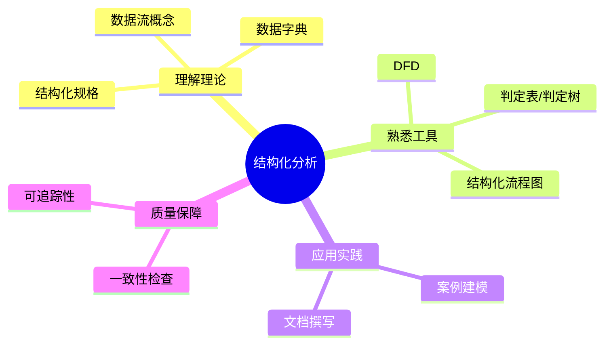
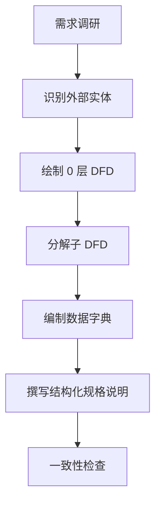
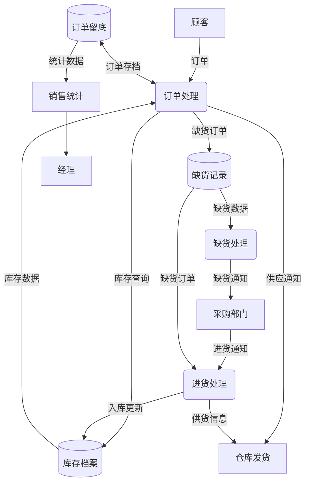
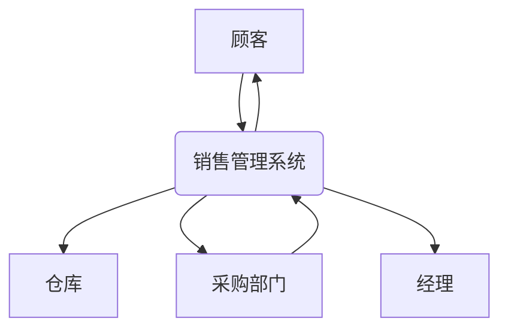
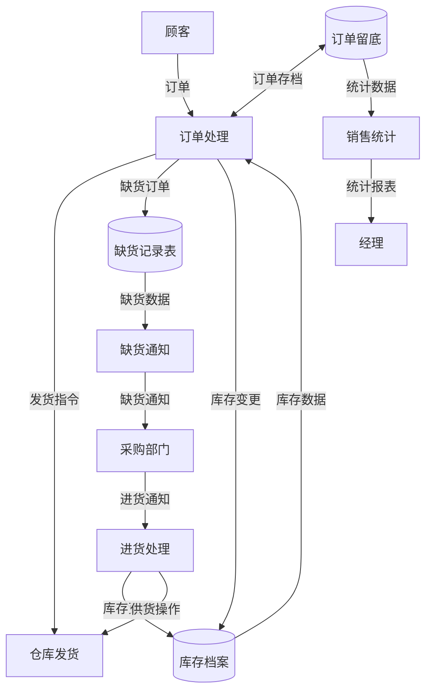

# 结构化分析学习指南

> 结构化分析（Structured Analysis & Design Method，SADM）是软件工程中用于需求分析与系统设计的重要方法。本指南结合课堂“销售管理系统”案例，帮助快速掌握核心概念与实践步骤。

## 📚 目录导航

- [学习目标](#学习目标)
- [核心概念](#核心概念)
- [方法流程](#方法流程)
- [建模工具与示例](#建模工具与示例)
- [销售管理系统案例](#销售管理系统案例)
- [实践建议与常见问题](#实践建议与常见问题)
- [推荐资源](#推荐资源)
- [复盘清单](#复盘清单)

## 学习目标



- 掌握结构化分析的核心思想：以数据流和加工为主线描述系统。
- 熟练运用 DFD、数据字典、结构化语言等工具表达需求。
- 能够在真实项目（如销售管理系统）中应用结构化分析。
- 建立与其他建模方法（UML、用例分析）的互补关系。

## 核心概念

- **数据流图（DFD）**：用图形化方式表示数据在系统中的流动与处理。
- **加工（Process）**：对输入数据进行转换或处理的功能单元。
- **数据存储（Data Store）**：系统内部的数据集合，如数据库、文件。
- **外部实体（External Entity）**：系统外与系统交互的数据源或接收方。
- **数据字典（Data Dictionary，DD）**：对数据元素、数据流、数据存储的详细描述。
- **结构化规格说明（Structured Specification）**：使用结构化语言、判定表、判定树描述加工逻辑。

## 方法流程



1. **识别外部实体**：梳理系统与哪些干系人或系统交互。
2. **绘制 0 层 DFD**：描述系统的总体输入、加工与输出。
3. **分解子 DFD**：对复杂加工进行逐层分解，直至清晰可实现。
4. **编制数据字典**：明确数据项命名、类型、来源、约束。
5. **结构化规格说明**：使用结构化语言或判定表描述加工细节。
6. **一致性检查**：确保数据流、数据存储与字典、规格说明互相一致。

## 建模工具与示例

- **数据流图（DFD）示例**：



- **数据字典片段示例**：

| 名称 | 定义 | 类型 | 来源 | 约束 |
| ---- | ---- | ---- | ---- | ---- |
| Order | 顾客提交的销售订单 | 记录 | 顾客/销售前台 | 包含商品编号、数量、客户信息 |
| InventoryStatus | 当前库存状况 | 记录 | 库存档案 | 各商品库存数量、仓库位置 |
| ShortageOrder | 因库存不足产生的订单信息 | 记录 | 缺货记录数据存储 | 包含订单号、缺货商品、缺货数量 |
| PurchaseNotice | 采购部门发回的进货通知 | 记录 | 采购部门 | 包含到货商品、数量、入库时间 |
| SalesSummary | 销售统计数据 | 报表 | 订单留底/统计处理 | 按时间区间汇总销售额、缺货率 |

- **结构化规格说明示例**：

```text
Process: 订单处理
输入：Order, InventoryStatus
输出：DeliveryNotice, ShortageOrder, OrderArchive
说明：
  IF 库存数量 ≥ 订单数量 THEN
      安排仓库发货
      库存数量 = 库存数量 - 订单数量
      订单存档 OrderArchive ← Order
  ELSE
      记录缺货信息至 ShortageOrder
      通知采购部门等待补货
```

## 销售管理系统案例

> 课堂案例：企业销售管理系统采用结构化分析建立功能模型，核心业务步骤如下：
> 1. 接受顾客订单并检查库存。若有货，则供货、修改库存、生成仓库发货单并留底；若缺货，则将订单记录到缺货记录。
> 2. 根据缺货记录形成缺货通知，发送给采购部门采购补货。
> 3. 收到采购部门的进货通知后，更新库存，并对缺货订单执行供货。
> 4. 基于留底订单进行销售统计，打印报表给经理。

### 1. 外部实体识别
- 顾客、仓库、采购部门、经理。

### 2. 0 层数据流图（DFD）



### 3. 1 层 DFD：核心加工分解



### 4. 结构化规格与判定表
- **订单处理（P1）结构化语言**：见前文示例。
- **缺货通知（P2）判定表**：

| 条件 | 库存差额 | 采购状态 | 结果 |
| ---- | ---- | ---- | ---- |
| C1 | 库存差额 > 0 | 未下单 | 生成缺货通知并发送采购部门 |
| C2 | 库存差额 > 0 | 已下单 | 记录待补货状态，不重复通知 |
| C3 | 库存差额 ≤ 0 | 任意 | 不生成缺货通知 |

### 5. 一致性与文档映射
- 数据流与数据字典名称保持一致，便于需求追踪。
- 在 SRS 中，可将 `订单处理`、`缺货通知`、`进货处理`、`销售统计` 对应到具体功能需求条目。


## 实践建议与常见问题

- **与 UML 配合使用**：结构化分析强调数据视角，UML 强调行为与对象，可并行使用提高完整性。
- **层次分解要适度**：分解过细会增加复杂度，建议以“一个加工可由一个团队在一个迭代内实现”为尺度。
- **避免命名混乱**：建立命名规范，维持 DFD、数据字典、SRS 的一致性。
- **常见问题**：
  - 数据流遗漏 → 对照业务流程逐一核对。
  - 处理逻辑模糊 → 使用结构化语言、判定表补充细节。
  - 与 SRS 不一致 → 每次更新需求时同步更新 DFD 与数据字典。

## 推荐资源

- [Structured Analysis - SEBoK](https://www.sebokwiki.org/wiki/Structured_Analysis)
- [Data Flow Diagram Tutorial - Lucidchart](https://www.lucidchart.com/pages/data-flow-diagram)
- [NASA Systems Engineering Handbook](https://www.nasa.gov/connect/ebooks/nasa-systems-engineering-handbook/)
- [Atlassian Guide: Capture Software Requirements](https://www.atlassian.com/software/jira/guides/use-cases/capture-requirements)

## 复盘清单

- [ ] 是否识别所有关键外部实体与数据流？
- [ ] 是否完成 0 层及必要的子层 DFD，并保持清晰？
- [ ] 数据字典是否覆盖所有数据项、数据存储？
- [ ] 结构化规格说明是否明确加工逻辑与异常处理？
- [ ] DFD、数据字典、SRS 之间是否保持一致？
- [ ] 是否针对案例完成一次完整的结构化分析演练？

---

**最后更新**：2025 年 9 月

**维护人**：陈星宇（GitHub：guangxiangdebizi）

