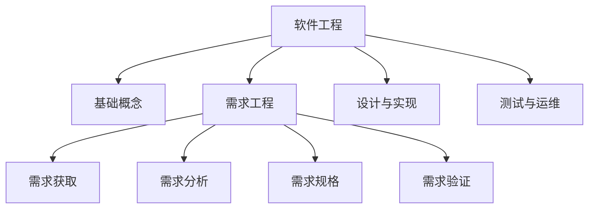
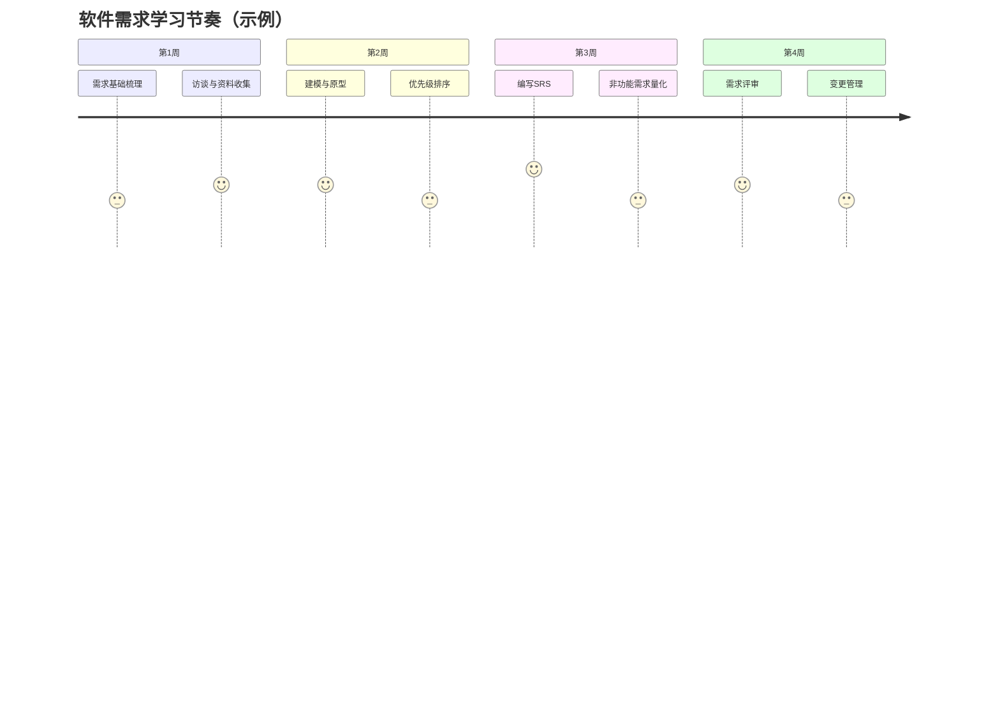

# 软件工程学习指南

> 本指南用于统筹软件工程课程资料，提供整体导航、阶段规划与专题链接。专题内容请参考对应子文档。

## 🔍 快速导航

- [课程概览](#课程概览)
- [学习地图](#学习地图)
- [阶段任务建议](#阶段任务建议)
- [专题索引](#专题索引)
- [资料维护说明](#资料维护说明)

## 课程概览

- **定位**：软件工程强调以工程化方法构建高质量软件，覆盖需求、设计、实现、测试、运维全生命周期。
- **当前进度**：课堂正在讲授「软件需求」和「模块化设计」，详细内容见对应学习指南。

## 学习地图

| 模块 | 关键主题 | 关联产出物 | 对应资料 |
| ---- | -------- | ---------- | -------- |
| 软件需求 | 需求工程流程、SRS、需求管理 | 需求清单、用例图、SRS、追踪矩阵 | [`软件需求学习指南`](./软件需求学习指南.md) |
| 模块化设计 | 高内聚低耦合、模块划分、接口设计 | 模块结构图、接口说明、依赖关系图 | [`模块化设计学习指南`](./模块化设计学习指南.md) |
| 系统设计 | 架构设计、设计模式、详细设计 | 架构图、设计文档 | 待新增 |
| 开发实现 | 编码规范、配置管理、持续集成 | 代码仓库、CI/CD 配置 | 待新增 |
| 软件测试 | 测试计划、用例设计、自动化测试 | 测试计划、测试报告 | 待新增 |
| 运维管理 | 运维流程、监控、反馈闭环 | 运维手册、反馈日志 | 待新增 |

## 阶段任务建议

- 建议按照「理解 → 实践 → 复盘 → 扩展」循环推进，结合课堂实验完善各类需求文档。
- 后续模块可沿用该结构，逐步扩展到设计、测试等章节。

## 专题索引

- [`软件需求学习指南.md`](./软件需求学习指南.md)：需求工程完整学习路径、模板示例与常见问题。
- [`结构化分析学习指南.md`](./结构化分析学习指南.md)：结构化分析理论、工具与销售管理系统案例。
- [`模块化设计学习指南.md`](./模块化设计学习指南.md)：模块化核心原则、高内聚低耦合、图书管理系统案例。
- （预留）`软件设计学习指南.md`：架构设计、设计模式等专题。
- （预留）`软件测试学习指南.md`：测试策略、测试用例设计与工具。
- （预留）`软件项目管理指南.md`：进度、成本、质量与风险管理。

## 资料维护说明

- 所有专题文件统一命名为 `软件XX学习指南.md`，并在本文件中登记。
- 每个专题须包含：导航目录、Mermaid 可视化、阶段计划、产出物模板、常见问题。
- 新增或更新专题时，同步在根目录 `README.md` 和本文件「学习地图 / 专题索引」中登记。

---

**最后更新**：2025 年 9 月

**维护人**：陈星宇（GitHub：guangxiangdebizi）

