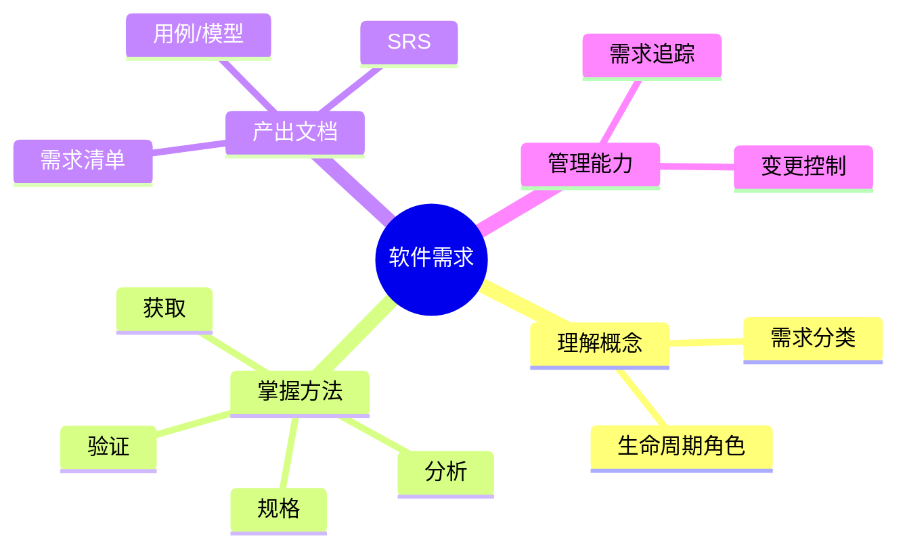
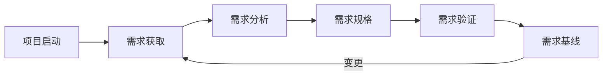
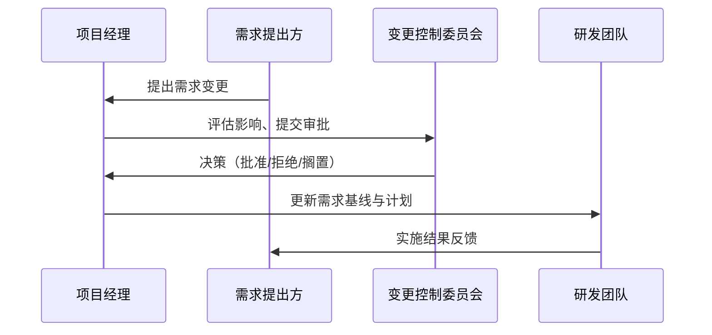

# 软件需求学习指南

> 针对课堂「软件需求」模块的详细学习指引，配合实验与项目实践使用。

## 📚 目录导航

- [学习目标](#学习目标)
- [需求工程全过程概览](#需求工程全过程概览)
- [需求获取](#需求获取)
- [需求分析与建模](#需求分析与建模)
- [需求规格说明（SRS）](#需求规格说明srs)
- [需求验证与管理](#需求验证与管理)
- [实践案例建议](#实践案例建议)
- [常见问题与对策](#常见问题与对策)
- [推荐资源](#推荐资源)
- [复盘清单](#复盘清单)

## 学习目标



- 理解需求工程的核心概念、活动与产出物。
- 熟练掌握需求获取、分析、规格化、验证的常用方法。
- 能够撰写结构化的需求规格说明书（SRS）。
- 建立需求变更控制与追踪管理意识。

## 需求工程全过程概览



- **获取**：识别干系人、采集需求信息。
- **分析**：澄清需求、本质化问题、建模。
- **规格**：使用标准格式记录需求，形成 SRS。
- **验证**：评审、原型、测试准则确保需求正确。
- **管理**：对需求进行版本控制与变更处理。

## 需求获取

- **方法选择指南**：
  - 面向个人：半结构化访谈、情景访谈。
  - 面向群体：焦点小组、工作坊、头脑风暴。
  - 面向数据：问卷调查、日志分析、竞品调研。
- **准备要点**：
  - 确定目标用户与关键干系人，建立沟通计划。
  - 制定访谈提纲，包含开放式与追问问题。
  - 准备记录工具（录音、记录表、观察日志）。
- **产出示例**：访谈纪要、用户画像、痛点列表、初步需求清单。

## 需求分析与建模

- **建模工具**：UML（用例图、活动图、类图）、用户旅程图、原型图。
- **用例分析步骤**：
  1. 确认主要参与者及其目标。
  2. 列出系统应提供的用例列表。
  3. 绘制用例图展示参与者与用例关系。
  4. 编写关键用例描述（主成功场景、扩展场景）。
- **优先级排序方法**：
  - MoSCoW：Must、Should、Could、Won’t。
  - 价值-成本矩阵：先实现高价值低成本需求。
  - Kano 模型：区分基本、期望、兴奋需求。

## 需求规格说明（SRS）

- **结构参考（基于 IEEE 29148）**：
  1. 引言（目的、范围、定义、参考资料）
  2. 总体描述（产品视角、用户特点、假设约束）
  3. 具体需求
     - 功能需求（Use Case、需求条目）
     - 非功能需求（性能、安全、可用性、可靠性等）
     - 外部接口（UI、API、数据接口）
     - 系统属性（质量属性）
  4. 附录（术语表、模型图、原型链接）
- **写作规范**：
  - 需求条目编号明确，便于追踪。
  - 表述客观可测，例如“响应时间＜2s”。
  - 避免歧义词汇（如“适当”、“快速”、“灵活”）。
- **模板片段**：

```text
FR-01 商品搜索
描述：用户输入关键字后，系统在2秒内返回匹配的商品列表。
前置条件：用户已登录。
优先级：Must
验收标准：
  1. 输入关键词后2秒内返回至少10条结果；
  2. 支持中文与英文关键字。
```

## 需求验证与管理

- **验证方式**：
  - 需求评审（Formal Inspection / Walkthrough）。
  - 原型演示与用户确认。
  - 定义验收测试用例并映射到需求条目。
- **变更管理流程**：



- **工具建议**：Jira/禅道（需求卡片与状态流转）、Git（文档版本控制）、ReqView/DOORS（专业需求管理）。

## 实践案例建议

- **参考实验**：以《实验一-可行性分析实验》项目为基础。
- **建议产出物**：
  - 项目愿景陈述
  - 干系人分析表
  - 用例列表与用例图
  - 功能与非功能需求条目表
  - 需求追踪矩阵（需求 ↔ 设计 ↔ 测试）
  - 初版 SRS 文档

## 常见问题与对策

| 问题 | 表现 | 对策 |
| ---- | ---- | ---- |
| 需求反复变更 | 需求记录不规范、缺乏基线 | 建立统一模板，明确变更审批流程 |
| 需求冲突 | 多方期望不一致 | 分析干系人优先级，组织协商会议达成共识 |
| 非功能需求被忽视 | 聚焦功能实现忽略质量属性 | 在 SRS 中单设章节，量化性能、安全等指标 |
| 需求不可验证 | 描述含糊、缺乏验收准则 | 使用可测量术语，设计验收测试 | 

## 推荐资源

- **教材与书籍**：
  - 《软件工程（第9版）》Ian Sommerville
  - 《现代软件工程》潘爱民
- **课程**：
  - 复旦大学《软件工程》（网易公开课）
  - Coursera《Software Processes and Agile Practices》
- **标准与模板**：
  - IEEE Std 29148-2018
  - SEI SRS 模板

## 复盘清单

- [ ] 能清楚区分功能需求、非功能需求与约束？
- [ ] 完成至少一次需求访谈并形成访谈纪要？
- [ ] 绘制关键用例图与用例描述？
- [ ] 撰写包含非功能需求的 SRS 章节？
- [ ] 设计并执行一次需求评审？
- [ ] 建立需求追踪矩阵并保持更新？

---

**最后更新**：2025 年 9 月

**维护人**：陈星宇（GitHub：guangxiangdebizi）

