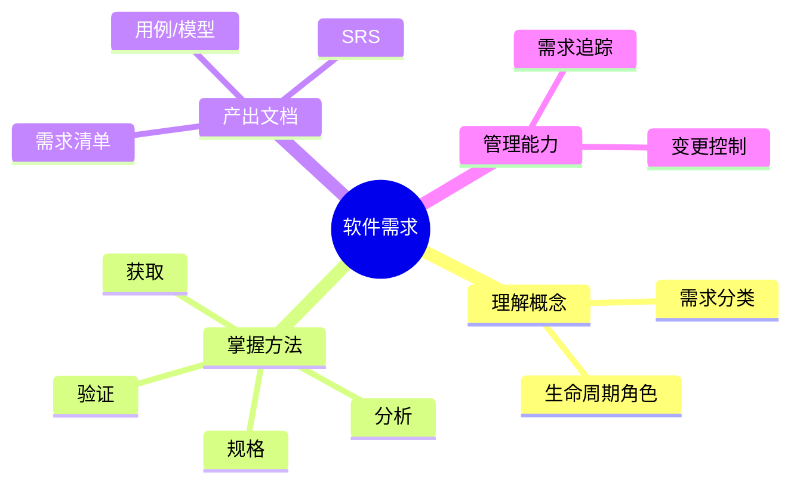
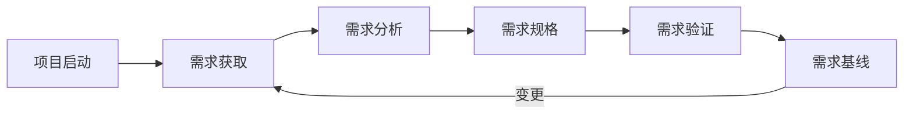
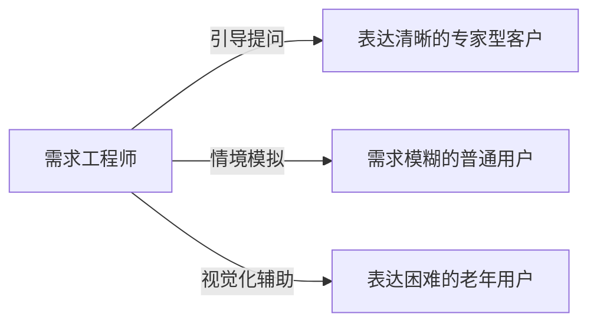
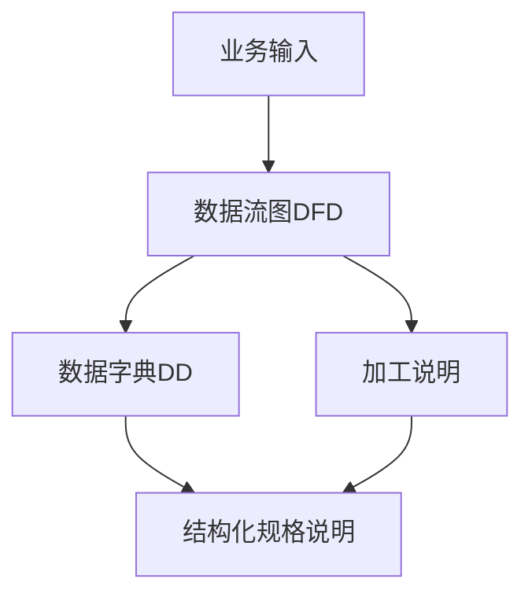
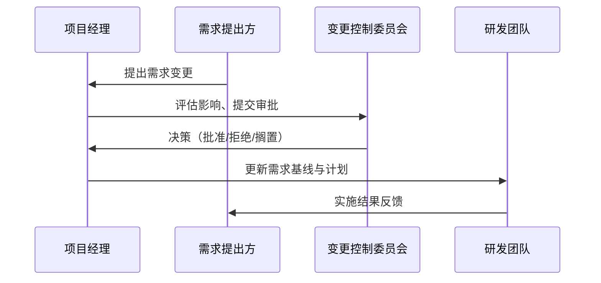
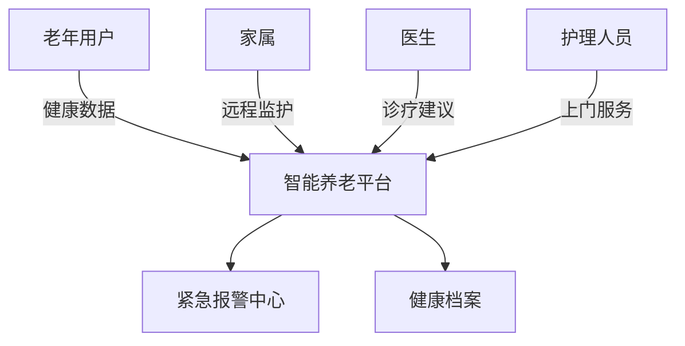

# 软件需求学习指南

> 针对课堂「软件需求」模块的详细学习指引，配合实验与项目实践使用。

## 📚 目录导航

- [学习目标](#学习目标)
- [需求工程全过程概览](#需求工程全过程概览)
- [需求获取](#需求获取)
- [需求分析与建模](#需求分析与建模)
- [结构化方法概述](#结构化方法概述)
- [需求规格说明（SRS）](#需求规格说明srs)
- [需求验证与管理](#需求验证与管理)
- [实践案例建议](#实践案例建议)
- [常见问题与对策](#常见问题与对策)
- [案例实战：智能养老系统](#案例实战智能养老系统)
- [推荐资源](#推荐资源)
- [复盘清单](#复盘清单)

## 学习目标



- 理解需求工程的核心概念、活动与产出物。
- 熟练掌握需求获取、分析、规格化、验证的常用方法。
- 能够撰写结构化的需求规格说明书（SRS）。
- 建立需求变更控制与追踪管理意识。

## 需求工程全过程概览



- **获取**：识别干系人、采集需求信息。
- **分析**：澄清需求、本质化问题、建模。
- **规格**：使用标准格式记录需求，形成 SRS。
- **验证**：评审、原型、测试准则确保需求正确。
- **管理**：对需求进行版本控制与变更处理。

## 需求获取

- **方法选择指南**：
  - 面向个人：半结构化访谈、情景访谈。
  - 面向群体：焦点小组、工作坊、头脑风暴。
  - 面向数据：问卷调查、日志分析、竞品调研。
- **准备要点**：
  - 确定目标用户与关键干系人，建立沟通计划。
  - 制定访谈提纲，包含开放式与追问问题。
  - 准备记录工具（录音、记录表、观察日志）。
- **产出示例**：访谈纪要、用户画像、痛点列表、初步需求清单。

### 沟通策略：面对不同表达能力的干系人



- **专家型客户（表达明确、术语丰富）**
  - 策略：使用专业术语对齐概念，准备需求清单进行确认。
  - 示例：与医保系统负责人对接时，采用问答表格记录接口需求，并在会后发送会议纪要核对。
- **普通用户（目标清晰但难以系统表达）**
  - 策略：通过情境化问题和故事板引导，辅助其讲述使用场景。
  - 示例：在智能养老系统中，家属用户对“远程看护”没有明确功能描述，可引导其描述“每天几点想了解老人状况、希望看到哪些指标”。
- **表达受限用户（如老年人、语言表达能力弱）**
  - 策略：采用原型演示、图片卡片或实际设备操作，引导其做出选择或反馈感受。
  - 示例：给老年用户展示大字体界面原型，观察其操作流程并记录困难点。
- **冲突化处理**：针对不同干系人理解不一致，可先输出统一的用户旅程图，让所有角色在共享视图上标注需求与痛点，再归纳成需求条目。

## 需求分析与建模

- **建模工具**：UML（用例图、活动图、类图）、用户旅程图、原型图。
- **结构化分析工具组**：数据流图（DFD）、数据字典（DD）、结构化流程图、状态转换图。
- **用例分析步骤**：
  1. 确认主要参与者及其目标。
  2. 列出系统应提供的用例列表。
  3. 绘制用例图展示参与者与用例关系。
  4. 编写关键用例描述（主成功场景、扩展场景）。
- **优先级排序方法**：
  - MoSCoW：Must、Should、Could、Won’t。
  - 价值-成本矩阵：先实现高价值低成本需求。
  - Kano 模型：区分基本、期望、兴奋需求。

### 结构化分析实践



- **应用场景**：适合需求较复杂、数据流清晰的系统，如智能养老平台的健康数据处理。
- **步骤示例**：
  1. **识别外部实体**：老人设备、家属 App、医生系统、报警中心。
  2. **绘制 0 层 DFD**：展示数据在平台内的主要流向，如“健康数据采集 → 数据处理 → 告警与展示”。
  3. **分解 DFD**：将加工过程细化，例如“数据处理”分解为“清洗”“分析”“存储”。
  4. **整理数据字典**：定义数据项（如血压、心率）的格式、单位、来源。
  5. **结构化规格说明**：为关键加工撰写结构化语言或判定表，描述输入、处理逻辑、输出。
- **与UML互补**：结构化分析强调数据流与处理逻辑，可与用例图、活动图互相验证，提高需求一致性。

## 结构化方法概述

- 结构化方法（Structured Analysis & Design Method，SADM）是软件工程中针对需求与设计阶段的系统化分析方法。
- 详细内容、操作步骤与智能养老系统示例，见《[结构化分析学习指南](./结构化分析学习指南.md)》。

## 需求规格说明（SRS）

- **结构参考（基于 IEEE 29148）**：
  1. 引言（目的、范围、定义、参考资料）
  2. 总体描述（产品视角、用户特点、假设约束）
  3. 具体需求
     - 功能需求（Use Case、需求条目）
     - 非功能需求（性能、安全、可用性、可靠性等）
     - 外部接口（UI、API、数据接口）
     - 系统属性（质量属性）
  4. 附录（术语表、模型图、原型链接）
- **写作规范**：
  - 需求条目编号明确，便于追踪。
  - 表述客观可测，例如“响应时间＜2s”。
  - 避免歧义词汇（如“适当”、“快速”、“灵活”）。
- **模板片段**：

```text
FR-01 商品搜索
描述：用户输入关键字后，系统在2秒内返回匹配的商品列表。
前置条件：用户已登录。
优先级：Must
验收标准：
  1. 输入关键词后2秒内返回至少10条结果；
  2. 支持中文与英文关键字。
```

## 需求验证与管理

- **验证方式**：
  - 需求评审（Formal Inspection / Walkthrough）。
  - 原型演示与用户确认。
  - 定义验收测试用例并映射到需求条目。
- **变更管理流程**：



- **工具建议**：Jira/禅道（需求卡片与状态流转）、Git（文档版本控制）、ReqView/DOORS（专业需求管理）。

## 案例实战：智能养老系统

> 目标：构建支持老人、家属、医生与护理机构的智慧养老服务平台。



- **干系人与目标**：
  - 老人：安全监护、用药提醒、健康咨询。
  - 家属：实时关注健康数据、异常告警与服务预约。
  - 医生：远程诊疗、查看历史健康档案、发布医嘱。
  - 护理机构：安排上门服务、记录服务结果。
  - 平台运营方：保障系统稳定、合规运营。

- **核心用例示例**：
  - `UC-01` 老人发起紧急求助 → 系统自动拨打 120 并通知家属与医生。
  - `UC-02` 医生下达远程医嘱 → 系统同步至老人终端并推送用药提醒。
  - `UC-03` 家属预约护理服务 → 护理人员确认并在执行后录入服务报告。
  - `UC-04` 平台定期生成健康报告 → 发送给老人和授权家属。

- **需求示例**：
  - 功能需求：
    - `FR-01` 系统需实时接收老人佩戴设备上传的心率、血压数据，并在 5 秒内展示于平台监控界面。
    - `FR-05` 家属可在小程序中查看最近 30 天的健康趋势并下载报告。
  - 非功能需求：
    - `NFR-02` 报警功能可用性需达 99.99%，报警链路响应时间不超过 3 秒。
    - `NFR-06` 系统需符合《个人信息保护法》，敏感数据存储与传输需加密。

- **SRS 片段示例**：

```text
FR-01 紧急报警
描述：当老人通过穿戴设备或终端触发紧急按钮时，系统应立即启动报警流程。
主流程：
  1. 老人触发报警。
  2. 系统验证设备身份并记录报警时间。
  3. 平台同时向 120、家属、值班医生发送报警通知。
  4. 在 App 中生成报警事件工单，供后续跟踪。
非功能约束：
  - 响应时间 ≤ 3 秒；
  - 通知送达成功率 ≥ 99%；
  - 工单需记录处理人、处理时间与结果。
```

- **需求追踪示例**（片段）：

| 需求编号 | 设计元素 | 对应测试用例 |
| -------- | -------- | ------------- |
| FR-01 | 报警处理服务、消息队列模块 | TC-ALERT-001：触发报警响应时间测试 |
| FR-05 | 报表服务、可视化组件 | TC-REPORT-003：数据趋势图展示与导出 |
| NFR-06 | 数据加密模块、访问控制策略 | TC-SEC-005：敏感数据存储加密检测 |

- **课堂延展建议**：以此案例开展访谈提纲设计、用例建模、SRS 编写、评审会议模拟，逐步形成完整需求包。

## 实践案例建议

- **参考实验**：以《实验一-可行性分析实验》项目为基础。
- **建议产出物**：
  - 项目愿景陈述
  - 干系人分析表
  - 用例列表与用例图
  - 功能与非功能需求条目表
  - 需求追踪矩阵（需求 ↔ 设计 ↔ 测试）
  - 初版 SRS 文档

## 常见问题与对策

| 问题 | 表现 | 对策 |
| ---- | ---- | ---- |
| 需求反复变更 | 需求记录不规范、缺乏基线 | 建立统一模板，明确变更审批流程 |
| 需求冲突 | 多方期望不一致 | 分析干系人优先级，组织协商会议达成共识 |
| 非功能需求被忽视 | 聚焦功能实现忽略质量属性 | 在 SRS 中单设章节，量化性能、安全等指标 |
| 需求不可验证 | 描述含糊、缺乏验收准则 | 使用可测量术语，设计验收测试 | 

## 推荐资源

- **在线课程**：
  - [复旦大学《软件工程》公开课 - 爱课程](https://www.icourse163.org/course/FUDAN-1207061802)
  - [Software Processes and Agile Practices - Coursera](https://www.coursera.org/learn/software-processes-and-agile-practices)
- **标准与指南**：
  - [IEEE 29148-2018 Standard Overview](https://ieeexplore.ieee.org/document/8559686)
  - [NASA Systems Engineering Handbook](https://www.nasa.gov/connect/ebooks/nasa-systems-engineering-handbook/)
- **实践资料**：
  - [Atlassian Requirements Management Guide](https://www.atlassian.com/software/jira/guides/use-cases/requirements-management)
  - [IDEO Design Kit - Interview Method](https://www.designkit.org/methods/interview)

## 复盘清单

- [ ] 能清楚区分功能需求、非功能需求与约束？
- [ ] 完成至少一次需求访谈并形成访谈纪要？
- [ ] 绘制关键用例图与用例描述？
- [ ] 撰写包含非功能需求的 SRS 章节？
- [ ] 设计并执行一次需求评审？
- [ ] 建立需求追踪矩阵并保持更新？

---

**最后更新**：2025 年 9 月

**维护人**：陈星宇（GitHub：guangxiangdebizi）

